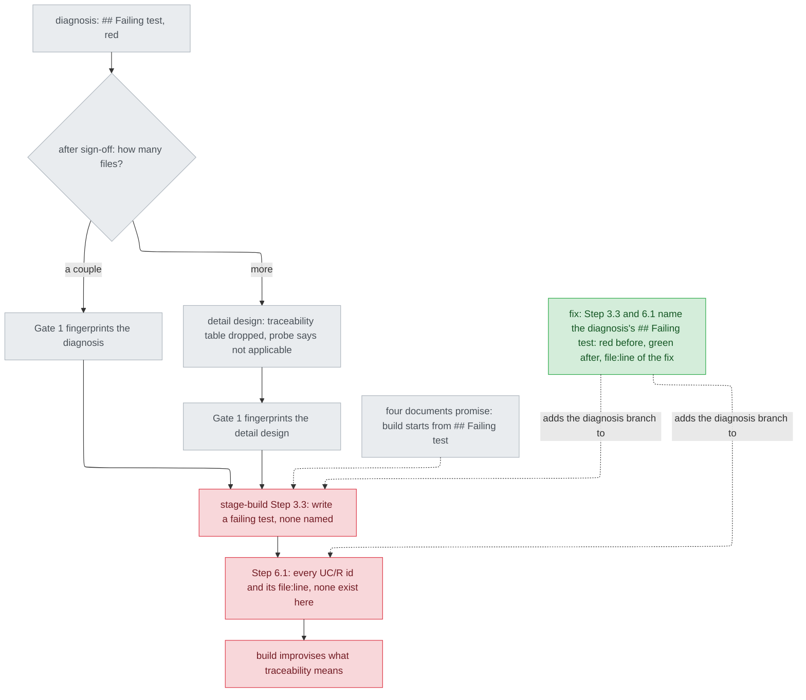

# stage-build.md 在診斷路徑上沒說要記錄什麼追溯 — diagnosis

名詞：診斷路徑（diagnosis path，design 階段寫的是診斷文件，簽核後直接進 build，或經過一份只引用診斷的細部設計再進 build）；可追溯性表（traceability table，build 在 Step 6 寫進 `implementation-notes.md` 和報告、把每個需求對到滿足它的 `file:line` 的表）；失敗測試（`## Failing test`，診斷文件裡「現在失敗、承諾成立就會通過」的那個測試）；使用情境編號（UC/R id，寫成 `UC1`、`R1`）；散文防護（prose guard，`scripts/validate.py` 裡只確認某段說明文字還在、不驗證行為的檢查）；簽核指紋（Gate 1 的 Approve 對 design 列文件記下的雜湊，之後改該檔會讓 `preflight.py build` 失敗）；探針（probe，`plugins/cai/scripts/design_probe.py`）；紅燈／綠燈（red/green，測試失敗／通過）。

## Status

approved 2026-09-26

## Symptom

`stage-build.md` Step 6 第 1 項只要求「every `UC`/`R` id and the `file:line` that now satisfies it」（`plugins/cai/skills/track/references/stage-build.md:292-295`；issue #168 寫的 `:285` 是舊行號）。診斷路徑上沒有這些編號：診斷的標題清單裡沒有 `Use cases / Issues`（`plugins/cai/scripts/design_probe.py:82-84`），接在診斷後的細部設計則被範本要求拿掉追溯表（`plugins/cai/templates/design-detail.md.tpl:32-35`）。build 只能自己決定這時「追溯」是什麼。沒有 UC/R 編號時 build 會即興發揮，已有實例：`.claude/track/done/viewer-shell-status-working/implementation-notes.md:19-52` 改對 intake 的 AC1-AC6 做追溯（那是非診斷路徑，只證明 build 在沒編號時會自己找替代品）。

**重現**（2026-09-26，工作樹，唯讀）：用 `python -c` 讀 `stage-build.md`，照 `scripts/validate.py:1820-1824` 的 `build_step` 切法切出 `## Step 6`，再數兩個字串在全檔出現幾次：

```
step6 chars 1986
Failing test in step 6: False
Failing test anywhere: 0
diagnos anywhere: 0
old 6.1 phrase present: True
```

同一天跑 `python scripts/validate.py`：exit 0，0 FAIL；`stage-build.md` 的 Step 1、Step 6.1 兩項散文防護都 PASS。也就是說，目前沒有任何檢查涵蓋這個缺口。

**假設與小測試**（每次只查一處，全部唯讀）：

| # | 假設：若 X 是原因，查 Y 就會看到 | 查了什麼 | 結果 |
|---|---|---|---|
| H1 | Step 6 以外的段落已用別的字眼講了診斷路徑 | Grep `stage-build.md` 的 `failing test\|red\|green` | 只有 `:167-177` 的通用 test-first 和驗證指令，不成立 |
| H2 | 別的出貨檔（stage-verify、goal、agents）告訴 build 診斷路徑要記什麼 | Grep `plugins/cai/` 的 `Failing test` | 只出現在設計端：`stage-design.md:447`、兩份範本、`design_probe.py`、`plan-review`，不成立 |
| H3 | 缺口只在 Step 6.1，Step 3 已經讓 build 從診斷的測試開始 | 讀 Step 3.2、3.3 | 3.3 只說「a failing test」（`:167-172`），3.2 的「what proves it (its `## Verification` rows)」（`:163-164`）指向診斷沒有的標題，不成立：起點同樣沒接上 |
| H4 | build 會從探針的不適用標籤得知要從 `## Failing test` 開始 | 讀 build Step 0 | 只有 Detail 模式的文件才跑探針（`:48-52`）；直接從診斷進 build 時看不到這個標籤，只有部分成立 |

## Failing test

`scripts/validate.py` 新增一個 check。build 先寫、先跑出紅燈，再動 `stage-build.md`。位置在 `if os.path.isfile(build_ref):` 區塊內、`:1826-1832` 那個迴圈之後，沿用同一個 `build_step`，但自成一個迴圈、自帶標籤。不加成既有迴圈的第三筆，因為那個迴圈的標籤（`:1831-1832`）寫的是「keeps build out of the signed-off design」，套在這個片語上不是事實。

| label | heading | phrase |
|---|---|---|
| `Step 3.3` | `## Step 3` | `## Failing test` |
| `Step 6.1` | `## Step 6` | `## Failing test` |

標籤：``f"{build_ref}'s {label} names the diagnosis path's `## Failing test`"``。寫好、還沒修 `stage-build.md` 時，應該印出兩行 ``FAIL plugins/cai/skills/track/references/stage-build.md's Step 3.3 names the diagnosis path's `## Failing test` ``（Step 6.1 同形），`validate.py` exit 非零。這是依上面的重現推得的預期，實際紅燈由 build 跑出來。修完後兩行都 PASS。如果 Gate 1 劃掉 `## Fix` 第 2 點，就只留 `Step 6.1` 這一筆。上方的註解要寫明：這是散文防護，而且沒有行為測試撐著，因為 build 是模型執行的階段，沒有程式行為可測。這一點和 `:1799-1804` 那兩筆不同，那兩筆的行為已經由測試負責。

**所依承諾（promise）**：文件，共四處。`plugins/cai/skills/track/references/stage-design.md:445-447`「build starts from its `## Failing test`」；`plugins/cai/templates/design-detail.md.tpl:32-35` 同一句；`plugins/cai/scripts/design_probe.py:533-535` 印出的不適用標籤同一句；`plugins/cai/templates/design-diagnosis.md.tpl:51-53`「`stage-build.md`'s test-first discipline starts here」。

## Root cause

**`stage-build.md` 寫在診斷模式出現之前。後來只有設計那一側承諾「build 從 `## Failing test` 開始」，build 這一側一直沒有加上診斷路徑：Step 3.3 的 test-first 和 Step 6.1 的追溯，只認得細部設計的 `## Verification` 和 UC/R 編號。**

- 追溯句在 `855b1eb`（2026-08-27）加入，最後一次修改是 `6207ef8`（2026-09-07，`docs/rule-provenance.md:81-82`）。診斷範本在 `fd30d5f`（#105，2026-09-16）加入，「build starts from」在 `d514f6b`（#165，2026-09-26）加入。之後動過 `stage-build.md` 的 `46e099b`、`5e1a29f`、`22ffe72` 都沒有加入診斷分支。UNVERIFIED：以上是 explorer 回傳的 `git log` 原文，本階段不能自己跑 git。這不影響結論，結論只依據現在的檔案：全檔 `diagnos` 出現 0 次（見重現）。
- 診斷沒有 `## Verification`，也沒有 `## Use cases / Issues`：`design_probe.py:82-84`。Step 3.2 與 Step 6.1 仰賴的正是這兩個標題：`stage-build.md:163-164`、`:292-293`。

**只修 Step 6.1 那一行會留下什麼**：Step 3.3 仍然讓 build 自己挑「a failing test」。build 可能一路做到 Step 6，都沒有先跑過診斷指名的那個測試。到那時，AC1 要的「build 自己在修之前看到的紅燈」就沒辦法誠實地填。範本把 `## Failing test` 綁在「`stage-build.md`'s test-first discipline」上（`design-diagnosis.md.tpl:52-53`），而那套紀律寫在 Step 3.3。所以根因是 `stage-build.md` 整份都沒有診斷路徑，起點和收尾都缺，不只是 Step 6.1 少一句。

## Blast radius

- **Step 6.1**：診斷路徑的兩條路都中，一條是直接進 build（`stage-design.md:297-298`），一條是經過細部設計（`design-detail.md.tpl:32-35`）。
- **Step 3.3**：同一個根因，是承諾的「起點」那一半。收進 `## Fix` 第 2 點，這一點超出 intake AC1 的字面，特別標出來給 Gate 1 看。
- **Step 3.2 的 brief 項目**（`:157-166`：Interface、Budgets、`## Verification` rows）：凡是沒有細部設計的路徑都缺替代說法，不限於診斷。這屬於方案 B 那一類，列入範圍外。
- **Step 6.4 報告**（`:317-318`）和 `plugins/cai/skills/goal/SKILL.md:115`：兩者都照抄「the traceability table」。診斷的列寫進同一張表，這兩處就不用改。
- **`plugins/cai-codex/`**：重新產生即可。`scripts/codex-overrides.json` 對 `stage-build.md` 的錨點（`:56-60`、`:73-77`、`:472-476`、`:484-486`）都不落在 Step 3.3（`:167-172`）或 Step 6 裡，改完 gen-codex 照樣套得上。
- **帳本 `stage-build-no-traceability-edit`**（`docs/rule-provenance.md:79-84`）：只要原句保持連續，就不受影響（見 `## Invariants preserved`）。

## Fix

`stage-build.md` 改兩處，`scripts/validate.py` 加一個 check。

1. **Step 6.1**（`:292-295`）：原句一字不動。在原句後面加上診斷路徑的說明。判定條件有兩種，符合其一即可：一是 design 列的文件是診斷，判斷依據是它有 `## Failing test` 標題，不看檔名，和探針的判斷方式相同（`design_probe.py:530`）；二是細部設計，它的 `## Reference` 列了診斷，但沒有任何一份文件有 `## Use cases / Issues`，這和探針不適用分支的條件相同（`:515-540`）。這時，診斷 `## Failing test` 指名的每個測試或檢查各寫一列，有多份診斷就每份都寫；以本文件為例是兩列，Step 3.3、Step 6.1 各一。每列記三件事：build 自己在修之前看到的紅燈（只抄該測試失敗的那幾行，不抄整次輸出）、修完後同樣那幾行的綠燈、修正所在的 `file:line`。這些列寫進同一張可追溯性表。再加一句：這張表也永遠不寫回診斷文件。直接進 build 時，診斷就是 design 列的文件，Gate 1 已經對它留下簽核指紋（`stage-design.md:297-298`、`plugins/cai/scripts/preflight.py:198-218`）；經過細部設計時，它不是留下指紋的那個檔案，但仍是人簽過的根因（`stage-design.md:288-292`）。要記 build 自己看到的紅燈、不抄診斷裡的，理由是診斷裡的紅燈可能比 build 早，也可能只是等價的重跑，本文件的重現就是這種情況。範例列：

   | Failing test | Red before the fix | Green after | Fix at |
   |---|---|---|---|
   | `scripts/validate.py` Step 6.1 check | ``FAIL …Step 6.1 names the diagnosis path's `## Failing test` `` | `PASS …` | `stage-build.md:<行>` |
2. **Step 3.3**（`:167-172`）：加一個子句。在診斷路徑上，負責修正的那個 unit，第一個失敗測試就是 `## Failing test` 指名的那一個；先跑它，保留紅燈輸出，Step 6.1 要用。證據只支持這一種做法：承諾寫的是「starts from」（`stage-design.md:447`），範本也指名 test-first（`design-diagnosis.md.tpl:52-53`）。
3. **`scripts/validate.py`**：照 `## Failing test` 寫，而且要先寫、先看到紅燈。

**寫法限制**：`## Failing test` 一律放在反引號裡。`build_step` 碰到第一個 `\n## ` 就截斷（`scripts/validate.py:1823`），換行後剛好以裸的 `## ` 開頭的一行，會讓切片提早結束，在 Markdown 裡也會被當成標題。新加的文字不要提到 `state.md`，也不要出現 `## Report` 這一行（見 `## Invariants preserved`）。

**交給 builder 決定**（三列成本都低，只影響一個檔案，下次跑 `validate.py` 就會發現，改回也容易）：英文的確切措辭；範例表的欄名；要不要在既有迴圈加一筆 `("Step 6.1 diagnosis", "## Step 6", <「不寫回診斷」那句的片語>)`，那個迴圈的標籤正好符合這句的意思。

**機械步驟**：`python scripts/gen-codex.py`，接著 `--release <大於現在的版本>`；`plugins/cai/.claude-plugin/plugin.json` 升 patch 版本（`CLAUDE.md` 規定「A `fix(cai):` PR bumps the patch version」）。

**會動到的檔案**：`stage-build.md`、`scripts/validate.py`，其餘都是機械步驟。實質修改只有兩個檔案，照 `stage-design.md:294-295` 直接進 `build`，不用經過 Detail。

## Invariants preserved

- 帳本那句「It goes in implementation-notes.md and the report, never back into the design document's own ### Traceability, for the reason Step 1 gives.」要保持連續。`provenance.py` 會把空白摺疊、去掉反引號，再比對它在不在該節裡（`plugins/cai/scripts/provenance.py:253-258`）。`## Step 6 — Close it out` 這個標題也不能改（`docs/rule-provenance.md:84`）。
- `scripts/validate.py:1826-1832` 那兩筆既有檢查照樣 PASS。
- UC/R 路徑的原句和原意都不變（AC3）；診斷路徑是另外加的句子。
- `stage-build.md` 裡 `state.md` 仍然恰好出現 3 次（`scripts/validate.py:2015-2018`），`## Report` 仍然只有一個。
- 驗證方式：`python scripts/validate.py` 0 FAIL，沒有 DRIFT/UNRELEASED；`python -m pytest` 全綠（AC5）。

## Picture



重點看虛線：承諾（`PROMISE`）指向 Step 3.3，可是兩條路線都會經過兩個紅色節點，而這兩個節點都不知道有診斷存在。綠色的修正同時補上這兩個節點，不只補 Step 6.1。

## Out of scope

- 方案 B：非診斷路徑上沒有 UC/R 編號時，改對 intake 的 AC 做追溯。這沒有書面承諾，需要走 Stance，也要改 `stage-intake.md`。
- 方案 C：讓範本或探針替診斷產生可追溯的編號。#165 的診斷已經判定這是 Stance 的新規則（`docs/design/2026-09-25-diagnosis-detail-traceability-diagnosis.md:119`）。
- Step 3.2 的 brief 在所有沒有細部設計的路徑上缺替代說法（見 Blast radius 第三點）。
- 用探針檢查細部設計有沒有提到診斷的失敗測試。
- issue 內文過時的 `:285` 行號。
