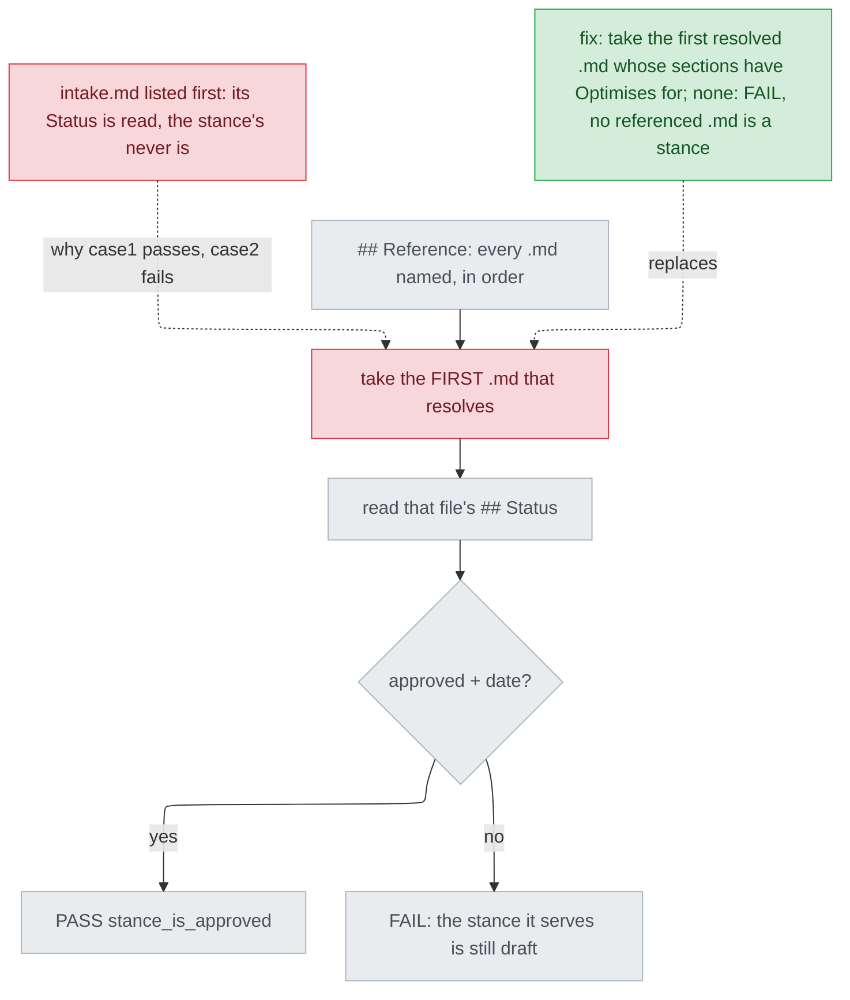

# 決策文件探針照位置認立場文件 — diagnosis

名詞：探針（probe，`plugins/cai/scripts/design_probe.py`，對設計文件逐項做固定檢查、每項印 PASS/FAIL 的腳本）；立場文件（stance，記錄系統取捨的文件，範本裡有 `## Optimises for` 這一節）；決策文件（decisions，列出立場衍生的待決選項，並在參照段落 `## Reference` 指向立場文件）；`stance_is_approved`（探針裡檢查「決策文件所服務的立場已核准」的那一項）；preflight（`plugins/cai/scripts/preflight.py`，每個 track 階段開始前跑的檢查腳本）。

## Status

approved 2026-09-26

## Symptom

決策文件的 `## Reference` 如果先列一份非 stance 的 `.md`、再列 stance，`--kind decisions` 的 `stance_is_approved` 讀到的是排第一那份的 `## Status`，不是 stance 的。兩個方向都會錯：

**重現**（2026-09-26，repo 的 `design_probe.py`，與已安裝的 1.35.0 版逐位元組相同，`filecmp.cmp(..., shallow=False)` 回傳 `True`）：在 scratchpad 用 `tests/test_design_probe_tiers.py` 自己的夾具（`decisions_doc()`、`STANCE`、`replace_section()`）寫出決策文件，`## Reference` 依序列 `intake.md`（沒有 `## Optimises for` 的非 stance）和 `stance.md`，再用 `python plugins/cai/scripts/design_probe.py --kind decisions --project-dir <scratch> <scratch>/x-decisions.md` 跑：

```
== case1（intake approved、stance draft）exit 0
PASS reference_resolves (<scratch>\case1\intake.md)
PASS stance_is_approved (approved)
-- decisions: 0 probe(s) failed
== case2（intake draft、stance approved）exit 2
PASS reference_resolves (<scratch>\case2\intake.md)
FAIL stance_is_approved (the stance it serves is still draft)
-- decisions: 1 probe(s) failed
```

case1 是比較危險的方向：stance 還是 draft，整份決策文件卻 0 FAIL。

本機現有 9 份 `docs/design/*-decisions.md` 都把 stance 排在第一，所以目前沒有一份讀錯（見 Blast radius 的比對）。`2026-09-25-convention-benchmark-case-decisions.md:5-6` 證明非 stance 文件確實會跟 stance 一起列在 `## Reference`，但它仍把 stance 排在前面；「真的有文件把別份排在 stance 前面」這件事，在本機沒有實例，是依 #169 的回報，本階段沒有讀 issue 原文（UNVERIFIED）。這不影響根因：上面的重現不依賴任何既有文件。

## Failing test

`tests/test_design_probe_tiers.py::test_an_approved_non_stance_listed_first_does_not_pass_a_draft_stance` 與 `tests/test_design_probe_tiers.py::test_a_draft_non_stance_listed_first_does_not_block_an_approved_stance`（新增，放在 `:253` 之後、`# --- the legacy kind` 之前，由 build 先寫、先跑出紅燈）。全文：

```python
NOT_A_STANCE = "# t - intake\n\n## Status\n\n%s\n\n## Problem\n\nSomething is broken.\n"


def stance_listed_second(tmp_path, first_status):
    """## Reference naming a document that is not a stance ahead of the one
    that is -- the order #169 reports the probe reading by position."""
    (tmp_path / "intake.md").write_text(NOT_A_STANCE % first_status,
                                        encoding="utf-8")
    return replace_section(decisions_doc(), "Reference",
                           "- Intake: `intake.md`\n- Stance: `stance.md`")


def test_an_approved_non_stance_listed_first_does_not_pass_a_draft_stance(tmp_path):
    doc, roots = written(tmp_path, stance_listed_second(tmp_path, "approved 2026-09-16"),
                         stance=STANCE)
    assert verdicts("decisions", doc, roots)["stance_is_approved"] is False


def test_a_draft_non_stance_listed_first_does_not_block_an_approved_stance(tmp_path):
    doc, roots = written(tmp_path, stance_listed_second(tmp_path, "draft"))
    assert verdicts("decisions", doc, roots)["stance_is_approved"] is True
```

本 track 的 design 第 1 輪經本人同意，暫時插入上面兩個測試、跑 `python -m pytest tests/test_design_probe_tiers.py -k non_stance_listed_first -v`，兩個都失敗，然後移除。輸出節錄（原文完整保留在第 2 輪的 brief 裡）：

```
tests/test_design_probe_tiers.py::test_an_approved_non_stance_listed_first_does_not_pass_a_draft_stance FAILED [ 50%]
tests/test_design_probe_tiers.py::test_a_draft_non_stance_listed_first_does_not_block_an_approved_stance FAILED [100%]
>       assert verdicts("decisions", doc, roots)["stance_is_approved"] is False
E       assert True is False
>       assert verdicts("decisions", doc, roots)["stance_is_approved"] is True
E       assert False is True
====================== 2 failed, 16 deselected in 0.07s =======================
```

兩個結果都跟程式碼推得出來的一樣：`design_probe.py:392-397` 第一個 `resolve()` 成功就 `break`，`:402-405` 讀那一份的 `## Status`。移除後 `git status --short` 與 `git diff --stat` 都沒有輸出，repo 裡現在沒有這兩個測試。

**所依承諾（promise）**：
- 文件：`plugins/cai/skills/track/references/stage-design.md:569-570`「The probe still catches the case that matters — the stance's `## Status` going back to `draft`」；`plugins/cai/templates/design-decisions.md.tpl:24-27`，`## Reference` 放的是「The stance document this queue serves」，Decisions mode 要那份文件的 `## Status` 是 `approved <date>` 才會開始。
- 探針自己的標籤：`design_probe.py:408-409` 說的是「the stance it serves」。
- 既有測試：`tests/test_design_probe_tiers.py:194-198`（stance 是 draft 時 FAIL），這個測試今天只因為 stance 是唯一一份參照文件才會過。

## Root cause

`decisions_probes` 把「`## Reference` 裡第一個讀得到的 `.md`」當成 stance，完全不檢查那份文件是不是 stance。所以只要 stance 不是第一份讀得到的，`stance_is_approved` 讀到的就是別份文件的 `## Status`。

- 選文件：`plugins/cai/scripts/design_probe.py:391-397`。regex `[\w./\\-]+\.md` 抓出每一個 `.md`，第一個 `resolve()` 成功就 `break`。這裡不看文件內容。
- 讀狀態：`design_probe.py:401-405` 打開 `ref`，讀 `## Status`，要求 `approved YYYY-MM-DD`。
- 範本沒有說 stance 必須排第一，也沒說只能列 stance：`design-decisions.md.tpl:21-31` 只給了一行 `- Stance:` 的範例。本機現有的文件也會在 stance 後面加列 intake、parent decisions、diagnosis、detail（見 Blast radius）。
- 同一種寫法以前出過事：#165 的 `detail_probes` 也是「第一個讀得到的」，後來改成挑第一份帶 `## Use cases / Issues` 的文件（`design_probe.py:511-515`）。那份診斷記錄了 `decisions_probes` 有同樣的迴圈，當時列為範圍外（`docs/design/2026-09-25-diagnosis-detail-traceability-diagnosis.md:58`、`:121`）。

**只修 stack trace 指到的那一行，還會剩下什麼**：stack trace 指到的是測試的斷言，探針裡直接算出那個布林值的是 `:404-405` 的狀態判斷。那一行沒錯，它只是如實讀了拿到的文件。就算把 `:397` 的 `break` 改成取最後一份，或改成只認帶 `Stance:` 字樣那一行，探針還是在猜「哪一份是 stance」：取最後一份時，排在 stance 後面的其他文件會被當成 stance（本機有 5 份決策文件在 stance 之後還列了讀得到的 `.md`，見 Blast radius）；只認 `Stance:` 字樣，就是替範例文字訂新規則，而範本的 `- Stance:` 本來只是示範（`design-decisions.md.tpl:31`）。所以根因是**用位置認文件種類**，不是狀態判斷那一行。修好之後，`design_probe.py` 裡就沒有別的判定結果還是用位置來決定；`detail_probes:502` 的 `resolved[0]` 只拿來印 `reference_resolves` 的路徑，不影響判定。

## Blast radius

- **`preflight.py design`**：它對 design 列的文件跑同一支探針，而且 `-decisions.md` 對應 `--kind decisions`（`plugins/cai/scripts/preflight.py:42-44`、`:116-120`）。探針印出的每一行 PASS/FAIL 都會變成 preflight 的檢查項（`:132-137`）。所以 design 列只要指向決策文件，這兩種讀錯都會原封不動進到 gate：case1 讓 preflight 放行一份 stance 還是 draft 的決策文件，case2 擋下一份正確的文件。
- **`plugins/cai-codex/scripts/design_probe.py:388-409`**：產生出來的副本，程式一模一樣。要用 `python scripts/gen-codex.py` 重新產生，並依 `CLAUDE.md` 加 `--release`（AC5）。
- **既有測試與 validate**：`stance_is_approved` 只有 `tests/test_design_probe_tiers.py:198` 會斷言。那個夾具 `STANCE` 有 `## Optimises for`（`:35`），所以修正後結果不變（AC4）。`scripts/validate.py:1177-1202` 的 PROBE_CASES 裡沒有 `decisions` 這一種，不受影響。
- **本機 9 份決策文件**：用 scratchpad 的唯讀腳本（2026-09-26）對每一份比較兩件事：「今天選到哪份」跟「第一份有 `## Optimises for` 的是哪份」。9 份都印 `same pick: True`，選到的都是各自的 `*-stance.md`。其中 5 份在 stance 之後還列了其他讀得到的 `.md`（例如 `2026-09-25-convention-benchmark-case-decisions.md` 讀得到 3 份）。所以修正不會改變任何既有文件的結果。
- **`## Optimises for` 的誤認（round 1 提的 (b)）**：整個 repo（包括用明確路徑搜尋的 `docs/`、`.claude/track/`），帶 `^## Optimises for` 的只有：11 份 `docs/design/*-stance.md`、兩棵樹的 `design-stance.md.tpl:29`、兩棵樹的 `plan-review/SKILL.md:213`，以及 `tests/test_design_probe_tiers.py:35`。`plan-review/SKILL.md:213` 在 `:211-220` 的 ```md 區塊裡，而且標題後面接著說明文字。實際用 `sections()` 讀那個檔：`'Optimises for' in sections(...)` 印 `False`，得到的鍵是 `'Optimises for       what this exists to make better, …'`，因為 `sections()` 會把整行都當成標題（`design_probe.py:133`）。plan-review 的輸出是 5 個粗體小節，不是 `##` 標題（`SKILL.md:113-143`）；就算輸出裡貼了這個骨架，也是同一種帶尾巴的行，一樣不會被認成 stance。剩下的風險：一份非 stance 文件剛好有一行只寫 `## Optimises for`（`sections()` 不跳過程式碼區塊，`:129-142`），又排在 stance 前面。這時探針仍會讀錯，但這些情況今天本來就全都會讀錯，所以修正後會讀錯的輸入比今天少。這一點不觸發步驟 4：它不需要架構層的選擇，也沒有第二種方案在證據下存活，更沒有踩到不變式。

## Fix

只改 `plugins/cai/scripts/design_probe.py` 的 `decisions_probes`（`:391-409`），做法與 #165 相同（`:496-515`）：

1. 照今天的 regex 和解析順序（`:392-395`，同一份文件旁邊的先找），把 `## Reference` 裡**所有**讀得到的 `.md` 依出現順序收集起來。`reference_resolves` 照舊：報第一份讀得到的路徑；一份都沒有就 FAIL，標籤不變（`:398-399`）。
2. 依序打開每一份，用 `sections()` 解析。**第一份 `sections()` 的鍵裡剛好有 `Optimises for` 的**就是 stance。判斷方式是鍵完全相等，跟 `:515` 用 `"Use cases / Issues" in s` 的寫法一樣。找到就停。打開檔案的方式跟今天的 `:402` 相同（`encoding="utf-8"`）。唯一新增的風險：排在 stance 前面、但不是第一份的非 UTF-8 `.md` 現在也會被打開並拋出例外。#165 的 `:509` 也接受了同樣的風險，這裡不另做處理。
3. 找到 stance：用今天的 `:402-409` 讀它的 `## Status`，regex 和兩種標籤都不變。
4. 有讀得到的 `.md`，但沒有一份是 stance：`stance_is_approved` 為 FAIL，標籤一字不差寫成 `stance_is_approved (no referenced .md is a stance -- none of N carries ## Optimises for)`，`N` 是讀得到的 `.md` 個數，照出現次數算，同一份列兩次就算 2（AC3）。
5. 一份都讀不到：跟今天一樣，只有 `reference_resolves` FAIL，不印 `stance_is_approved`（保留 `:401` 的條件）。

測試（test-first）：`## Failing test` 那兩個測試（AC1、AC2），再加第三個：`## Reference` 只列 `intake.md`（其 `## Status` 為 `approved 2026-09-16`，所以今天會 PASS、先跑出紅燈），斷言 `stance_is_approved` 為 False，而且用 `detail(...)` 取出的標籤包含 `no referenced .md is a stance`（AC3）。三個都放在 `tests/test_design_probe_tiers.py:253` 之後。

會動到的檔案：`design_probe.py`、`tests/test_design_probe_tiers.py`，重新產生 `plugins/cai-codex/`（AC5），並調高 `plugins/cai/.claude-plugin/plugin.json` 的 patch 版號（AC6）。文件和範本都不用改：`design-decisions.md.tpl:24` 本來就寫「The stance document this queue serves」，沒有規定順序。

## Invariants preserved

- 探針的誤判偏好：誤擋一份正確文件比漏放更貴（`design_probe.py:29-31`）。新規則只會擋下沒有 `## Optimises for` 的 stance，而這種 stance 本來就過不了 `--kind stance`，因為 `STANCE_HEADINGS` 要求這一節（`:69-71`），缺了 `probe_headings` 就 FAIL（`:210-219`）。
- 「核准」的定義不變：仍然是 `approved` 加日期（`:404-405`）。
- `reference_resolves` 的語意與標籤不變。`DECISIONS_HEADINGS`、`design-decisions.md.tpl` 和 `preflight.py` 都不動。
- 怎麼知道沒弄壞：`python -m pytest` 全綠，其中 `tests/test_design_probe_tiers.py:188-198` 不修改就通過（AC4）；`python scripts/validate.py` 全 PASS、沒有 DRIFT 或 UNRELEASED（AC7）；用上面 9 份決策文件重跑 `--kind decisions`，`stance_is_approved` 的結果跟修正前一樣。

## Picture



請看紅色的「take the FIRST .md that resolves」：錯在用位置選文件，下游的「approved + date?」本身沒錯。綠色的修正取代的就是這一格，「read that file's ## Status」之後都不動。

## Out of scope

- Decisions 閘門的另外兩項檢查：stance 的 `## Invariants` 不為空、`## Use cases / Issues` 有編號（`stage-design.md:348-350`）。探針目前只檢查 Status，intake 已記為範圍外。
- 方案 B（認檔名）與方案 C（規定 stance 排第一）：intake 已選 A，這裡不重新比較。
- cai 與 cai-codex 實際要用的版號（AC5、AC6）：出貨前對照當時的 main 再決定。
- `detail_probes` 的任何改動，包括 `:502` 那個只拿來印標籤的 `resolved[0]`。
- 讓 `sections()` 跳過程式碼區塊：這是共用的解析函式，六種探針都會用到，改它是另一件事。Blast radius 裡說明了本次不需要。
- `preflight.py:476` 用檔名 `-decisions.md` 認決策文件的做法：這不是用位置選，本次不動。
