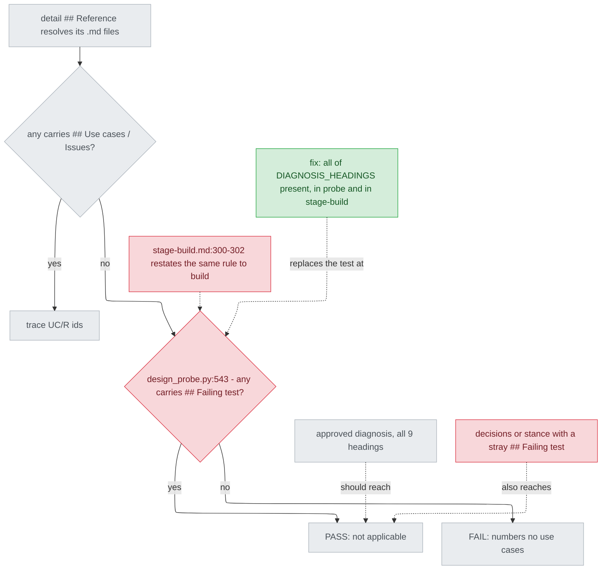

# design_probe.py recognises a diagnosis by one heading — diagnosis

## Status

approved 2026-09-26

## Symptom

A detail design whose `## Reference` resolves only to documents with no
`## Use cases / Issues` should FAIL traceability unless one is a diagnosis.
Any document that merely carries `## Failing test` is taken for one, and the
check becomes a "not applicable" PASS (issue #166).

**Reproduction** (2026-09-26, working tree at `567f508`, read-only): a scratch
script wrote one upstream to a temp directory, pointed a detail's
`## Reference` at it alone, and called the test file's `traceability_verdict`
(`tests/test_design_probe_diagnosis.py:162-167`):

```
a decisions + stray Failing test             -> True  | not applicable -- <tmp>\up.md is a diagnosis ...
b stance, no Use cases, + stray Failing test -> True  | not applicable -- <tmp>\up.md is a diagnosis ...
control: full diagnosis fixture              -> True  | not applicable -- <tmp>\up.md is a diagnosis ...
control: decisions without Failing test      -> False | the high-level design numbers no use cases
```

(a) is `DECISIONS_MIN` (`tests/test_design_probe_diagnosis.py:150-159`) plus a
`## Failing test` section; (b) a stance with `## Status` and `## Optimises for`
but no use cases, plus the same section. Both should read like the last row.

## Failing test

Two tests appended after `tests/test_design_probe_diagnosis.py:253`, run red
by build before the probe changes. Each writes one upstream to `tmp_path`,
references only it, and asserts `ok is False` and `"numbers no use cases" in
label` via `traceability_verdict`; red today on `assert True is False`:

- `tests/test_design_probe_diagnosis.py::test_decisions_with_a_stray_failing_test_still_fails`
  — `DECISIONS_MIN` plus a `## Failing test` section (AC1a).
- `tests/test_design_probe_diagnosis.py::test_stance_without_use_cases_with_a_stray_failing_test_still_fails`
  — a new stance fixture as in (b) above (AC1b).

**Promise** (documentation): only an approved diagnosis makes traceability
not applicable (`plugins/cai/skills/track/references/stage-design.md:445-447`);
every other upstream numbers its use cases (`stage-design.md:439-444`). A
diagnosis is written from its template with no heading added or renamed
(`stage-design.md:255-259`) and passes `--kind diagnosis` (`:284-286`), which
fails if any of the nine headings is missing
(`plugins/cai/scripts/design_probe.py:82-84,210-219,357`).

## Root cause

**The not-applicable branch identifies a diagnosis by a heading no kind owns
exclusively: `design_probe.py:543` tests `"Failing test" in s`, and nothing
stops another document from carrying that heading.**

- `sections()` keys every `## ` heading whatever the kind (`:129-142`); only
  the legacy kind rejects extra headings, and only detail ones (`:300-302`).
- The branch runs when no upstream has `## Use cases / Issues` (`:528,539`) —
  true of every decisions document (`:75-76`) and of a stance missing them.
- `stage-build.md:300-302` restates the rule to build: the design row is a
  diagnosis when "it carries a `## Failing test` heading, judged the same way
  `design_probe.py`'s not-applicable branch does".

**Fixing only `:543` would leave** build, following `stage-build.md:300-305`,
taking the same stray document for a diagnosis and writing failing-test rows
instead of UC/R rows. The rule is stated in two places; both change.

## Blast radius

- **`design_probe.py:543`** is the only content-based recognition. `:368`
  runs inside `--kind diagnosis`, which already needs all nine headings
  (`:357`); `preflight.py:42` picks kinds by filename suffix. Neither reached.
- **`stage-build.md:300-305`**: Step 6.1's classification, including the
  detail-path clause ("at least one diagnosis"). The Codex copy
  (`plugins/cai-codex/skills/track/references/stage-build.md:310-311`)
  regenerates; no `scripts/codex-overrides.json` anchor for this file lies in
  Step 6.
- **Label**: a real diagnosis plus a stray document, no use cases — today's
  plural label (`design_probe.py:549-552`) names both; after, only the real
  one. The two-diagnosis test uses full fixtures (`tests/...:183-194`).
- **Coupling**: recognition now follows `DIAGNOSIS_HEADINGS`; adding a heading
  later un-recognises older diagnoses. The list already gates `--kind
  diagnosis` and is tied to the template (`scripts/validate.py:1224-1234`),
  and is unchanged since `fd30d5f` (#105), per `explorer`'s `git log -L`.
- **Local documents**: all three `docs/design/*-diagnosis.md` have the nine
  headings, no other file there has `## Failing test`: no verdict changes.

## Fix

1. **`design_probe.py:543`**: a resolved document is a diagnosis only when
   every heading in `DIAGNOSIS_HEADINGS` (`:82-84`) is a key of its
   `sections()`. Presence, not content — content is `--kind diagnosis`'s check
   (`:210-219`), passed before sign-off. No new constant. The comment at
   `:540-542` says why one heading is not enough and the full shape is.
2. **`stage-build.md:300-302`**, parenthetical only (AC3): a diagnosis carries every
   heading of the diagnosis template (`design_probe.py`'s
   `DIAGNOSIS_HEADINGS`), not only `## Failing test` — the test the probe's
   not-applicable branch applies — and is still not judged by filename.
3. **Tests** as in `## Failing test`, red first.

Mechanical (AC4): `plugins/cai/.claude-plugin/plugin.json` 1.35.3 → 1.35.4;
`python scripts/gen-codex.py`, then `--release <greater version>`; `validate.py` and
`pytest` green. Two shipped files change in substance, so after sign-off this
goes straight to `build` (`stage-design.md:294-296`).

Left to the builder (one component, caught next test run): exact wording and
the fixture's name. No test pins the label side effect; no AC asks for one. No
new `stage-build.md` line may start with `## ` (`build_step` stops at
`\n## `, `scripts/validate.py:1823`).

## Invariants preserved

- `tests/test_design_probe_diagnosis.py:174-253` pass unedited (AC2): the
  `DIAGNOSIS` fixture has all nine headings (`:25-67`); label strings
  (`design_probe.py:533,546-552`) are unchanged.
- `scripts/validate.py:1224-1234` and `:2368-2373` pass: the list is untouched.
- The ledger sentence at `stage-build.md:296-298` and the Step 6 heading stay
  intact (`docs/rule-provenance.md:83-84`); `validate.py:1826-1848` still
  find their phrases in Step 6 (`## Failing test` stays at `:306`).
- Known by: `validate.py` 0 FAIL, no DRIFT/UNRELEASED; `pytest` all green.

## Picture



Look at the two dotted arrows into `NA`: the real diagnosis and the stray
document pass the same red node, and `stage-build.md` repeats that node.

## Out of scope

- `design_probe.py:411` recognises a stance by one heading: separate issue.
- The FAIL label "the high-level design numbers no use cases" (`:533,555`).
- The branch never checks the diagnosis is approved, though
  `stage-design.md:445` gates Detail on it. Found here, not fixed.
- Rejected at intake: excluding other kinds' headings; the filename suffix.
