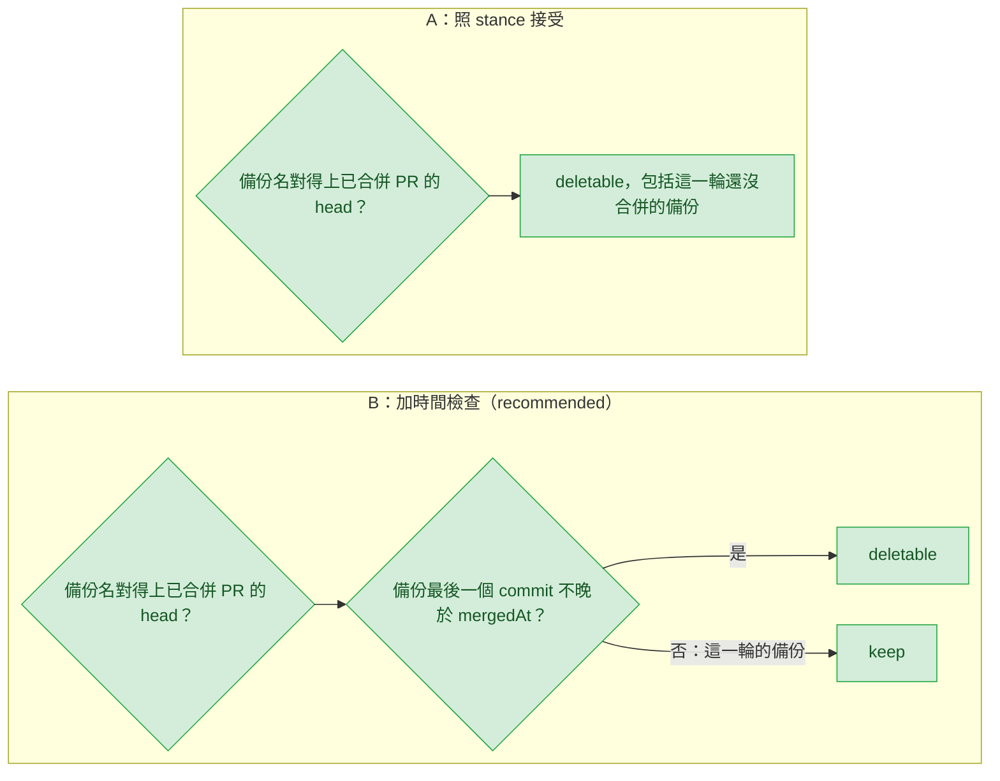

# git-sweep-delete-backups — decisions

名詞（第一次出現的英文詞，先給中文意思）：sweep 是 `plugins/cai/scripts/branch_sweep.py`，替每個本地分支判一個狀態，`deletable` 可刪、`keep` 保留、`held` 被工作目錄（worktree）占用、`ahead` 有沒推上遠端的 commit、`gone` 遠端分支已刪。備份（backup）是 ship 在壓縮（squash）前建的 `backup/...` 分支；來源（source）是它備份的那條分支。PR（pull request）是合併請求；head（headRefName）是 PR 的來源分支名；`mergedAt` 是 PR 的合併時間。gh 是 GitHub 的命令列工具。WHY 是 sweep 表格的理由欄。committer date 是 commit 被寫下的時間，由寫的那台機器的時鐘決定。`iso-strict` 是 `2026-09-26T19:15:13-04:00` 這種帶時區的時間寫法。Rollback 是 ship 的復原步驟，把分支指回備份（`plugins/cai/skills/track/references/stage-ship.md:159`）。Tier 1 要本人回答，Tier 2 列出來給人掃過，Tier 3 只記錄。實測指這一輪用 Python 讀本機檔案，不跑 git、gh。

## Reference

- Stance: `docs/design/2026-09-26-git-sweep-delete-backups-stance.md` — status: approved 2026-09-26。下文 `stance:N` 指該檔第 N 行，S1–S9 在 stance:26-34，R2–R4 在 stance:58-60。
- Intake：`.claude/track/git-sweep-delete-backups/options-intake.md`（驗收條件 :18-24）。
- 本人已接受 stance 的 Sacrifices 第二項（stance:18），包括 intake 沒點名的那一種：上一輪已合併、這一輪還沒合併時建的備份（2026-09-26，經 main session 轉達）。所以 D1 問的是「要不要便宜地縮小它」，照原樣接受也是有效的答案。行為面那一半（大家會不會重複使用分支名）已由這個接受定案，D1 剩下的是技術上的成本與涵蓋範圍，不列為需求缺口。

## Feasibility

| Id | Capability | Verdict | Evidence |
|---|---|---|---|
| C1 | sweep 已經用一次 `gh pr list --state merged --json number,headRefName` 拿到全部已合併 PR 的號碼與 head | verified | `plugins/cai/scripts/branch_sweep.py:130-153` |
| C2 | sweep 已經用一次 `git for-each-ref refs/heads` 拿到全部本地分支，`backup/...` 也在其中 | verified | `branch_sweep.py:156-173`；2026-09-26 對本 repo 跑的 `git for-each-ref` 列出 `backup/fix-diagnosis-recognition-shape-20260926-presquash` |
| C3 | `gh pr list --json` 接受 `mergedAt` 欄位 | verified | https://cli.github.com/manual/gh_pr_list 的 JSON FIELDS 清單含「headRefName」「mergedAt」「number」 |
| C4 | `for-each-ref` 的日期欄位可以指定格式，`%(committerdate:iso-strict)` 印出帶時區的時間 | verified | https://git-scm.com/docs/git-for-each-ref ：「As a special case for the date-type fields, you may specify a format for the date by adding `:` followed by date format name」；2026-09-26 的 `git for-each-ref` 以 `%(committerdate:iso-strict)` 印出 `2026-09-26T19:15:13-04:00` |
| C5 | Python 能把兩種時間讀成可比較的值：`Z` 換成 `+00:00` 後用 `fromisoformat` | verified | `plugins/cai/scripts/viewer.py:1228` 已這樣用；實測 `fromisoformat('2026-09-26T19:15:13-04:00')` 與 `fromisoformat('2026-09-26T23:59:00+00:00')` 都讀得出來 |
| C6 | 本 repo 唯一的真實備份，最後一個 commit 早於 PR #178 的合併：備份 2026-09-26T19:15:13-04:00（23:15:13Z），`mergedAt` 2026-09-27T00:05:07Z，相差 50 分鐘；B 之下它仍是 `deletable`，options-intake.md:22 成立 | verified | main session 2026-09-26 實跑：`gh pr view 178 --json mergedAt,headRefName` 回 `{"headRefName":"fix/diagnosis-recognition-shape","mergedAt":"2026-09-27T00:05:07Z"}`；`git log -1 --format="%H %cI" ab50145` 回 `2026-09-26T20:05:07-04:00`（與 mergedAt 同一刻）；`git for-each-ref --format="%(refname:short) %(committerdate:iso-strict)" refs/heads/backup` 回 `backup/fix-diagnosis-recognition-shape-20260926-presquash 2026-09-26T19:15:13-04:00`。來源見 `.claude/track/git-sweep-delete-backups/options-intake.md:15` |
| C7 | ship 的備份沒有 upstream，所以 `ahead` 是 0、`gone` 是否，自然走到新規則 | verified | `stage-ship.md:112` 沒給起點，從目前分支建；https://git-scm.com/docs/git-branch ：「The default option, `true`, behaves as though `--track=direct` were given whenever the start-point is a remote-tracking branch.」；C2 那次輸出中備份的 upstream 欄為空；`branch_sweep.py:170-172` |
| C8 | 每個備份最多比對 200 個 head，不需要額外呼叫 | verified | `PR_LIMIT = 200`，`branch_sweep.py:52` |
| C9 | 測試的假 gh 原樣輸出測試給的 JSON，多放一個欄位不必改假 gh | verified | `tests/fake_gh.py:28`；`tests/test_branch_sweep.py:66-74` |
| C10 | 備份在 PR 還開著時仍有用途：ship 的 Rollback 就是把分支指回它 | verified | `stage-ship.md:159`：`git reset --soft backup/<branch>-<timestamp>` |

## Ruled out

| Option | Invariant it violates | Evidence |
|---|---|---|
| 用 `git merge-tree` 或比對 tree 來縮小誤判（R3） | S3：不做內容證明 | stance:28 |
| 每個備份另跑一次 `gh pr view` 或 `git log` 查時間（R3） | S4：不新增子程序呼叫；C1、C2 已經有兩次既有呼叫可以多要欄位 | stance:29；C1、C2 |
| 只認後綴是 `\d{8}-\d{6}` 的名字（R2、R4） | S5：presquash 形狀認不出來 | stance:30 |
| 只在本地分支裡找來源（R2） | S6：來源常已被刪，issue 的情境就是這樣 | stance:31；C2 |

## Requirement gaps

| # | The behavioural assumption | Veto condition, or verification path | Deletes |
|---|---|---|---|

## Tier 1

### D1 — 要不要用「備份最後一個 commit 早於 PR 合併」來縮小同名重用的誤判？

兩張圖只差 B 多一道菱形：同名分支上一輪合併之後才寫下的 commit，一定晚於那次合併，所以這一輪的備份停在 `keep`。

| Option | Rests on | What it costs | Fails when |
|---|---|---|---|
| A — 照 stance 接受，不縮小 | C1、C2 | 不多任何程式 | 同名分支上一輪已合併、這一輪 ship 完 PR 還開著時跑 sweep：這一輪的備份被列 `deletable`；照 `--delete` 刪掉，這個 PR 就失去 ship 的 Rollback（C10），只剩印出的 SHA（`branch_sweep.py:319-322`） |
| B — 加時間檢查（recommended） | C3、C4、C5、C6 | `gh pr list` 的 `--json` 多要 `mergedAt`，`for-each-ref` 格式多要 `%(committerdate:iso-strict)`，仍是同兩次呼叫（S4）；約 10–15 行、1–2 個測試；`gh_merged_prs()` 回傳多帶時間，`local_branches()` 每列多一欄 | 上一輪沒合併、這一輪合併的舊備份，以及早於合併的手動 `backup/*`，最後一個 commit 都早於合併，照樣列 `deletable`（和 A 一樣）；本機時鐘比 GitHub 慢超過「最後一個 commit 到合併」的間隔（本 repo 實例是 50 分鐘，C6）時，這一輪的備份會漏網 |

第三種做法是拿備份名後綴裡的日期和 `mergedAt` 比。它明顯較差：只到「日」，`date +%Y%m%d` 用的是本機時區、`mergedAt` 是 UTC，後綴不是日期時就沒得比，所以不列。

- **Blast radius:** 低。兩個選項都只動 `branch_sweep.py` 和它的測試。
- **Found out when:** 高。A 的誤判要等有人在 PR 還開著時想做 Rollback、才發現備份已被刪，是發佈之後的事，也可能永遠沒人發現。B 萬一誤留，要等有人回報「該刪的備份沒被列出」。
- **Undo cost:** 低。A 改 B 是純加法；B 改回 A 是刪掉約 15 行。
- **Decided:** B — 加時間檢查。本人 2026-09-26 以選單回答，問題「D1：要不要加時間檢查（備份最後一個 commit 不晚於 PR 合併時間才列可刪）？」，選的標籤是「B — 加時間檢查 (Recommended)」，選項原文在 `.claude/track/git-sweep-delete-backups/options-D1.md`。C6 隨後由 main session 驗證，真實備份在 B 之下仍是 `deletable`。答完重跑成本測試：D2、D3 不受影響，仍是 Tier 2；Tier 3 標「D1 選 B 時」的五列全部生效。

## Tier 2

### D2 — 多個已合併 PR 的 head 都對得上同一個備份時，取哪一個？

Chose：head 原樣（含 `/`）和 `/` 換成 `-` 的寫法都比，取對得上的最長者；一樣長時取原樣；都對不上就是 `keep`（S2，stance:27）。一樣長時原樣優先，因為 ship 寫備份名時直接用 `${BRANCH}`（`plugins/cai/skills/track/references/stage-ship.md:112`）。最長優先，因為 ship 的後綴固定是 `-YYYYMMDD-HHMMSS`：`fix/a` 和 `fix/a-b` 都對得上 `backup/fix/a-b-20260926-120000` 時，取 `fix/a` 就等於說後綴是 `b-20260926-120000`，而 ship 不會產生這種後綴。D1 選 B 時，時間檢查只用選中的這個 PR。**Found out when:** 發佈後，有人在表格上看到 WHY 指向錯的來源時。

### D3 — 沒有後綴的 `backup/<來源>` 算不算備份？

Chose 不算：來源名後面必須還有 `-` 和至少一個字元。核准的選項原文是「把備份名去掉 `backup/` 前綴和結尾」（`.claude/track/git-sweep-delete-backups/options-intake.md:39`），兩種已知形狀都有後綴（stance:30）。不算的結果是 `keep`，也就是今天的行為，屬於誤留；算的結果是可能刪掉某人為了別的原因留著的分支。**Found out when:** 發佈後，有人發現 `backup/<來源>` 一直沒被列出時。

## Tier 3

| Decision | Chose | Instead of | Found out when |
|---|---|---|---|
| 規則放在 `classify()` 的哪裡 | `pr` 之後、`gone` 之前（stance:62 的圖；`branch_sweep.py:224-227`）；`held`、`ahead` 仍在最前面（S1） | 放在 ancestry 之前 | 下一次測試 |
| 怎麼推回來源 | 對每個已合併 PR 的 head 試兩種寫法，看 `backup/` 之後的名字是不是以「寫法 + `-`」開頭（C1、C8） | 先用正規式切掉後綴再查表：後綴格式不固定（S5），不知道來源在哪裡結束 | 下一次測試 |
| 前綴 | 只認小寫字面 `backup/`（`stage-ship.md:112`） | 也認 `backups/`、`bak/` | 下一次測試 |
| 沒有 upstream 要不要另外處理 | 不用：`ahead` 是 0、`gone` 是否，本來就會走到新規則（C7） | 另寫一條「沒有 upstream」的判斷 | 下一次測試 |
| 自己也有已合併 PR 的 `backup/*` | 照既有 `pr` 規則，WHY 是 `pr: #N merged`（`branch_sweep.py:224-225`）；S9 不受影響 | 讓備份規則優先 | 下一次測試 |
| gh 查不到時的 `note:` 字串 | 不改（`branch_sweep.py:263-264`），只在 `plugins/cai/skills/git-sweep/SKILL.md:40-44` 補一句「備份也只會是 keep」 | 改 `note:` 字串 | 下一次測試 |
| 說明文字 | docstring `branch_sweep.py:18-22` 改成「ancestry、pr，以及來源有已合併 PR 的備份」；`SKILL.md:27-28` 的 `deletable` 補上備份這一種 | 只改 `SKILL.md` | 下一次 `validate.py` |
| 測試 | 在 `tests/test_branch_sweep.py` 加案例：標準形、presquash 形、來源不在本地、沒有 PR 時 `keep`、`held`、`--delete` 的復原行、gh 失敗時 `keep`、D2 的最長優先；`use_fake_gh` 的 JSON 直接多放欄位（C9） | 另開新測試檔 | 下一次測試 |
| 版號與 Codex 版 | ship 時依 commit 類型升 `plugins/cai/.claude-plugin/plugin.json` 的版號，再跑 `python scripts/gen-codex.py`，必要時加 `--release`（本 repo `CLAUDE.md`） | 在 build 階段先升 | ship 時 `validate.py` 報 DRIFT 或 UNRELEASED |
| （D1＝B）時間怎麼讀 | `%(committerdate:iso-strict)` 與 `mergedAt`，`Z` 換成 `+00:00` 後用 `fromisoformat` 讀（C4、C5，同 `viewer.py:1228`） | `%(committerdate:unix)`：文件只說格式名取自 `--date`，這一輪沒實測 | 下一次測試 |
| （D1＝B）讀不到時間 | 任一邊缺少或讀不出來，就不列 `deletable`（S2 的安全方向） | 跳過時間檢查，照樣列 `deletable` | 下一次測試 |
| （D1＝B）時鐘誤差 | 不加緩衝，直接比「不晚於」（C6 的實例相差 50 分鐘） | 加 N 分鐘緩衝 | 發佈後，有人回報該刪的備份被 `keep` |
| （D1＝B）用哪個 PR 的時間 | D2 選中的那個 PR；同名多個 PR 時，`gh_merged_prs()` 本來就只留號碼最大的一個（`branch_sweep.py:149-152`） | 任何一個對得上的 PR 通過就算 | 下一次測試 |
| （D1＝B）時間檢查沒過時的 WHY | `keep`，WHY 寫 `backup of <來源>: pr #N merged before its last commit`；逐字字串由 Detail 定 | 往下走成 `keep / no merge signal`，看不出為什麼沒被刪 | 下一次測試 |
