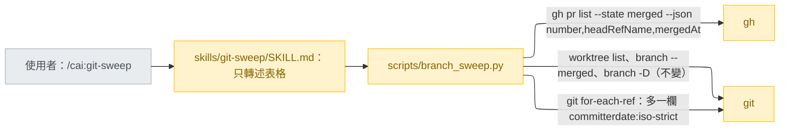
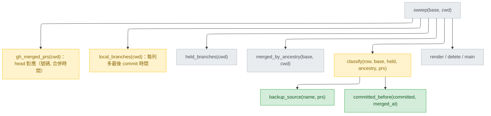
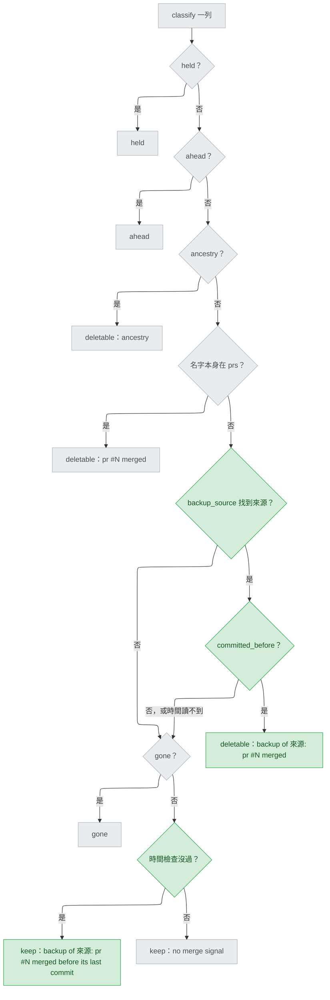
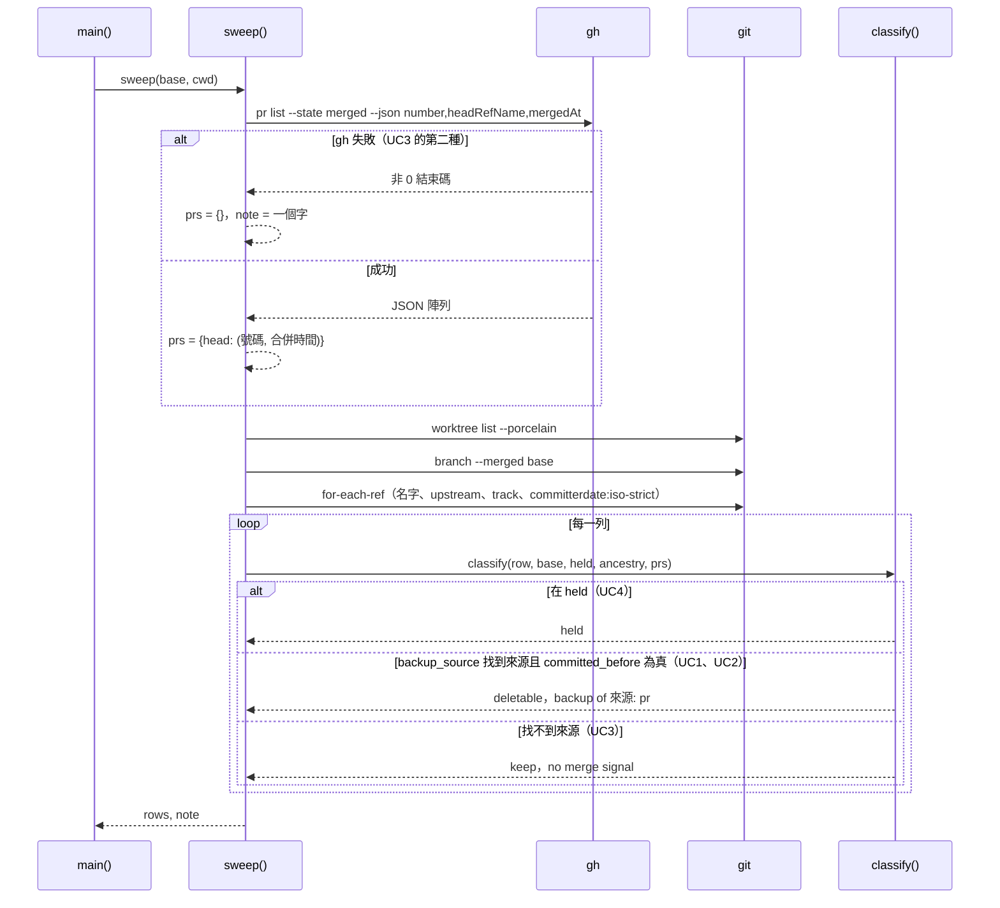
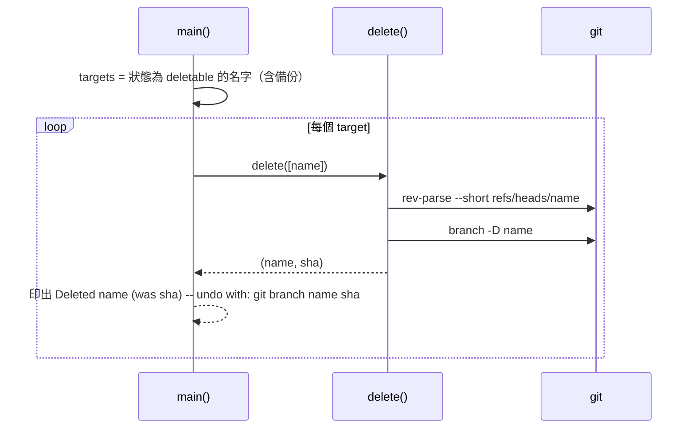

# git-sweep-delete-backups — detail design

這份是建造規格，寫給沒參與對話、照著就能動工的人。它不是簽核對象：本人簽的是 stance 和 decisions，這份是那兩份授權的施工圖。名詞第一次出現的定義見 `## Glossary`；表外幾個詞：PR（pull request，合併請求）、gh（GitHub 的命令列工具）、head（PR 的來源分支名，gh 欄位 `headRefName`）、WHY（sweep 表格的理由欄）、SHA（commit 識別碼）、squash（把一串 commit 壓成一個）、worktree（另一個工作目錄）、Codex 版（`scripts/gen-codex.py` 從 `plugins/cai/` 產生的 `plugins/cai-codex/`）。

## Reference

Stance doc: docs/design/2026-09-26-git-sweep-delete-backups-stance.md
Decisions doc: docs/design/2026-09-26-git-sweep-delete-backups-decisions.md
Status: approved 2026-09-26（stance）；decisions 的 Tier 1 唯一一條 D1 已有 `Decided:`（B，本人 2026-09-26）

### Traceability

| From the referenced document | Satisfied by | Status |
|---|---|---|
| R1 — 備份從不 `deletable` | `classify()` 在 `pr` 之後加備份規則（`### classify`）；測試 T1 | covered |
| UC1 — 來源已從本地刪除 | `backup_source()` 只對已合併 PR 的 head 比對，不看本地分支（S6）；測試 T2 | covered |
| UC2 — presquash 形狀 | 兩種寫法比對（`### backup_source`）＋時間檢查通過（decisions C6：早 50 分鐘）；測試 T3 | covered |
| UC3 — 沒有 PR 時 `keep`；gh 查不到時 `keep` 加 `note:` | `backup_source()` 回 `None` 就往下走到既有的 `gone`／`keep`；`gh_merged_prs()` 失敗時回空表（`branch_sweep.py:134-135`）；測試 T4、T5 | covered |
| UC4 — worktree 占用時 `held` | `held` 仍在最前面（`branch_sweep.py:218-219`，不動）；測試 T6 | covered |
| UC5 — `--delete` 印復原行 | 走既有 `delete()` 與 `main()`（`branch_sweep.py:245-257`、`:319-322`，不動）；測試 T7 | covered |
| UC6 — 說明、Codex 版、驗證 | `## Change points` 的 docstring 與 `SKILL.md` 三處；Unit 3 重產 Codex 版、跑 `validate.py` 與 `pytest` | covered |
| R2 — 多個 head 對得上 | `backup_source()` 的挑選規則（D2）；測試 T9 | covered |
| R3 — 縮小同名重用的誤判 | `committed_before()` 時間檢查（D1＝B）；測試 T8、T11 | covered |
| R4 — 沒有後綴 | `backup_source()` 要求 head 後面還有 `-` 和至少一個字元（D3）；測試 T10 | covered |

## Requirement

ship 在 squash 前建的 `backup/<來源>-<後綴>` 分支從不 push，也不是任何 PR 的 head，所以 sweep 永遠把它判成 `keep / no merge signal`（`branch_sweep.py:228`），要人手動清（issue #188）。做完之後：來源的 PR 已合併、且備份最後一個 commit 不晚於那次合併時，同一次 sweep 就把備份列為 `deletable`，WHY 為 `backup of <來源>: pr #N merged`；來源在不在本地都一樣。怎麼知道做到了：`## Verification` 的 T1–T11 全綠，既有 13 個測試一字不改照樣綠（S9），`validate.py` 與 `pytest` 通過。

## Glossary

| Term | Definition | Where it lives |
|---|---|---|
| sweep | 列出本地分支並替每條判一個狀態的腳本 | plugins/cai/scripts/branch_sweep.py:231 |
| 狀態（status） | `deletable`、`gone`、`ahead`、`held`、`keep` 五個值之一，表格依這個順序排 | plugins/cai/scripts/branch_sweep.py:65 |
| 備份（backup） | 名字以 `backup/` 開頭的本地分支；ship 用 `git branch "backup/${BRANCH}-$(date +%Y%m%d-%H%M%S)"` 建 | plugins/cai/skills/track/references/stage-ship.md:112 |
| 來源（source） | 備份當初備份的那條分支，由 `backup_source()` 從備份名對回某個已合併 PR 的 head | concept |
| 後綴（suffix） | 備份名裡來源之後、`-` 之後的部分，至少一個字元，內容不限 | concept |
| 寫法（spelling） | head 的兩種比對形式：原樣，以及把每個 `/` 換成 `-` | concept |
| 已合併 PR 表（prs） | `gh_merged_prs()` 的回傳：head 對應到（號碼, 合併時間）；同一個 head 只留號碼最大的一筆 | plugins/cai/scripts/branch_sweep.py:126 |
| 合併時間（merged at） | gh 的 `mergedAt` 欄位，UTC、ISO 8601，例如 `2026-09-27T00:05:07Z` | concept |
| 時間檢查 | `committed_before()` 對備份的最後 commit 時間與選中 PR 的合併時間回真 | concept |
| 最後 commit 時間（committed） | `for-each-ref` 的 `%(committerdate:iso-strict)`，例如 `2026-09-26T19:15:13-04:00` | concept |
| 分支列（row） | `local_branches()` 每一列：（名字, upstream, ahead 數, gone, 最後 commit 時間） | plugins/cai/scripts/branch_sweep.py:156 |
| `BACKUP_PREFIX` | 常數 `"backup/"` | new — plugins/cai/scripts/branch_sweep.py |
| `backup_source()` | 從備份名找出來源 head 的函式 | new — plugins/cai/scripts/branch_sweep.py |
| `committed_before()` | 判斷最後 commit 時間不晚於合併時間的函式 | new — plugins/cai/scripts/branch_sweep.py |
| 假 gh | 測試用的假 CLI，原樣輸出環境變數給的 JSON | tests/fake_gh.py:23 |

## Budgets

| What | Number | Where it comes from |
|---|---|---|
| 每次執行新增的子程序呼叫 | 0 | S4（stance:29）；兩個欄位都加在既有的 `gh pr list`（`branch_sweep.py:130-132`）與 `for-each-ref`（`:158-159`）裡 |
| 每條備份最多比對的 head 數 | 200 | `PR_LIMIT`（`branch_sweep.py:52`），每個 head 兩種寫法，最多 400 次 `startswith` |
| 子程序逾時 | 15 秒 | `TIMEOUT_SECONDS`（`branch_sweep.py:41`），不變 |
| 時鐘誤差緩衝 | 0 秒 | decisions Tier 3「時鐘誤差」列 |
| 真實備份離合併的餘裕 | 3000 秒 | decisions C6：19:15:13-04:00 對 00:05:07Z |
| 新增測試數 | 11 | `## Verification` T1–T11 |
| 既有測試的改動行數 | 0 | S9（stance:34）；只擴充 `use_fake_gh()` 這個輔助函式，向後相容 |

## Design decisions

- DD1 — 時間檢查（decisions D1，本人選 B）：備份的最後 commit 時間不晚於選中 PR 的合併時間，才列 `deletable`。服務 R3。
- DD2 — 挑來源（D2）：原樣與 `/`→`-` 兩種寫法都比，取最長；一樣長時原樣優先；還是一樣時取 PR 號碼大的（照 `branch_sweep.py:149-152`「同名留較新的」的既有慣例）。服務 R2。
- DD3 — 後綴必須存在（D3）：head 之後要有 `-` 和至少一個字元。服務 R4。
- DD4 — 規則的位置：`pr` 之後、`gone` 之前；`held`、`ahead` 不動（S1、stance:62 的圖）。
- DD5 — 時間檢查沒過時，不直接回 `keep`，而是照常往下判 `gone`；落到最後的 `keep` 時，WHY 改為 `backup of <來源>: pr #N merged before its last commit`，讓人看得出為什麼沒被刪（decisions Tier 3）。
- DD6 — 任一邊時間缺少或讀不出來，視為時間檢查沒過（decisions Tier 3「讀不到時間」列，S2 的安全方向）。
- DD7 — `note:` 字串不改（`branch_sweep.py:263-264`），只在 `SKILL.md` 補一句備份也會是 `keep`（decisions Tier 3）。

## Diagrams

### Architecture

看的重點：跨出腳本的箭頭數沒有增加，只是兩條既有的呼叫各多要一個欄位（S4）。模型那一層（SKILL.md）仍然只轉述，判斷全在腳本裡。

### Component

看的重點：兩個新函式都是純函式，只被 `classify()` 呼叫，不碰子程序；會變形狀的只有 `gh_merged_prs()` 的回傳值和 `local_branches()` 的列，`sweep()` 的簽名與回傳不變。

### Flow

看的重點：綠色只出現在 `pr` 之後；時間檢查沒過的備份不會被刪，但也不會吞掉 `gone`，只在最後的 `keep` 換一句 WHY（DD5）。

### Sequence — UC1, UC2, UC3, UC4

看的重點：UC1（來源已刪）和 UC2（presquash）走的是同一條呼叫順序，差別只在 `backup_source()` 內部用哪種寫法對上；本地有沒有來源分支從頭到尾不被查詢。

### Sequence — UC5

看的重點：備份走的刪除路徑和其他分支完全相同，沒有任何新呼叫（S8）。UC6 是說明與發版，沒有執行時的呼叫順序，所以不畫。

## Implementation spec

### BACKUP_PREFIX

- Responsibility：定義哪些分支名算備份。
- Interface：`BACKUP_PREFIX = "backup/"`，模組層常數，放在 `PR_LIMIT` 之後。
- Data：字串，小寫、區分大小寫比對（decisions Tier 3「前綴」列）。
- Errors／Concurrency：無。
- Observability：無。
- Where it lives：`plugins/cai/scripts/branch_sweep.py`（檔案存在）。
- What it reuses：值取自 `stage-ship.md:112`；上方註解說明為什麼（ship 建的名字），照 `branch_sweep.py:49-52` 的註解風格。

### gh_merged_prs（修改）

- Responsibility：一次查出所有已合併 PR，回傳 head 對應（號碼, 合併時間）。
- Interface：`def gh_merged_prs(cwd=None) -> tuple[dict[str, tuple[int, str | None]], str | None]`（型別只寫在 docstring，照檔案現況不加 annotation）。
- Data：argv 的 `--json` 改為 `number,headRefName,mergedAt`。每筆：`headRefName` 必須是非空字串、`number` 必須是 int，否則略過（現行規則加上「非空」）；`mergedAt` 是字串才保留，否則存 `None`。同一個 head 仍只留號碼最大的一筆，連同那一筆的 `mergedAt`。
- Errors：不變——非 0 結束碼回 `({}, classify_gh(...))`，JSON 讀不了回 `({}, "unreadable")`（`branch_sweep.py:133-141`）。
- Concurrency：唯讀，可重跑。
- Observability：不變，失敗時的一個字由 `render()` 印成 `note:`。
- Where it lives：`plugins/cai/scripts/branch_sweep.py:126-153`。
- What it reuses：`run()`（`:68-86`）、`gh_prefix()`（`:97-107`）、`classify_gh()`（`:110-123`）。

### local_branches（修改）

- Responsibility：一次列出所有本地分支，每列多帶最後 commit 時間。
- Interface：`def local_branches(cwd=None) -> list[tuple[str, str, int, bool, str]]`。
- Data：`fmt` 改為 `"%(refname:short)\t%(upstream:short)\t%(upstream:track)\t%(committerdate:iso-strict)"`；第五欄取 `parts[3]`，缺少時為 `""`。
- Errors：不變——`for-each-ref` 失敗回 `[]`（`:160-161`）。
- Concurrency：唯讀。
- Observability：無。
- Where it lives：`plugins/cai/scripts/branch_sweep.py:156-173`。
- What it reuses：`git()`（`:89-94`）、`_AHEAD`（`:54`）。

### backup_source（新增）

- Responsibility：給一個分支名，找出它是哪個已合併 PR head 的備份。
- Interface：`def backup_source(name, prs) -> str | None`，回傳 head（原樣，含 `/`），找不到回 `None`。
- Data：`name` 不以 `BACKUP_PREFIX` 開頭就回 `None`。否則 `rest = name[len(BACKUP_PREFIX):]`；對 `prs` 的每個 head、每種寫法（`head`、`head.replace("/", "-")`），當 `rest.startswith(寫法 + "-")` 且 `len(rest) > len(寫法) + 1` 時算對上。多個對上時依序比：寫法長度較長者、原樣寫法優先於 `-` 寫法、PR 號碼較大者（DD2）。
- Errors：不拋例外；空 `prs` 回 `None`。
- Concurrency：純函式。
- Observability：無；結果由 `classify()` 寫進 WHY。
- Where it lives：`plugins/cai/scripts/branch_sweep.py`，放在 `classify()` 之前。
- What it reuses：`prs` 的形狀來自 `gh_merged_prs()`。

### committed_before（新增）

- Responsibility：判斷最後 commit 時間不晚於合併時間。
- Interface：`def committed_before(committed, merged_at) -> bool`。
- Data：兩個都是字串或 `None`。各自先把結尾的 `Z` 換成 `+00:00`，再用 `datetime.datetime.fromisoformat()` 讀；回傳 `committed_dt <= merged_dt`。
- Errors：任一個是 `None`、空字串，或讀取／比較時拋 `ValueError`、`TypeError`，回 `False`（DD6）。
- Concurrency：純函式。
- Observability：無。
- Where it lives：`plugins/cai/scripts/branch_sweep.py`，放在 `backup_source()` 之後；檔頭加 `import datetime`。
- What it reuses：與 `plugins/cai/scripts/viewer.py:1228` 相同的讀法。

### classify（修改）

- Responsibility：替一列判出（狀態, WHY）。
- Interface：`def classify(row, base, held, ancestry, prs) -> tuple[str | None, str | None]`，簽名不變。
- Data：拆列改為 `name, _upstream, ahead, gone, committed = row`。`name in prs` 那一行改用 `prs[name][0]` 取號碼，WHY 字串不變。在它之後加入：`source = backup_source(name, prs)`；有來源時取 `number, merged_at = prs[source]`，`committed_before(committed, merged_at)` 為真就回 `("deletable", "backup of %s: pr #%d merged" % (source, number))`，否則記下 `unproven = "backup of %s: pr #%d merged before its last commit" % (source, number)` 並往下走。`gone` 判斷不變；最後回 `("keep", unproven or "no merge signal")`。docstring 的「Order is the safety policy」照留。
- Errors：不拋例外。
- Concurrency：純函式。
- Observability：WHY 欄是唯一輸出。
- Where it lives：`plugins/cai/scripts/branch_sweep.py:212-228`。
- What it reuses：`backup_source()`、`committed_before()`。

### 模組 docstring 與 SKILL.md（修改）

- Responsibility：讓讀的人知道備份規則存在、依據什麼、弱在哪裡。
- Interface／Data：以下英文句子照抄進檔案（這兩個檔案都是英文）。
  - docstring `branch_sweep.py:18-22`：第一句改為「Only `ancestry` and `pr` are evidence that the work reached <base>, and only those -- plus the backup rule below, which leans on `pr` -- are ever reported `deletable`.」；在 `gone` 那段之後加一段：「A `backup/<source>-<suffix>` branch -- what `ship` leaves behind before it squashes -- is never pushed and is no pull request's head, so none of the three signals can fire for it. It is reported `deletable` when <source> is the head of a merged pull request and the backup's last commit is no later than that merge. The match is by name only; nothing checks the backup's contents. The time check is what keeps a backup made in a later round of a reused branch name from riding on the earlier round's merge.」
  - `SKILL.md:27-28` 的 `deletable` 後面接：「Or it is a `backup/<source>-<suffix>` branch whose source's pull request merged after the backup's last commit; the `WHY` column then reads `backup of <source>: pr #N merged`. That match is by name only -- nothing checks the backup's contents.」
  - `SKILL.md:38` 的 `keep` 後面接：「A backup whose `WHY` ends in `merged before its last commit` has a source whose pull request merged before the backup's last commit, so it is probably left over from a later round on a reused branch name.」
  - `SKILL.md:40-44` 的 `note:` 段，在第一句之後接：「Backup branches can then only read as `keep` too.」
- Errors／Concurrency／Observability：無。
- Where it lives：`plugins/cai/scripts/branch_sweep.py:1-33`、`plugins/cai/skills/git-sweep/SKILL.md`。
- What it reuses：無。

## Naming

| Name | What it is | Chosen by |
|---|---|---|
| `BACKUP_PREFIX` | 值為 `"backup/"` 的模組常數 | follows 大寫常數慣例 `CLI_ENV`、`PR_LIMIT` at plugins/cai/scripts/branch_sweep.py:47；值 follows plugins/cai/skills/track/references/stage-ship.md:112 |
| `backup_source` | 找來源 head 的函式 | follows 小寫底線、描述回傳物的函式名 `merged_by_ancestry` at plugins/cai/scripts/branch_sweep.py:188 |
| `committed_before` | 時間比較函式 | follows 同上 at plugins/cai/scripts/branch_sweep.py:188 |
| `backup of <來源>: pr #N merged` | `deletable` 備份的 WHY | the user, 2026-09-26（intake 驗收條件 `.claude/track/git-sweep-delete-backups/options-intake.md:19`） |
| `backup of <來源>: pr #N merged before its last commit` | 時間檢查沒過、落到 `keep` 時的 WHY | decisions Tier 3「時間檢查沒過時的 WHY」列，隨 Gate 1 簽核；句型 follows 上一列 |
| `mergedAt` | gh 的 JSON 欄位 | gh 自己的欄位名（https://cli.github.com/manual/gh_pr_list ） |
| `%(committerdate:iso-strict)` | for-each-ref 的格式欄位 | git 自己的欄位名（https://git-scm.com/docs/git-for-each-ref ） |
| `test_backup_*` 等 11 個測試名（見 `## Verification`） | 新測試函式 | follows 句子式測試名 at tests/test_branch_sweep.py:92 |

## Change points

| Path | Change | Exists today |
|---|---|---|
| `plugins/cai/scripts/branch_sweep.py` | 加 `import datetime`、`BACKUP_PREFIX`、`backup_source()`、`committed_before()`；改 `gh_merged_prs()`、`local_branches()`、`classify()`、模組 docstring | yes |
| `plugins/cai/skills/git-sweep/SKILL.md` | 三處說明（見 `### 模組 docstring 與 SKILL.md`） | yes |
| `tests/test_branch_sweep.py` | `use_fake_gh()` 的 `merged` 接受（號碼, head）或（號碼, head, 合併時間），第三項存在時才輸出 `mergedAt`；新增 T1–T11；模組 docstring 補一句備份 | yes |
| `plugins/cai-codex/scripts/branch_sweep.py`、`plugins/cai-codex/skills/git-sweep/SKILL.md` | 只由 `python scripts/gen-codex.py` 重產，不手改 | yes |
| `plugins/cai/.claude-plugin/plugin.json`、`scripts/codex-release.json` | 版號與 `gen-codex.py --release`，在 ship 時依 commit 類型處理（decisions Tier 3「版號與 Codex 版」列） | yes |
| 新依賴 | 無；`datetime` 是標準函式庫 | — |

## Failure modes

| Situation | What happens | What the caller sees |
|---|---|---|
| gh 不在、未登入、連不上 | `prs = {}`，所有備份找不到來源 | 備份 `keep / no merge signal`，表格上方照舊有 `note:` 行 |
| gh 回的某筆沒有 `mergedAt` 或不是字串 | 存 `None`；`pr` 規則照常，備份的時間檢查沒過 | 該備份 `keep`，WHY `... merged before its last commit`（DD6） |
| `for-each-ref` 的時間欄空白或讀不出來（例如很舊的 git 不認得 `iso-strict`，UNVERIFIED） | `committed_before()` 回 `False` | 備份 `keep`，WHY 同上；其他分支不受影響 |
| 本機時鐘比 GitHub 慢，使這一輪的 commit 看起來早於上一輪合併 | 時間檢查通過 | 這一輪的備份被列 `deletable`（decisions D1 的已知失敗，Budgets 緩衝 0 秒） |
| 本機時鐘比 GitHub 快，使真正的備份看起來晚於合併 | 時間檢查沒過 | 備份 `keep`；要時鐘快過「最後 commit 到合併」的間隔才會發生（真實例 3000 秒） |
| 分支名正好是 `backup/` 或 `backup/<head>` | 沒有後綴，對不上（DD3） | `keep / no merge signal` |
| 兩個 head 換成 `-` 後同名、一樣長 | 取 PR 號碼大的（DD2） | WHY 指向號碼大的那個 PR |
| 備份名自己就是某個已合併 PR 的 head | 既有 `pr` 規則先命中 | `deletable`，WHY `pr: #N merged` |
| 備份被 worktree 占用、或有沒推上的 commit | `held`／`ahead` 先命中（S1） | 不會被刪 |
| 備份有 upstream 且遠端已刪，時間檢查沒過 | 照常判 `gone`（DD5） | `gone`，WHY 為既有的 upstream 說明 |
| 一個 `backup/*` 都沒有 | 新程式碼只做 `startswith` 判斷 | 表格與今天相同（S9） |
| 分支名或 head 含主控台編碼外的字 | `run()` 已用 UTF-8 讀（`branch_sweep.py:72-77`） | 照常 |

## Rollout

- 分段：一個 PR 出貨。最小可用的一塊就是整個規則加測試；說明與 Codex 版必須同一個 PR，否則 `validate.py` 報 DRIFT。
- 既有資料：不遷移。已經存在的備份在更新後第一次 sweep 就會被重新判定；本 repo 的 `backup/fix-diagnosis-recognition-shape-20260926-presquash` 會變成 `deletable`（decisions C6）。
- 進行中的呼叫：`/cai:git-sweep` 預設只列表不刪（`SKILL.md:19-22`），所以更新當下不會有東西被自動刪掉。
- Rollback：revert 這個 commit，沒有寫入任何狀態；已經用 `--delete` 刪掉的備份，用當時印出的 `git branch <名稱> <SHA>` 建回。

## Verification

測試全在 `tests/test_branch_sweep.py`，用既有的真 bare remote 與假 gh（`tests/test_branch_sweep.py:28-44`、`:66-74`）。「晚於」用 `2999-01-01T00:00:00Z` 當合併時間，「早於」用 `2000-01-01T00:00:00Z`，不依賴測試執行的時刻。備份用 `git branch <備份名> <來源>` 建，起點是本地分支，所以沒有 upstream（decisions C7）。

| Criterion | Level | What it needs | Green before |
|---|---|---|---|
| R1 — T1 `test_backup_of_a_squash_merged_source_is_deletable`：`feat/squashed` 已 push、PR #106 合併於 2999 年，`backup/feat/squashed-20260926-194453` 為 `deletable`，WHY 等於 `backup of feat/squashed: pr #106 merged` | integration | 真 repo、假 gh 三項 tuple | Unit 1 |
| UC1 — T2 `test_backup_is_deletable_after_its_source_was_deleted`：建備份後 `git branch -D feat/squashed`，備份仍 `deletable` | integration | 同上 | Unit 1 |
| UC2 — T3 `test_backup_with_dashes_and_a_word_suffix_is_recognised`：`backup/fix-diagnosis-recognition-shape-20260926-presquash` 對上 head `fix/diagnosis-recognition-shape`，WHY 用含 `/` 的原樣 | integration | 同上 | Unit 1 |
| UC3 — T4 `test_backup_of_an_unmerged_source_is_kept`：假 gh 回空陣列，備份 `keep`、WHY `no merge signal` | integration | 同上 | Unit 1 |
| UC3 — T5 `test_backups_are_kept_when_gh_is_unavailable`：gh 回 127，備份 `keep`，`note` 不是 `None` | integration | 照 `tests/test_branch_sweep.py:175-177` 的寫法 | Unit 1 |
| UC4 — T6 `test_backup_held_by_a_worktree_is_held`：`git worktree add` 備份，狀態 `held` | integration | tmp_path 下的 worktree | Unit 1 |
| UC5 — T7 `test_delete_prints_the_sha_that_undoes_a_backup`：`main(["--repo", ..., "--delete"])` 的輸出含 `git branch backup/feat/squashed-20260926-194453 ` 加 SHA 前 7 碼 | integration | capsys | Unit 1 |
| R3 — T8 `test_backup_made_after_its_source_merged_is_kept`：合併時間 2000 年，備份 `keep`，WHY `backup of feat/squashed: pr #106 merged before its last commit` | integration | 假 gh 三項 tuple | Unit 1 |
| R2 — T9 `test_the_longest_matching_source_names_the_backup`：`feat/a`（#1）與 `feat/a-b`（#2）都合併、合併時間都是 2999 年；本地只建 `feat/a-b` 並以它為起點建備份，`backup/feat/a-b-20260926-120000` 的 WHY 為 `backup of feat/a-b: pr #2 merged` | integration | 兩條來源分支 | Unit 1 |
| R4 — T10 `test_a_backup_with_no_suffix_is_not_a_backup`：`backup/feat/squashed` 為 `keep`、WHY `no merge signal` | integration | 同 T1 | Unit 1 |
| R3 — T11 `test_backup_without_a_merge_time_is_kept`：`feat/squashed` 已 push，假 gh 只給（號碼, head），備份 `keep`，而來源分支本身仍 `deletable`、WHY `pr: #106 merged` | integration | 兩項 tuple | Unit 1 |
| S9 — 既有 13 個測試一字不改照樣綠 | integration | 無 | Unit 1 |
| UC6 — `python scripts/validate.py` 全 PASS、`python -m pytest` 全綠、Codex 版無 DRIFT | integration | 重產後的 `plugins/cai-codex/` | Unit 3 |

## Work breakdown

| Unit | Depends on | Can run alongside | Done when |
|---|---|---|---|
| 1 — `branch_sweep.py` 的規則與 T1–T11：先寫測試看它紅，再改 `gh_merged_prs()`、`local_branches()`、`classify()`，加兩個新函式與常數，改模組 docstring | nothing | Unit 2 | T1–T11 與既有 13 個測試全綠 |
| 2 — `plugins/cai/skills/git-sweep/SKILL.md` 三處說明 | nothing | Unit 1 | 文字與 `### classify` 的行為一致 |
| 3 — `python scripts/gen-codex.py` 重產，然後 `python scripts/validate.py`、`python -m pytest` | Unit 1、Unit 2 | nothing | 兩者都通過；重產要等 PostToolUse 的 validate hook 跑完再做，否則可能報 DRIFT |

最有風險的是 Unit 1（`classify()` 改拆列、`gh_merged_prs()` 改回傳形狀，既有測試會第一個抓到），所以排第一。建造時發現本文件有錯，照 `stage-build.md` 的 Step 5 — Deviations 格式記錄，不另立格式。

### Upstream blockers

| What | Owned by | Needed before |
|---|---|---|
| 無：不需要本 repo 以外的任何東西；版號與 `--release` 在 ship 處理 | — | — |
