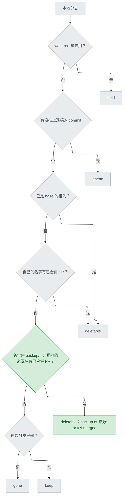

# git-sweep-delete-backups — stance

依據：`.claude/track/git-sweep-delete-backups/options-intake.md`（issue #188，驗收條件在 :18-24）。使用者在 intake 選單選了選項 A，這份文件不重新選方向，只把 A 的取捨寫成能刪選項的形式，交上去等核准。

名詞：sweep 指 `/cai:git-sweep` 背後的 `plugins/cai/scripts/branch_sweep.py`，它替每個本地分支（branch）判一個狀態：`deletable` 可刪、`keep` 保留、`held` 正被某個工作目錄（worktree）拿去用、`ahead` 有 commit 還沒推上遠端、`gone` 遠端分支已被刪。base 是工作預期要合進去的分支，通常是 main。upstream 是本地分支對應的那條遠端分支。祖先關係（ancestry）指分支的 commit 已經全在 base 的歷史裡。備份分支（backup branch）是 ship 階段在壓縮（squash，把一串 commit 壓成一個）之前建的 `backup/...` 分支。來源分支（source branch）是備份當初備份的那條。PR（pull request）是合併請求；gh 是 GitHub 的命令列工具，sweep 用一次 `gh pr list` 取得「已合併 PR 的號碼與來源分支名（headRefName）」。WHY 是 sweep 表格裡說明判定理由的那一欄。SHA 是 commit 的識別碼。內容證明指把備份試合併到 base、比對結果，確認內容都已在 base 上。Codex 版是 `scripts/gen-codex.py` 從 `plugins/cai/` 產生的 `plugins/cai-codex/`。

## Status

approved 2026-09-26

## Optimises for

來源分支一經已合併的 PR 確認，它留下的備份分支就在同一次 sweep 被列為 `deletable`，不必再手動清。判定只用 sweep 本來就會跑的那一次 `gh pr list` 和那一次 `git for-each-ref` 的結果，不新增任何 git 或 gh 呼叫。怎麼算成功：驗收條件每一條（options-intake.md:19-24）各有一個 `tests/test_branch_sweep.py` 案例指得到。

## Sacrifices

- **備份本身的內容從不檢查。** 「名字對得上一個已合併 PR」代替了「內容已在 base 上」。被刪掉的是 squash 前的逐筆 commit 歷史；內容本身在 squash 時保留（`stage-ship.md:126`「content must be identical to before the squash」），但沒有人再驗一次。
- **重複使用的分支名會誤判。** 同名分支上一輪沒合併留下的備份，或手動建、名字碰巧對上已合併 PR 的 `backup/*`，會被列為 `deletable`（使用者在 intake 接受，options-intake.md:44）。另一種同類情形 intake 沒點名：同名分支上一輪已合併、這一輪還沒合併時建的備份，也會被上一輪的 PR 判為可刪，因為 PR 對照表每個名字只留最新一個已合併 PR（`branch_sweep.py:149-152`）。唯一的補救是 `--delete` 印出的 SHA（`branch_sweep.py:319-322`）。
- **沒有 PR 的合併不算。** 來源只以祖先關係合併、或它的 PR 比最近 200 個已合併 PR 還舊（`PR_LIMIT`，`branch_sweep.py:49-52`），備份仍是 `keep`。
- **沒有 gh 就全部保留。** gh 查不到時，所有備份和今天一樣是 `keep`，只有既有的 `note:` 行說明原因（`branch_sweep.py:262-264`）。

## Invariants

**This system's:**

- S1 — 安全順序不變：`held`、`ahead` 在任何合併訊號之前判定（`branch_sweep.py:213-221`），備份規則也排在它們之後。被 worktree 拿去用的備份維持 `held`（options-intake.md:21）。
- S2 — 備份只有在推回的來源名有已合併 PR 時才可能 `deletable`；推不出來源、或來源沒有已合併 PR，一律 `keep`（options-intake.md:21）。
- S3 — 不做內容證明：不跑 `git merge-tree`、不比對 tree 或 diff。使用者否決了選項 B；B 在本 repo 唯一的真實備份上因 13 個檔案的版號衝突判錯（options-intake.md:16）。
- S4 — 不新增子程序呼叫：規則只用 `gh_merged_prs()`（`branch_sweep.py:126-153`）和 `local_branches()`（`:156-173`）那兩次既有呼叫的結果（options-intake.md:42「不多任何 git 呼叫」）。在同一次呼叫裡多要一個欄位不算新增呼叫。
- S5 — 兩種命名都認得：ship 的標準形 `backup/<來源>-<YYYYMMDD-HHMMSS>`（`stage-ship.md:112`），以及 `/` 被寫成 `-`、後綴不是時間的 `backup/fix-diagnosis-recognition-shape-20260926-presquash`（options-intake.md:15, :22）。
- S6 — 來源分支不必存在於本地：來源名拿去對已合併 PR 的 headRefName，不對本地分支清單（options-intake.md:20）。
- S7 — WHY 一字不差寫成 `backup of <來源>: pr #N merged`，`<來源>` 用 PR 的 headRefName 原樣（含 `/`）（options-intake.md:19）。
- S8 — 刪除路徑不變：備份和其他分支一樣走 `delete()`，印出 `git branch <名稱> <SHA>` 復原行（`branch_sweep.py:245-257`、`:319-322`；options-intake.md:23）。
- S9 — 名字不以 `backup/` 開頭的分支，判定結果與今天完全相同；`tests/test_branch_sweep.py` 既有案例不改一字照樣通過。

**Cross-project:**

- 本 repo `CLAUDE.md` 的「Who a file is for」：`branch_sweep.py` 與 `skills/git-sweep/SKILL.md` 是 Theirs，不能假設使用者的 repo 只有 ship 建的備份、或分支名有 `fix/` 這類前綴；`plugins/cai-codex/` 只能重新產生，不能手改。
- `skills/git-sweep/SKILL.md:8-12`：表格由腳本決定，模型只轉述、不自行判斷，所以規則必須寫在腳本裡，不能只寫在 SKILL 的說明文字。
- 使用者的 rules，以本 repo `CLAUDE.md` 匯入的版本為準（`coding.md` 最少程式碼、照檔案原有風格）。

## Rejected stances

- **選項 B：名字對上之後再做內容證明。** 誤刪風險較低，但在每個 `fix(cai)` PR 都要升版號的流程裡，幾乎每個備份都會撞版號而被誤留；本 repo 唯一的真實備份實測即判錯（options-intake.md:16）。使用者 2026-09-26 沒選。
- **對所有分支做內容比對，當第四種合併訊號。** 超出 #188 範圍、成本最高，且撞上同樣的版號衝突（options-intake.md:54）。
- **只認嚴格命名 `backup/<來源>-<8 位數字>-<6 位數字>`。** 誤判最少，但認不出本 repo 唯一的真實備份，違反驗收條件 options-intake.md:22。
- **維持現狀，備份交給使用者自己刪。** 什麼都不會誤刪，但 issue #188 回報的問題原封不動：備份永遠落在 `keep / no merge signal`（`branch_sweep.py:228`）。

## Use cases / Issues

- R1 — 備份分支從不 `deletable`：它沒有 upstream（本 repo 的備份在 `git for-each-ref` 輸出中 upstream 欄為空，2026-09-26 實測），所以 `ahead`、`gone` 都不觸發，也不是任何 PR 的 head，最後落到 `branch_sweep.py:228`。怎麼知道修好了：來源有已合併 PR 的備份，測試判為 `deletable` 且 WHY 符合 S7。
- UC1 — 來源分支已從本地刪除，備份仍判為 `deletable`（issue 的情境，options-intake.md:20）。
- UC2 — `-presquash` 形狀的備份找得回來源 `fix/diagnosis-recognition-shape`，並對上 PR #178（options-intake.md:15, :22）。
- UC3 — 來源沒有已合併 PR 時備份是 `keep`；gh 查不到時備份是 `keep`，並照舊印 `note:` 行。
- UC4 — 被 worktree 拿去用的備份是 `held`。
- UC5 — `--delete` 刪備份時印出復原行（S8）。
- UC6 — 說明與發版：`SKILL.md` 的 `deletable` 與 `note:` 說明、`branch_sweep.py:18-22` 的 docstring（今天寫「只有 ancestry 和 pr 會回報 deletable」）一併改寫；Codex 版重新產生；`validate.py`、`pytest` 通過（options-intake.md:24）。版號與 `gen-codex.py --release` 依 ship 時選的 commit 類型，照本 repo `CLAUDE.md` 處理。
- R2 —（交 Decisions）多個已合併 PR 的名字都對得上同一個備份時選哪個，例如 `fix/a` 與 `fix/a-b` 都對得上 `backup/fix/a-b-20260926-120000`；`fix/a-b` 與 `fix-a/b` 換成 `-` 後同名時怎麼辦。
- R3 —（交 Decisions）能否便宜地縮小 Sacrifices 第二項的誤判，例如要求備份最後一個 commit 的時間早於 PR 的合併時間。這需要 gh 的 `mergedAt` 欄位（UNVERIFIED，交 feasibility 表查官方文件）和 for-each-ref 多一個欄位，仍符合 S4；但它是否擋得住，取決於人怎麼重複使用分支名，可能要先補需求。
- R4 —（交 Decisions）沒有後綴的 `backup/<來源>` 算不算備份。

## Overview

看圖的重點：新加的只有綠色那一格，而且它插在 `held`、`ahead` 之後（S1），所以一條備份要走到它，必須先通過兩道安全檢查。它的「是」只來自已合併 PR 這一份既有資料（S2、S4），沒有任何一條路會去看備份的內容（S3）。

## Out of scope

- 內容證明、`git merge-tree`、tree 比對：使用者已否決（S3）。
- 修改 ship 的備份命名（`stage-ship.md:112`）或讓 ship 在合併後自己刪備份：這次只動 sweep。
- 名字不以 `backup/` 開頭的分支的任何判定改動（S9）。
- 比對規則的確切寫法、函式名稱、測試怎麼造分支：交給 Decisions 的 Tier 3 或 Detail。
- `docs/` 被 git 忽略；這份文件在 ship 時要用 `git add -f`。
