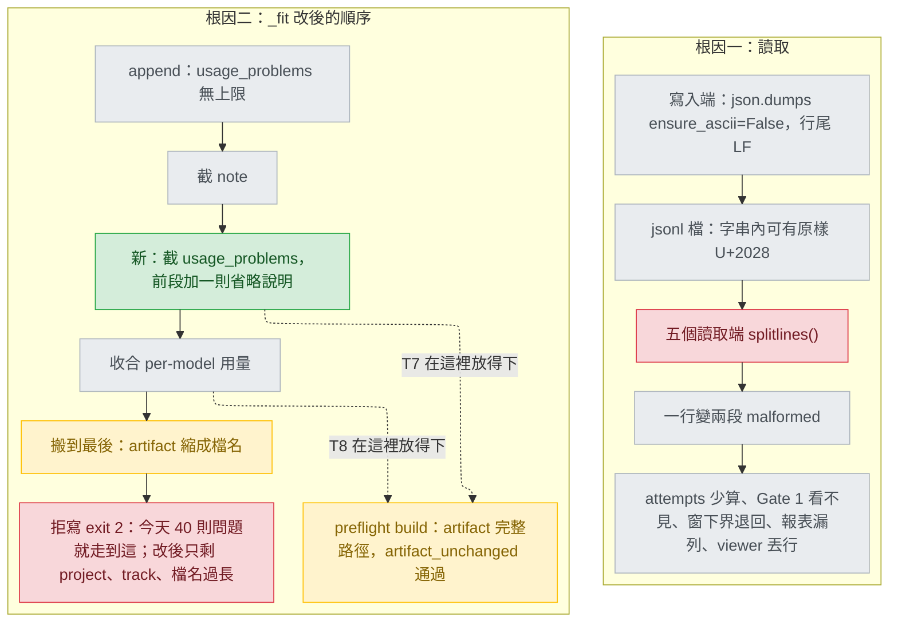

# jsonl-split-on-newline — diagnosis

## Status

approved 2026-09-26

## Symptom

名詞：每行一筆 JSON 的檔案格式（JSONL）；帳本（ledger，每條軌道的 `ledger.jsonl` 與集中帳本 `usage.jsonl`）；對話紀錄檔（transcript，Claude Code 每個 session 寫的 JSONL）；切行函式 `str.splitlines()`；記錄縮減函式（`_fit`）；用量問題清單（`usage_problems`，記錄上列出取用量時遇到的問題）；各模型用量明細（per-model 用量）；開工前檢查（preflight）；設計核可閘（Gate 1）。三個分隔字元一律寫成 U+2028（行分隔）、U+2029（段落分隔）、U+0085（下一行控制字元）。下文 `intake.md`、`options-*.md` 都在 `.claude/track/jsonl-split-on-newline/`。

- 現象一：一筆合法的帳本記錄，只要字串裡帶原樣的 U+2028、U+2029 或 U+0085，讀回來就變成兩個 malformed 佔位；重試計數、Gate 1 判定、用量窗下界、報表、Agent Viewer 都跟著讀錯。
- 現象二：一個 session 的 `usage_problems` 累積到二十則左右（見 Fix 的模擬）之後，這個 session 的每一次 `ledger.py append` 都 exit 2、什麼都不寫，Gate 1 的 Approve 因此遺失。
- 本軌道自己踩到：intake 的 `passed` 被拒，`record is 8512 bytes with nothing left to drop (limit 3840)`，50 則片段，全部來自對話紀錄檔裡含分隔字元的行（`intake.md:185-193`）。issue #154 留言另量到 532 則、92,451 位元組（`options-intake-Q1.md:6`）。
- 每次都重現的步驟：在一個暫存的 `CLAUDE_CONFIG_DIR` 下、清掉 `CLAUDE_CODE_SESSION_ID`，對暫存軌道目錄做三次 `ledger.append(track, "build", "failed", note="a" + chr(0x2028) + "b")`，再呼叫 `ledger.attempts(track, "build")`。實際輸出見下一節。

## Failing test

以下測試現在都會失敗；build 依序先寫出它們。函式名由 build 取，測試字串一律用 `chr(0x2028)` 等寫法；數行數不可沿用 `tests/test_ledger.py:23-25`、`tests/test_ledger_central.py:34` 的輔助函式，它們自己也用 `splitlines`。

| 測試 | 放在 | 斷言 | 對照的承諾 |
|---|---|---|---|
| T1＋AC1＋AC7 | `tests/test_ledger.py` | 三次 append 讀回 3 筆、`attempts == 3`、note 逐字相同；三個字元各一次；第 1 行帶 U+2028、第 2 行垃圾時 malformed 在第 2 行 | `tests/test_ledger.py:47-55`；`ledger.py:4-6`「one JSON object per line」；`ledger.py:419-422` 只有 unparseable line 才變 malformed |
| T2 | `tests/test_ledger_usage.py` | 仿 `:95-121`，第一筆 note 帶 U+2028，第二次的 `since` 等於第一筆的 `window_end` | D4 相鄰窗接續（`docs/design/2026-08-30-track-usage-accounting-detail.md:116`） |
| T3 | `tests/test_usage_collector.py` | `read_window()` 回傳那一行、`problems == []`；經 `usage_records()` 那一筆用量計入 | `usage_collector.py:193-195` 只有 unparseable lines 進 problems |
| T4 | `tests/test_preflight_build_gate.py` | note 帶 U+2028 的 Approve，`design_signed_off` 通過 | `preflight.py:222-234` 的 docstring |
| AC6 | `tests/test_report.py` | `usage_report._read_central_records()` 讀回、malformed 為 0 | `usage_report.py:402-408` 的 docstring |
| T6 | `tests/test_viewer_claude.py` | `read_tail()` 回傳帶 U+2028 的物件 | `tests/test_viewer_claude.py:23-28` |
| T5 | `tests/test_ledger_usage.py` | 仿 `:60-75`，collect 回 40 則約 174 位元組的 problem，`append()` 成功且 central 記錄 ≤ `CENTRAL_FIT_LIMIT`；清單最後一則是省略說明，前面是原清單的前段 | `ledger.py:369-370`「Truncating beats refusing」；設計文件 `:124`、`:439`、`:558-561` |
| T7 | `tests/test_preflight_build_gate.py` | T5 的 collect 加上 Gate 1 Approve（`gate="human"`、`artifact` 指向專案目錄**子目錄**裡的設計文件；放在專案根目錄的話檔名也找得到，修正前就會通過）；`preflight.py build` 的 `design_signed_off`、`artifact_unchanged` 都 PASS，記錄上仍是完整路徑 | `preflight.py:199-203`（UC5：build 讀的就是被簽的那份）；`preflight.py:222-234` |
| T8 | `tests/test_preflight_build_gate.py` | 同 T7 的文件位置，collect 改回兩欄各 20 個 model（仿 `tests/test_ledger_usage.py:60-73`）、問題清單為空；`usage_collapsed` 為真，artifact 仍是完整路徑，兩項檢查都 PASS | 同 T7 |

T1–T6 在本 session 以一支受限腳本實測（`CLAUDE_CONFIG_DIR` 指向新的暫存目錄、在匯入 repo 任何模組之前設定；真的 session id 與 `CAI_USAGE_LEDGER` 都清掉；只在需要走 collect 路徑的題目設一個假的 session id，並在行程內替換 `collect`；不改 repo 任何檔）。輸出原樣如下，暫存路徑以 `<tmp>` 代換：

```
T1 attempts: 0
T1 records: 6
T1 malformed_lines: [1, 2, 3, 4, 5, 6]
AC1 U+2028 whole/malformed: (0, 2, None)
AC1 U+2029 whole/malformed: (0, 2, None)
AC1 U+0085 whole/malformed: (0, 2, None)
AC7 malformed_lines (promise: [2]): [1, 2, 3]
AC6 central records/malformed: (0, 14)
T2 second since (promise: first window_end): '2026-09-26T00:00:00.000Z'
T2 first window_end: '2026-09-26T23:28:13.226Z'
T5 LedgerError: 'record is 7380 bytes with nothing left to drop (limit 3840)'
T5 ledger.jsonl exists: False
T4 design_signed_off: (False, 'design_signed_off (no passed+human design record on the ledger -- a person must pick Approve at the design gate, approval-gates.md Gate 1, which appends one with `--gate human`; a failed or blocked human record -- Changes requested, Reject -- does not count)')
T4 artifact_unchanged: (True, 'artifact_unchanged (no signed-off design recorded)')
T3 lines returned (promise: 1): 0
T3 problems (promise: []): ['unparseable line 1 in <tmp>\\transcript.jsonl', 'unparseable line 2 in <tmp>\\transcript.jsonl']
T6 read_tail (promise: both objects): [{'a': 2}]
```

T7、T8 今天的結果，同樣受限的第三支腳本（`append(track, "design", "passed", artifact="docs/design/…", gate="human", note="Approve")`，專案目錄是 52 位元組的暫存路徑；`design_signed_off` 的長訊息從略）：

```
T7 today: append: LedgerError: 'record is 7487 bytes with nothing left to drop (limit 3840)'
T7 today: design_signed_off: False (no passed+human design record on the ledger ...)
T8 today: stderr: usage detail collapsed to per-source totals to fit 3840 bytes
T8 today: recorded artifact: 2026-09-26-x-diagnosis.md   usage_collapsed: True
T8 today: design_signed_off: True
T8 today: artifact_unchanged: (False, 'artifact_unchanged (2026-09-26-x-diagnosis.md was signed off and is not there now)')
```

## Root cause

**根因一（切行）：五個 JSONL 讀取端用 `str.splitlines()` 切行，它的斷行集合比寫入端用的分隔字元 LF 大；其中 U+0085、U+2028、U+2029 可以合法地原樣出現在 JSON 字串裡，於是一行合法記錄被切成兩段。**

- 寫入端只用 LF 分行：`ledger.py:184-185` 以 `ensure_ascii=False` 編碼後加 `"\n"`。
- Python 文件（https://docs.python.org/3/library/stdtypes.html#str.splitlines）：「This method splits on the following line boundaries. In particular, the boundaries are a superset of universal newlines.」表中除 LF、CR 外還有 `\x0b`、`\x0c`、`\x1c`–`\x1e`、`\x85`、U+2028、U+2029。
- RFC 8259 §7（https://www.rfc-editor.org/rfc/rfc8259#section-7）：「All Unicode characters may be placed within the quotation marks, except for the characters that MUST be escaped: quotation mark, reverse solidus, and the control characters (U+0000 through U+001F).」json 文件（https://docs.python.org/3/library/json.html#json.dump）：「If False, all characters will be outputted as-is, except for the characters that must be escaped」。實測 `json.dumps(..., ensure_ascii=False)` 對 `\x0b`、`\x0c`、`\x1c`–`\x1e`、CR 都輸出跳脫形式，只有 U+0085、U+2028、U+2029 原樣保留（上述腳本，Python 3.13.5）。所以會出事的恰好是這三個，而字串內的 LF 一定被跳脫，只在 LF 切行不會誤切。
- 五處：`ledger.py:139`、`ledger.py:430`、`usage_collector.py:204`、`usage_report.py:417`、`viewer.py:1088`。

**修掉堆疊指向的那一行之後仍然成立的事：** `design_signed_off` 看不見 Approve 的直接原因是 `records()`（`ledger.py:430`），但只修它，其餘四處照樣切錯，因為原因是「每個讀取端各自選了切行函式」，不是某一行。所以五處一起修。將來新增的讀取端仍可能再犯；intake 選做法 A 時已接受這一點，條件是讀取端維持個位數且各有測試（`intake.md:146`）。

**根因二（`_fit`）：`_fit` 的縮減步驟只處理 note、artifact 與 per-model 用量，沒有一步處理 `usage_problems`，而它同樣沒有上限。**

- 三步與拒寫：`ledger.py:371-415`。第三步的註解把不成立的不變式寫成事實：「per-model detail is the one field that can grow without bound」（`ledger.py:401-402`，設計文件 D5 `:120-124` 同一個前提）。
- `usage_problems` 每遇到一個壞行、一行缺時間戳、一個讀不到的檔就加一則，沒有上限，每則還帶一條路徑：`usage_collector.py:200`、`:211`、`:218`。
- **只修根因一之後仍然成立的事：** 真正壞掉的行（`:211`）和缺時間戳的行（`:218`）照樣無上限，每次 append 都整份重報（`intake.md:173`）。所以根因二獨立存在，不是根因一的症狀。
- **在同一條路上找到的第三件事：** 第二步把 artifact 縮成檔名（`ledger.py:392-399`，理由「Its basename still names the file」），但 `artifact_unchanged` 用記錄裡的 artifact 路徑去找檔（`preflight.py:208-212`，`resolve()` 在 `preflight.py:47-55` 只把它接在專案目錄與軌道目錄後面），檔名找不到就 FAIL（上面 T8 today 實測）。所以新步驟若照 Q1 排在三步之後，記錄寫得進去，`preflight.py build` 仍然擋下。這是 P1，使用者 2026-09-26 選了選項 B（`options-design-P1.md:51-58`），做法見 Fix。

**升級到立場模式：考慮過，沒有採用。** 根因二落在一條不成立的不變式上，照 `stage-design.md` 第 4 步應升級。沒有升級，理由：「照寫還是拒寫」這個取捨，使用者已在 Q1 看過兩句互相矛盾的承諾（`options-intake-Q1.md:8`）之後選了 A，樣本是 exit 0（`:20-25`），欄位 3 寫明錯誤處理表那一列要改寫（`:40`）；design 路線又選了「一份診斷書」，選項原文寫明「Q1 的回答記成立場裁決」（`options-design-path.md:49`）。剩下唯一會改變做法形狀的選擇 P1 以待決問題交給使用者、已回答，而不是另寫一份立場書。依 `stage-design.md:279-282` 記錄在此。

## Blast radius

| 讀取端 | 切斷時的後果 |
|---|---|
| `ledger.py:430` `records()` | 一筆變兩個 malformed（`:438`）：`streak()` 排除它（`:452`），重試上限少算；`last_passed()` 找不到 design pass（`:463-471`），`artifact_unchanged` 回「不適用」直接通過（`preflight.py:204-206`）；`design_signed_off` 找不到 Approve（`preflight.py:235-243`）；之後每行行號多 1，`ledger_intact` 報錯行號（`preflight.py:185-195`） |
| `ledger.py:139` `_window_since()` | 本 session 最新一筆讀不到，下界退回前一筆或導入日（`ledger.py:133`、`:156-169`；上面 T2 退到導入日零時），同一段用量記兩次 |
| `usage_collector.py:204` `read_window()` | 片段記成 unparseable（`:211`），那一輪用量漏算；片段沒時間戳，每次 append 重報。`usage_records()`（`usage_collector.py:262`）與 `context_peak.py:93-94` 吃它切好的行，修它就一併修好 |
| `usage_report.py:417` | 記錄從 `/cai:usage` 報表消失 |
| `viewer.py:1088` `read_tail()` | Claude transcript 尾段（`viewer.py:1712`）與 Codex rollout 尾段（`viewer.py:2006`）裡帶字元的那行被默默丟掉（`viewer.py:1094-1095`）；畫面上的實際錯誤未實測 |

- 其餘 `splitlines` 都讀 Markdown、指令輸出或 docstring（`intake.md:36-41`）；explorer 掃 `plugins/cai/` 全樹、本 pass 另查 `plugins/cai/hooks/`，都沒有第六個 JSONL 讀取端。
- `_fit` 的後果涵蓋同一 session 的每一次 append，兩份帳本都不寫（`ledger.py:253-263`）。縮檔名那一步在 D5 預期的「12 個以上 model」時同樣觸發（設計文件 `:122`；上面 T8 today），新順序一併封住。
- 新順序下收合時 artifact 仍帶目錄。D5 的 12 個門檻是在「artifact 已縮成檔名」下量的（設計文件 `:90`）；11 個 model 那階還有 242 位元組餘裕（3840−3598），目錄前綴短於此門檻不變，更長則提早觸發收合（由 `:90` 的數字推算，未實測）。
- `plugins/cai-codex/scripts/` 的 `ledger.py`、`usage_collector.py`、`viewer.py` 是產生的複本；`usage_report.py`、`context_peak.py` 被排除（`scripts/gen-codex.py:62-67`）。
- 已經寫在磁碟上、先前被切斷的記錄：升版之後會被讀成完整記錄。進行中的軌道因此可能看到 `attempts` 上升、先前看不見的 Approve 重新算數、`ledger_intact` 的 malformed 數下降。這是 AC1 承諾的方向，不另做遷移。新順序只影響之後寫入的記錄。

## Fix

**單元 1（切行）**：五處 `.splitlines()` 改成 `.split("\n")`，旁邊一行註解說明原因。寫入端不動（AC8）。
- 行號因此回到實際行號：LF 就是寫入端的分隔字元。檔尾的空字串由既有的 `if not text.strip()` 略過。
- CRLF 檔留下的行尾 CR，`json.loads` 視為空白接受（實測 `json.loads('{"a":1}\r')` 成功）；`usage_collector.py:205`、`viewer.py:1089` 本來就先 `strip()`。
- `viewer.py:1084` 丟棄尾段開頭殘行時，本來就以 LF 為界，改完兩者一致。

**單元 2（`_fit` 的新順序，P1 選項 B）**：截 note → 截 `usage_problems`（新）→ 收合 per-model 用量 → artifact 縮成檔名 → 拒寫。截 note（`ledger.py:375-390`）與收合（`:405-412`）的程式不動；縮檔名那段（`:394-399`）整段搬到收合之後，讓 `artifact_unchanged` 找檔所靠的路徑（`preflight.py:208-212`）成為最後才犧牲的欄位。
- 截問題清單：N 則時，找最大的 K（0 ≤ K < N），使「前 K 則原樣保留，再補一則 `"<N-K> more omitted"`」的記錄編碼後不超過 `limit`；找到就回傳，stderr 印 `usage_problems cut to the first <K> of <N> to fit <limit> bytes`。K 為 0 也放不下時，K=0 的形式（只剩那一則省略說明）編碼後比原清單短就留下，否則還原原清單，都往下走收合。N 為 0 時整步跳過。
- 為什麼量位元組、不數則數：每則的長度隨路徑變（`usage_collector.py:200,211,218`），只數則數無法保證 AC-F(a)；其他步驟都用同一種方法（`_encode` 後和 `limit` 比，`ledger.py:371-372`）。
- `usage_problems` 唯一的讀取端把各則以 `"; "` 串起來印（`ledger.py:526-528`），省略說明當成一則字串不會弄壞它。不能掛在收合的 `if` 底下（`ledger.py:405`）：用量兩欄都空時那段整個跳過，這一步仍要跑。
- stderr 照今天的慣例只說「讓記錄放得下的那一步」（`ledger.py:390,398,411`；上面 T8 today 只說收合、沒提檔名），收合與縮檔名的兩句原文不動；前面各步留在記錄上看得到（截斷標記、省略說明、`usage_collapsed`）。
- 模擬：程式還不存在，第三支腳本在行程內用一個照上面規則寫的替身取代 `_fit`，跑同樣的 `append()` 與兩項 preflight 檢查。K 隨專案路徑長度變，測試不可釘死 K：

```
T7 after: exit 0 / stderr: usage_problems cut to the first 19 of 40 to fit 3840 bytes
T7 after: usage_problems: ["unparseable line 0000 in /home/u/.claude/projects/ppp...jsonl", ...19 則..., "21 more omitted"]
T7 after: artifact: docs\design\2026-09-26-x-diagnosis.md / central record 3802 bytes (limit 3840)
T7 after: design_signed_off: True / artifact_unchanged: True
T8 after: stderr: usage detail collapsed to per-source totals to fit 3840 bytes
T8 after: artifact: docs\design\2026-09-26-x-diagnosis.md / usage_collapsed: True / artifact_unchanged: True
```

- AC-F(e)：同一替身對 `tests/test_ledger_usage.py:172-203`、`:156-167` 的輸入，新舊順序回傳值與記錄完全相同（腳本印 `True`）；`:32-56`、`:60-90` 在截 note 或收合就結束，問題清單都空。
- 程式裡跟著改的文字：`ledger.py:392-393`「Step 1 already emptied the note, so the only field left with slack is the artifact path」搬家後不成立，改寫；`:401-404` 那句不成立的不變式改寫；`tests/test_ledger_usage.py:170,192` 稱縮檔名為第二步，改成按功能稱呼（測試函式名不改）。`_fit` 的 docstring（`:364-370`）沒寫順序，不動；`ledger.py:174` 與 `tests/test_ledger_usage.py:3,58` 的步驟編號今天就互相矛盾，不是本修正造成的，不動。
- 設計文件 `docs/design/2026-08-30-track-usage-accounting-detail.md` 就地改寫兩處，各在句內指向本文：`:118` D5「既有的兩步…不動，新步驟排在它們之後」改為上面的新順序，並寫明 artifact 路徑最後才犧牲的理由；`:566` 改為「全部步驟之後仍超過 → 拒寫 exit 2，兩份都沒寫；單是問題清單爆量不會走到這一列，它被截短、exit 0」。`:564`「前兩步失效，第三步收合」在新順序下仍成立（前兩步變成截 note、截問題清單），`:90` 是有條件的實測紀錄，都不改。
- 收尾：`python scripts/gen-codex.py` 重產複本，版本號與 Codex `--release` 各升一次（AC10）；`python scripts/validate.py` 全 PASS、`python -m pytest` 全綠（AC9）。

## Invariants preserved

- 寫入端的位元組不變（AC8，`ledger.py:183-185` 沒有 diff）。
- R5：真正無法解析的行仍變成 malformed 佔位、不丟例外（`ledger.py:419-422`）。
- AC-F(d)，照 P1 選項 A/B 的原文改寫（`options-design-P1.md:46,55`）：今天只靠截 note 就寫得進去的記錄，輸出位元組完全相同。會變的只有今天要走到縮檔名或收合的記錄：問題清單非空者先截清單，artifact 與 per-model 明細因此可能保住；問題清單為空、有 per-model 用量者先收合再縮檔名，其中「縮檔名就放得下」的那一窄類改成保留路徑、收合明細（P1 欄位 4 接受的代價；替身實測：note 清空後超 10 位元組、3 個 model，今天縮檔名，改後收合）；兩者皆空時結果不變。沒有 session id 的記錄問題清單固定一則原因（`ledger.py:240`），超限時它先被換成 `1 more omitted`，`session_id` 為 null 仍看得出原因。
- D-B（使用者 2026-08-30 裁決，設計文件 `:126`）：note 先於用量被犧牲，照舊。
- UC5：`artifact_unchanged` 只信帳本記錄上的路徑與 digest、不信 `state.md`（`preflight.py:201-203`）。修法不碰 preflight，而是讓那條路徑最後才被縮。
- 改寫後的不變式：記錄裡每個大小由外部資料決定的欄位（note、`usage_problems`、per-model 用量、artifact）都有一個縮減步驟；只剩 `project`、`track` 或 artifact 檔名本身過長時才拒寫。

## Picture



看兩個紅框：上面是切行函式選錯，下面是今天沒有一步處理問題清單而直接拒寫。綠框是新的一步；黃框是搬到收合之後的縮檔名，以及因此在縮檔名之前就放得下、preflight 找得到完整路徑的兩條虛線（T7、T8）。

## Out of scope

- 寫入端改用 `ensure_ascii=True`（`intake.md:172`）。
- `usage_collector.py:211`、`:218` 每次 append 都重報整份檔案的壞行，這個行為本身不改（`intake.md:173`）。
- 共用切行函式（intake 的做法 B，已選 A）。
- 所有步驟之後仍會拒寫的情況：`project` 路徑極長（設計文件 `:565`）、`track` 名稱極長，或 artifact 檔名本身極長。只列出，不處理。
- `usage_report.py:407-408` 的 docstring 引用漂移（`intake.md:178`）。
- Codex rollout 是否原樣寫入 U+2028：UNVERIFIED，只影響 viewer 那一處修正的效益，不影響修法。
- 具體版本號，留給 build／ship。
