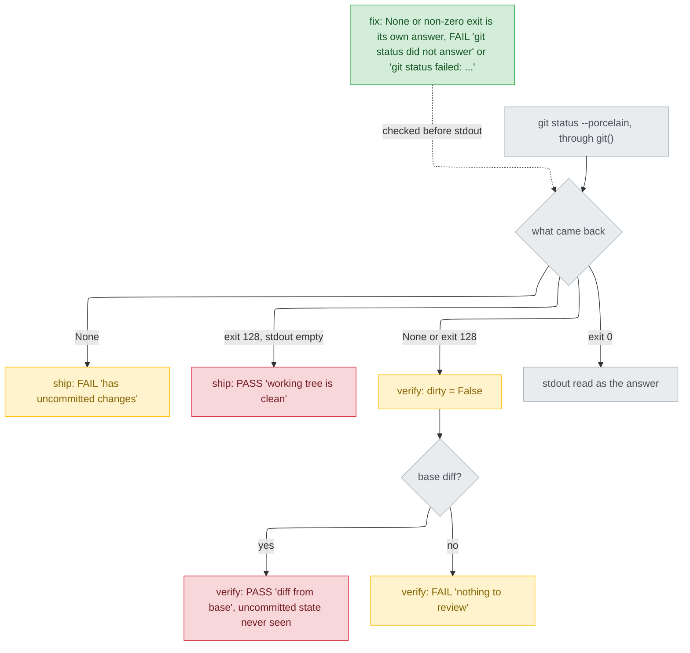

# preflight 把失敗的 git status 當成乾淨工作樹 — diagnosis

名詞：preflight（`plugins/cai/scripts/preflight.py`，每個 track 階段開始前跑的檢查腳本，每項印 PASS/FAIL，有 FAIL 就擋下該階段）；`git status --porcelain`（以機器可讀格式列出未提交變更的 git 指令，沒有變更時輸出為空）；`git()`（preflight 自己包的執行 git 的函式）；`CompletedProcess`（Python 執行子程序後回傳的結果物件，帶結束碼 returncode、標準輸出 stdout、標準錯誤 stderr）；`clean_tree`（ship 階段「工作樹沒有未提交變更」的檢查項）；`has_changes`（verify 階段「有東西可審」的檢查項）；stub（測試裡用假函式頂替真的 `git()`，指定它回傳什麼）；base diff（目前分支相對於基準分支 main/origin 的已提交差異）。

## Status

approved 2026-09-26

## Symptom

`git status --porcelain` 失敗時，preflight 不是把它當「問不到」，而是當成一個答案：

- `ship`：結束碼 128、stdout 為空 → `PASS clean_tree (working tree is clean)`。這是一次沒做成的檢查卻判定通過。
- `ship`：`git()` 回傳 `None` → FAIL，但標籤寫 `has uncommitted changes`，擋下的理由是錯的。
- `verify`：任何失敗的 status 都被當成「沒有未提交變更」。有 base diff 時 PASS（只看到已提交的部分）；沒有時 FAIL，標籤寫 `nothing to review`，理由也是錯的。

**重現**（2026-09-26，main session 執行，本 track design 第 1 輪寫的腳本原封不動）：`python <scratchpad>/repro_155.py`，`TMPDIR`/`TEMP`/`TMP` 指向 `<scratchpad>/repro155-tmp`。腳本在暫存目錄建真的 repo（`main` 上一個 commit，再切 `feat/x`；D/E/F2 在 `feat/x` 上多一個 commit），寫一份 verify 為 `done` 的 `state.md`，再呼叫 `preflight.STAGES[stage](track, repo)`。A–E 用 stub 讓 `("status", "--porcelain")` 回傳 `CompletedProcess(returncode=128, stdout="", stderr="fatal: simulated failure\n")` 或 `None`，其他 git 呼叫照常。F1/F2 不用 stub，把真的 `.git/index` 覆寫成 `not an index`。結束碼 0，之後 `<top>` 的 `git status --porcelain` 沒有輸出。完整 stdout（沒有家目錄路徑，不需遮蔽）：

```
git: git version 2.39.2.windows.1
A ship rc128: (True, 'clean_tree (working tree is clean)')
B ship None: (False, 'clean_tree (working tree has uncommitted changes)')
C verify rc128 no diff: [(False, 'has_changes (nothing to review)')]
D verify rc128 diff: [(True, 'has_changes (diff from main: 1 files, 1 lines)')]
E verify None diff: [(True, 'has_changes (diff from main: 1 files, 1 lines)')]
F1 rev-parse rc: 0
F1 status rc: 128 stdout: '' stderr0: fatal: .git/index: index file smaller than expected
F1 ship real: (True, 'clean_tree (working tree is clean)')
F1 verify real: [(False, 'has_changes (nothing to review)')]
F2 rev-parse rc: 0
F2 status rc: 128 stdout: '' stderr0: fatal: .git/index: index file smaller than expected
F2 ship real: (True, 'clean_tree (working tree is clean)')
F2 verify real: [(True, 'has_changes (diff from main: 1 files, 1 lines)')]
```

F1/F2 證明這不是只有 stub 才走得到的路：真的 git 2.39.2 在 `rev-parse --is-inside-work-tree` 成功（rc 0，所以 `is_git_repo` 放行，`preflight.py:300-302`）之後，`status` 仍以 128 結束、stdout 為空，preflight 照樣判定乾淨。

## Failing test

新檔 `tests/test_preflight_git_status_failure.py`（由 build 先寫、先跑出紅燈；檔名與函式名可由 build 改，斷言不可改）。夾具照上面的腳本：真 repo + `state.md`（verify 為 `done`，格式同 `scripts/validate.py:1514-1522`），stub 寫法同 `tests/test_preflight_merge_check.py:268-283`，只頂替 `("status", "--porcelain")`，`try/finally` 還原 `preflight.git`。六個測試，每個對應一種失敗情況（AC4）：

| 測試 | status 回傳 | base diff | 斷言 | 今天的結果 |
|---|---|---|---|---|
| `test_ship_status_exit_128_fails_clean_tree` | rc 128，stderr `fatal: simulated failure\n` | 無 | `ship(...)[1] == (False, "clean_tree (git status failed: fatal: simulated failure)")` | `(True, 'clean_tree (working tree is clean)')`（A） |
| `test_ship_status_exit_128_without_stderr_says_no_message` | rc 128，stderr `""` | 無 | `ship(...)[1] == (False, "clean_tree (git status failed: no message)")` | 同 A：`:747` 不讀 stderr，所以推得出也是 PASS（未單獨跑過） |
| `test_ship_status_no_answer_fails_clean_tree` | `None` | 無 | `ship(...)[1] == (False, "clean_tree (git status did not answer)")` | `(False, '... has uncommitted changes')`（B） |
| `test_verify_status_exit_128_with_base_diff_fails` | rc 128 | 有 | `verify(...) == [(False, "has_changes (git status failed: fatal: simulated failure)")]` | PASS `diff from main`（D） |
| `test_verify_status_exit_128_never_says_nothing_to_review` | rc 128 | 無 | 同上一列 | `nothing to review`（C） |
| `test_verify_status_no_answer_with_base_diff_fails` | `None` | 有 | `verify(...) == [(False, "has_changes (git status did not answer)")]` | PASS `diff from main`（E） |

失敗時 pytest 印的是 `assert <今天的結果> == <斷言右邊>`，例如第一列 `E  AssertionError: assert (True, 'clean_tree (working tree is clean)') == (False, 'clean_tree (git status failed: fatal: simulated failure)')`。這六個測試本身還沒跑過；它們用的 stub 與夾具就是上面的重現腳本，所以今天的結果欄是那次輸出（第二列例外，已註明）。

**所依承諾（promise）**：
- `plugins/cai/skills/track/references/stage-ship.md:59`「Working tree must be clean — if dirty, stop」。status 失敗時，沒人知道工作樹乾不乾淨。
- `MANUAL.md:331`：`clean_tree` 存在是因為「Ship rewrites history and won't do it over a dirty tree」；`MANUAL.md:329`：`has_changes` FAIL 的意思是「clean tree, no diff from base」。
- `preflight.py:686-690`：「couldn't tell」不可讀成「nothing changed」。
- 同一原則已經寫給 `not_main_branch`：`preflight.py:312-315`「Not knowing is a reason to block, not to continue」，`MANUAL.md:317`。

## Root cause

兩處讀 `git status --porcelain` 的程式只看 stdout，不看 git 有沒有成功回答；而 `git()` 在非零結束時照樣回傳帶空 stdout 的 `CompletedProcess`，所以「git 失敗」跟「工作樹乾淨」在這裡長得一模一樣。

- `git()` 只在 `OSError`/`SubprocessError` 時回傳 `None`（`preflight.py:296-297`），其他情況回傳 `subprocess.run` 的結果，不管結束碼（`:291-295`）。非零結束確實以 `CompletedProcess` 回來，而不是例外或 `None`：重現 F1 的 `ship real` 走的是未 stub 的 `git()`，判定為乾淨，只有拿到 stdout 為空的非 `None` 結果才會這樣。
- `ship`：`clean = bool(working and not working.stdout.strip())`（`:747`）。rc 128、stdout 空 → `True`；`None` → `False`，標籤只有兩種：`is clean` / `has uncommitted changes`（`:748-749`）。
- `verify`：`dirty = bool(status and status.stdout.strip())`（`:710`）。任何失敗都得 `False`，接著 `ok = dirty or diff`（`:718`），有 base diff 就 PASS，沒有就落到 `nothing to review`（`:727-728`）。
- 更上游的原因：preflight 對「工作樹乾不乾淨」只有兩種答案。`current_branch` 早已為「問不到」加了第三種值 `UNKNOWN_BRANCH`（`:305-322`），`bash_guard.py:432` 也先檢查 `returncode == 0` 才看 stdout；status 這兩處從 8babb52（2026-08-27，`feat(cai): fill in the five remaining preflight checks`）引入後從沒改過（`explorer` 跑 `git log -L 709,710` 與 `-L 746,747` 的結果，本 pass 的 Bash 只能跑 python，沒有自己重跑）。

**只修 stack trace 指到的那一行，還會剩下什麼**：這個 bug 沒有 stack trace，它是一次錯誤的 PASS。最顯眼的那一行是 `:747`（ship 的錯誤 PASS）。只修它，`verify` 的 `:710` 仍以同樣方式把失敗讀成「沒變更」，有 base diff 時照樣 PASS（重現 D、E、F2）。所以原因不在某一行，而在「status 的結果沒有『問不到』這個值」，兩處都要改，且兩處要一樣。

假設與檢驗（`debug/SKILL.md` Step 4）：H1（`ship` 不看結束碼）、H2（`None` 在 ship 得到錯的 FAIL 標籤）、H3（`verify` 不看結束碼，有 base diff 就 PASS）都被重現 A/B/D/E 證實；H4（`rev-parse` 成功後真的 git 不會讓 status 非零結束）被 F1/F2 推翻；H5（失敗的 status 會寫 stdout，所以只會錯 FAIL 不會錯 PASS）被 F1/F2 的 `stdout: ''` 推翻。單一元件，不需要 Step 3 的邊界埋點。

`git()` 因逾時回傳 `None`，要靠 `subprocess.TimeoutExpired` 屬於 `SubprocessError`（`:296` 只接這兩類）。這一點本 pass 沒查官方文件：UNVERIFIED。它不影響修法：修正後 `None` 不論從哪來都 FAIL 並標 `did not answer`。

## Blast radius

- **同一原因的兩個呼叫點**：`preflight.py:709-710`（verify）、`:746-747`（ship）。在 `plugins/cai/scripts` 與 `scripts` 裡，讀 `"status", "--porcelain"` 的只有這兩處加 `bash_guard.py:431`（`explorer` 的 `git grep`，我用 Grep 在 `plugins/` 下得到相同的三處加上 cai-codex 的副本）。
- **產生出來的副本**：`plugins/cai-codex/scripts/preflight.py:709`、`:746`，程式相同。要跑 `python scripts/gen-codex.py`，再加 `--release` 一個更大的版號（AC6）。
- **`bash_guard.py:431-432`**：先檢查 `returncode == 0`，問不到就放行，這是刻意的（`:427-430`），不受影響，也不改。
- **同樣形狀、但只會標錯理由、不會錯放**：
  - `:715-716`：`diff --quiet` 結束碼不是 0/1（例如 128）時當成「沒有 diff」。status 成功且乾淨時會 FAIL 並標 `nothing to review`，不會 PASS。
  - `:301-302`：`is_git_repo` 在 `git()` 回傳 `None` 時是 False，於是 `:707`/`:741` 標 `not a git repository`。照樣 FAIL。
  - `:377-384`：`track_ignored` 在 `check-ignore` 以 128 結束時會說「NOT ignored」，但它永遠回傳 True，只是建議。
- **`merges_cleanly`**（`:634-637`）：刻意在問不到時 PASS 並寫 `not checked`，不受影響，也不改。
- **文件**：`MANUAL.md:329`、`:331` 兩列沒提到 git 問不到的情況（AC6），`:317` 已經有這種寫法可以照抄。

## Fix

只改 `plugins/cai/scripts/preflight.py` 的 `verify` 與 `ship`，讓兩者先判斷 status 是否成功回答，再看 stdout：

1. `git()` 回傳 `None` → 原因字串 `git status did not answer`。
2. `returncode != 0` → `git status failed: <stderr 整段 strip 後的第一行>`；stderr 為 `None` 或只有空白則 `no message`。取法與 `:679-680` 完全相同。
3. `returncode == 0` → 照今天的方式讀 stdout，所有既有標籤不變。不可寫成 `(stdout or "")`：cp950 下 stdout 可能是 `None`（`:287-288`），那樣會把「解碼失敗」讀成「乾淨」，重演這個 bug。rc 0 而 stdout 為 `None` 時，今天在 `.strip()` 丟出 `AttributeError`（`:710`、`:747`），修正後照舊。
4. `ship`：1 或 2 → `clean_tree` 為 `(False, "clean_tree (<原因>)")`（AC1、AC2）。
5. `verify`：1 或 2 → 在看 base diff 之前直接回傳 `[(False, "has_changes (<原因>)")]`。這是本人 2026-09-26 選的方案 A（intake.md），所以 status 失敗時絕不印 `nothing to review`（AC3）。

兩處共用一個讀 status 的小函式，還是各自寫判斷，由 build 決定：只影響這一個檔案，上面六個測試兩種寫法都會抓到，改回來也只是改這個檔。

其他要動的檔案都是 repo 規定的機械步驟：新測試檔；`MANUAL.md` 兩列照 `:317` 的寫法各加一句——`:329` 的 Meaning 欄接在後面加「, or git could not be asked whether the tree is clean」，`:331` 的 Meaning 欄加「, or git could not be asked」，兩列的 Do this 欄都加「If the line says `git status failed` or `did not answer`, run `git status` yourself and fix what it prints — not knowing is a reason to stop」；`plugins/cai/.claude-plugin/plugin.json` 調高 patch、重新產生 `plugins/cai-codex/` 並 `--release`（AC6）。

## Invariants preserved

- git 成功回答時，所有標籤一字不改：`clean_tree (working tree is clean)`、`... has uncommitted changes`、`has_changes (uncommitted changes: ...)`、`diff from ...`，以及乾淨且沒有 base diff 時的 `nothing to review`。怎麼知道：`scripts/validate.py:1502-1540` 的四個 verify/ship 夾具與 `tests/test_preflight_verify_change_size.py` 不修改就通過（AC5）。
- 擋下仍以結束碼 2 表示（`validate.py:1504`、`:1533`）：修法只多出 FAIL，走既有的 FAIL 路徑。
- 「不知道就擋下」（`:312-315`）現在也適用於 status；`bash_guard` 與 `merges_cleanly` 的刻意放行不變（`bash_guard.py:427-430`、`preflight.py:634-637`）。
- cp950 的 stdout 為 `None` 仍是另一個問題，不被遮掉（見上面第 3 點）。
- 怎麼知道沒弄壞：`python -m pytest` 全綠，`python scripts/validate.py` 全 PASS，沒有 DRIFT 或 UNRELEASED。

## Picture



紅色是錯放（一次沒做成的檢查被判 PASS），黃色是擋對了但理由錯。它們全都來自同一個菱形「what came back」：今天那裡只分「stdout 空不空」，綠色的修正在讀 stdout 之前先把 `None` 與非零結束分出去。灰色的 `exit 0` 路徑不動。

## Out of scope

- cp950 下 `git()` 的 stdout 為 `None`（`preflight.py:287-288`）：另一個問題，intake 已列為範圍外。
- `:715-716`、`:301-302`/`:707`/`:741`、`:377-384` 的錯誤標籤：都不會錯放，只會標錯理由（見 Blast radius）；要修另開一件。
- `bash_guard.py:431-432` 與 `merges_cleanly`（`:634-637`）：刻意放行，不改。
- 方案 B（有 base diff 就放行並註記）：intake 已由本人否決，這裡不重新比較。
- `stage-ship.md:54-61` 由模型自己跑的 `git status`：那是模型讀輸出後的判斷，不是 preflight 的程式。
- 用真的損壞 index 寫測試：F1/F2 的 stderr 文字依 git 版本而定，CI 的 Linux git 是否相同 UNVERIFIED，所以失敗測試用 stub。
- cai 與 cai-codex 實際要用的版號：出貨前對照當時的 main 再決定。
