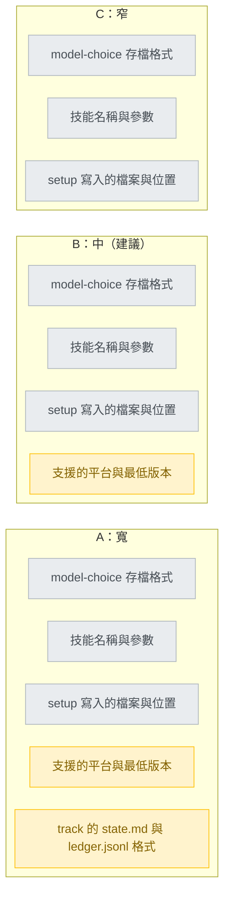
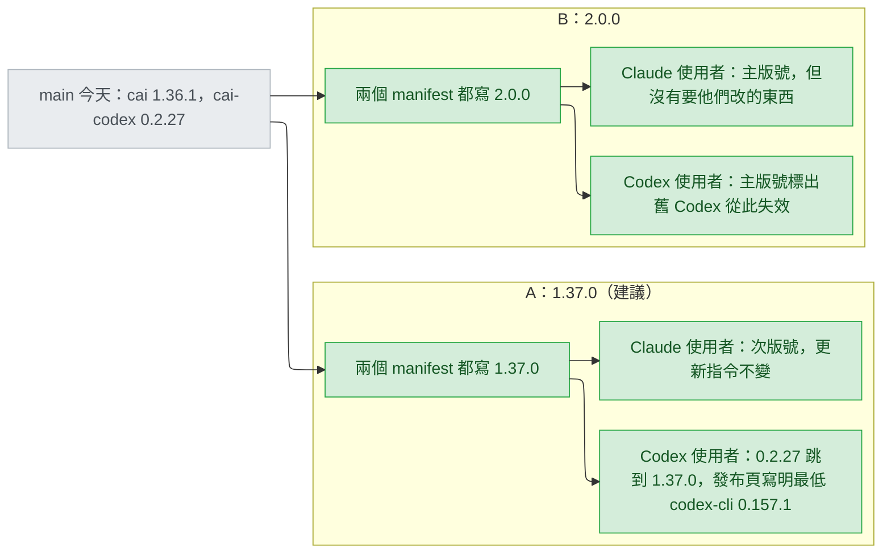
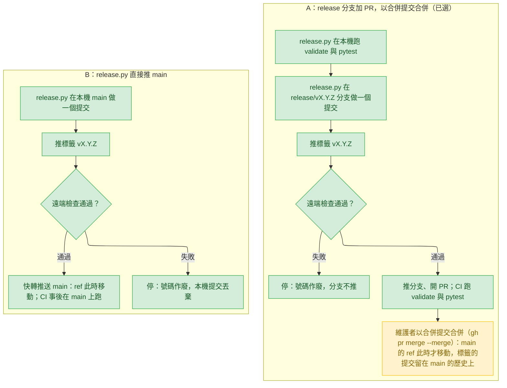
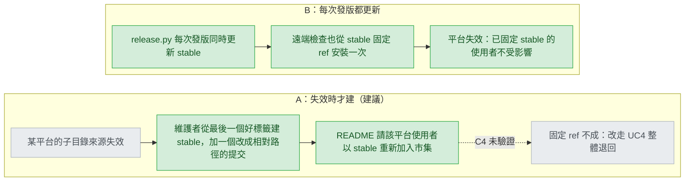
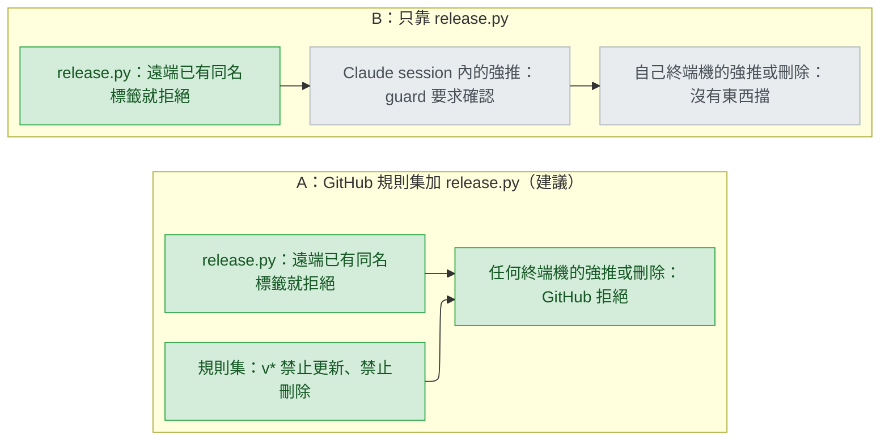

# release-versioning — decisions

詞彙（stance 已解釋過的「標籤、ref、市集檔、子目錄來源、快取、隔離設定目錄、SemVer、發布頁、CHANGELOG、啟動器」不再重複）：
- 公開介面（public API）：使用者會直接打、直接依賴或留在自己機器上的東西；SemVer 依「它有沒有被打壞」決定升哪一段。主版號／次版號／修補號即 MAJOR／MINOR／PATCH。
- 遠端檢查（remote check）：`release.py` 推出標籤後，從 GitHub 在隔離設定目錄裡實際安裝一次（stance I6）。
- PR（pull request）：合併請求。壓縮合併（squash merge）：把 PR 的所有提交壓成 main 上一個新提交。合併提交（merge commit）：main 上多一個有兩個父提交的提交，PR 分支上原本的提交原樣留在 main 的歷史裡。快轉推送（fast-forward push）：main 直接前進到本機那個提交，不產生新提交。
- 規則集（ruleset）：GitHub 儲存庫設定，能限制某些分支或標籤名稱誰可以推、改、刪。
- 退路分支（`stable` branch）：stance I9 的退路，只指向已發布標籤的內容。
- `--plugin-dir`：Claude Code 的啟動參數，讓一個 session 直接從資料夾載入外掛，不經市集安裝。

## Reference

- Stance: `docs/design/2026-09-26-release-versioning-stance.md` — status: approved 2026-09-26

## Feasibility

| Id | Capability | Verdict | Evidence |
|---|---|---|---|
| C1 | Claude Code：市集裡 ref 指向標籤的子目錄來源，裝到的是標籤的樹、快取目錄名等於標籤那版的版號；移動 ref 會更新；只改 HEAD 不會外漏 | verified | `.claude/track/release-versioning/spike.md:484-489`（Claude Code 2.1.283，O1–O4） |
| C2 | codex-cli 同上；更新方式是再跑一次 `codex plugin add`，不必先 remove | verified | `spike.md:484-489`、`spike.md:501-502`（codex-cli 0.157.1） |
| C3 | 從 github.com 經 HTTPS 的稀疏部分複製（sparse partial clone）能裝子目錄來源 | UNVERIFIED | `spike.md:492-495`：本機傳輸忽略 `--filter`；由第一次發版的遠端檢查補上 |
| C4 | 使用者端把市集固定在某個 ref（Claude `#ref`、Codex `--ref`） | UNVERIFIED | `spike.md:490`；https://code.claude.com/docs/en/plugins/install.md: "Add `#ref` to pin a branch or tag."；https://github.com/openai/codex/pull/21396: "`codex plugin marketplace add <source> --ref <ref>`" |
| C5 | codex-cli 0.155.0 讀得到物件形式的 `source` | infeasible | `docs/design/2026-09-18-codex-support-stance.md:40`（E2："only a string `source` is read"）；`scripts/validate.py:1649-1651` |
| C6 | 讀得懂子目錄來源的最舊 codex-cli 版本 | UNVERIFIED | 只跑過 0.157.1（`spike.md:494-495`）；https://github.com/openai/codex/pull/21396 的標題 "[codex] add plugin marketplace CLI commands" 沒寫出版號 |
| C7 | `claude --plugin-dir <資料夾>` 在一個 session 內載入該資料夾的外掛，並取代同名、從市集安裝的外掛 | verified | https://code.claude.com/docs/en/plugins/cli-reference.md: "`--plugin-dir <path>` — Load a plugin from a directory or a `.zip` archive of one."；https://code.claude.com/docs/en/plugins/loading.md: "An enabled `--plugin-dir`, `--plugin-url`, or `CLAUDE_CODE_PLUGIN_DIRS` plugin. It replaces a same-named installed marketplace plugin or skills-directory plugin" |
| C8 | 以本機資料夾加入的市集是即時讀檔；相對路徑來源在兩個平台都裝得起來 | verified | https://code.claude.com/docs/en/plugins/host-marketplace.md: "Claude Code reads plugins with relative-path sources directly from that directory instead of copying them."；`spike.md:128-131`、`:217-231`（Claude）、`:343-359`（Codex，複製進以版號命名的快取） |
| C9 | Claude Code 只在算出的版號和已安裝紀錄不同時才更新 | verified | https://code.claude.com/docs/en/plugins/loading.md: "`claude plugin update` and background auto-update compute the version again and skip the plugin when it matches what `installed_plugins.json` records." |
| C10 | 啟動器在每個市集目錄下找 cai-codex，取數字最大的版本目錄，同分時保留排序在前的那個 | verified | `plugins/cai-codex/scripts/launcher.py:50-68`（`:58` 排序、`:66` 嚴格大於）；Codex 每個外掛只留一個版本目錄（`spike.md:498-499`） |
| C11 | 啟動器發現 agent 戳記和外掛版號不符時以 exit 3 要求重跑 `$setup` | verified | `plugins/cai-codex/scripts/launcher.py:204-210`；戳記由 `scripts/gen-codex.py:437` 寫入 |
| C12 | `validate.py` 把 Claude 市集的 `source` 當路徑字串讀，並要求 Codex 市集的 `source` 是字串 | verified | `scripts/validate.py:144-147`、`:1652-1659` |
| C13 | gen-codex 的版號取自 `scripts/codex-release.json`，UNRELEASED 規則要求輸出一變就升版 | verified | `scripts/gen-codex.py:43`、`:576-590`、`:663-666`；`scripts/codex-release.json:2` |
| C14 | CI 在每個 PR 和每次推到 main 時，於 Linux 跑 `validate.py` 與 `pytest` | verified | `.github/workflows/validate.yml:2-5`、`:17-18` |
| C15 | GitHub 規則集能禁止移動、刪除符合某名稱樣式的標籤 | verified | https://docs.github.com/en/repositories/configuring-branches-and-merges-in-your-repository/managing-rulesets/available-rules-for-rulesets: Restrict updates: "If selected, only users with bypass permissions can push to branches or tags whose name matches the pattern you specify." 與 Restrict deletions: "If selected, only users with bypass permissions can delete branches or tags whose name matches the pattern you specify." |
| C16 | `gh release create` 能從檔案讀說明，並在遠端沒有該標籤時中止 | verified | https://cli.github.com/manual/gh_release_create: `--notes-file` "Read release notes from file (use "-" to read from standard input)"；`--verify-tag` "Abort in case the git tag doesn't already exist in the remote repository" |
| C17 | 本 repo 以壓縮合併收 PR；壓縮或 rebase 合併後，main 上是新的提交，不是分支上原本那個 | verified | `.claude/skills/fix-issue/SKILL.md:55`（`gh pr merge <n> --squash`）；https://docs.github.com/en/pull-requests/collaborating-with-pull-requests/incorporating-changes-from-a-pull-request/about-pull-request-merges: "Squashing turns all commits in the pull request into one commit on the base branch."；rebase 合併 "Always updates the committer information and creates new commit SHAs" |
| C18 | SemVer 要求宣告公開介面，並依相容性決定升哪一段；0.y.z 屬初期開發 | verified | https://semver.org/spec/v2.0.0.html 第 1 條: "Software using Semantic Versioning MUST declare a public API."；第 8 條: "Major version X (X.y.z \| X > 0) MUST be incremented if any backward incompatible changes are introduced to the public API."；第 4 條: "Major version zero (0.y.z) is for initial development. Anything MAY change at any time. The public API SHOULD NOT be considered stable."（原文取自 https://raw.githubusercontent.com/semver/semver/master/semver.md） |
| C19 | codex-cli 會在兩次執行之間自我更新 | verified | `docs/design/2026-09-18-codex-support-decisions.md:47`（C20：0.149.1 到 0.155.0） |
| C20 | 外掛在執行時讀得到正在跑的 codex-cli 版本 | UNVERIFIED | 本輪查過 https://developers.openai.com/codex/cli/reference 與 https://developers.openai.com/codex/plugins，沒有找到這樣的方法 |
| C21 | 這個 GitHub repo 的 main 有沒有分支保護或規則集，允許哪些合併方式 | verified | 主 session 2026-09-26 的 `gh api` 輸出，記在 `.claude/track/release-versioning/design-round3-brief.md:38-44`：`branches/main` → `{"protected":false}`；`rulesets` → `[]`；`allow_squash_merge`、`allow_merge_commit`、`allow_rebase_merge` 皆為 `true` |
| C22 | Codex 從本機資料夾市集重新 `plugin add` 同一版號時，會換成新內容 | UNVERIFIED | `spike.md:465-467` 只測過同一 ref、同一內容 |
| C23 | 既有安裝（相對路徑來源、1.36.1／0.2.27）在市集改成子目錄來源後照常更新 | UNVERIFIED | Claude Code 文件未提來源類型改變（本輪文件查詢，https://code.claude.com/docs/en/plugins/marketplace-reference 無相關句子）；探針只測過全新安裝與移動 ref（`spike.md:456-475`） |
| C24 | Claude Code 以原生方式安裝時，預設在背景自動更新 | verified | https://code.claude.com/docs/en/setup: "Native installations automatically update in the background to keep you on the latest version."；關閉方式："Set `DISABLE_AUTOUPDATER` to `"1"` in the `env` key of your `settings.json` file" |

## Ruled out

| Option | Invariant it violates | Evidence |
|---|---|---|
| 保留 `scripts/codex-release.json` 作為 cai-codex 自己的版號 | I1（只手寫一個版號） | stance `:36`；C13 |
| 以 git 標籤為版號來源，反推 manifest | I1（唯一來源是 `plugins/cai/.claude-plugin/plugin.json`） | stance `:36` |
| 保留「PR 改到輸出就要升版」：gen-codex 的 UNRELEASED 與 `--release`、`README.md:577-579`、`CLAUDE.md:36-43`、`.claude/skills/fix-issue/SKILL.md:37-41,70,79` | I7（PR 不碰版號） | stance `:42`；C13 |
| 保留 `validate.py` 的「Codex 來源必須是字串」 | I5（main 上兩個市集都用子目錄來源） | stance `:40`；C12 |
| 用預發布版號（`-rc`、`-dev`）讓維護者先試 | I2（只有 `X.Y.Z`） | stance `:37`；`launcher.py:39-47` |
| 在正式 repo 推一個測試用標籤、試完刪掉 | I3（標籤永不移動、不刪除） | stance `:38` |
| 為了測試把 main 的市集 ref 暫時指向分支或 HEAD | I5（只送已發布的樹） | stance `:40` |
| 先把 ref 移動的提交推上 main，再跑遠端檢查 | I6（先驗證再指過去） | stance `:41` |
| CI、hook 或 track 階段自動執行 `release.py` 或推標籤 | I8（人啟動發版） | stance `:43`；C14 |
| 遠端檢查失敗後，用同一個號碼重推標籤 | I3 | stance `:38`、`:30` |
| 第一個統一版號不大於 1.36.1（例如從 1.0.0 重新開始） | I4（遞增） | stance `:39` |
| 兩個平台先各用各的號碼，之後再合併 | I1 | stance `:36`、`:57` |

## Requirement gaps

| # | The behavioural assumption | Veto condition, or verification path | Deletes |
|---|---|---|---|
| RG1 | 發版節奏：維護者會在修正合併後「夠快」切版，使用者等得起。隨需發版在維護者忘記時失敗，定期發版在急修等排程時失敗，兩邊都押在人的行為上（stance `:25` 已放棄「合併即上線」） | Veto condition，由本人填數字：「`fix(cai):` 合併後 N 天內必須發版」。有 N 就刪掉「純隨需、沒有提醒」；沒有 N，節奏維持維護者自決，並寫進 README 的維護者段落 | **答覆（本人，2026-09-26）：A 不設期限。** 沒有 N，所以不刪任何做法、不加提醒機制；節奏由維護者自決，README 維護者段落寫一句「有 `fix:` 合併就考慮切版」 |
| RG2 | Codex 使用者跑的版本讀得懂子目錄來源（C19 的自我更新會把他們帶到新版）。沒有任何遙測能量到使用者的版本分布（C20、C6） | Veto condition：「任何 Codex 使用者被切到子目錄來源之前都會被告知：第一個統一版號的發布頁與 README 寫明已驗證的最低 codex-cli 與升級方式」。驗證路徑不存在，所以只能用這條否決 | **答覆（本人，2026-09-26）：A 接受。** 刪掉「靜默切換、不寫最低版本」；D11 據此成立：`v1.37.0` 發布頁與 README 寫明 codex-cli 0.157.1 與升級方式。「切換之前」這幾個字也刪掉了 Tier 3 原本的「發布頁在合併之後才建立」，改為 CI 通過後、合併之前（見 Tier 3） |
| RG3 | 退路啟用時，受影響平台的使用者會照 README 用 `stable` 重新加入市集（stance I9 的退路要每個使用者自己動手） | 驗證路徑：由本人判斷「要每個使用者動手的退路」是否可接受；不可接受就回 Stance 重開 I9，改以 UC4 的整體退回（`stance :68`，不需使用者動手）為唯一退路 | **答覆（本人，2026-09-26）：A 接受。** I9 保留，stance 不重開；D4 兩個選項都留下並照常提問；UC4 仍是不必動手的另一條退路 |

## Tier 1

依賴順序問答：D1 → D2；RG3 → D4；D3、D5 各自獨立。每個答覆後都重跑了成本測試，**沒有任何條目換層**：D1＝B 後，D2 的兩個選項仍都成立（見 D2 的依賴行），仍需本人回答；RG3＝A 保留 D4 的兩個選項；D3、D4、D5 的答覆不改變 Tier 2 任何一條的唯一選項。D3 的答覆新增一列 Tier 3（推標籤前的本機閘門）；RG2 的答覆改寫一列 Tier 3（發布頁的時機）。Detail 模式另外找到一條 Tier 2（D12，Claude Code 的最低版本），2026-09-26 已向本人列出，未推翻。這表示五個 Tier 1 除了已標出的兩條依賴之外彼此不牽制。

### D1 — SemVer 的公開介面包含哪些東西？

三個選項共用灰色三項，只差琥珀色兩項：A 比 B 多了 track 狀態格式，C 比 B 少了平台下限。差的那一項，就是改動時是否算主版號。

共用的三項，每個選項都算：技能名稱（`plugins/cai/skills/` 下 20 個，使用者打 `/cai:<name>`，Codex 打 `$<name>`，`plugins/cai-codex/README.md:107`）；`/cai:setup` 寫入的位置（`~/.claude/rules/`，`plugins/cai/skills/setup/SKILL.md:27-30`；`~/.claude/settings.json` 的 status line，`:182`）；`/cai:models` 的存檔（`<config root>/cai/model-choice.json`，`{"format": 1, "roles": …}`，`plugins/cai/scripts/model_choice.py:54`、`:90-93`；Codex 端 `$CODEX_HOME/cai-model-choice.json`，`plugins/cai-codex/README.md:105`）。共用的例子：MAJOR — 移除或改名一個技能；讓既有的 `format: 1` 存檔讀不進來。MINOR — 新增一個技能；新增一個舊存檔少了也能讀的欄位。PATCH — 修一支腳本的 bug 而不改任何格式（例如 #178 的 `fix(cai):`）；改寫規則措辭。

| Option | Rests on | What it costs | Fails when |
|---|---|---|---|
| A — 寬：共用三項，加上平台下限，加上 `.claude/track/<feature>/state.md` 的表格（`plugins/cai/skills/track/SKILL.md:41-43`、`plugins/cai/scripts/ledger.py:87`）與 `ledger.jsonl`（`ledger.py:44`）。例：state.md 加一個必填欄位＝MAJOR；codex-cli 下限提高＝MAJOR | C18 | 主版號最常跳：track 格式跟著流程功能一起改 | 很少：代價是號碼，不是壞掉 |
| B — 中（建議）：共用三項，加上平台下限。track 格式改動算 MINOR，發布頁寫「進行中的 track 先做完再更新」。例：state.md 加必填欄位＝MINOR；codex-cli 下限提高＝MAJOR | C18、C5 | 每次發版要判斷 track 格式有沒有變，並寫進發布頁 | 使用者在 track 進行到一半時更新，而 `preflight.py` 讀表格的 `data_rows`（`plugins/cai/scripts/preflight.py:58`）讀不了舊表格；只有讀了發布頁的人躲得掉 |
| C — 窄：只有共用三項。平台下限提高＝MINOR，靠發布頁告知 | C18 | 最少主版號 | 舊版 Codex 使用者看到次版號就更新，外掛從此不再更新（C5），而號碼沒有警告他 |

- **Blast radius:** 往後每一次發版的升版判斷、README 的相容性段落、`release.py` 的發布頁草稿 — 超過一個元件。
- **Found out when:** 發版之後，使用者回報「次版號卻壞了」時。
- **Undo cost:** 公開介面是對外承諾；縮小它等於事後改口，已發出的號碼不能改。
- **Decided:** B — 中：公開介面＝技能名稱、`/cai:setup` 寫入位置、model-choice 存檔格式、平台最低版本；平台下限提高＝MAJOR，track 格式改動＝MINOR 並由發布頁提醒「進行中的 track 先做完再更新」（本人以選單選「B 中 (Recommended)」，2026-09-26）

### D2 — 第一個統一版號是 1.37.0 還是 2.0.0？

兩條路的差別只在號碼傳達什麼：Claude 端兩者都沒有不相容的改動，Codex 端兩者都把 0.155.x 排除在外。

背景：兩個號碼都滿足 I4（大於 1.36.1 與 0.2.27）。到今天為止 repo 沒有宣告過任何公開介面或最低平台版本，cai-codex 的相容性只記錄「在 codex-cli 0.155.0／0.155.1 觀察過」（`plugins/cai-codex/README.md:103-114`）。切到子目錄來源後，0.155.0 讀不到外掛（C5）。Claude 端的更新指令不變（`README.md:310-318`；C1 的 O3 用的就是 `plugin update`），但既有安裝從相對路徑來源換到子目錄來源後能否照常更新，還沒驗證（C23，Tier 3 排在第一次發版檢查）。cai-codex 目前在 0.y.z，SemVer 對 0.y.z 不要求相容（C18）。

| Option | Rests on | What it costs | Fails when |
|---|---|---|---|
| A — 1.37.0（建議）：以「第一次宣告公開介面」為基準，之前沒有宣告過的 Codex 下限不算打破承諾；Codex 下限寫進發布頁與 README（RG2）。多數 Codex 使用者會被自我更新帶過下限（C19），但下限到底在哪一版不知道（C6） | C18、C1、C5、C6、C19、C23 | 無額外成本 | 舊版 Codex 使用者只看號碼、不看發布頁，以為次版號可以放心更新 |
| B — 2.0.0：把「更新管道換成標籤」與「Codex 下限提高」當成不相容改動 | C18、C5 | Claude 端使用者看到主版號，但沒有任何事要做 | 之後真正打壞 Claude 端時，主版號的訊號已經被這次用淡了；I4 讓這次選擇收不回 |

- **Blast radius:** 兩個 manifest、兩個市集檔的 ref、第一個標籤、發布頁、README — 超過一個元件。
- **Found out when:** 發版之後，使用者依號碼判斷要不要更新時。
- **Undo cost:** 不能收回：I4 要求往後只能更大，選 2.0.0 就回不到 1.x。
- 依賴：D1 選 C 時，平台下限不在公開介面內，A 的理由更強；D1 選 A 或 B 時兩個選項都仍成立。D1＝B 答覆後重跑成本測試：兩個選項仍成立，D2 留在 Tier 1。
- D1＝B 之下 1.37.0 仍一致的理由（提問時本人看到的）：D1＝B 讓「平台下限提高」成為 MAJOR，而第一次發版正好把 Codex 的實際下限從 0.155.x 提到 0.157.1。Claude 使用者看到 1.36.1 → 1.37.0（次版號，確實沒有事要做）；Codex 使用者看到 0.2.27 → 1.37.0，是主版號 0 → 1 的跳動，這一跳本身就是下限提高的主版號訊號，發布頁再寫明 codex-cli 下限（RG2）。所以 1.37.0 對兩個平台都沒有違反 D1＝B。這個理由要求 Codex 使用者不會在 0.2.27 與 1.37.0 之間拿到任何中間號碼；detail 設計的 `## Rollout` 因此讓遷移與第一次發版一起進 main。
- **Decided:** A — 1.37.0：兩個 manifest、第一個標籤 `v1.37.0` 都用它（本人以選單選「1.37.0 (Recommended)」，2026-09-26）

### D3 — 發版提交怎麼進 main？

兩條路在「推標籤、遠端檢查」之前完全相同（D6）；差在檢查通過後，main 是經過一個 PR 還是直接前進。A5 是琥珀色：它是本 repo 壓縮合併習慣（C17）的唯一例外。

背景（提問前查證）：main 沒有分支保護、沒有規則集，repo 三種合併方式都允許（C21）。所以 B 不會被 GitHub 擋，A 的合併提交也不需要改設定。

| Option | Rests on | What it costs | Fails when |
|---|---|---|---|
| A — release 分支加 PR，以合併提交合併（`gh pr merge --merge`）：`release.py` 先在本機跑 `validate.py` 與 `pytest`，再做發版提交、推標籤、遠端檢查；通過才推分支、開 PR；合併提交讓標籤指的提交留在 main 的歷史上，`git describe` 在 main 上找得到標籤（壓縮合併會換成新提交，C17，所以不用） | C14、C17、C21 | 每次發版多一個 PR 與一次 CI 等待；release PR 是 squash 習慣的唯一例外，`release.py` 印出正確的合併指令 | 標籤已推出後，release PR 的 CI 才失敗：這個號碼作廢（I3），要修好再切下一個號碼；本機先跑兩項檢查降低這個機率。PR 久未合併時，使用者也還拿不到（發布頁排在 CI 通過之後、合併之前，見 Tier 3） |
| B — 直接推 main：檢查通過後快轉推送 | C14、C21 | 最少步驟；標籤就在 main 的歷史上 | main 在檢查期間前進，推送被拒，這個號碼只能作廢；CI 在 main 前進之後才跑。另需本人判定：`workflow.md`「不直接在 main 上改」不約束自己親手跑的 `release.py` |

- **Blast radius:** `release.py` 的後半段、README 維護者段落、CI 觸發時機 — 超過一個元件。
- **Found out when:** 第一次發版時。
- **Undo cost:** 改 `release.py` 的後半段與 README 一段即可；GitHub 設定不必動（C21）。
- **Decided:** A — release 分支加 PR，以合併提交合併；`release.py` 推標籤前先在本機跑 `validate.py` 與 `pytest`（本人以選單選「A release PR＋merge commit (Recommended)」，2026-09-26）

### D4 — `stable` 退路分支是每次發版都更新，還是等平台失效才建立？

A 平時什麼都不做，失效時才第一次用到未驗證的 C4；B 每次發版都付一次成本，換來 C4 在第一次發版就被驗證。

背景：`stable` 的樹不能直接等於標籤的樹。標籤的樹裡市集檔是子目錄來源，而退路要的是相對路徑來源（stance I9），所以 `stable` 一定是「某個已發布標籤＋一個把兩個市集檔改成相對路徑的提交」（C8）。使用者端固定 ref（C4）在兩個平台都沒驗證過。

| Option | Rests on | What it costs | Fails when |
|---|---|---|---|
| A — 失效時才建（建議）：由維護者判斷何時啟用；若固定 ref 也不行，改走 UC4 整體退回（`stance :68`，使用者不必動手） | C4、C8 | 平時零成本 | 失效當下才發現 C4 不成立，只剩 UC4 可用，而 UC4 等於暫時放棄 I5 |
| B — 每次發版都更新：`release.py` 推 `stable`，遠端檢查也以固定 `stable` 的方式裝一次 | C4、C8、C3 | 每次發版多一次推送與一次安裝；C4 在某平台不成立時，要決定是讓發版失敗還是只警告 | C4 在某平台不成立：從第一次發版起就卡住，或那個平台的退路形同虛設 |

- **Blast radius:** `release.py`、遠端檢查、README 的使用者段落、固定了 `stable` 的使用者 — 超過一個元件。
- **Found out when:** 某平台的子目錄來源失效時，也就是發版之後。
- **Undo cost:** 已經固定 `stable` 的使用者，在 B 改回 A 時會停在最後一次更新的版本而不自知。
- **Decided:** A — 失效時才建：`release.py` 不碰 `stable`；README 維護者段落放一份「啟用退路」步驟清單（本人以選單選「A 失效時才建 (Recommended)」，2026-09-26）

### D5 — 「標籤推出後永不移動」怎麼強制，誰可以推 `v*` 標籤？

差別只在最後一格：A 在伺服器端擋住所有來源的移動與刪除，B 只擋得住經過 `release.py` 和 Claude session 的那些。

背景：git log 最近 300 個提交的作者都是 repo 擁有者本人（ML／Miller Lai，同一個 email）或其 Claude 共同作者；推標籤的實際上只有擁有者。bash guard 對 `git push --force` 只要求確認、不擋（`plugins/cai/scripts/bash_guard.py:57`），且只在 Claude／Codex session 內有效。今天 repo 沒有任何規則集（C21），所以 A 的規則集是一次性的手動設定，由 detail 設計的 `## Rollout` 列出步驟，不寫成程式。

| Option | Rests on | What it costs | Fails when |
|---|---|---|---|
| A — GitHub 規則集（建議）：對 `v*` 開「Restrict updates」與「Restrict deletions」，不設例外名單；`release.py` 另外拒絕已存在的標籤 | C15、C21 | 本人在 GitHub 設定頁操作一次（repo 外、不進版控）；推錯的標籤連本人也刪不掉，除非先改規則集 | 規則集被關掉或改掉時沒有任何紀錄會提醒；引用的句子沒說「Restrict updates」擋不擋新建標籤，若擋，本人要把自己放進例外名單，第一次發版推標籤時就會知道 |
| B — 只靠 `release.py`：拒絕已存在的標籤、從不加 `--force` | — | 無 | 有人在自己的終端機手打 `git push --force origin vX.Y.Z` 或 `git push --delete`，I3 就破了，而快取裡已有人拿著舊內容（C9） |

- **Blast radius:** GitHub repo 設定、`release.py`、「誰可以做什麼」 — 權限類，依規則預設為高。
- **Found out when:** 標籤被移動之後，使用者回報同號不同內容時。
- **Undo cost:** 規則集可隨時關；但標籤一旦被移動，已經快取舊內容的使用者收不回來（C9）。
- **Decided:** A — GitHub 規則集（`v*`：Restrict updates、Restrict deletions，無例外名單）加上 `release.py` 拒絕已存在的標籤；規則集是一次性手動設定（本人以選單選「A 規則集＋release.py (Recommended)」，2026-09-26）

## Tier 2

### D6 — 發版提交長什麼樣，`release.py` 依什麼順序跑？

一個提交同時寫入：`plugins/cai/.claude-plugin/plugin.json` 的新版號、重新產生的 `plugins/cai-codex/`（戳記與 manifest 由版號推出，`scripts/gen-codex.py:437`）、兩個市集檔的 ref＝`vX.Y.Z`、CHANGELOG 新的一節。標籤打在這個提交上，所以標籤的樹裡市集檔指向它自己；若把「改 ref」拆成第二個提交，標籤的樹會指向上一個標籤，而 https://code.claude.com/docs/en/plugins/cli-reference.md 對 `owner/repo#ref` 的說明是 "Clones the GitHub repository, pinned to `ref` when given."，固定在 `vX.Y.Z` 的人會讀到指向舊版的市集檔。順序照 stance 的 Overview（`stance :90-103`）與 I6：提交 → 推標籤 → 遠端檢查（D7）→ 依 D3 進 main → 發布頁（D10）。C1、C2 證明標籤的樹會被原樣送出。**Found out when:** 第一次發版。

### D7 — 遠端檢查怎麼裝？

在 repo 外的暫存資料夾放一個臨時市集檔（本機資料夾市集，C8），來源是子目錄來源，`url` 取 `plugins/cai/.claude-plugin/plugin.json:8` 的 `repository`，`ref` 是新標籤；以短路徑的隔離設定目錄（`%TEMP%` 下，`spike.md:440-450` 說明深路徑會觸發 Windows 路徑長度限制）分別讓 Claude Code 與 Codex 安裝。通過＝兩邊都裝成功，且快取目錄名等於 `X.Y.Z`（C1、C2 的 O1、O2 判準）。這一步順帶驗證 HTTPS 稀疏部分複製。改用 `owner/repo#vX.Y.Z` 加入市集會押在未驗證的使用者端固定 ref 上（`spike.md:490`），所以不採。**Found out when:** 第一次發版。

### D8 — 維護者怎麼在 Claude Code 上試還沒發版的改動？

`claude --plugin-dir <clone>/plugins/cai`：直接載入工作樹，取代同名的已安裝外掛（C7），不經快取，不需要改版號。今天 `README.md:565-570` 的「從本機 clone 加入市集」在切換後會照 `.claude-plugin/marketplace.json` 的子目錄來源裝標籤（C1），不再是工作樹，所以那一段改寫成 `--plugin-dir`。Codex 端見 Tier 3。**Found out when:** 切換後維護者第一次試改動時。

### D9 — 切換後 `validate.py` 與 gen-codex 檢查什麼？

gen-codex 從 `plugins/cai/.claude-plugin/plugin.json` 讀版號（I1），保留 DRIFT，移除 UNRELEASED、`--release` 與 `codex-release.json`（Ruled out；C13 的 `gen-codex.py:576-607`）。`validate.py:144-147` 改讀子目錄來源物件的 `path`（C12），`:1649-1659` 改成：兩個市集檔的每個項目都是子目錄來源、`path` 指向 `plugins/cai`／`plugins/cai-codex`、`ref` 等於 `v` 加上 cai 的版號，且 cai-codex manifest 的版號等於 cai 的。因為 D6 把版號與 ref 放在同一個提交，main 上這些等式恆成立；一般 PR 兩者都不動（I7）。**Found out when:** 下一次跑測試（CI 每個 PR 都跑，`.github/workflows/validate.yml:17-18`，C14）。

### D10 — CHANGELOG 與發布頁怎麼產生？

`CHANGELOG.md` 放在 repo 根目錄：它是給人讀的維護紀錄，沒有任何已發佈的元件會去讀它，依 `CLAUDE.md:45-49`、`:61-69` 不進 `plugins/cai/`，也就不會被子目錄來源送出去。`release.py` 從上一個標籤以來的 conventional-commit 標題起草新的一節，維護者編輯後才進發版提交。stance 的 R3 要求每個版本都有 CHANGELOG 一節（`stance :63`），所以只用 GitHub 自動產生的說明不夠。發布頁用 `gh release create vX.Y.Z --verify-tag --notes-file <那一節>`（C16）。第一次發版沒有上一個標籤，那一節只寫「第一個統一版號」，不回填歷史（`intake.md:40`）。**Found out when:** 第一次發版。

### D11 — 對 Codex 宣告的最低版本是多少？

codex-cli 0.157.1：它是唯一實測過子目錄來源 O1–O4 都通過的版本（C2，`spike.md:484-489`）；0.155.0 已知讀不到（E2，`docs/design/2026-09-18-codex-support-stance.md:40`）；兩者之間沒有證據。README 的 Codex 段落與第一個統一版號的發布頁都寫上這個下限與升級方式，滿足 RG2 的否決條件。不做執行期檢查，理由見 Tier 3。**Found out when:** 發版之後，舊版 Codex 使用者回報時。

### D12 — 對 Claude Code 宣告的最低版本是多少？（Detail 模式新增，2026-09-26 已向本人列出，未推翻）

Claude Code 2.1.283：它是唯一實測過子目錄來源 O1–O4 都通過的版本（C1，`spike.md:484-489`）；文件列出子目錄來源的欄位，卻沒寫從哪一版開始支援（https://code.claude.com/docs/en/plugins/marketplace-reference: "`git-subdir` | `url`, `path`, `ref`, `sha` | One subdirectory of a git repository, fetched with a sparse partial clone"），所以更低的號碼沒有證據。D1＝B 把平台下限列進公開介面，而 D2 的理由「第一次宣告不算提高」同樣適用於 Claude 端，所以 1.37.0 仍是次版號；原生安裝預設自動更新（C24），多數使用者本來就在較新版本。README 的 Prerequisites 與 `v1.37.0` 發布頁寫上這個下限；日後查到更低的支援版本，往下修是相容的改動。**Found out when:** 發版之後，舊版 Claude Code 使用者回報時。

## Tier 3

| Decision | Chose | Instead of | Found out when |
|---|---|---|---|
| `scripts/codex-release.json` 的去留 | 刪除，指紋也不留（D9 不再需要） | 保留成只存指紋的檔案 | 下一次跑測試 |
| `release.py` 放哪 | `scripts/release.py`，屬 Ours（stance 的 Cross-project 第一條） | `plugins/cai/scripts/` | 下一次跑測試 |
| 標籤種類 | 附註標籤（`git tag -a`），帶日期與標記者 | 輕量標籤 | 第一次發版 |
| 遠端檢查的隔離目錄 | `%TEMP%` 下短名稱目錄，檢查後刪除（`spike.md:440-450`） | scratchpad 深層路徑 | 第一次發版 |
| 既有安裝的升級路徑 | 第一次發版的檢查另外做一次「先從相對路徑來源裝 1.36.1／0.2.27，再更新」（C23） | 只測全新安裝 | 第一次發版 |
| 維護者在 Codex 上試改動 | 在 clone 裡暫時把 `.agents/plugins/marketplace.json` 改成字串來源、市集改名 `cai-dev`，以本機資料夾加入（C8，即時讀檔，`spike.md:343-359` 驗過這個形狀），每次改完重新 `plugin add`；此改動不提交，誤提交會被 D9 的檢查在 CI 擋下。同版號是否換新內容未驗證（C22），同分時啟動器取排序在前的市集（C10），兩者都寫進 README 維護者段落 | repo 外另建市集檔、以相對路徑指回 clone（能否跨出市集根目錄未驗證） | 切換後維護者第一次在 Codex 試改動 |
| 執行期檢查 Codex 版本 | 不做：沒有找到外掛讀取 codex-cli 版本的文件方法（C20） | 啟動器遇到舊版拒絕執行 | 發版之後 |
| Codex 使用者的更新指令 | `codex plugin marketplace upgrade` 後再 `codex plugin add`（C2），接著啟動器因戳記不符以 exit 3 要求重跑 `$setup`（C11） | 維持 `README.md:375-377` 的先 remove 再 add | 第一次發版 |
| Claude 使用者的更新指令 | 不變（`README.md:315-318`；C9） | 加上新步驟 | 第一次發版 |
| 發布頁的時機 | release PR 的 CI 通過之後、合併之前建立（RG2 的否決條件要求 Codex 使用者被切換「之前」就讀得到發布頁；合併就是切換的時刻）。原本選的「main 的 ref 移動之後」與這條否決衝突，改掉 | main 的 ref 移動之後；推標籤時就建立（CI 還可能讓號碼作廢） | 第一次發版 |
| 新平台接入（UC5） | 新平台的市集檔路徑加進 `release.py` 與 D9 檢查共用的一份市集檔清單，版號照 I1 推出 | 每個平台各寫一套檢查 | 下一次跑測試 |
| 推標籤前的本機閘門（D3 答覆後新增） | `release.py` 在做發版提交之前跑 `python scripts/validate.py` 與 `python -m pytest`，任一失敗就停，什麼都還沒提交、號碼尚未用掉（C14 的 CI 只在 Linux 跑，本機補上維護者的平台） | 只靠 release PR 的 CI | 第一次發版 |
