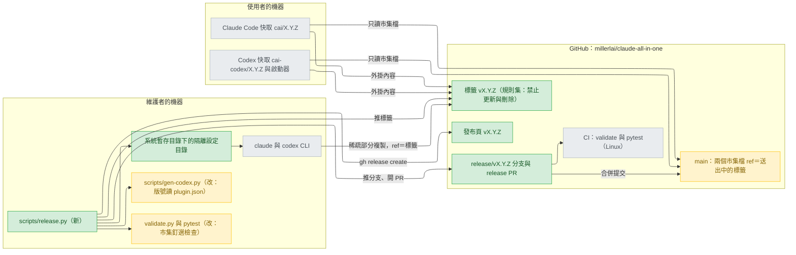
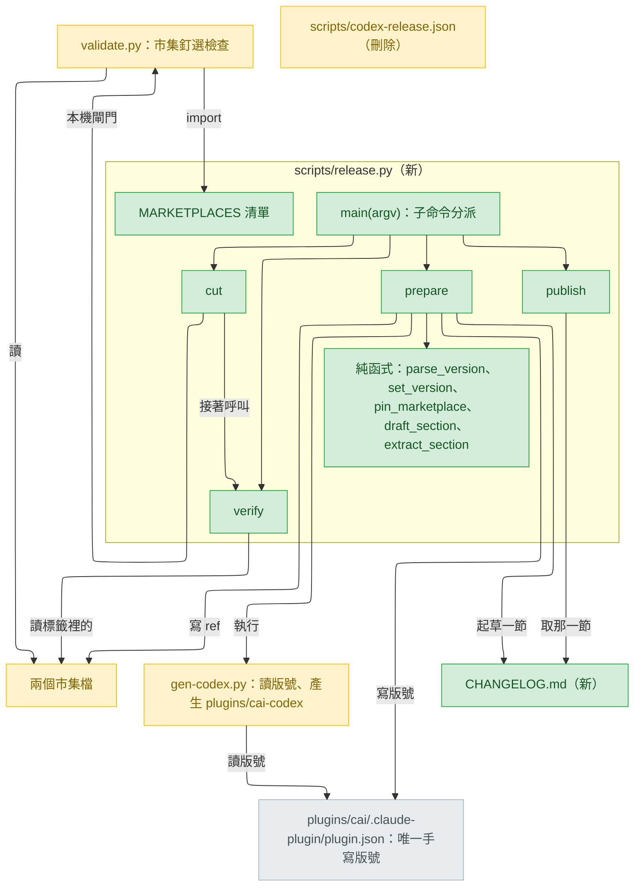
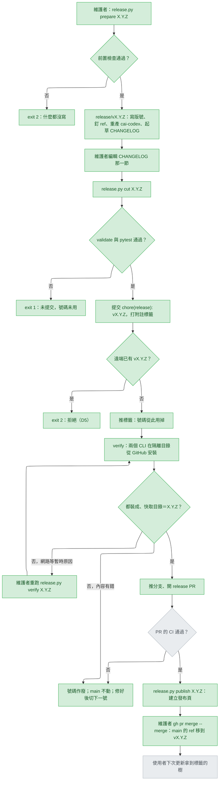
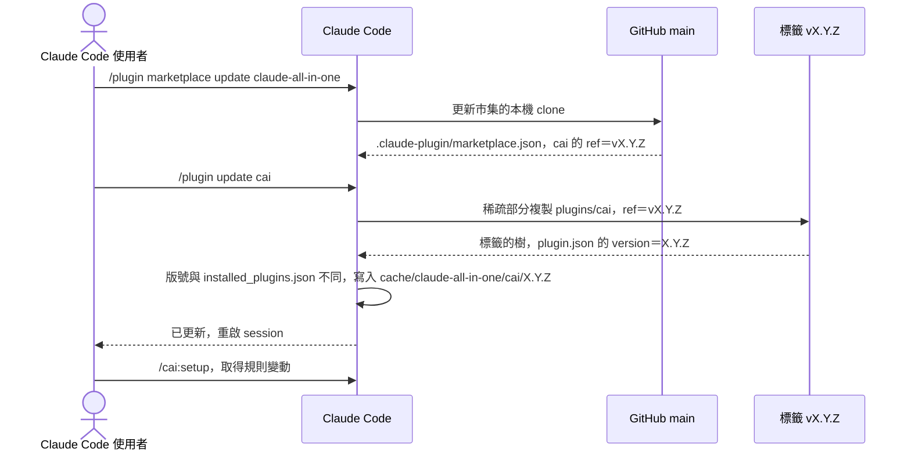
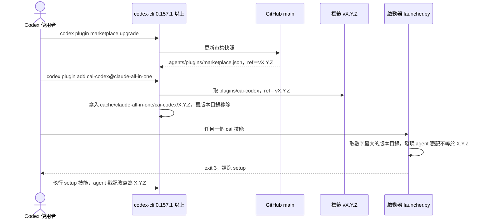
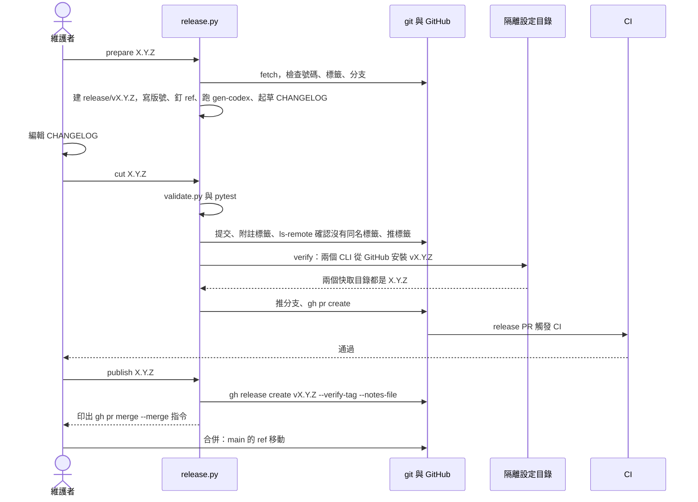
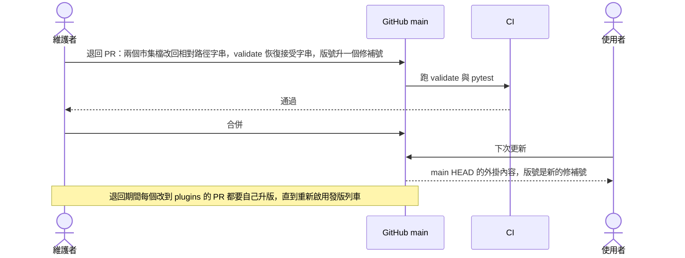
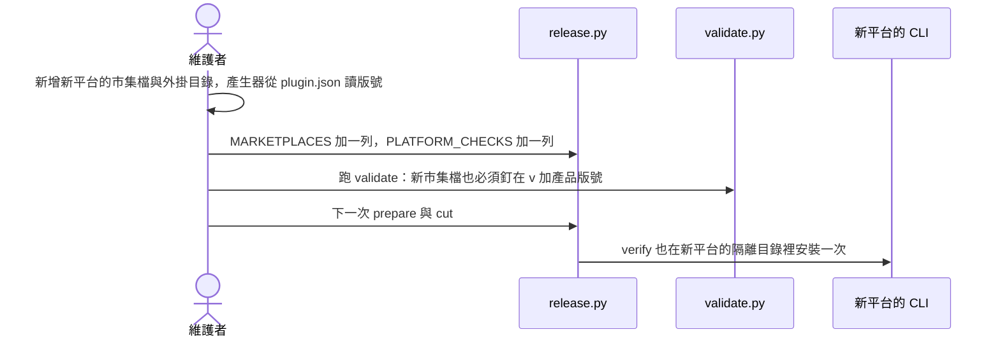
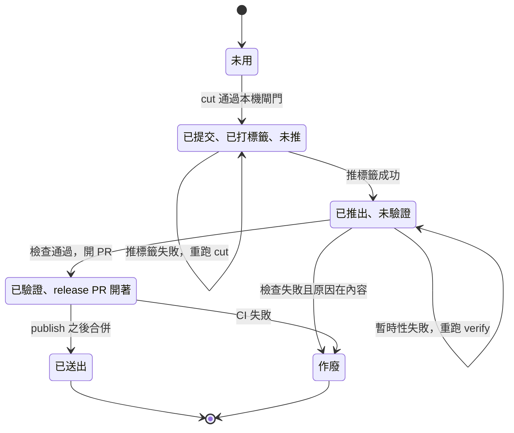

# release-versioning — detail design

詞彙（stance 與 decisions 已解釋過的「標籤、ref、市集檔、子目錄來源、快取、隔離設定目錄、SemVer、發布頁、CHANGELOG、啟動器、公開介面、遠端檢查、PR、合併提交、規則集、退路分支、`--plugin-dir`」不再重複）：
- 子命令（subcommand）：一支腳本的第一個參數決定它做哪一段工作，例如 `release.py prepare`。
- 附註標籤（annotated tag）：帶標記者、日期與訊息的標籤物件；`git tag -a` 建立（https://git-scm.com/docs/git-tag: "Make an unsigned, annotated tag object"）。
- 工作樹（worktree）：同一個 git repo 的第二份檢出資料夾，`git worktree add` 建立。
- 作廢的號碼（burned number）：標籤已推到 GitHub、卻從未被 main 的市集檔指向的版號；依 I3 永遠不再用。
- 送出（served）：main 上的市集檔 ref 指向某個標籤，使用者更新時拿到的就是它。
- 過渡形式（legacy form）：市集檔項目仍是相對路徑字串的舊寫法；只在遷移分支與退回時出現。

本文件是給之後實作 track 的建構規格（build spec）。本 track 不改程式、不改 `plugins/` 下任何檔案（`.claude/track/release-versioning/intake.md:39-40`）。

## Reference

Stance doc: docs/design/2026-09-26-release-versioning-stance.md
Decisions doc: docs/design/2026-09-26-release-versioning-decisions.md
Status: approved 2026-09-26

Stance 的 `## Status` 是 `approved 2026-09-26`；decisions 的 Tier 1 D1–D5 都有 `Decided:`（2026-09-26）。探針紀錄：`.claude/track/release-versioning/spike.md`（以 `:482-495` 的最終表為準）。

### Traceability

| From the referenced document | Satisfied by | Status |
|---|---|---|
| UC1 | `release.py verify` 的 Claude Code 安裝檢查；README `## Updating` 指令不變、`## Prerequisites` 寫下限；Sequence — UC1 | covered |
| UC2 | `release.py verify` 的 Codex 安裝檢查；README Codex `### Update` 改寫；第一次發版的既有安裝升級檢查（Rollout 步驟 7、10）；Sequence — UC2 | covered（GitHub 市集上的 `marketplace upgrade` 要到第一次發版合併後才實測，見 Rollout 步驟 10） |
| UC3 | `release.py` 的 `prepare`、`cut`、`verify`、`publish`；Flow 圖；Sequence — UC3 | covered |
| UC4 | `### 整體退回（UC4，手動程序）`；Sequence — UC4 | covered |
| UC5 | `MARKETPLACES` 清單與 `verify` 的平台安裝表；`### 新平台接入（UC5）`；Sequence — UC5 | covered |
| R1 | gen-codex 移除 UNRELEASED／`--release`；validate 不要求 PR 改版號；CLAUDE.md、README、fix-issue 的升版規則刪除 | covered |
| R2 | 只有 `release.py` 寫版號；GitHub 規則集與 `cut` 的遠端標籤檢查守 I3 | covered |
| R3 | 每次發版：附註標籤、`CHANGELOG.md` 一節、`publish` 建立發布頁 | covered |
| R4 | gen-codex 從 `plugins/cai/.claude-plugin/plugin.json` 讀版號；validate 檢查兩個 manifest 同號 | covered |
| AC2（intake） | `## Design decisions` 第 1–6 列與 README `## Compatibility` | covered |
| AC3（intake） | stance 的 Rejected stances 第三條（引 codex-support decisions `:59`、`:259-261`） | covered（在 stance） |
| AC4（intake） | `## Rollout` 的「遷移對照表」與「既有使用者」 | covered |
| AC5（intake） | `## Rollout` 的退回；`### 整體退回（UC4，手動程序）`；`### stable 退路（D4＝A，手動程序）` | covered |
| AC6（intake） | `### 新平台接入（UC5）` | covered |
| AC7（intake） | `### scripts/release.py` 與四個子命令區塊（只寫規格） | covered |
| AC8（intake） | `## Verification` 的 AC8 列：本 track 只寫 `docs/design/` | 待主 session 以 `git diff --stat` 確認 |

## Requirement

維護者要能「一次切出一個版本」：一個產品版號同時標示 Claude Code 的 `cai` 與 Codex 的 `cai-codex`，功能 PR 不再碰版號，而使用者經由市集拿到的永遠是已推出、已從 GitHub 實裝驗證過的標籤內容（stance `## Optimises for`）。成功的判準：功能 PR 的 diff 不含版號（R1）；`v1.37.0` 起每個版本都有附註標籤、CHANGELOG 一節與發布頁（R3）；任一標籤的樹裡兩個 manifest 同號（R4）；Claude Code 與 Codex 的快取目錄名都等於該標籤的版號（UC1、UC2）。

## Glossary

| Term | Definition | Where it lives |
|---|---|---|
| 產品版號 | 唯一手寫的版號，其他版號欄位都由它推出（I1） | `plugins/cai/.claude-plugin/plugin.json:3` |
| repository 欄位 | 產品 manifest 裡的 GitHub 網址，子目錄來源的 `url` 由它加 `.git` 得出 | `plugins/cai/.claude-plugin/plugin.json:8` |
| Claude 市集檔 | Claude Code 讀的市集檔；`cai` 項目的 `source` 今天是相對路徑字串 | `.claude-plugin/marketplace.json:11` |
| Codex 市集檔 | Codex 讀的市集檔；`cai-codex` 項目的 `source` 今天是相對路徑字串 | `.agents/plugins/marketplace.json:10` |
| cai-codex manifest | gen-codex 產生的 Codex 外掛清單，版號今天是 0.2.27 | `plugins/cai-codex/.codex-plugin/plugin.json:3` |
| 版本戳記 | 每個產生的 agent TOML 第一行的 `# cai-codex-version:` | `scripts/gen-codex.py:437` |
| gen-codex | 從 `plugins/cai/` 產生 `plugins/cai-codex/` 的產生器 | `scripts/gen-codex.py:646` |
| 發布紀錄檔 | cai-codex 今天自己的版號與指紋；本設計刪除它 | `scripts/codex-release.json:2` |
| validate 的市集檢查 | 今天要求 Codex 市集來源是字串的那段；本設計改寫 | `scripts/validate.py:1649` |
| validate 的 manifest 讀取 | 今天把 Claude 市集的 `source` 當路徑字串讀 manifest | `scripts/validate.py:141` |
| 啟動器 | Codex 端找出數字最大的 cai-codex 版本目錄並執行腳本 | `plugins/cai-codex/scripts/launcher.py:50` |
| 戳記不符 | 啟動器發現戳記與外掛版號不同時以 exit 3 要求重跑 `$setup` | `plugins/cai-codex/scripts/launcher.py:204` |
| CI | 每個 PR 與每次推到 main 時在 Linux 跑 validate 與 pytest | `.github/workflows/validate.yml:2` |
| release.py | 維護者親手執行的發版腳本，唯一寫版號的程式（I7、I8） | new — scripts/release.py |
| MARKETPLACES | release.py 與 validate.py 共用的市集檔清單，每列是一個平台 | new — scripts/release.py |
| 子目錄來源項目 | 市集檔裡 `source` 為 `{"source": "git-subdir", "url", "path", "ref"}` 的外掛項目 | concept |
| 發版提交 | 標題 `chore(release): vX.Y.Z`、同時寫版號、ref、cai-codex 與 CHANGELOG 的那一個提交（D6） | concept |
| release 分支 | `release/vX.Y.Z`，發版提交所在的分支 | concept |
| release PR | 從 release 分支到 main 的 PR，以合併提交合併（D3） | concept |
| 本機閘門 | `cut` 在提交前跑的 `validate.py` 與 `pytest` | concept |
| 遠端檢查 | `verify` 在隔離設定目錄裡讓兩個 CLI 從 GitHub 安裝新標籤 | new — scripts/release.py |
| 檢查根目錄 | 遠端檢查用的暫存資料夾，位於系統暫存目錄下 | concept |
| 送出中的版本 | origin/main 的 Claude 市集檔 `ref` 所指的版本 | concept |
| CHANGELOG.md | repo 根目錄的逐版變更紀錄，屬 Ours | new — CHANGELOG.md |
| 發布頁 | 掛在標籤下的 GitHub Release，由 `publish` 建立 | concept |
| 標籤規則集 | GitHub repo 設定裡對 `v*` 禁止更新、刪除的規則集（D5） | concept |
| stable 分支 | 退路：最後一個好標籤加一個「市集檔改回相對路徑」的提交（D4） | concept |
| track 格式檔 | 改到它們時，發布頁要提醒「進行中的 track 先做完再更新」（D1＝B） | `plugins/cai/skills/track/SKILL.md:41` |
| ledger 格式 | track 的附加式紀錄格式，同屬 track 格式檔 | `plugins/cai/scripts/ledger.py:44` |
| 公開介面 | 技能名稱、`/cai:setup` 寫入位置、model-choice 存檔格式、平台最低版本（D1＝B） | concept |
| 平台下限 | Claude Code 2.1.283（D12）、codex-cli 0.157.1（D11） | concept |
| cai-dev 市集 | 維護者在 Codex 試改動時暫時改名的本機資料夾市集（Tier 3） | concept |

## Budgets

| What | Number | Where it comes from |
|---|---|---|
| 手寫產品版號的位置 | 1 | I1；`plugins/cai/.claude-plugin/plugin.json:3` |
| 市集檔（平台）數 | 2 | `.claude-plugin/marketplace.json`、`.agents/plugins/marketplace.json` |
| 版號段數 | 3（`X.Y.Z`，各段非負整數、無前導零、無後綴） | I2；`plugins/cai-codex/scripts/launcher.py:39-47` |
| 每次發版由版號推出的寫入 | 14 = cai-codex manifest 1 + agent 戳記 10 + 市集 ref 2 + 標籤 1 | 本輪 `plugins/cai-codex/agents/*.toml` 有 10 個檔案；`scripts/gen-codex.py:437`、`:466-481` |
| 宣告的 codex-cli 下限 | 0.157.1 | D11；`spike.md:484-489` |
| 宣告的 Claude Code 下限 | 2.1.283 | D12；`spike.md:484-489` |
| 每次發版的遠端安裝次數 | 2（每個平台 1 次全新安裝） | D7 |
| 第一次發版額外的升級檢查 | 4（2 平台 × 合併前模擬、合併後實測） | Rollout 步驟 7、10；C23 |
| 本機閘門耗時 | 約 218 秒（399 個測試） | `CLAUDE.md:120` 的健康輸出 |
| 已驗證可行的隔離目錄路徑長度 | 41 字元（`C:/Users/millerlai/AppData/Local/Temp/cxs`） | `spike.md:452` |
| 本設計的隔離目錄路徑長度 | 53–62 字元（`...\Temp\cai-check\codex` 到 `...\Temp\cai-check\claude-upgrade`） | 由 Naming 的名稱逐字計算 |
| 外掛樹裡最長的相對路徑 | 74 字元（`refactoring-catalog\replace-nested-conditional-with-guard-clauses\SKILL.md`） | 本輪以 python 走訪 `plugins/cai`、`plugins/cai-codex` 共 435 個檔案量得 |
| Codex 快取裡最長的完整路徑（估） | 183 字元 = 61 + 48（`\plugins\cache\claude-all-in-one\cai-codex\1.37.0\`）+ 74 | 由上三列相加；clone 暫存目錄的長度未量過 |
| Windows 傳統路徑上限 | 260 字元 | UNVERIFIED（本輪未查 Microsoft 文件）；`spike.md:141` 的 "Filename too long" 是實際撞到的證據 |
| 本機 git 查詢的逾時 | 5 秒 | 沿用 `scripts/gen-codex.py:543-544` 的做法 |
| 網路與 CLI 安裝的逾時 | 0（不設，維護者在場，可 Ctrl-C） | Design decisions 第 16 列 |
| 同時進行中的發版 | 1 | Design decisions 第 15 列 |
| 標籤規則集的例外名單人數 | 0 | D5＝A |
| 平時存在的 stable 分支 | 0（啟用退路時 1） | D4＝A |
| fix 合併到發版的期限 | 0 條規則（不設期限） | RG1＝A |
| CI 的 Python 版本 | 3.12 | `.github/workflows/validate.yml:15` |

## Design decisions

來自 decisions 文件、已答或已掃過的（第 1–12 列），以及本模式新增、成本測試落在 Tier 3（一個元件、下次跑測試或第一次發版就知道、改掉即可）的建構者決定（第 13–22 列）。第 23 列是本模式找到、放進 decisions Tier 2 的新條目。

| # | 決定 | 服務的需求 | 依據 |
|---|---|---|---|
| 1 | 唯一來源：產品版號只手寫在 `plugins/cai/.claude-plugin/plugin.json:3`；cai-codex manifest、戳記、標籤、市集 ref 都由程式推出 | R4、I1 | stance I1 |
| 2 | 格式：只允許 `X.Y.Z`，三段非負整數；啟動器跳過非數字目錄（`launcher.py:39-47`） | I2 | stance I2 |
| 3 | 公開介面＝技能名稱、`/cai:setup` 寫入位置、model-choice 存檔格式、平台下限。MAJOR：移除或改名技能；舊的 `format: 1` 存檔讀不進來；提高平台下限。MINOR：新增技能；新增舊存檔可省略的欄位；track 格式改動（發布頁提醒）。PATCH：修腳本的 bug 而不改格式；改寫規則措辭 | AC2、R3 | D1＝B |
| 4 | 發版節奏：隨需，由維護者決定，不設期限、不設提醒 | AC2 | RG1＝A |
| 5 | 派送：兩個市集檔都用子目錄來源，`ref`＝`vX.Y.Z`；兩個平台都在探針裡通過 O1–O4（`spike.md:484-489`） | UC1、UC2、I5 | C1、C2 |
| 6 | 退路：平時沒有 `stable`；某平台失效時維護者建立它；再不行就 UC4 整體退回 | AC5、I9 | D4＝A、RG3＝A |
| 7 | 第一個統一版號 `1.37.0` | AC4、I4 | D2＝A |
| 8 | 發版提交走 `release/vX.Y.Z` 分支與 release PR，以合併提交合併（`gh pr merge --merge`），是本 repo 壓縮合併習慣的唯一例外。**2026-10-09 起改為 D3＝B：不開 PR，`publish` 把 main 快轉到標籤的提交（見 decisions D3 的 Revised）** | UC3、I6 | D3＝A→B；C21 |
| 9 | I3 由 GitHub 標籤規則集（`v*`：Restrict updates、Restrict deletions，無例外名單）加上 `cut` 的遠端標籤檢查共同保證 | R2、I3 | D5＝A |
| 10 | 發版提交的內容與順序、遠端檢查的做法、`--plugin-dir`、validate 與 gen-codex 的新檢查、CHANGELOG 與發布頁、Codex 下限 | UC3、R1、R3、R4 | D6–D11 |
| 11 | 本機閘門在發版提交之前：`validate.py` 與 `pytest` 任一失敗就停，什麼都還沒提交 | UC3 | decisions Tier 3 |
| 12 | 發布頁在 release PR 的 CI 通過後、合併之前建立（RG2 要求 Codex 使用者被切換之前就讀得到） | RG2 | decisions Tier 3（已改寫） |
| 13 | **遷移與第一次發版一起進 main。** 實作分支不單獨合併；維護者以 `prepare 1.37.0 --base <實作分支>` 在它上面切出 `release/v1.37.0`，兩者由同一個 release PR、同一個合併提交進 main。理由：若實作先單獨合併，gen-codex 改讀產品版號後，main 上的 cai-codex 會變成 1.36.1 並經相對路徑來源送給 Codex 使用者；接著 1.37.0 把 Codex 下限提高，對他們只是次版號，違反 D1＝B（下限提高＝MAJOR），也推翻 D2 的「0.2.27 → 1.37.0」理由 | AC4、D1、D2 | D2 的依賴行；`scripts/gen-codex.py:663-666` |
| 14 | **validate 先擴張、後收縮。** 遷移分支上的 validate 接受兩種形式之一：全部是過渡形式（相對路徑字串），或全部是子目錄來源且 `ref` 等於 `v`＋產品版號；兩種混用就失敗。`v1.37.0` 送出後，收尾單元移除過渡形式，回到 D9 的嚴格檢查 | I5、D9 | 第 13 列；遷移分支中間的提交還是相對路徑 |
| 15 | 一次只有一個進行中的發版：遠端有尚未併入 origin/main 的 `release/v*` 分支時，`prepare` 拒絕 | I4 | 單一維護者（decisions D5 背景） |
| 16 | 網路動作（push、ls-remote、clone、兩個 CLI 的安裝）不設逾時；本機 git 查詢 5 秒 | UC3 | `scripts/gen-codex.py:543-544` |
| 17 | 遠端檢查把標籤樹裡的兩個市集檔原樣複製進檢查根目錄，以本機資料夾市集加入；市集名沿用 `claude-all-in-one`，快取路徑因此與使用者相同 | I6、UC1、UC2 | C8；`spike.md:95-107` |
| 18 | 遠端檢查的通過條件：CLI exit 0；快取目錄 `<home>/plugins/cache/claude-all-in-one/<plugin>/X.Y.Z/` 存在、其 manifest 的 `version` 是 `X.Y.Z`；標籤樹裡該外掛的每個檔名都在快取目錄裡（只比檔名，不比位元組，因為使用者的 git 可能轉換行尾） | I6 | `spike.md:162-168`、`:456-459` |
| 19 | CHANGELOG 起草的「上一版」取送出中的版本（origin/main 的市集 `ref`），不是最大的標籤；兩者之間的作廢號碼各寫一行 `Skipped:` | R3 | I3；Failure modes 的作廢列 |
| 20 | track 格式檔＝`plugins/cai/skills/track/SKILL.md` 與 `plugins/cai/scripts/ledger.py`；自上一個送出的版本以來改到任一個，草稿加一行提醒 | D1＝B | `.claude/track/release-versioning/options-D1.md:25`、`:33` |
| 21 | 第一次發版的既有安裝升級檢查（C23）是 Rollout 的手動程序，不寫進 `release.py`：只有這一次會發生來源類型改變 | UC1、UC2 | C1、C2 已涵蓋之後每次的 ref 移動 |
| 22 | 呼叫外部 CLI 一律用 `shutil.which()` 取得完整路徑、list 形式的 argv、`shell=False`；Windows 上 `claude`／`codex` 可能是 `.cmd` 包裝檔，以 list argv 執行它是否正常屬 UNVERIFIED，由第一次 `prepare` 的前置檢查（各 CLI 跑 `--version`）先暴露 | UC3 | 本 repo 的 `scripts/validate.py:1643-1644` 同樣以 list argv 呼叫子程序 |
| 23 | 對 Claude Code 宣告最低版本 2.1.283，寫進 README `## Prerequisites` 與 `v1.37.0` 發布頁 | D1＝B | decisions D12（Tier 2，2026-09-26 已向本人列出，未推翻） |

## Diagrams

### Architecture



看使用者那一欄的四條箭頭：從 main 只讀市集檔，外掛內容一律來自標籤（I5）；main 的市集檔只經由合併提交改變，而合併之前那個標籤已經被維護者機器上的兩個 CLI 從 GitHub 裝過一次（I6）。

### Component



新的箭頭 `GCX -- 讀版號 --> PJ` 取代了 gen-codex 對 `codex-release.json` 的依賴（那個方框改成刪除）；`VAL -- import --> MK` 讓 validate 與 release.py 讀同一份市集清單，新增平台只改一處（UC5）。

### Flow



號碼只在「推標籤」那一格被用掉：左邊三個出口（X1、X2、X3）都不花號碼，右邊的 B1 花掉號碼但 main 不動。發布頁（PB）排在合併之前，是 RG2 的否決條件造成的。

### Sequence — UC1



使用者打的兩行指令和今天一樣（`README.md:315-318`）；差別在第三個參與者：外掛內容來自標籤，不再來自 main HEAD（C1 的 O2、O4）。

### Sequence — UC2



注意少了 `codex plugin remove`：再跑一次 `add` 就換版（`spike.md:460-464`）；exit 3 那一步是既有行為（`launcher.py:204-210`），每次發版都會出現一次。

### Sequence — UC3



`R->>G` 的「推標籤」與 `M->>G` 的「合併」之間隔著遠端檢查與 CI 兩道門；只有維護者（M）能觸發合併（I8）。

### Sequence — UC4



退回 PR 必須同時升一個修補號：否則 main HEAD 的內容與同號的舊標籤不同，違反 I3（見 `### 整體退回（UC4，手動程序）`）。

### Sequence — UC5



新平台不帶來第二個版號：它的市集項目與 manifest 都由 `prepare` 從同一個產品版號寫出（I1）。

## Implementation spec

### scripts/release.py — 共用部分

- **Responsibility:** 提供四個子命令共用的常數與純函式，讓所有「由版號推出」的寫入都經過同一段程式。
- **Interface:**

```python
VERSION_RE = re.compile(r"^(0|[1-9]\d*)\.(0|[1-9]\d*)\.(0|[1-9]\d*)$")

class Marketplace(NamedTuple):
    file: str    # repo 相對路徑，例如 ".claude-plugin/marketplace.json"
    plugin: str  # 市集檔裡外掛項目的 name，例如 "cai"
    path: str    # 該項目送出的 repo 相對目錄，例如 "plugins/cai"
    manifest: str  # 該目錄裡的 manifest，例如 ".claude-plugin/plugin.json"

MARKETPLACES: tuple[Marketplace, ...] = (
    Marketplace(".claude-plugin/marketplace.json", "cai", "plugins/cai", ".claude-plugin/plugin.json"),
    Marketplace(".agents/plugins/marketplace.json", "cai-codex", "plugins/cai-codex", ".codex-plugin/plugin.json"),
)
PRODUCT_MANIFEST = "plugins/cai/.claude-plugin/plugin.json"
TRACK_FORMAT_FILES = ("plugins/cai/skills/track/SKILL.md", "plugins/cai/scripts/ledger.py")
FLOORS = (("Claude Code", "2.1.283"), ("codex-cli", "0.157.1"))

def parse_version(text: str) -> tuple[int, int, int]: ...          # ValueError when not VERSION_RE
def product_version(manifest_text: str) -> str: ...                # the "version" value
def repository_git_url(manifest_text: str) -> str: ...             # "repository" + ".git"
def set_version(manifest_text: str, version: str) -> str: ...      # ValueError unless exactly one "version" key
def git_subdir_source(url: str, path: str, ref: str) -> dict: ...
def pin_marketplace(text: str, market: Marketplace, url: str, ref: str) -> str: ...
def pinned_ref(text: str, market: Marketplace) -> str | None: ...  # None for the legacy string form
def draft_section(version: str, date: str, subjects: list[str], *,
                  first: bool, track_format_changed: bool, skipped: list[str]) -> str: ...
def insert_section(changelog_text: str | None, section: str) -> str: ...
def extract_section(changelog_text: str, version: str) -> str | None: ...
def run(argv: list[str], *, cwd: Path, env: dict | None = None,
        timeout: float | None = None) -> subprocess.CompletedProcess: ...
def tool_versions() -> dict[str, str | None]: ...               # {"git", "gh", "claude", "codex"} -> version, None when missing
def local_gate(repo: Path) -> list[str]: ...                      # runs validate.py and pytest; failure lines, [] when green
def main(argv: list[str] | None = None) -> int: ...
```

- **Data:**
  - `git_subdir_source` 回傳（鍵的順序照 `spike.md:103-105`）：`{"source": "git-subdir", "url": "https://github.com/millerlai/claude-all-in-one.git", "path": "plugins/cai", "ref": "v1.37.0"}`。`url` 加 `.git` 照官方範例（https://code.claude.com/docs/en/plugins/marketplace-reference 的例子 `"url": "https://github.com/your-org/monorepo.git"`）；不加 `.git` 是否同樣可行未驗證，也不需要。
  - `pin_marketplace`：`json.loads` → 找 `plugins` 裡 `name == market.plugin` 的那一項（恰好一項，否則 ValueError）→ 只換 `source` 的值，其他鍵與順序不動 → `json.dumps(obj, indent=2, ensure_ascii=False) + "\n"`。今天兩個檔案都是兩格縮排，`json.dumps(indent=2)` 會寫出相同的外形（`.claude-plugin/marketplace.json:1-15`）。
  - `set_version`：以 `("version"\s*:\s*")([^"]*)(")` 做文字替換，恰好一個匹配，其他位元組不動；描述欄很長（`plugin.json:4`），不做 JSON 來回轉換。
  - `draft_section` 的輸出（第一次發版，`first=True`；日期取執行當天）：

```
## v1.37.0 — 2026-10-01

First unified version: Claude Code and Codex now share one version number, and both install from this tag.

Requires Claude Code 2.1.283 or later and codex-cli 0.157.1 or later. Check with `claude --version` and `codex --version`. Update codex-cli the way you installed it (it also updates itself between runs) before updating this plugin; an older codex-cli stops seeing it.
```

  之後的版本（`first=False`）：

```
## v1.38.0 — 2026-10-15

### Added
- feat(cai): <subject> (#181)

### Fixed
- fix(cai): <subject> (#180)

### Other
- docs: <subject> (#179)

Finish any track in progress before updating: the track's state format changed in this release.

Skipped: v1.37.1 (tagged, failed its check, never served).
```

  `subjects` 是 `git log --format=%s <送出中的標籤>..HEAD` 的每一行（第一次發版不讀）；`feat` 開頭歸 Added、`fix` 開頭歸 Fixed、其他歸 Other，空的小節不寫。提醒行只在 `track_format_changed` 時出現，而它等於 `git diff --name-only <送出中的標籤> HEAD -- <TRACK_FORMAT_FILES>` 有輸出。`skipped` 是本機與遠端所有 `v*` 標籤中，版號依數字比較嚴格大於送出中的版本、且嚴格小於 `X.Y.Z` 的那些，由小到大，每個一行 `Skipped:`；送出中的版本是 None（main 是過渡形式：第一次發版，或 UC4 退回後重新啟用）時，`skipped` 一律為空、`first=True`。
  - `extract_section`：從 `## vX.Y.Z` 那一行的下一行起，到下一個 `## v` 開頭的行之前，去掉頭尾空行；找不到回 None。
- **Errors:** 純函式只丟 `ValueError`（附一句說明）；`main` 把它轉成 exit 2 並印 `FAIL <說明>`。
- **Test seams:** `tool_versions` 與 `local_gate` 是 `prepare` 與 `cut` 取得外部工具版本、執行本機閘門的唯一入口，測試以 monkeypatch 替換這兩個模組層函式；其他外部呼叫都經過 `run`。模組最後是 `if __name__ == "__main__": sys.exit(main())`，所以 validate.py import 它時不會執行任何子命令。
- **Concurrency:** 純函式無共享狀態。`run` 不帶 `shell=True`；`timeout=None` 用於網路動作，本機 git 查詢傳 5（Budgets）。
- **Observability:** 每一步印一行 `PASS <what>` 或 `FAIL <what>: <reason>`（與 `CLAUDE.md:105-109` 的 validate 輸出同形）；外部指令失敗時，把它的 stdout／stderr 縮排印出（同 `scripts/validate.py:1646-1647`）；最後一行 `-- release.py <子命令> vX.Y.Z: ok` 或 `failed`，接著印下一步要打的指令。`main` 開頭 `sys.stdout.reconfigure(encoding="utf-8")`（同 `scripts/activation.py:255-256`），避免 Windows cp950 把輸出弄壞（`.claude/skills/fix-issue/SKILL.md:71`）。
- **Exit codes:** 0 成功；1 某個檢查或外部指令失敗；2 參數錯誤或前置條件不成立（此時什麼都沒寫）。與 `scripts/gen-codex.py:24-26` 的分法一致。
- **Where it lives:** `scripts/release.py`，今天不存在。屬 Ours（`CLAUDE.md` 的「Who a file is for」；decisions Tier 3）。
- **What it reuses:** 版號以數字 tuple 比較，同 `scripts/gen-codex.py:593-597` 的方法（該函式本設計從 gen-codex 刪除，release.py 用自己的 `parse_version`）；寫 JSON 時 `newline=""` 保持 LF，同 `scripts/gen-codex.py:712-717`；list argv 的子程序呼叫同 `scripts/validate.py:1643-1644`。

### release.py prepare

- **Responsibility:** 在新的 `release/vX.Y.Z` 分支上寫好發版提交要的所有檔案，但不提交、不推送。
- **Interface:** `python scripts/release.py prepare X.Y.Z [--base REF]`；`def prepare(version: str, base: str = "origin/main", repo: Path = ROOT) -> int`。
- **Data:** 讀 `REF` 上的產品 manifest 與兩個市集檔；寫工作樹的 `plugins/cai/.claude-plugin/plugin.json`（版號）、兩個市集檔（子目錄來源，`ref`＝`vX.Y.Z`）、`plugins/cai-codex/`（跑 `python scripts/gen-codex.py`）、`CHANGELOG.md`（插在標題下、第一節之前；檔案不存在就以 `# Changelog` 開頭建立）。
- **前置檢查（依序，任一不成立就 exit 2，什麼都不寫）：**
  1. `X.Y.Z` 符合 `VERSION_RE`（I2）。
  2. 工作樹乾淨（`git status --porcelain` 無輸出）。
  3. `git fetch origin --tags` 成功。
  4. `X.Y.Z` 依數字比較，大於 `REF` 上產品 manifest 的版號，也大於本機與 `git ls-remote origin "refs/tags/v*"` 列出的每個 `v*` 標籤（I4；作廢號碼也算）。
  5. 本機與遠端都沒有 `vX.Y.Z` 標籤、沒有 `release/vX.Y.Z` 分支。
  6. 遠端沒有尚未併入 origin/main 的 `release/v*` 分支（Design decisions 第 15 列）。
  7. `shutil.which` 找得到 `git`、`gh`、`claude`、`codex`；`gh auth status` exit 0（https://cli.github.com/manual/gh_auth_status: "If an account on any host ... has authentication issues, the command will exit with 1"）；`codex --version` 不低於 0.157.1、`claude --version` 不低於 2.1.283（維護者自己的 CLI 低於下限時，遠端檢查的通過不代表什麼）。版本取該指令 stdout 裡第一個符合 `\d+\.\d+\.\d+` 的字串；兩個 CLI 的 `--version` 輸出格式本輪未查文件（UNVERIFIED），找不到版本字串時視同檢查失敗、exit 2。
- **動作：** `git switch -c release/vX.Y.Z <REF>` → `set_version` → 每個 `MARKETPLACES` 項目 `pin_marketplace(url=repository_git_url(...), ref="vX.Y.Z")` → `python scripts/gen-codex.py`（exit 非 0 → exit 1）→ 算 `draft_section`（送出中的版本取 `REF` 上 Claude 市集檔的 `pinned_ref`；是 None 表示第一次發版，`first=True`）→ 寫 CHANGELOG → 印出「編輯 CHANGELOG.md 的 vX.Y.Z 一節，然後執行 `python scripts/release.py cut X.Y.Z`」。
- **`--base`：** 預設 `origin/main`。只有第一次發版傳實作分支（Design decisions 第 13 列、Rollout 步驟 4）。
- **Errors:** 動作途中失敗（例如 gen-codex exit 1）→ exit 1，分支與改動留在工作樹，印出「`git switch -` 回原分支、`git branch -D release/vX.Y.Z` 丟棄」；號碼沒被用掉。
- **Concurrency:** 一個 clone 一次只跑一個；重跑前置檢查 5 會因分支已存在而拒絕，要先照上一行丟棄。
- **Observability:** 每個前置檢查一行 PASS／FAIL；結尾列出改動的檔案。
- **Where it lives / What it reuses:** 同 `### scripts/release.py — 共用部分`；gen-codex 以子程序呼叫，不 import。

### release.py cut

- **Responsibility:** 跑本機閘門、做發版提交、打附註標籤並推出，然後交給 `verify`。
- **Interface:** `python scripts/release.py cut X.Y.Z`；`def cut(version: str, repo: Path = ROOT) -> int`。
- **Data:** 讀工作樹；寫一個提交（標題 `chore(release): vX.Y.Z`，無內文）與一個附註標籤（訊息 `cai vX.Y.Z`）。
- **步驟：**
  1. 目前分支是 `release/vX.Y.Z`，否則 exit 2。
  2. 若 HEAD 已是這個版本的發版提交（標題相符、工作樹乾淨），跳到步驟 7；這是推標籤失敗後的重跑。
  3. `git status --porcelain` 列出的路徑全部落在允許集合內：`plugins/cai/.claude-plugin/plugin.json`、每個 `MARKETPLACES[*].file`、`CHANGELOG.md`、`plugins/cai-codex/` 之下；否則 exit 2 並列出多出的路徑。
  4. 一致性：產品版號＝`X.Y.Z`；每個市集檔 `pinned_ref`＝`vX.Y.Z`；`extract_section(CHANGELOG, X.Y.Z)` 非空。否則 exit 2。
  5. 本機閘門：`python scripts/validate.py`、`python -m pytest`，都要 exit 0；之後 `git status --porcelain` 必須與步驟 3 相同（pytest 中斷會留下 `plugins/cai/evals/_breach_test_fake_secret.md`，`.claude/skills/fix-issue/SKILL.md:65`）。任一失敗 → exit 1，什麼都沒提交。
  6. `git add` 逐一列出步驟 3 的路徑；提交訊息寫進暫存檔再 `git commit -F`。
  7. 本機沒有 `vX.Y.Z` 就 `git tag -a vX.Y.Z -m "cai vX.Y.Z"`；已有則必須指向 HEAD，否則 exit 2。
  8. `git ls-remote origin refs/tags/vX.Y.Z` 有輸出 → exit 2，印「已推出，請改跑 `release.py verify X.Y.Z`」（D5：遠端已有同名標籤就拒絕；https://git-scm.com/docs/git-ls-remote: "Displays references available in a remote repository along with the associated commit IDs."）。
  9. `git push origin refs/tags/vX.Y.Z`（只推這一個標籤，從不加 `--force`、從不用 `--tags`）。失敗 → exit 1；遠端沒有這個標籤，號碼還沒用掉，修好原因後重跑 `cut`（回到步驟 2）。
  10. 呼叫 `verify(version)`，回傳它的 exit code。
- **Errors:** 見步驟；步驟 9 成功之後的任何失敗都屬 `verify`。
- **Concurrency:** 步驟 2、7 讓重跑安全；步驟 8 保證不會把別人的同名標籤當成自己的。
- **Observability:** 本機閘門的兩個指令各印一行 PASS／FAIL，FAIL 時附最後 40 行輸出；推標籤成功時印「vX.Y.Z 已推出：此號碼從現在起不能重用」。

#### 號碼的狀態



「未用」到「已推出」之間的每個失敗都不花號碼；從「已推出」起只有兩個出口：送出，或作廢（I3 禁止重推同號）。

### release.py verify

- **Responsibility:** 在不碰維護者真正設定的隔離目錄裡，讓 Claude Code 與 Codex 從 GitHub 安裝已推出的標籤，通過後才推分支、開 release PR（I6）。
- **Interface:** `python scripts/release.py verify X.Y.Z`；`def verify(version: str, repo: Path = ROOT, temp_root: Path | None = None) -> int`，`temp_root` 預設 `Path(tempfile.gettempdir()) / "cai-check"`。平台表：

```python
class PlatformCheck(NamedTuple):
    market: Marketplace
    home_env: str          # "CLAUDE_CONFIG_DIR" or "CODEX_HOME"
    home_dir: str          # subdirectory of temp_root, e.g. "claude"
    empty_marker: str      # what `<cli> plugin marketplace list` prints in an empty home
    commands: tuple[tuple[str, ...], ...]  # argv templates, {market_dir} and {marketplace} filled in

PLATFORM_CHECKS: tuple[PlatformCheck, ...]  # one per MARKETPLACES row
```

  兩列的內容：Claude Code — `home_env="CLAUDE_CONFIG_DIR"`、`empty_marker="No marketplaces configured"`（`spike.md:472`）、指令 `claude plugin marketplace add {market_dir}`、`claude plugin install cai@{marketplace}`（`spike.md:121-122`、`:155-156`）。Codex — `home_env="CODEX_HOME"`、`empty_marker="No plugin marketplaces in scope."`（`spike.md:455`）、指令 `codex plugin marketplace add {market_dir}`、`codex plugin add cai-codex@{marketplace}`（`spike.md:249-250`、`:457`）。
- **前置條件（不成立 → exit 2）：** `X.Y.Z` 合法；本機 `vX.Y.Z` 存在；`git ls-remote origin refs/tags/vX.Y.Z` 的物件 id 等於本機 `git rev-parse vX.Y.Z`（推出去的就是這一個）；目前分支是 `release/vX.Y.Z`，且 `vX.Y.Z^{commit}` 是 HEAD 或 HEAD 的祖先。
- **步驟：**
  1. 若 `temp_root` 已存在就整個刪掉，再建 `market`、每個平台的 `home_dir`。
  2. 每個 `MARKETPLACES` 項目：`git show vX.Y.Z:<file>` 原樣寫到 `temp_root/market/<file>`（Design decisions 第 17 列）；`{marketplace}` 取該檔的 `name`（今天是 `claude-all-in-one`，`.claude-plugin/marketplace.json:2`）。
  3. 每個平台：環境變數只把 `home_env` 設成 `temp_root/<home_dir>`，其他照繼承；先跑 `<cli> plugin marketplace list`，輸出必須含 `empty_marker`，否則 exit 2（隔離沒生效，不能往下裝）；再依序跑 `commands`，任一 exit 非 0 → 記一筆 FAIL。
  4. 每個平台的通過條件（Design decisions 第 18 列）：`temp_root/<home_dir>/plugins/cache/<marketplace>/<plugin>/X.Y.Z/<manifest>` 存在且 `version`＝`X.Y.Z`；`git ls-tree -r --name-only vX.Y.Z -- <path>` 的每個檔名（去掉 `<path>/` 前綴）都在該目錄下。Claude 的快取路徑形狀見 `spike.md:162-165`，Codex 的見 `spike.md:457`。
  5. 全部通過：刪掉 `temp_root`；遠端沒有 `release/vX.Y.Z` 就 `git push -u origin release/vX.Y.Z`；`gh pr view release/vX.Y.Z --json number,url,state` 失敗（沒有 PR）就 `gh pr create --base main --head release/vX.Y.Z --title "chore(release): vX.Y.Z" --body-file <CHANGELOG 那一節的暫存檔>`（https://cli.github.com/manual/gh_pr_view: "[<number> | <url> | <branch>]"；https://cli.github.com/manual/gh_pr_create: `--body-file` "Read body text from file"）；印出 PR 網址與「CI 綠了之後執行 `python scripts/release.py publish X.Y.Z`」。
  6. 任一 FAIL：保留 `temp_root` 供檢查，印出它的路徑與每個失敗指令的輸出；exit 1；印「vX.Y.Z 已推出但未送出。若原因是暫時性的（網路），重跑 `release.py verify X.Y.Z`；否則此號碼作廢，修好後以下一個號碼重新 `prepare`」。分支不推，main 不動。
- **Errors:** 見步驟 3、6；路徑太長的錯誤（`spike.md:140-142`）以一般 FAIL 呈現。
- **Concurrency:** 步驟 1 會刪掉上一次的 `temp_root`，所以同時跑兩個 `verify` 不安全；步驟 5 的推送與開 PR 都先查再做，重跑不會開第二個 PR。
- **Observability:** 每個平台每個指令一行 PASS／FAIL；通過時印兩個快取目錄的完整路徑。
- **Where it lives:** `scripts/release.py`。**What it reuses:** 探針的指令與判準（`spike.md:452-475`、`:482-495`）。

### release.py publish

- **Responsibility:** release PR 的 CI 通過後、合併之前建立發布頁，然後印出唯一正確的合併指令。
- **Interface:** `python scripts/release.py publish X.Y.Z`；`def publish(version: str, repo: Path = ROOT) -> int`。
- **步驟：**
  1. `gh pr view release/vX.Y.Z --json number,state,headRefOid,url`：必須存在且 `state` 為 OPEN，否則 exit 2。
  2. `gh pr checks <number>`：exit 0 才往下；exit 8 表示還在跑（https://cli.github.com/manual/gh_pr_checks: "8: Checks pending"）→ exit 1 並印「稍後重跑」；其他非 0 → exit 1（CI 失敗：號碼作廢，見 Failure modes）。
  3. `gh release view vX.Y.Z` exit 0 表示發布頁已存在 → 跳到步驟 5（重跑）。該指令在發布頁不存在時的行為文件沒寫（https://cli.github.com/manual/gh_release_view），所以只把 exit 0 當成「存在」。
  4. `git show vX.Y.Z:CHANGELOG.md` → `extract_section` → 寫暫存檔 → `gh release create vX.Y.Z --verify-tag --title vX.Y.Z --notes-file <暫存檔>`（C16）。
  5. 印出 `gh pr merge <number> --merge --match-head-commit <headRefOid>`（https://cli.github.com/manual/gh_pr_merge: `--merge` "Merge the commits with the base branch"；`--match-head-commit` "Commit SHA that the pull request head must match to allow merge"；完整 40 字元，`.claude/skills/fix-issue/SKILL.md:60`），並提醒「不要用 `--squash`」。
- **Errors:** 見步驟；`gh release create` 失敗 → exit 1，沒有任何東西被移動。
- **Concurrency:** 步驟 3 讓重跑安全。
- **Observability:** 印出發布頁網址與合併指令。`publish` 自己不合併（I8：main 的前進由維護者親手觸發）。

### scripts/gen-codex.py（修改）

- **Responsibility:** 從 `plugins/cai/` 產生 `plugins/cai-codex/`，版號取自產品 manifest。
- **Interface:** `def product_version(source: Path) -> str`（讀 `source / ".claude-plugin" / "plugin.json"` 的 `version`；檔案缺、不是 JSON、沒有鍵都丟例外）；`def build(source: Path, out: Path, check: bool) -> int`；CLI 只剩 `--check`、`--source`、`--out`（今天 `scripts/gen-codex.py:726-729`）。
- **Data:** 版號字串傳給既有的 `emit(files, tiers, version)`（`scripts/gen-codex.py:484`），manifest 與戳記照舊產生（`:466-481`、`:437`）。`.claude-plugin/` 仍在排除清單（`:54`），所以 `product_version` 直接讀檔，不經 `collect`。
- **刪除：** `RELEASE_FILE`（`:43`）、`fingerprint`（`:510-522`）、`load_release_record`（`:532-535`）、`_git`（`:538-546`）、`find_base_ref`（`:549-559`）、`read_published_record`（`:562-573`）、`check_unreleased`（`:576-590`）、`_version_tuple`（`:593-597`）、`release_refusal`（`:600-607`）、`build` 裡的指紋、base ref 與 `--release` 分支（`:663-666`、`:678-692`、`:698-700`、`:704-718`）、`--release` 參數（`:729`）；模組 docstring 的相關段落（`:17-26`）改寫。這些函式在 repo 裡只被 gen-codex 自己與 `tests/test_gen_codex.py` 用到（本輪 grep：`scripts/`、`tests/` 下 `fingerprint`／`find_base_ref` 只出現在這兩個檔案與無關的 preflight、ledger 測試用語）。
- **Errors:** 產品 manifest 讀不到 → 印一行原因、exit 2（沿用 `:24-26` 的「unreadable input file」一類）。
- **Concurrency:** 不變。
- **Observability:** 不再印 `UNRELEASED`、`SKIP release base unavailable`、`released X.Y.Z`；DRIFT 行照舊（`:696-701`）。
- **Tests（`tests/test_gen_codex.py`）：** 刪 `:785-941` 的十二個 release／UNRELEASED／base ref 測試；`:409-415` 的註解描述的是指紋，改寫或連同複製迴圈一起拿掉（建構者決定）；新增兩個：manifest 的 `version` 等於來源 `.claude-plugin/plugin.json` 的 `version`；來源缺少該檔時 exit 2。測試的來源樹是整份 `plugins/cai` 的複本（`:394-400`），本來就帶著 `.claude-plugin/plugin.json`，不必改 fixture。
- **Where it lives:** `scripts/gen-codex.py`（存在）。

### scripts/validate.py（修改）

- **Responsibility:** 在每個 PR 與 main 上保證 I1、I5 的等式成立，而不要求 PR 改版號。
- **Interface:** 沿用 `check(label, cond)`（`scripts/validate.py:18`）。以 `:1220-1222` 的同款寫法 `sys.path.insert(0, "scripts")` 後 `import release` 取 `MARKETPLACES`、`PRODUCT_MANIFEST`、`pinned_ref`、`repository_git_url`。
- **改 `:141-149`：** 每個項目的外掛目錄：`source` 是字串就用它（過渡形式），是物件就用 `source["path"]`；其後讀 manifest、比對 name 的兩個 check 不變。
- **改 `:1649-1659`（取代「sources are strings」）：** 對每個 `MARKETPLACES` 項目讀市集檔，得到每個項目的形式；check 1：所有項目同一形式（全部過渡形式，或全部子目錄來源）。若是子目錄來源，逐項 check：`source == "git-subdir"`、`url == repository_git_url(產品 manifest)`、`path == market.path`、`ref == "v" + 產品版號`。不論哪種形式都 check：`plugins/cai-codex/.codex-plugin/plugin.json` 的 `version` 等於產品版號（R4）。收尾單元（Work breakdown U6）刪掉「全部過渡形式」這個出口。
- **不檢查：** 版號是否比 main 上的大、PR 有沒有升版（I7）。gen-codex 的 `--check` 呼叫（`:1641-1647`）不變。
- **Errors:** 市集檔讀不到或不是 JSON → 對應的 check FAIL（同今天 `:1657-1658` 的做法）。
- **Where it lives:** `scripts/validate.py`（存在）。**What it reuses:** `check`、`:1220` 的 import 寫法。

### 市集檔與 manifest（資料，只由 release.py 改）

- `.claude-plugin/marketplace.json:11` 與 `.agents/plugins/marketplace.json:10` 的字串來源，在第一次 `prepare` 時換成 `git_subdir_source(...)` 的物件；兩檔其他欄位不動。
- `plugins/cai/.claude-plugin/plugin.json:3` 只由 `prepare` 的 `set_version` 改。
- `plugins/cai-codex/.codex-plugin/plugin.json:3` 與十個 agent TOML 的第一行只由 gen-codex 從產品版號產生。
- `scripts/codex-release.json` 刪除（decisions Tier 3）。

### CHANGELOG.md（新）

- 第一行 `# Changelog`，其後每個送出的版本一節，最新在上，格式見 `draft_section`。不回填 1.37.0 之前的歷史（`.claude/track/release-versioning/intake.md:40`）。屬 Ours：沒有任何已發佈的元件讀它，也不在 `plugins/cai/` 之下，子目錄來源不會送出它（decisions D10）。

### 文件改動

| 檔案與位置 | 今天 | 改成 |
|---|---|---|
| `README.md:278`（`## Prerequisites`） | "Claude Code CLI, installed and authenticated." | 加上最低版本 2.1.283（D12） |
| `README.md:310-329`（`## Updating`） | 指令；`:323` "If content changed without a version bump, or the cache looks corrupted:" | 指令不變；`:323` 改成只說快取損壞（I3 之下不會再有同號不同內容） |
| `README.md:340-361`（Codex `### Install`） | 無版本需求 | 加一行：需要 codex-cli 0.157.1 以上，`codex --version` 檢查，較舊版本看不到這個外掛（RG2、D11） |
| `README.md:372-384`（Codex `### Update`） | `upgrade`、`remove`、`add`；"it was not exercised in this build" | 改成 `codex plugin marketplace upgrade`、`codex plugin add cai-codex@claude-all-in-one`、`$setup`；說明再 `add` 一次就換版（`spike.md:460-464`）；`upgrade` 在 GitHub 市集上仍未實測的句子保留，直到 Rollout 步驟 10 通過 |
| `README.md`（新 `## Compatibility`，放在 `## Using it with Codex CLI` 之後） | 無 | 一個版號兩個外掛；公開介面四項；MAJOR／MINOR／PATCH 的例子（Design decisions 第 3 列）；兩個平台下限；track 格式改動為 MINOR 並看發布頁 |
| `README.md`（新 `## If an update stops installing`，放在 `## Compatibility` 之後） | 無 | 「某平台更新裝不起來時，看最新的發布頁：退路啟用時，那裡會給出以 `stable` 分支重新加入市集的確切指令（Claude Code `#stable`、Codex `--ref stable`）」。指令本身等啟用時才寫，因為使用者端固定 ref 未驗證（C4）（RG3＝A） |
| `README.md:565-570`（`## Contributing / developing` 開頭） | 從本機 clone 加入市集 | 改成新小節 `### Testing unreleased changes`：Claude Code 用 `claude --plugin-dir /path/to/claude-all-in-one/plugins/cai`（D8）；Codex 用 `cai-dev` 的暫時改法，附 C22、C10 兩個限制（decisions Tier 3） |
| `README.md:577-579` | PR 改 `plugins/cai/` 就要升版 | 「PR 從不改 `version`；發版時由 `scripts/release.py` 寫入（見 Releasing）」 |
| `README.md`（新 `### Releasing`，在 `## Contributing / developing` 之下） | 無 | 四個子命令與順序；何時切版（有 `fix:` 合併就考慮，RG1）；release PR 以 `--merge` 合併的例外；作廢號碼；標籤規則集的存在與設定步驟（Rollout 步驟 1） |
| `README.md`（新 `### Stable fallback`，在 `### Releasing` 之後） | 無 | `### stable 退路` 程序的英文版（D4＝A） |
| `CLAUDE.md:36-39` | "once a cai-codex version is on `main`, an output change also needs `python scripts/gen-codex.py --release <greater version>`, or `validate.py` reports DRIFT/UNRELEASED." | 「`validate.py` reports DRIFT when it is stale.」 |
| `CLAUDE.md:42-43` | "A `fix(cai):` PR bumps the patch version ... in the same PR" | 「No PR changes `version` in `plugins/cai/.claude-plugin/plugin.json`; `scripts/release.py` writes it when a release is cut (README, Releasing).」 |
| `.claude/skills/fix-issue/SKILL.md:3` | "the cai-codex regenerate and release step" | "the cai-codex regenerate step" |
| `.claude/skills/fix-issue/SKILL.md:37-41`（步驟 6） | bump 版本、`--release` | 只留「改到會被產生進 `plugins/cai-codex/` 的檔案，就跑 `python scripts/gen-codex.py`」，加一句「不要改 `plugin.json` 的 `version`」 |
| `.claude/skills/fix-issue/SKILL.md:70` | "release 的版本號用 `main` 上的版本加一" | 刪除這一條 |
| `.claude/skills/fix-issue/SKILL.md:79` | "版本已 bump；需要時 codex 也已 release" | 「沒有改 `version`；需要時 codex 已重新產生」 |
| `plugins/cai-codex/README.md:9` | "`codex-cli`." | "`codex-cli` 0.157.1 or later."（手寫檔，`CLAUDE.md:29-35` 的 HAND_WRITTEN 清單內） |

`docs/rule-provenance.md` 沒有任何條目引用上面這些句子（本輪 grep `fix(cai)`、`bumps`、`version`、`release`、`577`：只有無關的提交標題），所以不必同步改帳本。

### GitHub 標籤規則集（手動設定，D5）

- **Responsibility:** 讓任何人、任何終端機都不能移動或刪除 `v*` 標籤（I3）。
- **設定步驟（repo 擁有者在 GitHub 網頁操作一次）：** Settings → Rules → Rulesets → New ruleset → New tag ruleset；名稱照 Naming；Enforcement status：Active；Target tags → Include by pattern：`v*`；勾選 Restrict updates 與 Restrict deletions；不勾 Restrict creations（https://docs.github.com/en/repositories/configuring-branches-and-merges-in-your-repository/managing-rulesets/available-rules-for-rulesets: Restrict creations "If selected, only users with bypass permissions can create branches or tags whose name matches the pattern you specify."——勾了連第一次推標籤都會被擋）；Bypass list 留空（D5＝A）。選單名稱取自 https://docs.github.com/en/repositories/configuring-branches-and-merges-in-your-repository/managing-rulesets/creating-rulesets-for-a-repository（"New ruleset"、"New tag ruleset"、"Enforcement status"、"Target tags"、"Include by pattern"）。
- **確認：** 設定後 `gh api repos/millerlai/claude-all-in-one/rulesets` 不再是 `[]`（C21 的查法）。「Restrict updates」擋不擋新建標籤仍未驗證（decisions D5）；第一次 `cut` 的步驟 9 會知道，若被擋，推送失敗時號碼尚未用掉。

### stable 退路（D4＝A，手動程序）

1. 觸發：某平台的使用者回報子目錄來源裝不起來，或遠端檢查在一個平台持續失敗而另一個通過。由維護者判斷（decisions D4）。
2. `git switch -c stable <最後一個送出的標籤>`；把兩個市集檔的項目改回相對路徑字串（`./plugins/cai`、`./plugins/cai-codex`，即今天的 `.claude-plugin/marketplace.json:11`、`.agents/plugins/marketplace.json:10`）；提交；`git push -u origin stable`。`stable` 的推送不觸發 CI（`.github/workflows/validate.yml:2-5` 只看 main 與 PR），所以它上面的 validate 失敗不會擋住任何事。
3. 在隔離設定目錄裡實際試一次使用者端固定 ref（Claude `/plugin marketplace add millerlai/claude-all-in-one#stable`，Codex `codex plugin marketplace add millerlai/claude-all-in-one --ref stable`；C4 未驗證）。成功才進下一步；失敗就改走 UC4。
4. 在最新發布頁（`gh release edit` 或新增一段）與 README `## If an update stops installing` 寫上第 3 步實際成功的指令。
5. 退路期間每次送出新版：`git switch stable && git merge v<新版號>`，衝突一律保留相對路徑，推上去（快轉，不需要 `--force`）。
6. 平台恢復後：發布頁說明可以改回一般市集；`stable` 分支保留（刪掉它會讓仍固定它的人更新失敗）。

### 整體退回（UC4，手動程序）

1. 開一個 PR：兩個市集檔改回相對路徑字串；validate 恢復接受過渡形式（若收尾單元 U6 已合併，就 revert 它）；產品版號升一個修補號（否則 main HEAD 的內容與同號的舊標籤不同，違反 I3）；CHANGELOG 加一節說明；README `### Releasing` 加一段「退回期間每個改到 `plugins/` 的 PR 都要升修補號」。
2. CI 通過後合併。使用者下次更新拿到 main HEAD（`README.md:310-318` 的指令不變）；Codex 端啟動器因戳記改變 exit 3，跑 `$setup`（C11）。
3. 退回期間 `release.py` 不用。重新啟用時，`prepare` 看到 main 是過渡形式，會用第一次發版的固定文字起草，維護者要把那一節改寫成「恢復發版列車」；並照 Rollout 步驟 6、7、10 重跑一次既有安裝的升級檢查，因為來源類型又改變了一次。

### 新平台接入（UC5）

新增一個平台要新增或改動的檔案：
1. 新平台的市集檔（路徑由平台決定），項目用子目錄來源。
2. 若新平台讀不了 `plugins/cai` 原樣：新的產生器與產生出的外掛目錄，產生器從 `plugins/cai/.claude-plugin/plugin.json` 讀版號（同 gen-codex 的 `product_version`），不另設版號（I1）。
3. `scripts/release.py`：`MARKETPLACES` 加一列；`PLATFORM_CHECKS` 加一列（隔離用的環境變數、空目錄時 `marketplace list` 的輸出、安裝指令、快取路徑形狀——都要先以探針驗證，照 `spike.md` 的 O1–O4）；`FLOORS` 加該平台的已驗證版本。
4. `scripts/validate.py` 不用改：它讀 `MARKETPLACES`。若有新產生器，加一段同 `:1641-1647` 的 `--check` 呼叫。
5. README：安裝、更新段落，`## Compatibility` 的下限列表。
6. 新平台第一次被送出的那一版，發布頁寫明它的下限（D1＝B：加入平台不是提高下限，屬 MINOR）。

## Naming

| Name | What it is | Chosen by |
|---|---|---|
| `scripts/release.py` | 發版腳本 | the user, 2026-09-26（brief 列為已核准） |
| `vX.Y.Z`（附註標籤） | 每個版本的標籤 | the user, 2026-09-26 |
| `release/vX.Y.Z` | 發版提交所在的分支 | the user, 2026-09-26 |
| `stable` | 退路分支 | the user, 2026-09-26 |
| `CHANGELOG.md`（repo 根目錄） | 逐版變更紀錄 | the user, 2026-09-26 |
| `chore(release): vX.Y.Z` | 發版提交的標題；release PR 的標題沿用同一字串 | the user, 2026-09-26 |
| `v*` | 標籤規則集的目標樣式 | the user, 2026-09-26 |
| `cai-dev` | Codex 上試改動用的市集名 | the user, 2026-09-26 |
| `claude-all-in-one` | 遠端檢查裡沿用的市集名 | follows `.claude-plugin/marketplace.json:2` |
| `{"source": "git-subdir", "url", "path", "ref"}` | 子目錄來源的欄位 | follows https://code.claude.com/docs/en/plugins/marketplace-reference 與 `spike.md:103-105` |
| `PASS` ／`FAIL` 行首 | release.py 每一步的輸出 | follows `CLAUDE.md:105-109` |
| exit 0／1／2 | release.py 的結束碼 | follows `scripts/gen-codex.py:24-26` |
| 子命令 `prepare`、`cut`、`verify`、`publish` | release.py 的四段 | the user, 2026-09-26（名稱選單，全部接受） |
| 選項 `--base REF` | `prepare` 從哪個 ref 切出 release 分支 | the user, 2026-09-26（名稱選單，全部接受） |
| 位置參數顯示名 `VERSION` | 四個子命令都收的 `X.Y.Z` | the user, 2026-09-26（名稱選單，全部接受） |
| `MARKETPLACES`、`Marketplace`、`PLATFORM_CHECKS`、`PlatformCheck`、`PRODUCT_MANIFEST`、`TRACK_FORMAT_FILES`、`FLOORS` | release.py 的常數與型別，validate.py 會 import 前兩個 | the user, 2026-09-26（名稱選單，全部接受） |
| 系統暫存目錄下的 `cai-check`，子目錄 `market`、`claude`、`codex` | 遠端檢查的檢查根目錄 | the user, 2026-09-26（名稱選單，全部接受） |
| `cai-check` 下的 `before`、`claude-upgrade`、`codex-upgrade`、`claude-github`、`codex-github` | 第一次發版手動升級檢查的目錄 | the user, 2026-09-26（名稱選單，全部接受） |
| `release-tags` | GitHub 標籤規則集的顯示名稱 | the user, 2026-09-26（名稱選單，全部接受） |
| `## Compatibility`、`## If an update stops installing`、`### Testing unreleased changes`、`### Releasing`、`### Stable fallback` | README 新標題 | the user, 2026-09-26（名稱選單，全部接受） |
| `# Changelog`、`## vX.Y.Z — YYYY-MM-DD`、`### Added`／`### Fixed`／`### Other`、`Skipped: vX.Y.Z (tagged, failed its check, never served).` | CHANGELOG 的標題與固定句 | the user, 2026-09-26（名稱選單，全部接受） |
| `cai vX.Y.Z` | 附註標籤的訊息 | the user, 2026-09-26（名稱選單，全部接受） |
| `vX.Y.Z` | 發布頁標題 | the user, 2026-09-26（名稱選單，全部接受） |

## Change points

| Path | Change | Exists today |
|---|---|---|
| `scripts/release.py` | 新增：四個子命令與共用函式 | no |
| `tests/test_release.py` | 新增：純函式與以本機 bare repo 當 origin 的 `prepare`／`cut` 測試 | no |
| `scripts/gen-codex.py` | 版號改讀產品 manifest；刪除發布紀錄、指紋、UNRELEASED、`--release` | yes |
| `tests/test_gen_codex.py` | 刪 `:785-941`；加兩個版號測試；`:409-415` 註解 | yes |
| `scripts/codex-release.json` | 刪除 | yes |
| `scripts/validate.py` | `:141-149` 讀子目錄來源；`:1649-1659` 改成市集釘選檢查；import release | yes |
| `.claude-plugin/marketplace.json` | 由第一次 `prepare` 改成子目錄來源（不手改） | yes |
| `.agents/plugins/marketplace.json` | 同上 | yes |
| `plugins/cai/.claude-plugin/plugin.json` | 由 `prepare` 寫 `1.37.0`（不手改） | yes |
| `plugins/cai-codex/`（產生的 manifest 與 10 個 agent TOML） | 由 gen-codex 重產 | yes |
| `plugins/cai-codex/README.md` | `:9` 寫下限 | yes |
| `CHANGELOG.md` | 由第一次 `prepare` 建立 | no |
| `README.md` | 見文件改動表 | yes |
| `CLAUDE.md` | `:36-39`、`:42-43` | yes |
| `.claude/skills/fix-issue/SKILL.md` | `:3`、`:37-41`、`:70`、`:79` | yes |
| GitHub repo 設定 | 新增標籤規則集（不在 repo 裡） | no |

沒有新的相依套件：`release.py` 只用標準函式庫，外部工具是維護者機器上已有的 `git`、`gh`、`claude`、`codex`。

## Failure modes

| Situation | What happens | What the caller sees |
|---|---|---|
| 版號格式錯（`1.37`、`v1.37.0`、`1.37.0-rc1`、`01.37.0`） | `prepare`／`cut`／`verify`／`publish` 都不動任何東西 | exit 2，`FAIL version ... is not X.Y.Z` |
| 版號不大於 base 的產品版號或任何 `v*` 標籤（含作廢的） | `prepare` 拒絕 | exit 2，列出目前最大的號碼 |
| 標籤或 release 分支已存在（本機或遠端） | `prepare` 拒絕 | exit 2 |
| 遠端已有未合併的 `release/v*` 分支 | `prepare` 拒絕（一次一個發版） | exit 2，列出分支名；作廢後要刪掉那個遠端分支 |
| 工作樹不乾淨 | `prepare` 拒絕 | exit 2 |
| `gh` 未登入、找不到 `claude`／`codex`、版本低於下限 | `prepare` 拒絕，號碼不會在 `verify` 才被浪費 | exit 2，指出哪一個 |
| gen-codex 在 `prepare` 中失敗（DENY、ANCHOR） | 分支與改動留在工作樹 | exit 1，印出丟棄分支的兩行指令 |
| `cut` 時有允許集合以外的改動 | 拒絕 | exit 2，列出路徑 |
| CHANGELOG 沒有 vX.Y.Z 一節 | 拒絕 | exit 2 |
| 本機 validate 或 pytest 失敗 | 沒有提交；號碼未用 | exit 1，最後 40 行輸出；修好後重跑 `cut` |
| pytest 被中斷、留下 `plugins/cai/evals/_breach_test_fake_secret.md` | 步驟 5 的工作樹比對不符，視同失敗 | exit 1 |
| 推標籤被拒（規則集擋新建、網路） | 遠端沒有標籤；本機提交與標籤留著 | exit 1；修好後重跑 `cut`，從步驟 2 接著做 |
| 遠端已有 vX.Y.Z | `cut` 拒絕（D5） | exit 2，「請改跑 verify」 |
| 隔離沒生效（`marketplace list` 不是空的） | 不安裝 | exit 2；維護者真正的設定沒被碰 |
| 遠端檢查安裝失敗（clone、解析、路徑太長、快取目錄名不是 X.Y.Z） | 標籤已推出但未送出；main 不動；檢查根目錄保留 | exit 1；暫時性就重跑 `verify`，否則號碼作廢 |
| 快取裡少了標籤樹中的檔案 | 同上 | exit 1，列出缺的檔名 |
| 推分支或開 PR 失敗 | 標籤已驗證；重跑 `verify` 會重做檢查再補推、補開（先查再做） | exit 1 |
| release PR 的 CI 失敗 | 號碼作廢（decisions D3）：關 PR、`git push origin --delete release/vX.Y.Z`、修好後以下一個號碼 `prepare`；下一節 CHANGELOG 會有 `Skipped:` 一行 | `publish` exit 1 |
| CI 還在跑 | `publish` 不建立發布頁 | exit 1，「稍後重跑」 |
| 發版期間 main 前進，release PR 衝突 | 維護者把 origin/main 合併進 release 分支，產生出來的檔案取 release 分支那邊再 `python scripts/gen-codex.py`，推上去；標籤不動（它的樹已驗證），合併進來的內容等下一版才送出 | CI 重跑；`publish` 用新的 `headRefOid` |
| 兩個 release PR 次序顛倒 | `prepare` 的第 6 項前置檢查不允許第二個存在 | exit 2 |
| 發布頁已存在 | `publish` 跳過建立，只印合併指令 | exit 0 |
| 舊版 codex-cli（低於 0.157.1、例如 0.155.0）的使用者在切換後更新 | 外掛項目被靜默丟棄（C5）；啟動器繼續用快取裡最後一版（C10）；他們讀得到的只有 README 與發布頁的告知（RG2） | 外掛不再更新，沒有錯誤訊息 |
| 更舊的 Claude Code 讀不懂子目錄來源 | 行為未知（UNVERIFIED，文件沒寫最舊支援版本）；原生安裝會自動更新（C24） | 可能更新失敗；README 與發布頁寫了下限（D12） |
| 既有安裝在來源類型改變後不更新（C23） | 由 Rollout 步驟 7 在合併前發現 | 不合併；把現象與選項交回本人決定（此時是一個新的決定，不在本文件預先選定） |
| 同時跑兩個 `verify` | 後者刪掉前者的檢查根目錄 | 前者任意失敗；README 寫明不要同時跑 |
| 第一次發版之前沒有任何 `v*` 標籤 | `prepare` 的比較只對產品版號；草稿用第一次發版的固定文字 | 正常 |
| `--base` 指向的分支 validate 失敗 | `cut` 的本機閘門擋下 | exit 1 |

## Rollout

**能不能分段送？** 程式與文件可以分成多個單元在實作分支上完成（Work breakdown），但進 main 只有一次：遷移與 `v1.37.0` 由同一個 release PR、同一個合併提交進入（Design decisions 第 13 列）。最小的第一段就是整個遷移加第一次發版。之後唯一單獨送的是收尾單元 U6。

**第一次發版的步驟：**
1. 本人在 GitHub 建立標籤規則集（`### GitHub 標籤規則集`），用 `gh api repos/millerlai/claude-all-in-one/rulesets` 確認不再是 `[]`。
2. 實作 track 在自己的分支上完成 U1–U5；其 verify 階段跑 `validate.py` 與 `pytest` 都要綠（validate 在這個分支上走過渡形式的出口）。
3. 實作分支照常 ship 成 PR，但**不合併**；PR 描述寫明「由 release/v1.37.0 帶入」。
4. 維護者：`python scripts/release.py prepare 1.37.0 --base origin/<實作分支>`，編輯 CHANGELOG（第一次發版的固定文字已含兩個平台下限，RG2、D12）。
5. `python scripts/release.py cut 1.37.0`（本機閘門 → 提交 → 標籤 → 推標籤 → verify）。這一步順帶第一次驗證 HTTPS 稀疏部分複製（C3）與「Restrict updates 擋不擋新建」（decisions D5）。
6. 為合併後的實測預備兩個家目錄（此時 main 還是 1.36.1／0.2.27 的相對路徑來源）：在 `cai-check\claude-github` 以 `CLAUDE_CONFIG_DIR` 隔離，`claude plugin marketplace add millerlai/claude-all-in-one`、`claude plugin install cai@claude-all-in-one`，確認版本 1.36.1；在 `cai-check\codex-github` 以 `CODEX_HOME` 隔離，`codex plugin marketplace add millerlai/claude-all-in-one`、`codex plugin add cai-codex@claude-all-in-one`，確認快取目錄是 0.2.27。
7. **合併前的既有安裝模擬（C23，擋合併）：** `git worktree add --detach <cai-check\before> origin/main`；在 `cai-check\claude-upgrade` 隔離，以 `before` 資料夾加入市集、安裝 `cai`（1.36.1）；`git -C <before> checkout --detach v1.37.0`（市集檔變成子目錄來源、指向 GitHub 上的標籤）；`claude plugin marketplace update claude-all-in-one`、`claude plugin update cai@claude-all-in-one`，預期「updated from 1.36.1 to 1.37.0」、快取出現 `1.37.0`（同 `spike.md:172-182` 的 O3 形狀）。Codex 同樣在 `cai-check\codex-upgrade`：先 `codex plugin add` 得到 0.2.27，切到 v1.37.0 後再 `codex plugin add`，預期快取換成 `1.37.0`、`0.2.27` 目錄消失（`spike.md:460-464`）。任一失敗：停，不合併，把現象交回本人。通過後 `git worktree remove <before>`。這一步用的是本機資料夾市集，真正的 GitHub 市集留給步驟 10。
8. release PR 的 CI 綠後：`python scripts/release.py publish 1.37.0`（發布頁在切換之前出現，RG2）。
9. 以印出的 `gh pr merge <n> --merge --match-head-commit <sha>` 合併；關閉實作分支的 PR（它的提交已在 main 的歷史裡）。
10. **合併後實測（確認）：** 在步驟 6 的兩個家目錄：Claude `claude plugin marketplace update claude-all-in-one`、`claude plugin update cai@claude-all-in-one`，預期 1.37.0；Codex `codex plugin marketplace upgrade`、`codex plugin add cai-codex@claude-all-in-one`，預期 1.37.0——這是 README 新的 Codex 更新指令第一次在 GitHub 市集上實測。失敗：依現象走 `### stable 退路` 或 `### 整體退回`，並在發布頁補充。通過：可選擇在之後的一般 PR 裡把 README 那句「未實測」改掉。
11. 刪掉 `cai-check` 資料夾；收尾單元 U6（validate 只接受子目錄來源）以一般 PR 合併。

**遷移對照表（AC4）：**

| 項目 | 去留 |
|---|---|
| 第一個版號 | `1.37.0`，大於 `1.36.1`（`plugins/cai/.claude-plugin/plugin.json:3`）與 `0.2.27`（`scripts/codex-release.json:2`），I4；intake 寫的 1.36.0／0.2.26 其後已前進 |
| `scripts/codex-release.json` | 刪除 |
| gen-codex 的 UNRELEASED 與 `--release` | 刪除；DRIFT 保留 |
| `README.md:577-579` | 改成「PR 從不改 version」 |
| README 其他段落 | 見 `### 文件改動` |
| `CLAUDE.md` 的 fix(cai) 一行（`:42-43`）與 `--release` 一句（`:36-39`） | 改寫 |
| `.claude/skills/fix-issue/SKILL.md:3`、`:37-41`、`:70`、`:79` | 改寫或刪除 |
| `scripts/validate.py:141-149` | 讀子目錄來源的 `path` |
| `scripts/validate.py:1649-1659` | 改成市集釘選檢查，先擴張後收縮 |

**既有使用者會發生什麼：**
- Claude Code：下次照 `README.md:315-318` 更新，版號 1.36.1 → 1.37.0 不同，於是更新（C9）；快取多一個 `cai/1.37.0` 目錄，舊的 `1.36.x` 目錄仍留著（Claude 保留所有裝過的版本，`spike.md:499-500`）。需要重跑 `/cai:setup` 與重啟，和平常一樣。
- Codex：`codex plugin marketplace upgrade` 後 `codex plugin add`，快取的 `cai-codex/0.2.27` 換成 `cai-codex/1.37.0`（Codex 只留一個版本目錄，`spike.md:498-499`）；下一次用任何技能，啟動器因戳記 0.2.27 ≠ 1.37.0 以 exit 3 要求 `$setup`（`plugins/cai-codex/scripts/launcher.py:204-210`）。沿用舊指令先 `remove` 再 `add` 也可以（`spike.md:501-502`）。codex-cli 低於 0.157.1 的使用者見 Failure modes。

**進行中會壞什麼：** 合併那一刻之前更新的人拿到 1.36.1／0.2.27（相對路徑），之後的拿到 1.37.0；中間沒有第三種狀態，因為遷移與版號在同一個合併提交裡。進行中的 track 不受影響（track 格式沒變）。

**退回：** 合併前任何一步失敗：不合併，main 不受影響；已推出的 `v1.37.0` 依 I3 保留並作廢，下一次用 `1.37.1`。合併後：`### stable 退路`（某一平台）或 `### 整體退回`（UC4，兩平台，使用者不必動手）。不能用 `git revert -m 1` 退回整個合併提交：它會把產品版號改回 1.36.1，對已經拿到 1.37.0 的使用者是降版，違反 I4。

## Verification

| Criterion | Level | What it needs | Green before |
|---|---|---|---|
| `parse_version` 接受 `0.0.0`、`1.37.0`，拒絕 `1.37`、`v1.37.0`、`1.37.0-rc1`、`01.37.0`、空字串（I2） | unit | 無 | U3 完成 |
| `set_version` 只改 version 值、其他位元組不變；零個或兩個 version 鍵時 ValueError | unit | 今天的 `plugins/cai/.claude-plugin/plugin.json` 內容當 fixture | U3 完成 |
| `pin_marketplace` 只換目標項目的 `source`、鍵順序不變、LF 結尾；找不到或找到兩個項目時 ValueError；`pinned_ref` 對字串形式回 None | unit | 今天兩個市集檔的內容 | U3 完成 |
| `draft_section`：第一次發版的固定文字含兩個下限；feat／fix／其他分組；空小節不寫；track 提醒與 `Skipped:` 只在需要時出現 | unit | 幾組假的提交標題 | U3 完成 |
| `extract_section` 取出正確的一節；找不到回 None；最後一節（後面沒有 `## v`）也取得到 | unit | 兩節以上的假 CHANGELOG | U3 完成 |
| `prepare` 的每個前置檢查各自以 exit 2 拒絕，且工作樹不變 | integration | 以 `git init --bare` 的本機 repo 當 origin 的暫存 clone；monkeypatch `tool_versions` | U3 完成 |
| `prepare` 在假 origin 上寫出預期的四類檔案，並從過渡形式判定第一次發版 | integration | 同上，加上整份 `plugins/cai` 的複本以便跑 gen-codex | U3 完成 |
| `cut` 在允許集合外有改動時 exit 2；本機閘門失敗時沒有提交；遠端已有標籤時 exit 2；推標籤只推一個 ref；推標籤失敗後重跑不重複提交 | integration | 同上；monkeypatch `local_gate` | U3 完成 |
| `verify` 的判準：給定假的快取目錄，版號或檔名不符時 FAIL | unit | 暫存目錄模擬的快取；不實際呼叫 CLI | U3 完成 |
| UC1、UC2：兩個 CLI 從 GitHub 安裝真正的標籤 | end-to-end | 維護者機器、網路、`gh` 登入 | 第一次發版的 Rollout 步驟 5 |
| UC1、UC2（既有安裝）：1.36.1／0.2.27 更新到 1.37.0 | end-to-end | Rollout 步驟 6、7、10 | 步驟 7 綠才合併 |
| UC3：四個子命令完整跑一次 | end-to-end | 同上 | `v1.37.0` 送出 |
| UC4：退回程序 | 未排測試 | 只在需要時執行；程序寫在本文件與 README `### Releasing` | 不適用：退回本身就是測試不到的緊急路徑 |
| UC5：validate 讀 `MARKETPLACES`，多一列假的市集檔時也檢查它 | unit | 在 `tests/test_release.py` 以暫存目錄與替換的清單呼叫共用檢查函式 | U2 完成 |
| R1：一般 PR 不改版號時 validate 全綠 | integration | CI 在 U6 之後的第一個一般 PR | U6 合併後第一個 PR |
| R2：標籤規則集擋住移動與刪除 | end-to-end | Rollout 步驟 1 的 `gh api` 輸出；不實際嘗試強推（會被擋，但試了也沒有額外資訊） | 步驟 5 之前 |
| R3：`v1.37.0` 有標籤、CHANGELOG 一節、發布頁 | end-to-end | `git ls-remote`、`CHANGELOG.md`、`gh release view v1.37.0` | 步驟 9 之後 |
| R4：validate 在兩個 manifest 不同號時 FAIL | integration | 暫存的 repo 複本，手改 cai-codex manifest | U2 完成 |
| gen-codex：manifest 版號等於產品版號；缺 manifest 時 exit 2 | unit | `tests/test_gen_codex.py` 的整份來源複本 | U1 完成 |
| validate 過渡形式：全部字串通過、全部子目錄來源且 ref 相符通過、混用 FAIL、ref 不符 FAIL | integration | 暫存的 repo 複本 | U2 完成；U6 之後改成「全部字串 FAIL」 |
| AC8：本 track 只改 `docs/design/` | 手動 | 主 session 跑 `git diff --stat`（設計者沒有 git 權限） | Gate 1 之前 |
| 全部既有測試 | integration | `python scripts/validate.py`、`python -m pytest`（Windows 本機與 Linux CI） | 實作分支 ship 之前 |

## Work breakdown

依 `stage-build.md` 的偏離紀錄格式記錄實作時發現本文件的錯誤，不另立格式。

| Unit | Depends on | Can run alongside | Done when |
|---|---|---|---|
| U3 `scripts/release.py`：共用部分與四個子命令，`tests/test_release.py`（風險最高：外部 CLI、git 狀態機，先做） | nothing | U1 | Verification 裡所有「U3 完成」的列綠 |
| U1 gen-codex 改讀產品版號、刪發布紀錄機制、刪 `scripts/codex-release.json`、改 `tests/test_gen_codex.py`、重產 `plugins/cai-codex/` | nothing | U3 | 「U1 完成」的列綠；`gen-codex.py --check` exit 0 |
| U2 validate.py 兩處改動（過渡形式出口保留） | U3（import `MARKETPLACES` 與共用函式） | U4 | 「U2 完成」的列綠；在實作分支上 `validate.py` exit 0 |
| U4 文件：README 各段、CLAUDE.md、fix-issue、`plugins/cai-codex/README.md:9` | U3（指令名稱與選項）、Pending questions 的命名答覆 | U2 | 文件改動表每一列都指到新文字；`validate.py` exit 0（它檢查 README 以外的 repo 自述） |
| U5 實作分支 ship 成 PR（不合併） | U1–U4 | nothing | PR 開著、CI 綠；PR 描述寫明由 release/v1.37.0 帶入 |
| R 第一次發版（Rollout 步驟 1–11，維護者手動） | U5；上游阻擋全部解除 | nothing | `v1.37.0` 送出；步驟 7、10 綠 |
| U6 收尾：validate 刪掉過渡形式的出口，相關測試改成「全部字串 FAIL」 | R | nothing | 以一般 PR 合併，CI 綠 |

### Upstream blockers

| What | Owned by | Needed before |
|---|---|---|
| GitHub 標籤規則集（`v*`：Restrict updates、Restrict deletions） | repo 擁有者（本人），GitHub 設定頁 | Rollout 步驟 5 |
| `gh` 已登入且對 repo 有推送權限 | 維護者機器 | Rollout 步驟 4 |
| Claude Code ≥ 2.1.283、codex-cli ≥ 0.157.1 裝在維護者機器 | 維護者機器 | Rollout 步驟 4 |
| 能連 github.com 的網路 | 維護者機器 | Rollout 步驟 5 |
| Naming 的名稱獲得答覆 — 已完成，2026-09-26 名稱選單全部接受 | 本人（Pending questions） | U3、U4 開始 |
| decisions D12 經本人掃過 — 已完成，2026-09-26 列出，未推翻 | 本人 | U4 開始 |
