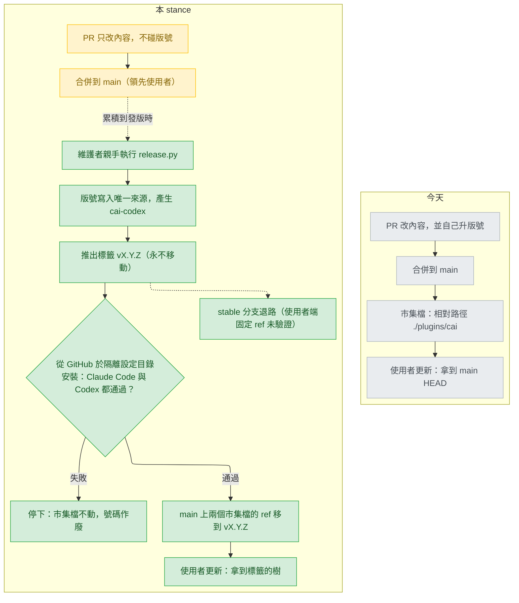

# release-versioning — stance

輸入：`.claude/track/release-versioning/intake.md`（路由 stance，假設 A1–A3，AC1–AC8）、`spike.md`（以文末「Main-session re-run」的最終表為準）、`state.md`。Trade 已由本人以選單定下：intake 選 B（發版列車＋市集來源固定到標籤），discover 選「遠端檢查併入發版流程」（`state.md:3-4`）。本文件把這兩個答案寫成 stance，不再重新提問。

詞彙：
- 發版列車（release train）：合併 PR 不等於發版；維護者決定時，一次切出一個版本。
- 標籤（tag）：git 裡指向某個 commit 的固定名字，本文寫作 `vX.Y.Z`。ref：分支名、標籤名或 commit，告訴平台取哪一份檔案。
- 市集檔（marketplace file）：告訴 Claude Code／Codex 去哪拿外掛的 JSON，本 repo 有 `.claude-plugin/marketplace.json` 與 `.agents/plugins/marketplace.json` 兩個。
- 子目錄來源（git-subdir）：市集檔的一種來源寫法，「從某個 git 網址、在某個 ref 取某個子目錄」；相對路徑來源（relative path）則直接取市集自己那份 clone 裡的目錄。
- 快取（cache）：平台把裝好的外掛放在以版號命名的目錄；版號不變，平台就判定沒有更新。
- 隔離設定目錄（isolated config home）：用 `CLAUDE_CONFIG_DIR`／`CODEX_HOME` 指到拋棄式目錄，測試安裝不碰真正設定。
- 語意化版號（SemVer）：`主.次.修補` 三段數字。發布頁（GitHub Release）：掛在標籤下的說明頁。變更紀錄（CHANGELOG）：逐版列出改動的檔案。
- 啟動器（launcher）：Codex 端 `plugins/cai-codex/scripts/launcher.py`，從快取找出要執行的 cai-codex 版本。

## Status

approved 2026-09-26

## Optimises for

一個版號只對應一份內容，而且使用者經由市集拿到的，永遠是一份已發布、已從 GitHub 實裝驗證過的內容。成功的樣子：功能 PR 的 diff 不含版號改動；任何 `vX.Y.Z` 在 Claude Code 與 Codex 的快取裡都是同一個標籤的樹。

## Sacrifices

- **合併即上線。** 修正合併到 main 後要等下一次發版才到使用者手上；兩次發版之間 main 領先所有人裝到的版本。今天改 `plugins/cai/` 的 PR 自己升版（`README.md:577-579`、`CLAUDE.md:42-43`），合併就等於發布。
- **各平台各自的版號。** 只改 Codex 的發版，也會讓 Claude Code 使用者升到內容沒變的新版號，反之亦然。這推翻 D13（`docs/design/2026-09-18-codex-support-decisions.md:259-261`）。
- **在 CI 上完成發版。** 從 GitHub 實裝的檢查需要網路、推送權限和兩個 CLI，只能在維護者機器上手動跑；CI 只在 Linux 跑 `validate.py` 與 `pytest`（`.github/workflows/validate.yml`，`CLAUDE.md`「Platform coverage」）。
- **舊版 Codex。** 只讀字串 `source` 的 Codex（0.155.0，E2，`docs/design/2026-09-18-codex-support-stance.md:40`）看不到子目錄來源的外掛；驗證過的只有 codex-cli 0.157.1（`.claude/track/release-versioning/spike.md:484-490`）。Codex 會在兩次執行間自我更新（同 decisions 文件 `:47`，C20），但比 0.157.1 舊的版本不保證可用。
- **預發布版號與發布通道。** 只有 `X.Y.Z`，沒有 `-rc`／`-beta`；同一市集也不能並存兩個版本（https://code.claude.com/docs/en/plugins/host-marketplace.md: "Claude Code has no release-channel concept, and one marketplace serves one version of each plugin at a time."）。
- **失敗的號碼。** 遠端檢查失敗時標籤已經推出，那個號碼就作廢，下一次用更大的號碼（I3）。

## Invariants

**This system's:**

- I1 — 唯一來源。產品版號只手寫在 `plugins/cai/.claude-plugin/plugin.json` 的 `version`（目前 `1.36.1`，`:3`；intake A1）。cai-codex manifest、agent 版本戳記（`scripts/gen-codex.py:437`）、標籤名、市集檔的 ref 都由程式從它推出，不另外手寫第二個版號。
- I2 — 格式。三段非負整數 `X.Y.Z`，不帶後綴（intake A2）。啟動器跳過非數字的版本目錄（`plugins/cai-codex/scripts/launcher.py:39-47`）；Codex 的 plugin-creator 規格："`version` must use strict semver."（openai/codex 原始碼 `codex-rs/skills/src/assets/samples/plugin-creator/references/plugin-json-spec.md`，屬驗證器而非執行期載入器）。
- I3 — 一號一樹。標籤 `vX.Y.Z` 推出後永不移動、不刪除，其樹裡兩個外掛 manifest 都寫 `X.Y.Z`。依據：https://code.claude.com/docs/en/plugins/loading.md: "Claude Code computes a version for every plugin it installs, and that version is how it detects an update."；Codex 快取路徑是 `<codex_home>/plugins/cache/<marketplace>/<plugin>/<version>/`（openai/codex 原始碼 `codex-rs/core-plugins/src/store.rs`）。同號兩份內容，就有人永遠拿不到後一份。
- I4 — 遞增。每次發版的號碼依數字比較嚴格大於上一次（比較法同 `scripts/gen-codex.py:593-607`）；第一個統一版號大於 main 上的兩個現值 `1.36.1` 與 `0.2.27`（`scripts/codex-release.json:2`）。intake A3 寫的 1.36.0／0.2.26 其後已前進。啟動器取數字最大的版本目錄（`launcher.py:50-68`）。
- I5 — 只送已發布的樹。使用者經由市集拿到的內容，永遠是某個已發布標籤的樹：兩個市集檔在 main 上都用子目錄來源、ref 指向標籤（退路模式下是只會指向已發布標籤的 stable 分支）。合併 PR 不改變任何人裝到什麼。
- I6 — 先驗證再指過去。main 上市集檔的 ref 只在該標籤從 GitHub、於隔離設定目錄中，Claude Code 與 Codex 都安裝通過之後才移動（discover 的選單答案，`state.md:4`）。
- I7 — PR 不碰版號。只有 `release.py` 寫版號；一般 PR 不改它，`validate.py` 也不要求它改。
- I8 — 人啟動發版。只有維護者親手執行 `release.py` 才會切版、推標籤；CI、hook、track 的任何階段都不會。
- I9 — 保留 stable 分支退路。子目錄來源在某平台失效時，能改用只指向已發布標籤的 `stable` 分支加相對路徑來源服務使用者（使用者以 `#stable`／`--ref stable` 固定市集；https://code.claude.com/docs/en/plugins/install.md: "`/plugin marketplace add your-org/plugins#v1.2.0` to pin the `v1.2.0` tag"）。使用者端固定 ref 在兩個平台都未驗證（`spike.md:490`，O5）。

**Cross-project:**

- 本 repo `CLAUDE.md` 的「Who a file is for」：`release.py` 與新檢查是 Ours，不進 `plugins/cai/`；`plugins/cai-codex/` 仍只由 `scripts/gen-codex.py` 產生。檔案衛生規則（無 BOM、`.cmd` 純 ASCII）照舊。
- 使用者規則 `workflow.md`：沒被要求就不 commit／push，不直接在 main 上改。
- 平台限制：上文引用的 loading、host-marketplace、install 三頁；codex-support stance 的 E2（`:40`）。
- 測試環境看得到的：CI 只在 Linux 跑 `validate.py` 與 `pytest`；從 GitHub 的實裝只在維護者機器上看得到；Windows 路徑長度在深層目錄會讓 clone 失敗（`spike.md:440-450`）。

## Rejected stances

- **A：持續發布，每個合併的 PR 都是一次發版**（今天的做法加上標籤）。每個 PR 仍要改版號，衝突來源不變（`.claude/skills/fix-issue/SKILL.md:67-70`），而且每次合併都要跑一次遠端檢查。本人在 intake 選 B 不選 A（`state.md:3`）。
- **C：發版列車，但市集來源不固定到標籤。** main 合併後內容變了、版號沒變：新裝的人拿到 main HEAD，舊使用者停在快取，同號兩份內容，違反 I3（https://code.claude.com/docs/en/plugins/loading.md: "Because the manifest comes first, a manifest that pins "version": "1.0.0" keeps every user on the cached copy until its author changes the string, however many commits they push."）。本人選 B 不選 C。
- **維持 D13，各平台各自版號。** 兩個號碼描述一個產品，要兩套升版規則。D13 排除同步版號的理由是「只改 Codex 的修正得去改 `plugins/cai/.claude-plugin/plugin.json`」（codex-support decisions `:59`），那是 codex-support 自己的 I1（`docs/design/2026-09-18-codex-support-stance.md:25`，該 track 不改 `plugins/cai/`）。列車下版號由 `release.py` 在發版時改，不由修正 PR 改，這個理由不再成立。

## Use cases / Issues

- R1 — 每個 PR 都改版號，是固定的 rebase 衝突來源（`intake.md:21`；`fix-issue/SKILL.md:67-70` 為此寫了專門步驟）。成立於：功能 PR 的 diff 不含版號改動，`validate.py` 照樣通過。
- R2 — cai 端升版只靠慣例（`README.md:577-579`、`CLAUDE.md:42-43`），漏升時改動靜靜到不了使用者（#163 曾補升，`intake.md:28`）。成立於：由程式保證已發布的號碼不會對應第二份內容（I3）。
- R3 — 沒有標籤、發布頁、CHANGELOG（`git tag --list` 輸出為空，2026-09-26）。成立於：每個版本都有 `vX.Y.Z` 標籤、發布頁與 CHANGELOG 一節。
- R4 — 一個產品兩個號碼（`1.36.1` 與 `0.2.27`）。成立於：任一標籤的樹裡，兩個 manifest 的版號相同。
- UC1 — Claude Code 使用者照 `README.md:310-321` 更新，拿到最新標籤的內容而非 main HEAD。成立於：`release.py` 的遠端檢查對 Claude Code 通過（本機 O1–O4 已通過，`spike.md:484-489`）。
- UC2 — Codex 使用者 `codex plugin marketplace upgrade` 後再 `codex plugin add`（`spike.md:501-502`），啟動器因戳記不符以 exit 3 提示跑 `$setup`（`launcher.py:204-210`）。成立於：遠端檢查對 Codex 通過。
- UC3 — 維護者切一個版本：執行一次 `release.py`；遠端檢查失敗時 main 的市集檔不動（I6）。
- UC4 — 整體退回：兩個市集來源改回相對路徑（今天是 `.claude-plugin/marketplace.json:11`），使用者下次更新拿到 main HEAD，等於回到每個 PR 升版的做法（intake AC5）。
- UC5 — 新平台接入：新平台的市集檔加一個子目錄來源，版號由 I1 推出，不新增第二個版號（intake AC6）。

## Overview

看「本 stance」那一塊：「合併到 main」和「使用者拿到什麼」之間不再有實線，內容只經由「推出標籤 → 遠端檢查 → 移動 ref」這一條路到使用者手上（I5、I6）；檢查失敗那條分支只花掉一個號碼，不碰市集檔。

## Out of scope

- 留給 Decisions：
  - 發版節奏（何時切版：隨需或定期）；`release.py` 的步驟順序，以及版號提交與 ref 移動怎麼進 main（直接推或開 PR，受 `workflow.md` 約束）；誰有權推標籤。
  - 何時、由誰啟用 stable 分支退路（例如遠端檢查只在一個平台失敗時）。
  - 第一個統一版號的數字，SemVer 公開介面清單與 MAJOR／MINOR／PATCH 各一例。
  - CHANGELOG 與發布頁怎麼產生。
  - 下列各自的去留：`scripts/codex-release.json`、gen-codex 的 UNRELEASED／`--release`（`scripts/gen-codex.py:576-607`）、`scripts/validate.py:141-149`（把 Claude 來源當路徑讀）與 `:1649-1659`（要求 Codex 來源是字串）、`README.md:577-579`、`CLAUDE.md:37-43`、`.claude/skills/fix-issue/SKILL.md:37-41,70,79`。
  - 使用者的 Codex 版本分布未知，這是關於使用者行為的假設：Decisions 會把它列為需求缺口，而不是當成事實。
- 本 track 不改程式、不改 `plugins/` 下任何檔案、不推標籤（`intake.md:39-40`）。
- 仍未驗證、由第一次發版的遠端檢查補上：從 github.com 的 HTTPS sparse partial clone（稀疏部分複製），以及使用者端 `#ref`／`--ref`（`spike.md:490-495`）。
- `docs/` 被 gitignore，本檔要 `git add -f` 才會保留。
