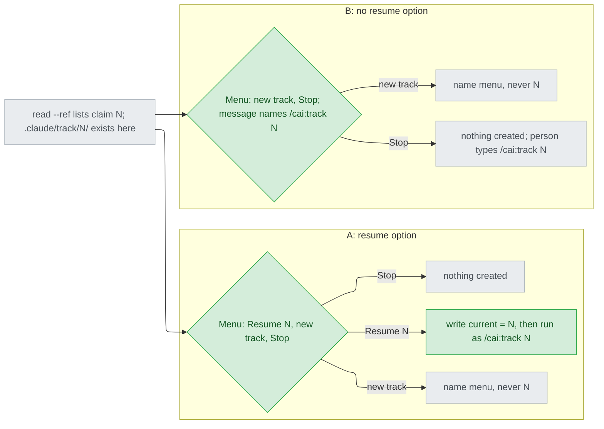
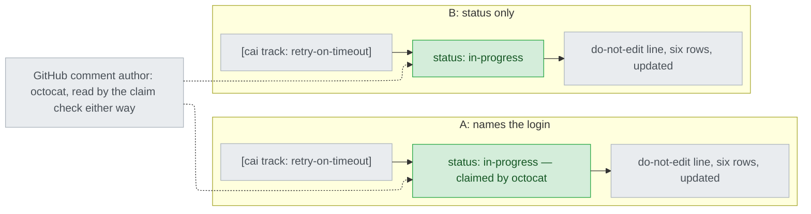

# Track issue status sync — decisions

## Reference

- Stance: `docs/design/2026-09-26-track-issue-status-sync-stance.md` — status: approved 2026-09-26

## Feasibility

| Id | Capability | Verdict | Evidence |
|---|---|---|---|
| C1 | One `gh issue view --json` call returns number, title, body and comments together | verified | `plugins/cai/scripts/ticket_backend.py:226` passes a comma-joined field list; `:245` asks for `comments`; the session observed `gh issue view --json comments` on #170 (`.claude/track/track-issue-status-sync/design-round1-brief.md:71-75`) |
| C2 | Each listed comment carries `body`, `author.login` and `url` | verified | `ticket_backend.py:258-260` matches on `body` and `author.login`; `:263-264` builds the PATCH endpoint from `url`, and that PATCH ran on #170 (`design-round1-brief.md:73-75`); https://github.com/cli/cli/blob/trunk/api/queries_comments.go — `Author CommentAuthor \`json:"author"\``, `Body string \`json:"body"\``, `URL string \`json:"url,omitempty"\`` |
| C3 | `gh issue view --json comments` returns every comment on the issue, however many | verified | https://github.com/cli/cli/blob/trunk/pkg/cmd/issue/view/http.go — `comments(first: 100, after: $endCursor)` inside a loop that ends only `if !comments.PageInfo.HasNextPage`. Read from gh's current source, not from the gh installed here |
| C4 | gh reports a per-comment edit time | infeasible | https://github.com/cli/cli/blob/trunk/api/queries_comments.go — the `Comment` struct carries `CreatedAt` and `IncludesCreatedEdit bool`, and no updated or edited time |
| C5 | Every cai-written comment starts with the marker and ends in `updated <UTC time>` | verified | `plugins/cai/scripts/ticket.py:149` (marker first), `:158` (`updated %s` last) |
| C6 | A projection can run before intake: `state.md` holds six empty rows as soon as the track exists | verified | `plugins/cai/skills/track/SKILL.md:41-43` creates the table with one row per stage; `ticket.py:143-147` renders only on exactly six rows; `ticket-mirror.md:42-44` points before the first stage |
| C7 | A later projection edits the same comment in place | verified | `ticket_backend.py:258-267` (marker plus author match, then PATCH) |
| C8 | `ticket.py` imports `track_state.py` to reuse its left-open parser | infeasible | `tests/test_ticket_config.py:50` allows only stdlib, `preflight`, `ticket_backend`; `plugins/cai/scripts/track_state.py:30` imports `ledger`, which `ticket.py:19-21` says it never imports (DD2) |
| C9 | `preflight.py` is importable from both `ticket.py` and `track_state.py` | verified | `ticket.py:31`, `track_state.py:29`; `track_state.py:23-27` already reuses `preflight` rather than write a lookup twice |
| C10 | `SKILL.md`'s body is 128 of 130 lines, the 128 is pinned, and every line naming "ticket" must name `ticket-mirror.md` and not contain "clos" | verified | `scripts/validate.py:2134`; `tests/test_track_skill_ticket_pointer.py:132`; `tests/test_ship_ticket_gate.py:96-99` |
| C11 | A Codex override whose anchor no longer occurs exactly once stops generation | verified | `scripts/gen-codex.py:252-258` raises `AnchorError` unless the anchor count is 1 |
| C12 | Generated Codex text may not contain `AskUserQuestion` | verified | `scripts/gen-codex.py:132` (deny-list) |
| C13 | Closing an already-closed issue exits 0 | verified | `ticket_backend.py:315-317` (measured, recorded in the comment) |
| C14 | `ticket.py`'s CLI takes boolean flags | verified | `ticket.py:451-452` (`--dry-run`, `--confirmed-by-user`) |
| C15 | The `Backend` interface is pinned to exactly four methods | verified | `tests/test_ticket_config.py:63-66` |
| C16 | `track_state.py` finds the track through `.claude/track/current`, and `/cai:track <name>`'s resume never writes `current` | verified | `track_state.py:38-64`, `:200-205`; `SKILL.md:34-36` (resume) and `:41` (only creation writes `current`) |
| C17 | A listed stop that times out is left unanswered and asked again only after the person next writes | verified | `plugins/cai/skills/track/references/approval-gates.md:204`, `:211-212` |
| C18 | `read` prints number, then title, then the body last | verified | `ticket.py:353-355` |
| C19 | Every pointed track reads the ticket once before intake's dispatch, including one pointed by hand | verified | `ticket-mirror.md:55-62`; the hand-run `point` path is documented at `MANUAL.md:483-486` |

## Ruled out

| Option | Invariant it violates | Evidence |
|---|---|---|
| A new subcommand (e.g. `ticket.py claims`) carries the claim check instead of `read --ref` | I4 names `read --ref` as what lists the claims | stance I4; C1 makes the existing call enough |
| Match claims the way `upsert_comment` does, marker plus own login | I4: every marked comment, "whoever wrote it" | stance I4; `ticket_backend.py:258-260` |
| A check that could not run proceeds silently as if nothing was found | I4: "never reads as no claims" | stance I4 |
| The name menu proposes, or accepts as free text, a name a listed claim carries | I5 | stance I5 |
| `done` posts a new comment for its final state | I3: one marked comment per track, edited in place | stance I3; C7 |
| The final comment records the close, or a second projection after the close does | I7: nothing beyond `state.md` and `left-open`; the close result lives in neither | stance I7; `ticket.py:374-376` (transition writes nowhere) |
| Ask the close menu before the move, so the move waits for the answer | I6: `done` is never held up by the ticket; a timed-out menu would leave the directory unmoved | stance I6; C17 |
| The close menu carries a `(recommended)` | I2 and AC4 | stance I2; `intake.md:59-61` |
| Keep a close item at Gate 2 beside the one at `done` | I1: one close point | stance I1, Rejected stances |
| Record the close answer in `state.md` or the ledger | I2 | stance I2 |

## Requirement gaps

| # | The behavioural assumption | Veto condition, or verification path | Deletes |
|---|---|---|---|
| RG1 | A track directory found here is not being driven right now by another live session in the same working tree. `.claude/track/<feature>/` is a path inside the project's working tree (`SKILL.md:41`), so a local match means the same tree, and nothing locks a track (`SKILL.md:31-43` names no lock) | Verification path: the person states whether they ever run two sessions in one working tree. **Answered 2026-09-26**, 「不會，各用獨立 clone/worktree (Recommended)」 (`options-design-RG1.md`): one session per working tree, parallel sessions in separate clones or worktrees. The veto condition does not apply | Nothing: D1 kept both options and was then answered A |
| RG2 | After the close menu at `done` times out, the person either comes back to the same session (so the standing re-ask reaches them, C17) or does not want it re-asked | Verification path: the person states which. **Answered 2026-09-26**, 「A 同 session 下次開口再問 (Recommended)」 (`options-design-RG2.md`). Veto condition now standing: "a close left unanswered is asked again when the person next writes in that session, and is gone with the session" (what C17 already gives every listed stop) | The no-re-ask wording: the close-at-`done` timeout row asks again in the same session only, and prints no "stays open" line |

## Tier 1

### D1 — When a listed claim's name matches a track directory in this working tree, does the claim menu offer to resume it?

Both shapes start from the same listed claim; only A has a third arrow, and only A writes `current`.

| Option | Rests on | What it costs | Fails when |
|---|---|---|---|
| A — A third option, "Resume N", shown only when `.claude/track/N/` exists and its `ticket.json` cached login equals the claim's author (`ticket.py:232-240`). It creates and points nothing (I4 holds), writes `current` = N, then continues exactly as `/cai:track N` does. A match under `done/N/` offers nothing extra: an archived track is not resumable (`SKILL.md:131`). | C16, C2 | One more menu option and one more `current` writer in `ticket-mirror.md`; whatever `current` named before stops being current (still resumable by name) | RG1: another session in the same working tree is driving N, and both then write one `state.md` |
| B — Menu stays continue/stop; its message names the local directory and says to stop and run `/cai:track N` | C16 | Nothing new to build | `current` names a different track: `/cai:track N` resumes by name without writing `current` (C16), so `track_state.py status` reports the other track's next stage — a gap in today's resume path that B sends the person into |

- **Blast radius:** `ticket-mirror.md`'s "Starting from a ticket" flow, the approval-gates timeout table, and `current`'s writers — more than one component.
- **Found out when:** the first time someone re-runs `/cai:track <url>` on their own issue after release.
- **Undo cost:** a text change, but a menu the person has learned changes shape.
- **Decided:** A — "Resume N", on exactly row A's condition; D12 below adds that the local pointer must name this same issue (the person, 2026-09-26: 「A 多一個「Resume N」選項 (Recommended)」, `options-D1.md`)

### D2 — Does the status line name the login?

The two comments differ in one line; the dotted arrows are the author field both already carry, which is what the claim listing prints.

| Option | Rests on | What it costs | Fails when |
|---|---|---|---|
| A — `status: in-progress — claimed by <login>`, then `status: done — claimed by <login>` at `done`; the shape the person saw at intake (`options-intake-q1.md:78-79`) | C2 | `project()` must resolve the login before rendering: today it renders at `ticket.py:228` and fetches the login after, at `:232-240`, so the first projection is reordered | Never technically; cai never reads the body copy (the listing takes `author.login`, C2), so it only duplicates the author |
| B — `status: in-progress`, then `status: done` | C2 | Nothing beyond the new line | A reader wants the login in the body text. Whether GitHub's issue page shows each comment's author was not fetched: UNVERIFIED |

- **Blast radius:** `render_comment`/`project` in `ticket.py` and their tests — one component.
- **Found out when:** after release, by whoever reads an issue; finished tracks keep the wording they were last written with.
- **Undo cost:** a renderer change; comments of finished tracks keep the old line.
- **Decided:** B — `status: in-progress`, and `status: done` on the final projection; `project()` keeps its order (the person, 2026-09-26: 「B 只寫狀態 (Recommended)」, `options-D2.md`)

## Tier 2

### D3 — How does `read --ref` learn the claims?

`Backend.read` asks for `number,title,body,comments` in its one existing call (C1, every page, C3) and returns the comments as `{body, login}` pairs; `StubBackend` returns none. A fifth `Backend` method would break the four-method pin (C15) for a round trip C1 shows is unneeded. `ticket.py` parses the marker from each body and the time from its `updated` line (C5), never the status line, so D2's wording cannot break an older comment's parsing. Refined in round 3: comments are asked for only when the caller passes `with_comments=True`, which only the `--ref` path does — the three `--track-dir` reads never print them (`ticket.py:345-356`), and every extra page (C3) runs inside one fixed 10-second call (`ticket_backend.py:24`), so fetching them there could only turn a working intake read into `unreachable`. **Found out when:** next test run (`tests/test_ticket_backend.py:167-176` pins today's exact dict).

### D4 — Where do `done`'s ticket steps live?

`SKILL.md`'s `## /cai:track done` gains the hook by widening one of its existing lines (130-132), no new line: the 128 is pinned and every line naming "ticket" must name `ticket-mirror.md` and never "clos" (C10); a hook in the command's own section follows `SKILL.md:33-34`. `ticket-mirror.md` gains a `## /cai:track done` section after the ship section, holding the final projection and the close item moved out of `ticket-mirror.md:103-117`. **Found out when:** next test run for the line pins; the first real `done` for whether the hook is followed.

### D5 — Which carriers lose Gate 2's close?

Every one that names ship as the close point (stance I1), including six the stance did not list (`codex-overrides.json:302-303` and `:404-406`, `MANUAL.md:527-529`, `test_ship_ticket_gate.py:48-59`, `test_question_timeout.py:100-106`, the docstring at `test_track_skill_ticket_pointer.py:140`). The full set: `stage-ship.md:7-12` and its override `scripts/codex-overrides.json:185-205` (anchor rewritten or generation stops, C11); `codex-overrides.json:302-303` (SKILL.md Human gates replacement) and `:404-406` (shipper description); `approval-gates.md:136-147` ("Three more" becomes two) and `:199`; `ticket-mirror.md:85,96-117`; `ticket.py:359-383` docstring and refusal text; `MANUAL.md:527-529`; tests `test_ship_ticket_gate.py:48-59,159-185`, `test_question_timeout.py:100-106`, `test_track_skill_ticket_pointer.py:140`. Found in round 3: `MANUAL.md:207-209` and `:545-549`, and `README.md:217-219`, which say the same. **Found out when:** next test run for the pinned ones; `MANUAL.md` and `README.md` only by a reader.

### D6 — How do left-open items reach the final comment?

`left_open_items` moves from `track_state.py:74-92` into `preflight.py`, which both scripts already import (C9); `ticket.py` may import nothing else from this repo (`tests/test_ticket_config.py:50`). The items render as their own list under the table, each cut at `NOTE_LIMIT`, because `Left open:` sits last in the note (`SKILL.md:69`) and the row note is cut at 200 (`ticket.py:120-123`), which drops those items first. **Found out when:** next test run.

### D7 — In what order does `done` run, and what does a timed-out close do?

Refusal check, `left-open`, `project --final`, move and clear `current`, then the close menu with `--track-dir .claude/track/done/<feature>`, since the pointer moves with the directory (`ticket.py:81-82`). Timed out, nothing runs (stance I2) and the row joins the timeout table beside the others (`approval-gates.md:196-204`, C17); RG2 is answered, so the row says it is asked again when the person next writes in the same session, and is gone with the session. **Found out when:** the first `done` whose menu times out.

### D8 — How does `project` know it is writing the final state?

A `--final` flag that only `done`'s step passes (C14), rendering `status: done`; every other projection renders `status: in-progress`. Both words are `state.md`'s own vocabulary (`plugins/cai/scripts/ledger.py:87`). Deriving "final" from every row being done or skipped would write it at ship's projection, before `done`, while the stance's overview puts the final rewrite at `done` (stance `## Overview`, node F). **Found out when:** next test run.

### D9 — Where does the claim projection run?

In `ticket-mirror.md`'s "Before dispatch: read once" step for intake, right after that read (C6): it runs for every pointed track, including one pointed by hand (C19), where a call placed after the ticket path's `point` would miss that path. It satisfies AC1 (after `point`, before intake's dispatch, `intake.md:50-52`); a re-run intake edits the same comment (C7). **Found out when:** next test run for the text; the first hand-pointed track otherwise.

### D10 — What do the new menus say about the tool, and which is recommended?

No new sentence names `AskUserQuestion` (C12): each says "a menu" and points at `approval-gates.md`, whose `:9-11` already says what that means, so no new override is needed. The claim menu recommends Stop, from the request itself (`intake.md:10-14`, so agents "do not pick the same issue twice"); an ordinary stop carries one (`approval-gates.md:170-173`). D1 landed on A, so re-decided here: when a "Resume N" is shown, it is recommended instead of Stop. RG1's answer makes that claim the person's own paused track in this tree (D12 makes it this issue's), so resuming adds no second worker — the request's concern — while Stop sends them to type `/cai:track N`, which never writes `current` (C16). **Found out when:** next generation run for the deny-list; after release, the first re-run on one's own issue, for the recommendation.

### D11 — When does `done` offer the close at all?

Only when mirroring is on and the track has a pointer — the same condition the Gate 2 item used (`approval-gates.md:144-145`, "only when mirroring is on"). Corrected in round 3: both are checked by the `ticket.py read --track-dir` that resolves the number anyway, which prints nothing with mirroring off (`ticket.py:310-314`) and one line when there is no pointer (`:324-328`), both before any backend call; `show` was named in round 2 but never reads the config (`ticket.py:267-277`), so it would print the pointer with mirroring off (UC1). The close is offered exactly when that read prints a `number:` line. A failed final projection does not suppress it (UC2); a track with no pointer is never offered a close (UC1). **Found out when:** next test run for the text; the first `done` with mirroring off otherwise.

### D12 — Does "Resume N" also require the local track to point at this issue?

Yes: the local `ticket.json`'s `ref`, reduced to its issue number, must equal the number the same read just printed. RG1's answer puts parallel sessions in separate clones, so a claim under the person's own login can come from another clone, and names are proposed from titles (`ticket-mirror.md:27-29`), so two issues can yield one name; the pointer carries the ref (`ticket.py:262`). Without the check, "Resume N" can continue a track pointed at a different issue. A ref that reduces to no number is not resumable. **Found out when:** after release, the first same-name track on a second issue.

## Tier 3

| Decision | Chose | Instead of | Found out when |
|---|---|---|---|
| Status line position | Second line, after the marker, before the do-not-edit line, as sampled (`options-intake-q1.md:78-80`); find-back is a substring test (C7) | After the do-not-edit line | Next test run |
| Where the claims are printed | Only on the `--ref` path, as a counted block (`claims: N`, then N lines) between title and body, so no body line can pose as one (C18) | After the body; or on every `read` | Next test run |
| Where the marker is parsed | `ticket.py`, beside `marker_for` (`ticket.py:112-117`); the backend returns raw pairs | Each backend parsing it | Next test run |
| Last-updated time | The body's `updated` line (C5) | gh's per-comment time, which gh does not report (C4) | Next test run |
| Left-open parser location, the rejected alternatives | Recorded for D6 | A second copy in `ticket.py`, or importing `track_state` (C8) | Next test run |
| A `done/N/` match | Listed as finished here, nothing more (`SKILL.md:131`) | A resume offer | Next test run |
| A listed name typed as free text | Refused, name menu asked again (I5) | Accepted | Next test run |
| Check could not run | One line naming the category, then the name menu (UC2, I4) | Asking continue/stop with nothing listed | Next test run |
| Mirroring off at the claim check | `read --ref` stays silent (`ticket.py:310-314`) and the existing "say so and ask for a name" stands (`ticket-mirror.md:51-53`); no claim line is added (UC1) | A "check did not run" line, which UC1 forbids | Next test run |
| Claim menu timed out | New timeout row: nothing created or pointed (I4) | Asking again with the name menu | Next test run |
| Close menu options | "Close #<n>" and "Leave it open", no recommendation (I2), the number resolved by `read --track-dir` as ship does (`ticket-mirror.md:87-94`) | The ref as typed | Next test run |
| In-flight tracks shipped under the old gate | One sentence in the done section: the issue may already be closed, and closing again is harmless (C13) | Reading the issue state first | First such `done` |
| No left-open items | `left open: none` | Omitting the list | Next test run |
| Test placement | Claim parsing in `tests/test_ticket_read.py` and `tests/test_ticket_backend.py`; status line and left-open list in `tests/test_ticket_render.py`; `done`'s text and the single close origin in a new `tests/test_ticket_done.py`; `tests/test_ship_ticket_gate.py` keeps only "ship does not close"; added in round 3: the `--final` flag through `main()` in `tests/test_ticket_project.py`, the claim-menu text in `tests/test_ticket_mirror_reference.py`, and `tests/test_track_state_left_open.py:79-91` follows the moved function | Flipping everything inside `test_ship_ticket_gate.py` | Next test run |
| `validate.py`'s pointer label | `scripts/validate.py:1969` names done's close as well as ship's comment | Leaving "ship's separate ticket item" | Next test run |
| Codex shipper prohibition | `codex-overrides.json:419` drops "or close the linked ticket" with the rest of D5 | Leaving a true but stale clause | Next generation run |
| Claim marker position | Counted only when the comment's first line is exactly a marker, as every cai-written comment has it (C5) | Anywhere in the body, which lists a person who merely quotes one | Next test run |
| Claim order | Most recently `updated` first, `unknown` last; the text is fixed-width UTC (`ticket.py:172`) and sorts as text | gh's own order | Next test run |
| Where "resumable" and "finished" are decided | `ticket.py`, on the `--ref` path, from `.claude/track/<name>/ticket.json` and `.claude/track/done/<name>/` under `--project-dir`: the program layer | The main session opening `ticket.json` itself | Next test run |
| A claim name that is not a track name | Listed, never looked up on disk or offered for resume: only `[A-Za-z0-9][A-Za-z0-9._-]*`, and never `current` or `done` (`SKILL.md:33`) | Looking up whatever a comment says, which lets any commenter name a path | Next test run |
| More than two resumable claims | "Resume" for the first two in printed order; the rest named in the message; four options at most (`approval-gates.md:11`) | One option per claim | Next test run |
| Proposed name already carried by a listed claim | The title's name plus `-2`, then `-3`, until no listed claim carries it | Asking the model for another name | Next test run |
| Claim projection when the intake read says there is no pointer | Skipped; the read already printed the one line | A second "no pointer" line | Next test run |
| Close when no number was resolved | Not offered; after a `read: <category>` line, one line saying the ticket stays open and can be closed on the ticket itself | "Close" with the pointer's ref as typed | Next test run |
| Blank lines around the left-open block | One before `left open:` and one before `updated`, so the block is not rendered as a table row or a list continuation; that GitHub rendering is UNVERIFIED, and the blank lines are harmless if it is wrong | No blank lines | Next test run |
| Resume while `current` names another track | The one line says which track `current` named, and that it stays resumable by name | Overwriting it silently | Next test run |
| `--final` given to another subcommand | Ignored, as `--dry-run` is outside `show` (`ticket.py:462-463`) | A usage error | Next test run |
