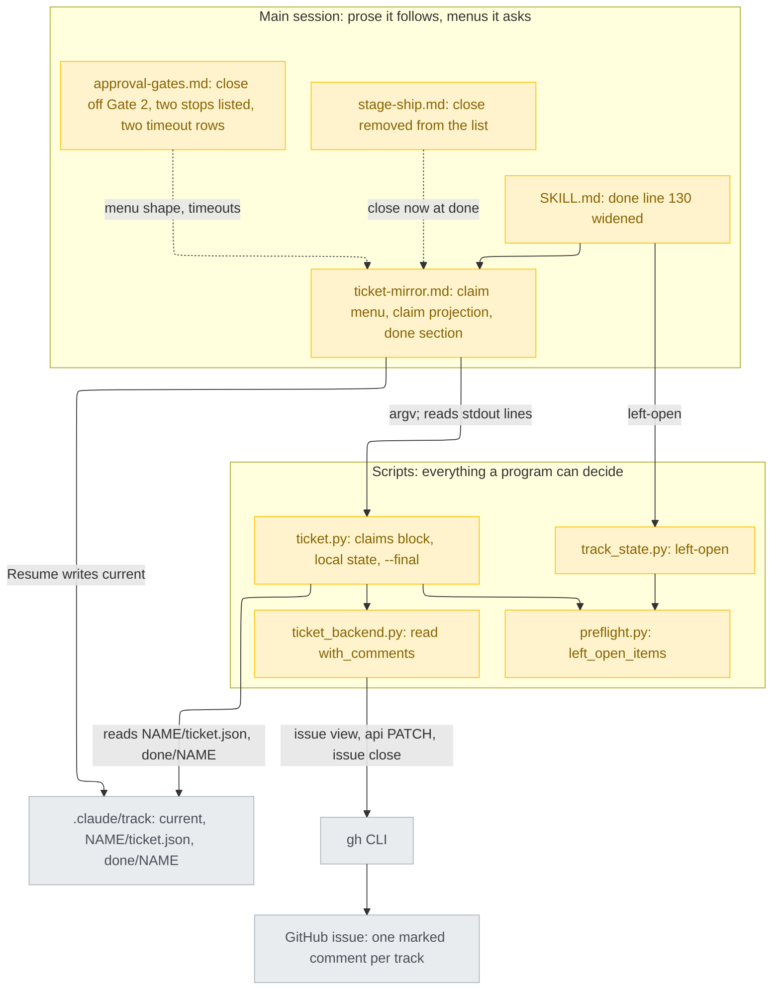
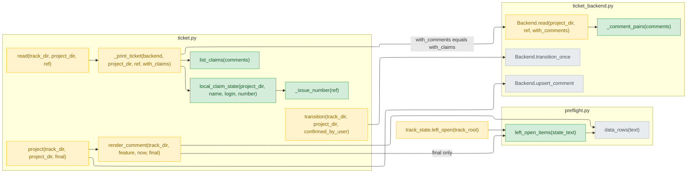
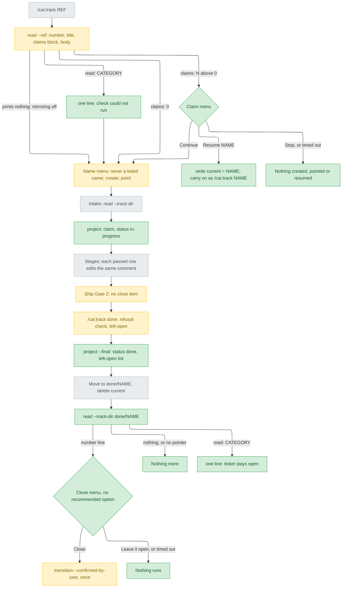
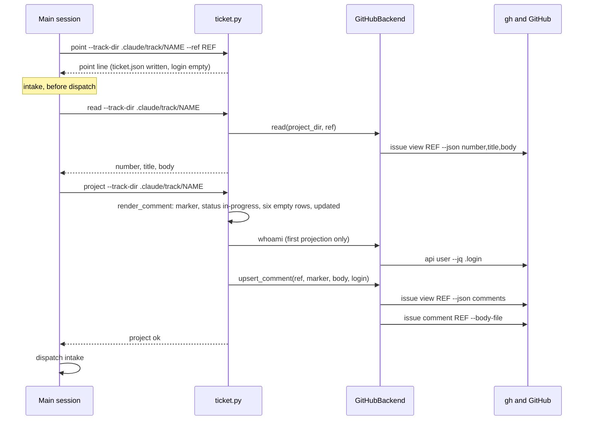
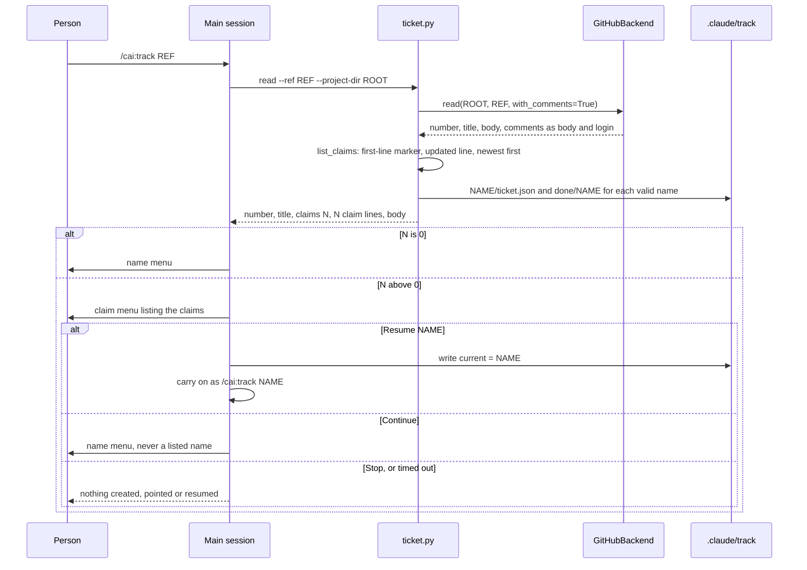
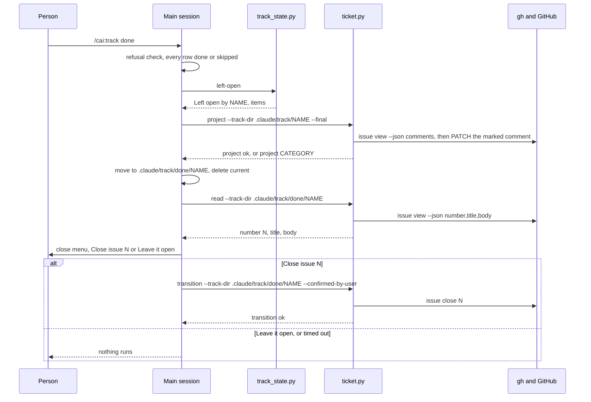
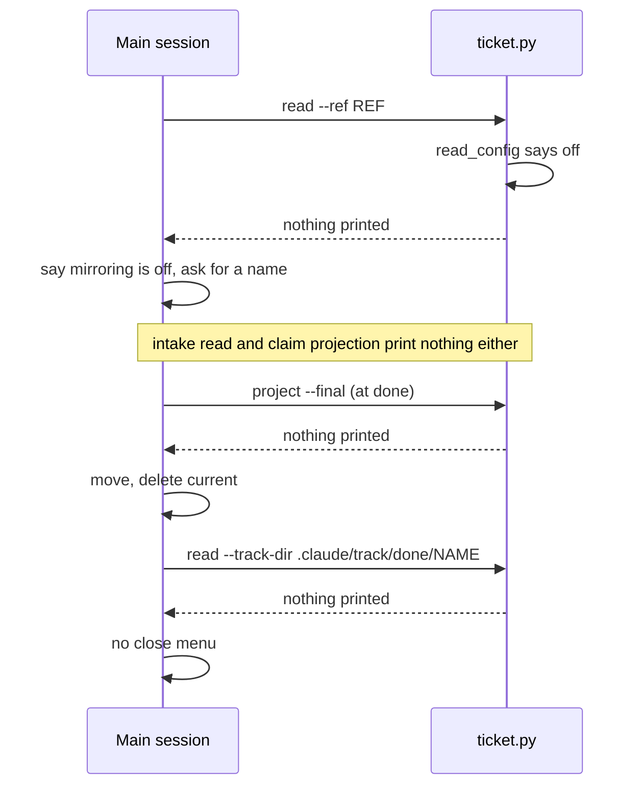
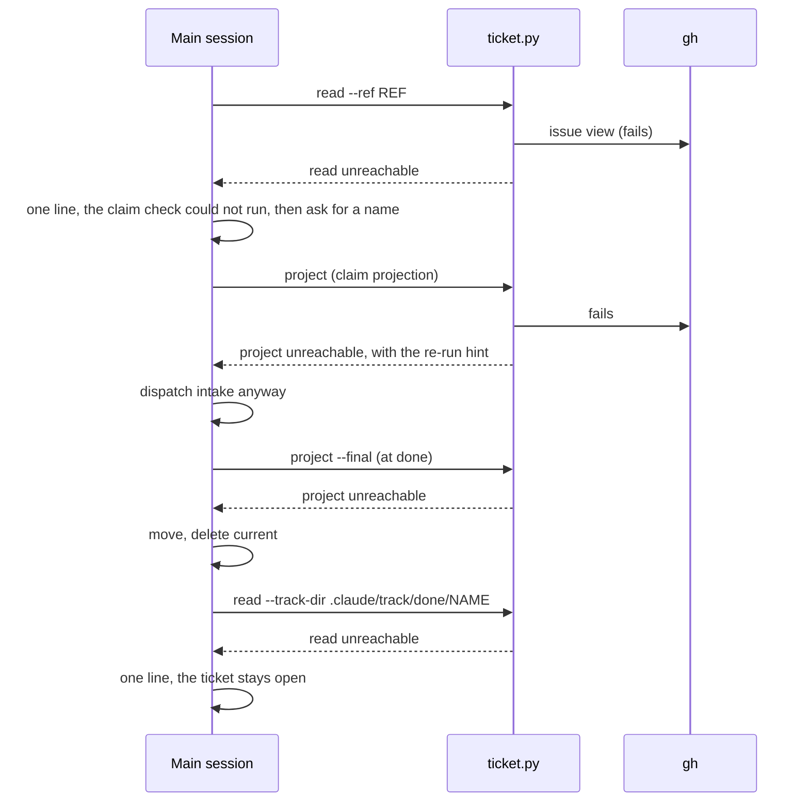

# Track issue status sync — detail design

## Reference

Stance doc: docs/design/2026-09-26-track-issue-status-sync-stance.md
Decisions doc: docs/design/2026-09-26-track-issue-status-sync-decisions.md
Status: approved 2026-09-26 (the stance's `## Status`); the decisions document's two Tier 1 entries carry `Decided:` lines dated 2026-09-26 (D1 = A, D2 = B), and both requirement gaps are answered.

### Traceability

| From the referenced document | Satisfied by | Status |
|---|---|---|
| R1 — no comment from `point` to the end of intake | The claim projection in `ticket-mirror.md`'s "Before dispatch: read once" (D9), rendering `status: in-progress` over six empty rows (`render_comment`, D2 = B, D8) | covered |
| R2 — `read --ref` never sees an existing claim | `Backend.read(..., with_comments=True)` (D3), `list_claims` and `local_claim_state` printing a `claims: <n>` block on the `--ref` path, and the claim menu in "Starting from a ticket" (D1 = A, D10, D12) | covered |
| R3 — `done` does nothing to the ticket | `ticket.py project --final` from `ticket-mirror.md`'s new `/cai:track done` section, hooked from `SKILL.md:130` (D4, D6, D7, D8) | covered |
| R4 — the ticket closes at Gate 2, before merge | The close item leaves every Gate 2 carrier (D5) and reappears only as `done`'s close menu, after the move (D7, D11) | covered |
| UC1 — mirroring off prints and calls nothing new | `read`, `project` and `read --track-dir` each return silently when `read_config` says off (`plugins/cai/scripts/ticket.py:202-203`, `:313-314`); the done section asks nothing unless a `number:` line was printed (D11) | covered |
| UC2 — a backend failure prints one line and blocks nothing | Every new call is a `ticket.py` subcommand that exits 0 (`ticket.py:473-476`); the prose says what to do after each failure line (claim check, claim projection, final projection, close) | covered |
| UC3 — Codex regenerated; `validate.py` and `pytest` pass | Work breakdown unit 8, and every unit's "Done when" | covered |

## Requirement

Issue #170 (`.claude/track/track-issue-status-sync/intake.md:10-14`): when `/cai:track <issue>` starts work on an issue, say so on the issue, so several cai agents working the same repository do not pick the same issue twice; when `/cai:track done` finishes that track, write the outcome back and offer to close the issue. It worked when AC1-AC6 hold (`intake.md:48-66`): a second session sees the first one's claim before it names a track, the comment ends in the track's final state, and the only close is a person's yes at `done`.

## Glossary

| Term | Definition | Where it lives |
|---|---|---|
| Mirror comment | The one issue comment a track owns, found back by marker plus cached login and edited in place | plugins/cai/scripts/ticket_backend.py:258 |
| Marker | The first line of a mirror comment, `[cai track: <name>]` | plugins/cai/scripts/ticket.py:112 |
| Status line | The mirror comment's second line, `status: in-progress` or `status: done` | new — plugins/cai/scripts/ticket.py |
| Claim | Any comment on the issue whose first line is a marker, whoever wrote it | new — plugins/cai/scripts/ticket.py |
| Claim listing | The `claims: <n>` line and its `<n>` claim lines that `read --ref` prints between title and body | new — plugins/cai/scripts/ticket.py |
| Resumable claim | A claim whose name has a directory under `.claude/track/` here, whose `ticket.json` caches the claim's author as login and points at this same issue number | new — plugins/cai/scripts/ticket.py |
| Finished claim | A claim meeting the same pointer test against `.claude/track/done/<name>/` instead | new — plugins/cai/scripts/ticket.py |
| Claim menu | The menu asked when the claim listing is non-empty, before the name menu | new — plugins/cai/skills/track/references/ticket-mirror.md |
| Name menu | The existing ask for the track directory's name | plugins/cai/skills/track/references/ticket-mirror.md:30 |
| Claim projection | The `ticket.py project` run right after intake's ticket read, which posts the claim | new — plugins/cai/skills/track/references/ticket-mirror.md |
| Final projection | `ticket.py project --final`, run by `done` before the move | new — plugins/cai/scripts/ticket.py |
| Close menu | The menu `done` asks after the move: "Close #<number>" or "Leave it open" | new — plugins/cai/skills/track/references/ticket-mirror.md |
| Left-open item | One `(stage, item)` pair from the text after `Left open:` in a state.md note | plugins/cai/scripts/track_state.py:74 |
| Pointer | A track's `ticket.json`: backend, ref, cached login, last projection | plugins/cai/scripts/ticket.py:35 |
| Cached login | The login `project` stores in the pointer on its first successful projection | plugins/cai/scripts/ticket.py:232 |
| Mirroring on | `.claude/cai.json`'s `ticket.enabled` is `true` | plugins/cai/scripts/ticket.py:44 |
| `current` | `.claude/track/current`, naming the one active track `track_state.py` reports | plugins/cai/scripts/track_state.py:38 |
| Refusal check | `done`'s refusal while any stage row is empty or `in-progress` | plugins/cai/skills/track/SKILL.md:131 |
| Timeout table | approval-gates' "what each stop does about a menu that closed on its own" | plugins/cai/skills/track/references/approval-gates.md:196 |
| Codex override | An anchor/replacement pair `gen-codex.py` applies before rewriting | scripts/gen-codex.py:247 |

## Budgets

| What | Number | Where it comes from |
|---|---|---|
| gh calls made by `read --ref` | 1 | unchanged: one `gh issue view` (`plugins/cai/scripts/ticket_backend.py:225-227`); comments ride in it (decisions C1) |
| Comments per gh page inside that call | 100 | decisions C3: gh loops `comments(first: 100, ...)` until the last page |
| Time allowed per gh call | 10 s | `ticket_backend.py:24`; an issue whose comment pages exceed it reads as `unreachable` (Failure modes) |
| gh calls for the claim projection | 3 on a track's first projection, 2 after | `ticket.py:192-197` (whoami skipped once cached); observed on #170 (`design-round1-brief.md:71-75`) |
| gh calls at `done`, at most | 5 | final projection 2, or 3 when no earlier projection ever cached a login (`ticket.py:232-240`); `read` 1; `transition` 1 on a yes |
| Characters kept per left-open item in the comment | 200 | `NOTE_LIMIT` (`ticket.py:40`), plus the one-character ellipsis (`:41`) |
| Resume options in one claim menu | 2 | four options at most (`plugins/cai/skills/track/references/approval-gates.md:11`) minus Continue and Stop |
| `SKILL.md` body lines after the change | 128 | pinned (`tests/test_track_skill_ticket_pointer.py:132`), ceiling 130 (`scripts/validate.py:2134`); D4 widens a line, adds none |
| Active tracks | 5 | `SKILL.md:36-39`; Resume creates none, Continue goes through the cap as today |
| cai plugin version | 1.36.0 | from 1.35.0 (`plugins/cai/.claude-plugin/plugin.json:3`); a feature bumps the minor number |
| cai-codex release | 0.2.22 | from 0.2.21 (`scripts/codex-release.json:2`); `--release` refuses a version not greater than the base ref's (`scripts/gen-codex.py:600-607`) |

## Design decisions

- **The claim is the mirror comment, posted before intake** (I3, D9). `ticket-mirror.md`'s intake read is followed by one `project`; nothing new is created on the issue, and every later projection edits the same comment (serves R1, AC1).
- **`read --ref` lists every claim** (I4, D3 refined, Tier 3 rows). Only the `--ref` path asks gh for comments, so the three `--track-dir` reads stay as small as today. A claim counts when the comment's first line is a marker; the list is newest first; a check that failed prints `read: <category>` and never a `claims:` line (serves R2, AC2).
- **Resume is offered by the program, recommended by the prose** (D1 = A, D10, D12). `ticket.py` decides `local: resumable` from files it can read; the prose turns that into a menu option and writes `current`. A name that could not be a track name is never looked up (Tier 3), so a comment cannot steer a file read or a `current` write.
- **A new track never takes a listed name** (I5). The proposal adds `-2`, `-3`, …; a typed one is refused (serves I5).
- **Status line only; the login stays in GitHub's author field** (D2 = B). `project()` keeps its order.
- **`done` writes the final state before the move and offers the close after it** (D7, D8, D11). `--final` renders `status: done` and the left-open list, with `left open: none` when there are none (serves R3, AC3). The close menu is asked only when `read --track-dir .claude/track/done/<feature>` prints a `number:` line, carries no `(recommended)`, and only its first option runs `transition --confirmed-by-user` (serves R4, AC4, I1, I2).
- **The close leaves every Gate 2 carrier in the same change** (I1, D5), including three Codex overrides and three tests, so there is never a moment with two close points or none.
- **Nothing blocks** (I6, UC2). Every new step is a `ticket.py` subcommand that exits 0 and prints one line on failure; the prose says to carry on after each.
- Refinements made in this round, all recorded in the decisions document so Gate 1 sees them: D3 (comments only on the `--ref` path), D11 (`read --track-dir` instead of `show`, since `show` never reads the config, `ticket.py:267-277`), and the new Tier 2 entry D12 (Resume needs the local pointer to name this issue).

## Diagrams

### Architecture



Look at the line between the two boxes: every judgement a program can make (which comments are claims, which one is yours and resumable, what the final comment says) sits in the scripts, and the main session's prose only turns printed lines into menus. The one new arrow from prose to disk is Resume's write of `current`.

### Component



Two things to see: `left_open_items` now has two callers across a module boundary, which is why it moves into `preflight.py` (the only module both may import, decisions C8/C9); and `Backend.read` gains a keyword, not a fifth method, so the four-method pin (C15) holds.

### Flow



Read it for the branches at the two ends: at the start, four outcomes of one `read --ref`, only one of which asks anything; at `done`, the move always happens before any question, so every branch after it (including a timeout) leaves the track archived.

### Sequence — R1



The new arrow is the second `ticket.py` call before intake is dispatched: from here on the issue carries the claim, while intake still has not run.

### Sequence — R2



Note where the disk is read: by `ticket.py`, before the menu, so the "Resume" option exists only when a program found the pointer; the main session's only disk write is `current`, and only after a pick.

### Sequence — R3 and R4



R4 is drawn here rather than on its own because it is the tail of the same `done` run. The arrow that moved is `transition`: it now starts after the move, with `done/NAME` as its track directory, and nowhere in ship.

### Sequence — UC1



Every `ticket.py` call still runs, and each returns before any backend is chosen; the absence of a `number:` line is what keeps the close menu away, so no model judgement about the config is involved.

### Sequence — UC2



Each failure is one printed line followed by the step the flow would have taken anyway; nothing here writes the ledger (`ticket.py:19-21`).

UC3 has no sequence: it is not a runtime call order but the build's own last unit (Work breakdown unit 8), and its proof is three commands' exit codes.

## Implementation spec

### Backend.read (`ticket_backend.py`)

- **Responsibility:** fetch one issue's number, title and body, and its comments only when asked.
- **Interface:** `Backend.read(self, project_dir: str, ref: str, with_comments: bool = False) -> tuple[dict | None, str]`, overridden by `GitHubBackend.read` and `StubBackend.read` with the same signature. New private helper `_comment_pairs(comments: object) -> list[dict]`.
- **Data:** out `{"number": str, "title": str, "body": str}`, plus `"comments": list[{"body": str, "login": str}]` only when `with_comments` is true, so the default return is byte-for-byte today's dict. `GitHubBackend` passes `--json number,title,body,comments` in that case and `number,title,body` otherwise (`ticket_backend.py:225-227`). `_comment_pairs`: a non-list becomes `[]` (as `:251-253` already does); each dict element becomes `{"body": c.get("body") or "", "login": (c.get("author") or {}).get("login") or ""}`; non-dict elements are dropped; order kept. `StubBackend` returns `"comments": []` when asked.
- **Errors:** unchanged: any failed call returns `(None, category)`; unparseable stdout returns `(None, "unclassified")` (`:230-232`).
- **Concurrency:** read-only; safe to repeat.
- **Observability:** the existing one `backend <argv summary> -> <category>` line per call (`:148-151`); the argv summary shows whether `comments` was asked for.
- **Where it lives:** `plugins/cai/scripts/ticket_backend.py`, exists.
- **What it reuses:** `run` (`:121-152`), `_load_json_object` (`:164-176`), the comment-list guard at `:251-253`.

### Claim listing (`ticket.py`)

- **Responsibility:** turn raw comments into the claim lines `read --ref` prints, including which one is this tree's own track.
- **Interface:**
  - `list_claims(comments: list[dict]) -> list[dict]` — pure.
  - `local_claim_state(project_dir: str, name: str, login: str, number: str) -> str` — returns `"resumable"`, `"finished"` or `""`.
  - `_issue_number(ref: str) -> str | None`.
  - `_print_ticket(backend, project_dir: str, ref: str, with_claims: bool = False) -> str`, calling `backend.read(project_dir, ref, with_comments=with_claims)`; `read()` keeps its signature (`ticket.py:294`) and passes `with_claims=True` only from its `--ref` branch (`:316-322`).
- **Data:**
  - Constants: `MARKER_LINE_RE = re.compile(r"\[cai track: ([^\]\n]+)\]")`; `TRACK_NAME_RE = re.compile(r"[A-Za-z0-9][A-Za-z0-9._-]*")`; `RESERVED_NAMES = ("current", "done")`; `ISSUE_URL_RE = re.compile(r"/issues/(\d+)(?:[/?#].*)?$")`.
  - `list_claims`: for each pair, `lines = (c.get("body") or "").splitlines()`; not a claim when `lines` is empty or `MARKER_LINE_RE.fullmatch(lines[0].strip())` is `None`. Otherwise `{"name": <group 1>, "login": c.get("login") or "unknown", "updated": u or "unknown"}`, where `u` is `line.strip()[len("updated "):].strip()` for the last line whose `strip()` starts with `"updated "`. Returned as `sorted(claims, key=lambda c: (c["updated"] != "unknown", c["updated"]), reverse=True)` — newest first (the text is fixed-width UTC, `ticket.py:172`), `unknown` last, ties in gh's order (Python's sort stays stable under `reverse`).
  - `_issue_number`: `s = str(ref).strip()`; `s` when `s.isdigit()`; else group 1 of `ISSUE_URL_RE.search(s)`; else `None`.
  - `local_claim_state`: `""` when `number` is empty, when `TRACK_NAME_RE.fullmatch(name)` is `None`, or when `name in RESERVED_NAMES`. Otherwise, with `root = os.path.join(project_dir, ".claude", "track")`: `"resumable"` when `os.path.join(root, name)` is a directory and `read_pointer` of it gives a dict whose `login` is non-empty and `== login`, and whose `_issue_number(ref)` `== number`; else `"finished"` when the same test passes for `os.path.join(root, "done", name)`; else `""`. All comparisons are exact strings.
  - Printed block, between `title:` and the body (`:353-355`): `claims: <n>`, then per claim `- <name> by <login>, updated <updated>`, plus `, local: resumable` or `, local: finished` when set. `number` is the value just read (`value.get("number", "")`).
- **Errors:** no new raise path: a missing `comments` key reads as `[]` (so a test double returning today's dict still works); an unreadable `ticket.json` is `read_pointer`'s `None` (`ticket.py:85-94`), so not resumable.
- **Concurrency:** reads local files only; another session editing a pointer between the read and the menu can only make an offer stale, never make one appear for another login.
- **Observability:** the block itself; `claims: 0` is printed on success so "ran and found none" is distinguishable from `read: <category>` (stance I4).
- **Where it lives:** `plugins/cai/scripts/ticket.py`, exists; `import re` is added (standard library, allowed by `tests/test_ticket_config.py:50`); the three functions and four constants are new.
- **What it reuses:** `marker_for`'s bracket format (`ticket.py:112-117`), `read_pointer` (`:85-94`), the `updated` line `render_comment` writes (`:158`).

Sample, for issue #170 with two claims, one of them this tree's own:

```
number: 170
title: 更新 issue 的狀態
claims: 2
- track-issue-status-sync by millerlai, updated 2026-09-26T12:45:17Z, local: resumable
- issue-status-claims by octocat, updated 2026-09-25T08:10:00Z
<body as today>
```

### Comment rendering and the final projection (`ticket.py`)

- **Responsibility:** render the mirror comment, with a status line always and the left-open list only on the final projection.
- **Interface:** `render_comment(track_dir: str, feature: str, now: str, final: bool = False) -> str | None`; `project(track_dir: str, project_dir: str, final: bool = False) -> str | None`; `main()` gains `ap.add_argument("--final", action="store_true")` and calls `project(args.track_dir, args.project_dir, args.final)`.
- **Data:** in-progress body: marker, `status: in-progress`, the do-not-edit line, header, rule, six rows, `updated <now>` — today's body (`ticket.py:149-159`) plus line 2. Final body: marker, `status: done`, the same rows, then an empty line, then `left open:` followed by `- [<stage>] <_truncate_note(item)>` per `preflight.left_open_items(text)` pair — or the single line `left open: none` when there are none — then an empty line, then `updated <now>`. `text` is the state.md already read at `:136-138`.
- **Errors:** unchanged: `None` when state.md is missing or not six rows (`:139-147`); `project` returns the category and never raises.
- **Concurrency:** unchanged (`upsert_comment` edits the one comment in place, C7).
- **Observability:** `project: ok` or `project: <category> -- re-run …` (`:246-249`).
- **Where it lives:** `plugins/cai/scripts/ticket.py`, exists.
- **What it reuses:** `_truncate_note` (`:120-123`), `preflight.data_rows` (`plugins/cai/scripts/preflight.py:58-74`), `preflight.left_open_items` (below).

Sample final body, from this track's own state.md (`.claude/track/track-issue-status-sync/state.md:3`, whose intake note is over 200 characters, so its `Left open:` items would be cut off inside the row and survive only in the list):

```
[cai track: track-issue-status-sync]
status: done
此留言由 cai 就地覆寫，請勿手動編輯
| stage | status | note |
| --- | --- | --- |
| intake | done | Approach A approved via menu: … (first 200 characters)… |
…five more rows…

left open:
- [intake] whether ship Gate 2 keeps a close item
- [intake] status-line wording and whether it names the login
- [intake] whether discover has anything to find

updated 2026-10-02T09:00:00Z
```

### Left-open parser (`preflight.py`)

- **Responsibility:** read every `Left open:` item from a state.md table.
- **Interface:** `left_open_items(state_text: str) -> list[tuple[str, str]]`, moved verbatim from `track_state.py:74-92` to just after `data_rows` (`preflight.py:58-74`); `track_state.left_open` calls `preflight.left_open_items(fh.read())` at `track_state.py:211`; the old definition is deleted.
- **Data, Errors, Concurrency:** unchanged — pure, never raises on text.
- **Observability:** none of its own; `track_state.py left-open`'s output is unchanged (`tests/test_track_state_left_open.py:44-67` keep passing untouched).
- **Where it lives:** `plugins/cai/scripts/preflight.py`, exists.
- **What it reuses:** `data_rows` (`preflight.py:58-74`).

### `transition`'s wording (`ticket.py`)

- **Responsibility:** unchanged — close the ticket once, only with the flag.
- **Interface:** unchanged, `transition(track_dir, project_dir, confirmed_by_user)` (`ticket.py:359`).
- **Data:** docstring `:366-372` names `ticket-mirror.md`'s `/cai:track done` close menu as the one origin instead of ship's confirmation, and `:371`'s pointer at `agents/shipper.md` becomes `references/pending-questions.md` (why a subagent cannot ask); the refusal text `:378-382` says the flag "only marks that this call came from the close menu `/cai:track done` asks, the one place authorized to make it".
- **Errors, Concurrency, Observability:** unchanged; `tests/test_ticket_transition.py:87` asserts only `confirmed-by-user` in the refusal.
- **Where it lives / What it reuses:** `plugins/cai/scripts/ticket.py:359-418`, exists.

### `ticket-mirror.md`

- **Responsibility:** the main session's procedure for the claim menu, the claim projection, ship's one remaining item, and `done`.
- **Interface:** the lines below, quoted in full because they are the component. None contains `AskUserQuestion`, `askUserQuestionTimeout`, `away from your keyboard`, `subagent_type`, `CLAUDE_CODE_` or `~/.claude/` (`scripts/gen-codex.py:129-139`); `/cai:` is rewritten to `$` after overrides apply (`:277-292`, order at `:656-661`); no new line backtick-quotes an agent name. The name-menu override's anchor (`scripts/codex-overrides.json:439-442`, matching `ticket-mirror.md:30-31`) is left byte-for-byte as it is.
  - Opening, `:5-6`: "…and ship's confirmation below needs one" becomes "…and the menus below need one".
  - Step 1 (`:22-26`) gains two paragraphs, inside the item:
    > Its output also carries a `claims: <n>` line, then one line per claim: every comment on the ticket whose first line is a `[cai track: <name>]` marker, whoever wrote it, newest first. A claim is a notice, not a lock — another cai track has said it is working this ticket. When `<n>` is above 0, ask before step 2, as a menu (`references/approval-gates.md`): list the claims as printed, then offer "Continue — name a new track" and "Stop", with Stop recommended. A claim line ending `local: resumable` is your own track in this working tree, pointed at this ticket: offer "Resume <name>" for each of the first two such lines, the first of them recommended in place of Stop, and name any further one in the message for `/cai:track <name>`. Resume writes `<name>` alone into `.claude/track/current`, as creating a track does, says which track `current` named before, if any (still resumable by name), creates and points nothing, then carries on exactly as `/cai:track <name>` does. Stop creates and points nothing. A line ending `local: finished` is a track already archived here; it is listed and offers nothing more.
    >
    > When the read prints `read: <category>` instead, the check could not run: say so in one line naming that category — never as "no claims" — and ask for a name as the mirroring-off paragraph below does.
  - Step 2 (`:27-29`) gains: "Never a name a listed claim carries: when the title gives one, add `-2`, then `-3`, until none does — a second track under a claimed name would edit that claim's comment in place."
  - Step 3 gains, after `:33`: "A name typed into the free-text entry that exactly matches a listed claim's name is refused: say which claim carries it, and ask again."
  - "Before dispatch: read once", after `:62`:
    > Right after that read, run `ticket.py project --track-dir ... --project-dir ...` once, unless the read said this track has no ticket pointer. This is the claim: the ticket's one marked comment appears now, reading `status: in-progress` over six still-empty rows, so a session starting from the same ticket sees it before intake has run. A failed projection prints one line; dispatch intake anyway.
  - Ship section: heading `:85` becomes "## ship: resolve before quoting, and one more confirmation item"; `:96-117` become:
    > Ship's confirmation before the irreversible operations (`stage-ship.md`'s human gate) gains one more item, asked on its own turn, separately from the rest — a yes to squashing or publishing is not a yes to it (`references/approval-gates.md`):
    >
    > - **The comment** — whether to run `ticket.py project` once more recording ship's own row.
    >
    > Ship does not close the ticket; `/cai:track done` offers that, below.
  - New section before `:119` ("Never copy stderr"):
    > ## /cai:track done: the final state, then the close
    >
    > `SKILL.md`'s `/cai:track done` sends you here once its refusal check has passed — every stage row `done` or `skipped` — and `track_state.py left-open` has printed. Nothing here can hold `done` up: every `ticket.py` subcommand exits 0, so relay what a step prints and carry on.
    >
    > 1. **Before the move, the final state.** `ticket.py project --track-dir .claude/track/<feature> --project-dir <project root> --final` rewrites the track's one marked comment in place: `status: done`, the six rows, and the `Left open:` items as their own list. Whatever it prints, `SKILL.md`'s move into `done/` and its deletion of `.claude/track/current` run next.
    > 2. **After the move, the close.** The pointer moved with the directory, so every call from here takes `--track-dir .claude/track/done/<feature>`. Resolve the number the way ship does: `ticket.py read --track-dir .claude/track/done/<feature> --project-dir <project root>`. Only when that prints a `number:` line, ask, as a menu (`references/approval-gates.md`): "Close #<number>" and "Leave it open", with no `(recommended)`. On "Close #<number>", run `ticket.py transition --track-dir .claude/track/done/<feature> --project-dir <project root> --confirmed-by-user`, once. On anything else, run nothing. When the read prints nothing (mirroring off) or says there is no ticket pointer, ask nothing; when it prints `read: <category>`, ask nothing and say in one line that the ticket stays open and can be closed on the ticket itself.
    >
    > A close menu that closes on its own runs nothing; `references/approval-gates.md`'s "A menu that closes on its own" says when it is asked again. A track that shipped before the close point moved here may already have closed its ticket at ship; ask anyway — closing a closed issue exits 0 and changes nothing.
    >
    > `--confirmed-by-user` marks that the call came from this answer, and this answer is the only thing that ever passes it — `approval-gates.md` lists the same menu, and no other stage, subagent, or skill closes a ticket. `transition` refuses without the flag. It does not itself prove anyone agreed — the menu above is what does, which is why only a yes to that menu may add it. When `transition` prints that the ticket is still open, relay that line to the person: nothing retries it, and it is the only place they hear about it.
- **Errors:** every failure line has a stated next step above; the move never waits on a ticket call (I6).
- **Concurrency:** Resume writes `current` — one session per working tree (RG1, answered); the claim window between two sessions' reads is the stance's accepted sacrifice.
- **Observability:** the claim listing, each `project`/`read`/`transition` line, and the one lines named above.
- **Where it lives:** `plugins/cai/skills/track/references/ticket-mirror.md`, exists.
- **What it reuses:** the ship section's number resolution (`:87-94`), the flag paragraph (`:110-117`, moved), the mirroring-off paragraph (`:51-53`).

### `SKILL.md`'s `done` hook

- **Responsibility:** send `done` to `ticket-mirror.md` without adding a line.
- **Interface:** `SKILL.md:130` becomes: "First run `python ${CLAUDE_PLUGIN_ROOT}/scripts/track_state.py left-open` and relay its output verbatim, then follow `${CLAUDE_PLUGIN_ROOT}/skills/track/references/ticket-mirror.md`'s `/cai:track done` section, which says what runs after the move too — all skipped when the refusal below fires."
- **Data:** body stays 128 lines. The line names "ticket" and `ticket-mirror.md` and no "clos" (`tests/test_ship_ticket_gate.py:96-99`); it does not say "main session", so the one line carrying both stays unique (`tests/test_track_skill_ticket_pointer.py:234-236`).
- **Errors, Concurrency, Observability:** not applicable — a routing sentence; the refusal still fires first, before any ticket call (I6).
- **Where it lives:** `plugins/cai/skills/track/SKILL.md:130`, exists; no Codex override anchors it.
- **What it reuses:** the pointer shape of `SKILL.md:88`.

### `approval-gates.md`

- **Responsibility:** list the claim and close menus with the other stops, and say what each does on a timeout.
- **Interface (text):**
  - `:89-97`, after "…the carve-out is the two gates, not the file.": "One stop that is not a gate takes it too: the close menu at `/cai:track done`, listed below, because its yes runs the one irreversible call ticket mirroring makes, and a recommendation there would be the model choosing it." The pinned phrase "exception to `epistemics.md`" stays (`scripts/validate.py:2003-2004`).
  - `:136-138`: "Three more confirmations … not a yes to any of them:" becomes "Two more … not a yes to either of them:"; bullet `:144-147` is deleted.
  - Two bullets appended to the other-stops list after `:176`:
    > - `ticket-mirror.md`'s claim menu, when `/cai:track <ticket>` finds other cai claims on the ticket, before any directory exists. An ordinary choice: it recommends the first "Resume <name>" when one is offered, otherwise Stop.
    > - `ticket-mirror.md`'s close menu at `/cai:track done` — asked only after `done`'s refusal check passed and the directory moved, so the track has already finished, and its answer writes nothing to `state.md` or the ledger. "Close #<number>" and "Leave it open", no `(recommended)` (the carve-out above). Only the first runs `ticket.py transition --confirmed-by-user`; the second runs nothing.
  - Timeout table: `:199` becomes the row "Gate 2, the squash, the ticket comment" / "None of it runs."; after `:203`, two rows:

    | Stop | On timeout |
    | --- | --- |
    | The claim menu (`ticket-mirror.md`) | Nothing is created, pointed or resumed, and `.claude/track/current` is not written. Left unanswered. |
    | Closing the ticket at `/cai:track done` (`ticket-mirror.md`) | `transition` does not run. Left unanswered: asked again when the person next writes in this session; a new session never asks it, since the track is already under `done/` and `current` is cleared. |
- **Data, Errors, Concurrency, Observability:** not applicable — reference prose; the `:221-226` one-line-per-timeout rule already covers both new rows.
- **Where it lives:** `plugins/cai/skills/track/references/approval-gates.md`, exists; its Codex overrides anchor `:6`, `:10`, `:21-23` and `:183-191` (`scripts/codex-overrides.json:147-181`, `:783-801`), none of which changes.
- **What it reuses:** the Gate 2 close bullet's option labels (`:145-147`).

### `stage-ship.md` and its Codex overrides

- **Responsibility:** ship lists no ticket close, on both trees.
- **Interface (text):** `stage-ship.md:7-12` becomes, wrapped to the same six-line width as today:
  > **Before the irreversible operations below — merging, tagging, publishing — confirm with the person first.** This is one of the two human gates the track never skips; running this stage standing alone does not remove it. With ticket mirroring on, `references/ticket-mirror.md`'s ship section adds one separate item, the ticket comment. Closing the ticket is not one of this stage's operations: `/cai:track done` offers it instead.

  `scripts/codex-overrides.json`:
  - `:186-193` anchor: those six new lines, exactly. `:194-205` replacement: "**On Codex, this stage prepares only and never runs the irreversible operations below** — merging, tagging, publishing. No subagent runs an irreversible git/gh operation here: after the person confirms, the main session runs them itself. That confirmation is one of the two human gates the track never skips; running this stage standing alone does not remove it. With ticket mirroring on, `references/ticket-mirror.md`'s ship section adds one separate item, the ticket comment. Closing the ticket is not one of this stage's operations: `/cai:track done` offers it instead. The sandbox's own push approval prompt is untested through release — do not treat it as a second safety net; Gate 2 is the only confirmation you can rely on." It keeps the three phrases `tests/test_gen_codex.py:524-526` pins.
  - `:302-305`: "publishing, and closing the linked ticket. Confirm…" becomes "publishing. Confirm with the person before running them, then run them yourself: no subagent runs an irreversible git/gh operation here, so `ship`'s own dispatched stage only prepares."
  - `:404-406`: "…the main session pushes, merges, tags, publishes and closes the linked ticket after the person confirms." becomes "…the main session pushes, merges, tags and publishes after the person confirms."
  - `:419`: "- Do not push, merge, tag, publish, or close the linked ticket yourself." becomes "- Do not push, merge, tag, or publish yourself." (`tests/test_gen_codex.py:528` pins "Do not push").
  - Each changed entry's `why` gains "; closing the ticket moved to `done` (track-issue-status-sync I1)".
- **Errors:** an anchor that no longer matches exactly once stops generation with `ANCHOR` (`scripts/gen-codex.py:252-258`, `:657-659`) — the unit's done-when runs the generator.
- **Where it lives:** `plugins/cai/skills/track/references/stage-ship.md`, `scripts/codex-overrides.json`, both exist.
- **What it reuses:** the existing override structure; no new override is needed (D10).

### `validate.py`'s pointer label

- **Responsibility / Interface:** `scripts/validate.py:1969`'s value becomes `"the claim menu, ship's ticket comment, and the close at done"`; the check itself (`:1973-1975`, "points at approval-gates.md") is unchanged and still true.
- **Where it lives:** `scripts/validate.py`, exists (Ours).

### Maintainer-side docs (Ours)

- **Responsibility:** the manual and README stop describing ship's close and describe the claim and `done`.
- **Interface (text):** `MANUAL.md:207-209` drops "and whether to close the issue" from ship and says it is asked at `/cai:track done`; `:240-256` adds that the close question at `done` comes back only in the same session; `:289-293` gains the final comment and the close menu; `:474-478` gains the claim listing and the Resume offer; `:527-529` becomes "`/cai:track done` asks, after the track has moved to `done/`"; `:531-532` names the status line; `:545-549`'s close bullet moves to `done`. `README.md:217-219` likewise.
- **Where it lives:** `MANUAL.md`, `README.md` at the repo root, both exist; neither ships (`.claude-plugin/marketplace.json` names `./plugins/cai`, per `CLAUDE.md`).

### Release

- **Responsibility:** make `/plugin update` ship the change on both trees.
- **Interface:** `plugins/cai/.claude-plugin/plugin.json:3` → `"version": "1.36.0"`; `python scripts/gen-codex.py --release 0.2.22`, which writes `scripts/codex-release.json` and stamps `plugins/cai-codex/.codex-plugin/plugin.json` (`scripts/gen-codex.py:663-667`, `:711-718`). Done in this same change, the way the two most recent feature/fix commits did (`git show --stat 22ffe72` and `d514f6b` each change both `plugin.json` files and `scripts/codex-release.json`); the separate `chore(cai): bump` commit `41cb6e1` bumped only cai, one file.
- **Errors:** `--release` exits 2 when 0.2.22 is not greater than the base ref's record (`:704-707`).
- **Where it lives:** the three files above, all exist.

## Naming

| Name | What it is | Chosen by |
|---|---|---|
| `with_comments` | `Backend.read`'s keyword; true only on the `--ref` path | designer, round 3 (recorded as D3's refinement); a bool parameter as `confirmed_by_user` is (`plugins/cai/scripts/ticket.py:359`) |
| `_comment_pairs` | backend helper turning gh comments into `{body, login}` pairs | designer, round 3; follows the module's `_`-prefixed helpers (`ticket_backend.py:155`, `:164`) |
| `list_claims` | pure claim parser | designer, round 3 |
| `local_claim_state` | resumable/finished lookup | designer, round 3 |
| `_issue_number`, `ISSUE_URL_RE` | ref-to-number reducer for D12 | designer, round 3 |
| `MARKER_LINE_RE` | the first-line marker pattern | designer, round 3; the bracket form is `marker_for`'s (`ticket.py:117`) |
| `TRACK_NAME_RE`, `RESERVED_NAMES` | which claim names may touch the disk | designer, round 3; the reserved pair is `SKILL.md:33`'s |
| `claims: <n>` | the claim listing's count line | decisions Tier 3 (round 2) |
| `- <name> by <login>, updated <time>` | one claim line | designer, round 3 |
| `, local: resumable` / `, local: finished` | the claim line's local suffix | designer, round 3 (round 2's sample said `(local: <path>)`, `options-D1.md:42`, and was marked illustrative) |
| `unknown` | a missing login or `updated` | designer, round 3 |
| `status: in-progress` / `status: done` | the status line | the person, 2026-09-26 (D2 = B); the words are `plugins/cai/scripts/ledger.py:87`'s |
| `left open:` / `left open: none` | the final comment's list header | decisions Tier 3 (round 2) for `none`; designer, round 3 for the header |
| `- [<stage>] <item>` | one left-open line | follows `track_state.py left-open`'s own output (`plugins/cai/scripts/track_state.py:218`) |
| `--final` | `project`'s final-state flag | decisions D8 (round 2) |
| "Resume <name>" | claim-menu option | the person, 2026-09-26 (D1 = A) |
| "Continue — name a new track", "Stop" | the other two claim-menu options | designer, round 3; "Stop" as round 2's D10 wrote it |
| "Close #<number>", "Leave it open" | close-menu options | follows the Gate 2 item (`plugins/cai/skills/track/references/approval-gates.md:145-146`) |
| `-2`, `-3`, … | suffix when a proposed name is already claimed | designer, round 3 (decisions Tier 3) |
| `## /cai:track done: the final state, then the close` | the new `ticket-mirror.md` heading | designer, round 3; the command name is `SKILL.md:128`'s |
| "The claim menu (`ticket-mirror.md`)", "Closing the ticket at `/cai:track done` (`ticket-mirror.md`)" | timeout-table stop names | designer, round 3; shaped like `approval-gates.md:203`'s row |
| `tests/test_ticket_done.py` | new test file | decisions Tier 3 (round 2) |
| `1.36.0`, `0.2.22` | the two versions | designer, round 3: the next minor for a feature, and the next cai-codex release after `scripts/codex-release.json:2` |

## Change points

| Path | Change | Exists today |
|---|---|---|
| `plugins/cai/scripts/ticket_backend.py` | `read(..., with_comments=False)` on `Backend`, `GitHubBackend`, `StubBackend`; `_comment_pairs` | yes |
| `plugins/cai/scripts/ticket.py` | `re` import; claim listing; `render_comment`/`project` `final`; `--final`; `transition` docstring and refusal wording | yes |
| `plugins/cai/scripts/preflight.py` | gains `left_open_items` | yes |
| `plugins/cai/scripts/track_state.py` | loses `left_open_items`, calls `preflight`'s | yes |
| `plugins/cai/skills/track/SKILL.md` | line 130 widened | yes |
| `plugins/cai/skills/track/references/ticket-mirror.md` | claim paragraphs, name rule, claim projection, ship item cut to one, new done section | yes |
| `plugins/cai/skills/track/references/approval-gates.md` | carve-out, companions, two stop bullets, timeout rows | yes |
| `plugins/cai/skills/track/references/stage-ship.md` | `:7-12` | yes |
| `plugins/cai/.claude-plugin/plugin.json` | 1.36.0 | yes |
| `scripts/codex-overrides.json` | four entries (`:184-207`, `:295-308`, `:392-409`, `:410-426`) | yes |
| `scripts/codex-release.json`, `plugins/cai-codex/**` | regenerated, released 0.2.22 | yes |
| `scripts/validate.py` | `:1969` label | yes |
| `MANUAL.md`, `README.md` | as above | yes |
| `tests/test_ticket_backend.py` | new `with_comments` cases; `:167-176` unchanged (the default still returns today's dict) | yes |
| `tests/test_ticket_read.py` | claim listing cases; `FakeReadBackend.read` (`:57`) accepts `with_comments=False` | yes |
| `tests/test_ticket_render.py` | status line, final list, `none`, 200-character cut | yes |
| `tests/test_ticket_project.py` | `project --final` through `main()` | yes |
| `tests/test_track_state_left_open.py` | `:79-91` call `preflight.left_open_items` | yes |
| `tests/test_ticket_mirror_reference.py` | claim-menu, name-rule and claim-projection text | yes |
| `tests/test_ship_ticket_gate.py` | `:1-13`, `:48-59`, `:159-167` flipped to "ship does not close"; `:170-185` moves out | yes |
| `tests/test_ticket_done.py` | done section, single close origin (from `test_ship_ticket_gate.py:170-185`), SKILL.md hook, approval-gates stops | no |
| `tests/test_question_timeout.py` | `:100-106` drops "closing the ticket" from Gate 2; two new-row tests, both trees | yes |
| `tests/test_track_skill_ticket_pointer.py` | docstring `:140` | yes |

No new dependency. `docs/rule-provenance.md` cites none of these files: its `Cited by:`/`Restated in:` lines (`docs/rule-provenance.md:24-105`) name only `rules/*.md`, `stage-build.md`, `stage-verify.md` and `procedure-scan.md`, none of which changes, so no ledger entry moves. No `.cmd` file changes.

## Failure modes

| Situation | What happens | What the caller sees |
|---|---|---|
| Mirroring off, at the claim check, the claim projection, `done` | Each `ticket.py` call returns before choosing a backend | Nothing; the name is asked as today (`ticket-mirror.md:51-53`); no close menu |
| `.claude/cai.json` malformed | `read_config`'s problem line, then off (`ticket.py:62-76`) | That one line; otherwise as mirroring off |
| `read --ref` fails (auth, not found, unreachable) | `read: <category>`, no `claims:` line | One line "the claim check could not run: <category>", then a name |
| Issue with enough comment pages to pass 10 s | gh is killed at the timeout (`ticket_backend.py:24`, `:146-149`) | `read: unreachable`, handled as above. How many comments that takes was not measured: UNVERIFIED; D3's refinement keeps it off the three `--track-dir` reads |
| `claims: 0` | Nothing more | The name menu, as today |
| A claim with no `updated` line, or a deleted author | `updated unknown`, `by unknown`; sorted last; never resumable (login empty) | Listed |
| A claim name that is not a track name (`../x`, `current`, a space) | Listed; no disk lookup; no local suffix | Never offered for Resume |
| A person's comment that quotes a marker mid-text | Not a claim (first line only) | Not listed |
| Local `ticket.json` unreadable, login empty, or pointing at another issue | Not resumable (`read_pointer` `None`; D12) | Listed without suffix; Continue or Stop only |
| Three or more resumable claims | First two offered, newest first, the first recommended | The rest named in the message |
| Claim menu times out | Nothing created, pointed, resumed; `current` untouched | One timeout line (`approval-gates.md:221-226`); asked again after the person next writes |
| Resume while `current` names another track | `current` overwritten | One line naming the previous track, still resumable by name |
| Title's name already claimed | `-2` appended, then `-3` | The proposed name |
| Free-text name equals a listed claim | Refused | Which claim carries it; the name menu again |
| Two sessions read before either posts | Both proceed (stance Sacrifices) | Two claims on the issue from then on |
| Claim projection when the read said no pointer | Skipped | The read's one line only |
| Claim projection fails | `project: <category> -- re-run …`, `ticket.json` records it | One line; intake dispatched |
| `done` refused | No ticket call | The refusal, as today |
| No left-open items | `left open: none` | In the comment |
| A left-open item of exactly 200 characters, or 201 | Kept whole; cut to 200 plus `…` | In the comment |
| Final projection fails, including a body GitHub rejects as too long (`ticket_backend.py:62-64`; GitHub's limit not fetched, UNVERIFIED) | `project: <category>` | One line; move proceeds; close still offered if the read resolves |
| The move itself fails | The directory stays under `.claude/track/<feature>/` | The OS error reported; the read under `done/` prints "no ticket pointer", so no close is offered |
| Read after the move fails | No menu | One line: the ticket stays open, close it on the ticket |
| Close menu times out | `transition` not run | One timeout line; asked again in this session only |
| Issue already closed at ship (in-flight track) | `gh issue close` exits 0 (C13) | `transition: ok` |
| `transition` fails | Nothing retries | Its own line, relayed (`ticket.py:413-417`) |

## Rollout

- **Pieces:** one change. The close move cannot be split (two close points, or none, in between — I1), and the claim half is small enough to ride with it; the units below are commit checkpoints inside the branch, each leaving the tree green.
- **Existing data:** nothing migrates. Comments written before this have no status line; the claim parser reads only the marker and `updated` (D3), so they list normally, and the find-back is unchanged (`ticket_backend.py:258-260`). `ticket.json` gains no field.
- **In flight when this lands:** a track before ship gets the status line at its next projection, no close at ship, and the close at `done`; a track already past ship under the old gate may have its issue closed and is offered the close again, harmlessly (C13); tracks already in `done/` are untouched. A session that loaded the old skill text before `/plugin update` keeps following it until restarted: that skills are re-read only at session start is UNVERIFIED; if they are re-read mid-session, nothing changes except sooner adoption.
- **Rollback:** revert the commit and ship a version above 1.36.0. Comments carrying a status line stay on issues and are harmless to the old code (it matches marker plus author only).

## Verification

| Criterion | Level | What it needs | Green before |
|---|---|---|---|
| R1 — status line in every projection; claim projection named in the intake read step | unit + text | `render_comment` fixtures (`tests/test_ticket_render.py:14-29`); `ticket-mirror.md` text | units 5 and 6 done |
| R2 — comments fetched only with `with_comments`; `{body, login}` pairs; stub `[]`; default dict unchanged | unit | throwaway fake CLI scripts (`tests/test_ticket_backend.py` style) | unit 2 done |
| R2 — claims block: first-line rule, `unknown`, newest first, `claims: 0`, suffixes, invalid name, other-issue pointer, `--track-dir` path prints none | unit | `FakeReadBackend` with comments; `tmp_path/.claude/track/<name>/ticket.json` and `done/<name>/` | unit 4 done |
| R2 — claim menu, Resume, Stop, I5 refusal, `-2` rule | text (the main session's behaviour has no code to test; review holds it, as `scripts/validate.py:2151-2159` says of such sentences) | `ticket-mirror.md` | unit 6 done |
| R3 — `--final` renders `status: done`, the list, `none`, the 200 cut; `main()` passes `--final` | unit | state.md fixtures; `RecordingBackend` (`tests/test_ticket_project.py:88-133`) | unit 5 done |
| R4 — ship's list, Gate 2, the ship section carry no close; the done section runs `transition --confirmed-by-user`; the flag's carriers are exactly `ticket-mirror.md`, `approval-gates.md`, `ticket.py`, and inside `ticket-mirror.md` only under the done heading | text | the shipped markdown | unit 1 done |
| I2 — both new timeout rows, on both trees | text | regenerated `plugins/cai-codex` | units 1 and 6 done |
| UC1 — `read --ref`, `project --final`, `read --track-dir` print nothing with no `cai.json` | unit | no `.claude/cai.json` (existing pattern, `tests/test_ticket_read.py:75-88`) | units 4 and 5 done |
| UC2 — a failing backend gives one line and no `claims:` line; a failing final projection leaves the ledger untouched | unit | `FakeReadBackend(category="unreachable")`; `RecordingBackend(write_category=...)` with `assert_ledger_untouched` (`tests/test_ticket_project.py:69-71`) | units 4 and 5 done |
| UC3 | integration | `python scripts/gen-codex.py --release 0.2.22`, `python scripts/validate.py` (every line PASS, exit 0), `python -m pytest` (all passed) | unit 8, before push |
| Two sessions on one real issue, and a real `done` with close | end-to-end, by hand | a GitHub test issue, `gh auth`, two clones, the released plugin | after release; not a merge gate |

## Work breakdown

| Unit | Depends on | Can run alongside | Done when |
|---|---|---|---|
| 1 Move the close point: `stage-ship.md:7-12`; four Codex override entries; `approval-gates.md` carve-out, companions, close-menu bullet, Gate 2 row and close row; `ticket-mirror.md` opening, ship section, new done section (names `--final`, which unit 5 builds); `SKILL.md:130`; `transition` wording; `validate.py:1969`; tests `test_ship_ticket_gate.py`, `test_ticket_done.py`, `test_question_timeout.py`, `test_track_skill_ticket_pointer.py:140` | nothing | 2, 3 | `python scripts/gen-codex.py --release 0.2.22` exits 0 (no `ANCHOR`, no `DENY`); `python scripts/validate.py` exits 0; `python -m pytest tests/test_ship_ticket_gate.py tests/test_ticket_done.py tests/test_question_timeout.py tests/test_track_skill_ticket_pointer.py tests/test_gen_codex.py tests/test_ticket_transition.py tests/test_preflight_merge_check.py tests/test_ticket_mirror_reference.py` all pass |
| 2 `Backend.read(..., with_comments)` and `_comment_pairs` | nothing | 1, 3 | `python -m pytest tests/test_ticket_backend.py tests/test_ticket_config.py tests/test_ticket_read.py` all pass |
| 3 `left_open_items` into `preflight.py` | nothing | 1, 2 | `python -m pytest tests/test_track_state_left_open.py` all pass |
| 4 Claim listing in `ticket.py` | 2 | 5 | `python -m pytest tests/test_ticket_read.py tests/test_ticket_config.py` all pass |
| 5 Status line and `--final` | 3 | 4, 6 | `python -m pytest tests/test_ticket_render.py tests/test_ticket_project.py tests/test_ticket_close_out.py` all pass |
| 6 Claim prose: `ticket-mirror.md` steps 1-3 and the intake paragraph; `approval-gates.md` claim bullet and claim row | 4 | 5 | `python scripts/gen-codex.py --release 0.2.22` exits 0; `python -m pytest tests/test_ticket_mirror_reference.py tests/test_question_timeout.py tests/test_gen_codex.py` all pass |
| 7 `MANUAL.md`, `README.md` | 1, 6 | nothing | a read-through against this document's sections; `python -m pytest tests/test_codex_readme.py tests/test_preflight_merge_check.py` all pass (both read these files) |
| 8 Release: `plugin.json` 1.36.0, `python scripts/gen-codex.py --release 0.2.22` | 1-7 | nothing | `python scripts/validate.py` exits 0 with every line PASS; `python -m pytest` reports all passed; `plugins/cai-codex/` differs only where generation put it |

Unit 1 goes first: it is the riskiest (a Codex anchor miss stops generation, C11; six pinned tests flip; I1's single origin is at stake) and depends on nothing. `--release 0.2.22` may be re-run at every unit, since `gen-codex.py` refuses only a version not greater than the base ref's (`scripts/gen-codex.py:600-607`). A deviation found while building is logged the way `stage-build.md` defines.

### Upstream blockers

| What | Owned by | Needed before |
|---|---|---|
| Nothing outside this repository blocks a unit. A GitHub test issue, `gh auth`, and two clones are needed only for the by-hand end-to-end check | the person | after unit 8, post-release |
