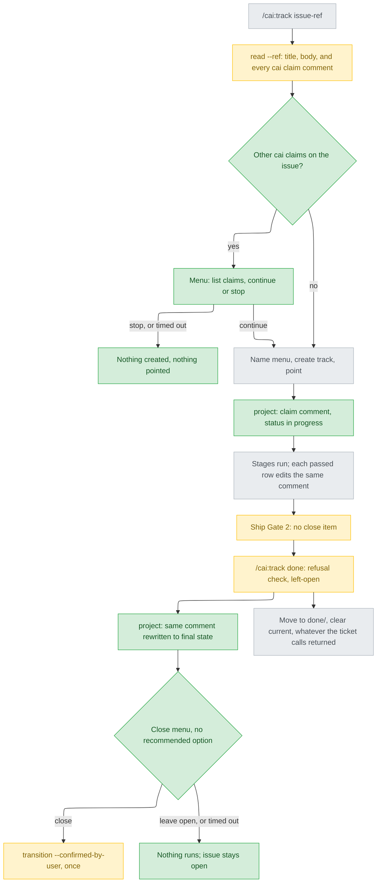

# Track issue status sync — stance

## Status

approved 2026-09-26

## Optimises for

A second cai session running `/cai:track <issue>` learns, before it names a track, that another cai track already claims that issue and which one; and the issue closes only on a person's yes at `/cai:track done`, after the work has landed, not at ship's `gh pr create` (`stage-ship.md:146`). This is approach A, chosen by the person at intake (`intake.md:4-6`, `options-intake-q1.md:40-47`).

## Sacrifices

- The claim is a notice, not a lock. Two sessions whose `read --ref` both run before either posts its claim both see nothing and both proceed; the window runs from the read, through the name menu, to the first `project` after `point` (`ticket-mirror.md:22-49`).
- Only cai-marked comments count (AC2). Someone working the issue without a `[cai track: <name>]` marker (`ticket.py:112-117`) is not listed.
- The claim is public from `point` on, before intake is approved. A track abandoned before `done` leaves a comment reading "in progress"; cai never withdraws it, and its `updated` line is the only staleness signal.
- Nothing closes the issue unless `/cai:track done` runs, and ship's Gate 2 no longer offers it: a person who merges at ship and never runs `done` keeps an open issue — the condition the person accepted with A (`options-intake-q1.md:47`, `:109`). Unfinished tracks count toward the five-track cap (`SKILL.md:36-39`), so `done` is not skippable for long.
- `/cai:track done` stops being local-only: with mirroring on and a pointer, it makes backend calls and asks one more menu.

## Invariants

**This system's:**

- I1 — One close point. A ticket is closed only by `ticket.py transition --confirmed-by-user`, run once, after a yes to the close menu of `/cai:track done`, asked by the main session. Ship's Gate 2 carries no close item, and closing is no longer one of ship's irreversible operations. This supersedes DD8 (`docs/design/2026-08-31-ticket-integration-detail.md:147-149`), AC17's "close ticket 併入後者" (`docs/design/2026-08-30-ticket-integration-intake.md:161`) and `ticket-mirror.md:103-117`; those records are not edited. Every shipped sentence and test that names ship as the close point is rewritten in the same change: `stage-ship.md:7-12` with its Codex override (`scripts/codex-overrides.json:185-205`), `approval-gates.md:136-147` and `:199`, `ticket.py:359-383`, and `tests/test_ship_ticket_gate.py:159-185`, which then pins the new single origin.
- I2 — The close menu is not a third gate. It is asked only once `done`'s refusal check has passed — every row `done` or `skipped` (`SKILL.md:131-132`) — so the track has already finished, and its answer writes nothing to `state.md` or the ledger. It is listed with the other stops (`approval-gates.md:149-152`), not under "Human gates" (`SKILL.md:90-97`). It carries no `(recommended)` (AC4): the gates' carve-out (`approval-gates.md:89-97`) widens by exactly this one stop, because it authorises the one irreversible call this feature makes (`ticket.py:360-362`). Timed out: nothing runs.
- I3 — The claim is the mirror comment. One `project` runs right after `point`, before intake is dispatched (AC1); the status line is the only new line, and every later projection, `done`'s included, edits that same comment in place (`ticket_backend.py:258-267`). No track ever owns a second marked comment.
- I4 — The check precedes any directory. `read --ref` lists every comment on the issue carrying a `[cai track: <name>]` marker, whoever wrote it — track name, author login, last updated — and the main session asks continue or stop before the name menu (AC2). Stop, or a timed-out menu, creates and points nothing. A check that could not run says so and never reads as "no claims".
- I5 — A new track never takes a name a listed claim already carries. Matching is marker plus author (`ticket_backend.py:258-260`) and names are proposed from the title (`ticket-mirror.md:27-29`), so two sessions under one login would otherwise both propose that name, and the second's projection would edit the first's claim in place.
- I6 — `done` is never held up by the ticket. Its refusal (`SKILL.md:131-132`) fires before any ticket call; a projection or close that fails prints its one line, and `done` still moves the directory and clears `current` (AC5).
- I7 — The final comment says nothing `state.md` and `track_state.py left-open` do not already hold: no artifact path (`ticket.py:132-134`), no raw stderr.

**Cross-project:**

- Mirroring off prints and calls nothing (`ticket.py:202-203`, `ticket-mirror.md:11-13`); ticket failures land in `ticket.json`, never in the ledger or the retry cap (DD2, `docs/design/2026-08-31-ticket-integration-detail.md:117-128`); every `ticket.py` subcommand exits 0 (DD4, `:132-134`).
- Raw backend stderr never reaches `--note` or any file (DD6, `:138-142`; `ticket-mirror.md:119-128`).
- Exactly two human gates (`SKILL.md:92-97`, `pending-questions.md:81-83`).
- Only the main session asks (`pending-questions.md:8-11`); a timed-out menu grants nothing (`approval-gates.md:193-199`, `docs/design/2026-09-25-question-timeout-stance.md:24`).
- A second backend costs `skills/track/` zero lines (`ticket_backend.py:322-328`): whatever the check reads goes through the `Backend` interface, and `StubBackend` answers it.
- `SKILL.md`'s body is capped at 130 lines (`scripts/validate.py:2134`) and stands at 128, so `done`'s ticket steps route to `ticket-mirror.md` the way `SKILL.md:88` already does.
- `workflow.md:20-21`; `CLAUDE.md:44` (Theirs assumes no repo layout), `:36` (regenerate `plugins/cai-codex/`), `:85` and `:109` (validate.py, pytest), `:96` (provenance ledger), `:140` and `:145` (ASCII `.cmd`, no BOM).

## Rejected stances

- B, mirror only: claim comment and final projection, close left at Gate 2 (`options-intake-q1.md:49-56`). Keeps DD8, but `read` never sees comments (`ticket_backend.py:226`), so a second session still sees nothing, and the issue still closes before merge. The person chose A.
- C, GitHub-native assignee and label, `Closes #N` in the PR (`options-intake-q1.md:58-65`). Closes exactly at merge, but sessions sharing a login look identical, the close needs no person's yes, and the check is tied to one backend. The person chose A.
- A lock: refuse `/cai:track <ref>` while any claim exists. Would close the menu window too, but a claim abandoned before `done` would block the issue until someone deletes a comment by hand; AC2 leaves that judgement to the person.
- Close at both Gate 2 and `done`. A's approved text moves the close point rather than adding one (`options-intake-q1.md:42`), and two origins undo the single, reviewable one `transition` exists to keep (`ticket.py:366-372`).

## Use cases / Issues

- R1 — From `point` to the end of intake the issue carries no comment (`ticket-mirror.md:77-81`). Fixed when, after `point` and before intake's dispatch, the issue carries the marked comment with a status line (AC1).
- R2 — `read --ref` fetches `number,title,body` only (`ticket_backend.py:226`), so an existing claim is invisible at start-up. Fixed when a second `/cai:track <ref>` lists the claim before the name menu and asks continue or stop (AC2).
- R3 — `/cai:track done` does nothing to the ticket (`SKILL.md:128-132`), so the comment stops at the last stage row. Fixed when `done` rewrites that comment to its final state with the left-open items (AC3).
- R4 — The ticket closes at Gate 2 after `gh pr create`, before merge (`stage-ship.md:146`, `ticket-mirror.md:103-108`), and never after "Stop". Fixed when only `done`'s menu offers the close and only its yes runs `transition` (AC4).
- UC1 — Mirroring off: `/cai:track <ref>` and `done` print and call nothing new (AC5). A track with no pointer is never offered a close.
- UC2 — A backend failure at the claim, the check or `done`: one printed line; intake still dispatches, `done` still completes, nothing reaches the ledger (AC5).
- UC3 — `plugins/cai-codex/` regenerated; `validate.py` and `pytest` pass (AC6).

## Overview

Read it top to bottom: green is new — the claim check before any directory exists, the claim posted before intake, and the final rewrite plus close menu at `done`. Amber marks the two moves: the close leaves Gate 2 and `transition` is now reached only from `done`.

## Out of scope

- The status line's wording, whether it names the login, how the final state is marked, and the backend call shape — Decisions and Detail (`intake.md:101`).
- Withdrawing a claim for an abandoned track; no subcommand abandons a track.
- A claim check on resume (`/cai:track <name>`) or on re-running `point` for an existing track.
- Ship's comment confirmation (`ticket-mirror.md:101-102`) and number resolution (`:87-94`), unchanged.
- Cross-repo tickets, still unsupported (`ticket_backend.py:239-242`).
- Whether `discover` runs for this track — the track's call (`intake.md:102-103`).
