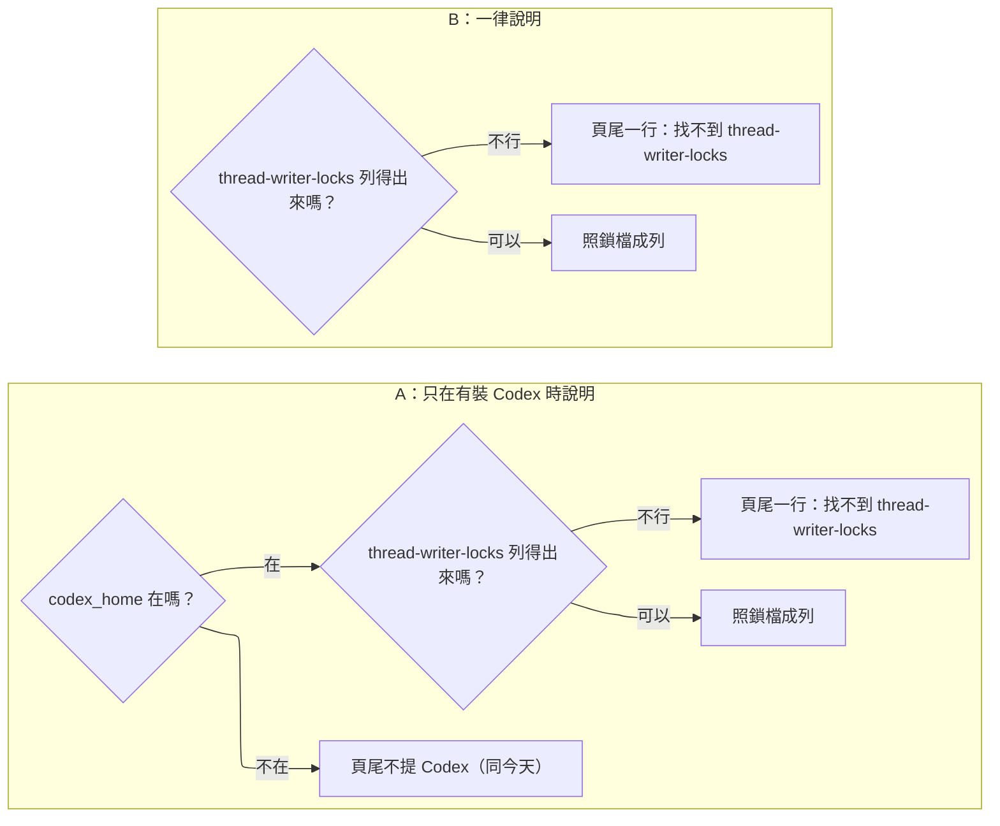

# viewer-live-status — decisions

## Reference

- Stance: `docs/design/2026-09-26-viewer-live-status-stance.md` — status: approved 2026-09-26（V8、V9、UC3、UC4、R2、R3 的出處）
- Diagnosis（問題 1）：`docs/design/2026-09-26-viewer-live-status-diagnosis.md` — status: approved 2026-09-26。它的 `## Fix` 已簽，這裡不重排，只收它留下沒定的：頁尾那一行怎麼帶到頁面、鎖檔檔名怎麼認、目錄讀不了怎麼辦、退回路徑的範圍。
- 其他輸入：`.claude/track/viewer-live-status-fixes/intake.md`（AC1–AC8）與它引用的選項檔；被修正、不改動的舊設計 `docs/design/2026-09-25-agent-viewer-web-portal-{stance,decisions,detail}.md`。
- 程式行號都是 main d514f6b 的 `plugins/cai/scripts/viewer.py`；`viewer.py` 自 #162（8ce3dd8）起沒有再變，簽核文件用的 41cb6e1 行號照樣成立（`git log -- plugins/cai/scripts/viewer.py` 最新一筆是 8ce3dd8）。

用詞（第一次出現的英文詞）：派出（launch，Agent 或 Workflow 工具回「已在背景啟動」的那一筆結果）；結束通知（task notification，transcript 裡 `queue-operation` 帶 `<task-notification>` 的一行）；一輪結束紀錄（`turn_duration`，`type: system`、`subtype: turn_duration` 的那一行）；待完成計數（它上面的 `pendingBackgroundAgentCount`、`pendingWorkflowCount`）；簿記列（bookkeeping row，Claude Code 在兩輪之間自己寫的 `last-prompt`、`mode`、`permission-mode`、`atis-latch`、`pr-link`、`cost-state` 這類紀錄，不是對話內容）；接續（resume，用 SendMessage 讓已結束的子代理再做一輪）；檔尾（tail，viewer 讀的 transcript 最後 262144 位元組）；快照（snapshot，viewer 每次輪詢組出的 JSON）；鎖檔（lock file，`<codex_home>/thread-writer-locks/<thread-id>.lock`）；codex_home（`CODEX_HOME` 或 `~/.codex`）；launcher（使用者下 `/cai:viewer` 時跑的那一段，找到或啟動背景 server）。

證據說明：引用 `~/.claude/projects/…/*.jsonl:<行>` 的是本機 transcript，不在 repo 裡。「掃描」指 2026-09-26 以唯讀腳本掃過 `~/.claude/projects/*/*.jsonl` 全部 187 個檔，只數列的種類、鍵名與 `<status>` 這類標籤，不讀也不抄對話內容；數字照腳本輸出。

## Feasibility

| Id | Capability | Verdict | Evidence |
|---|---|---|---|
| C1 | 認出一次背景派出：`toolUseResult.status == "async_launched"`，id 在 `agentId`（Agent）或 `taskId`（Workflow） | verified | `~/.claude/projects/D--project-claude-all-in-one/a8af33f2-a42d-4e02-b0d5-10d322d5ac2b.jsonl:100-101`；#162 的讀法 `plugins/cai/scripts/viewer.py:1437-1442`。掃描：801 次 `async_launched`，Agent 783 次都另帶 `isAsync: true`，Workflow 18 次都沒有 `isAsync` |
| C2 | AC5 字面的 `run_in_background: true` 認不出派出 | verified | Agent 呼叫常常沒有這個參數（`~/.claude/projects/D--project-day-trading-monarch-3/402ed4d7-e8c2-4eee-afec-1b47cdf054ec.jsonl:1043`）；有的時候值是字串 `"true"`（`a8af33f2-a42d-4e02-b0d5-10d322d5ac2b.jsonl:100`）；布林值 `true` 只出現在 Bash 呼叫（同檔 `:146`） |
| C3 | 結束通知帶 `<task-id>` 與 `<status>`；每一則指向派出的通知，`<status>` 都是 `completed`、`failed`、`killed`、`stopped` 之一 | verified | `a8af33f2-a42d-4e02-b0d5-10d322d5ac2b.jsonl:108`；`stopped`：`~/.claude/projects/D--project-claude-all-in-one-2-claude-all-in-one/81ee4381-89f2-4ef0-ad00-61b615799747.jsonl:1155`；`killed`：`~/.claude/projects/D--project-day-trading-monarch-4/2a72e8e3-38c2-4ffe-89f0-5fad3ad85779.jsonl:1486`。掃描：801 次派出之後第一則同 id 通知為 completed 787、failed 6、killed 2、stopped 1，另 5 次還沒有通知；32 則沒有 `<status>` 的通知沒有一則指向派出。#162 收到任何通知就算結束（`plugins/cai/scripts/viewer.py:1422-1427`） |
| C4 | SendMessage 接續：結果只有 `resumedAgentId`，沒有派出紀錄；之後同一 id 再來一則通知 | verified | `402ed4d7-e8c2-4eee-afec-1b47cdf054ec.jsonl:1131-1132`、`:1160`；接續後一輪結束的計數是 1（`~/.claude/projects/D--project-claude-all-in-one/2162ccb5-c60c-447a-9112-ce3620300e7b.jsonl:231`、`:241-242`） |
| C5 | 待完成計數只見過兩個鍵，而且只在大於 0 時出現 | verified | `2162ccb5-c60c-447a-9112-ce3620300e7b.jsonl:241`；#162 的萬用比對 `plugins/cai/scripts/viewer.py:1474-1480`。掃描：2397 筆一輪結束，`pendingBackgroundAgentCount` 出現 1010 筆、`pendingWorkflowCount` 20 筆，每一筆的值都大於 0，沒有第三種鍵 |
| C6 | 一輪結束之後會接著寫什麼 | verified | 掃描，1030 筆計數大於 0 的一輪結束：後面還有下一筆一輪結束的 1025 筆，每一筆中間都先有一個 `user` 列（新的一輪）；111 筆後面第一個緊接的是簿記列，其中 65 筆之後等到的第一個對話事件是結束通知，也就是背景子代理那時還在跑（例：`~/.claude/projects/D--project-day-trading-monarch/5672bbdb-faca-4cd4-946f-d8c68405dae4.jsonl:832-837`，一輪結束、四列簿記、才是通知）。`system/away_summary` 只跟在計數為 0 的一輪結束後面（292 筆，約 184 秒後），計數大於 0 的後面 0 筆。主 transcript 裡沒有 `isSidechain: true` 的 `user`／`assistant` 列（92774 列全是主線） |
| C7 | 登記檔：`idle` 是一輪做完在等使用者；背景子代理在跑時一直是 `busy` | verified | `.claude/track/done/agent-viewer-web-portal/discover-evidence.md:11`；`.claude/track/viewer-live-status-fixes/probe/registry-bg.jsonl:3` |
| C8 | 檔尾 262144 位元組裝不下派出紀錄的比例 | verified | 檔尾大小 `plugins/cai/scripts/viewer.py:1236`、`:1632`。掃描：796 次有通知的派出，從派出那一列到通知寫下時檔尾的距離中位數 45001、p90 159428 位元組；40 次（5.0%）超過 262144，也就是子代理還在跑時派出紀錄已被擠出檔尾 |
| C9 | 列 `thread-writer-locks` 的檔名就得到開著的對話串 id；id 是 36 字元；目錄裡另有點開頭的 `.coordination.lock` 與還沒送訊息時的暫時 id | verified | `docs/design/2026-09-26-viewer-live-status-diagnosis.md:5`、`:38`、`:53`；`.claude/track/viewer-live-status-fixes/probe/findings.md:7-9`（Codex 0.157.1、Windows 實機） |
| C10 | `os.listdir` 只回名稱、不含 `.` 與 `..`；目錄不在、不是目錄、沒權限都拋 `OSError` 的子類 | verified | https://docs.python.org/3/library/os.html#os.listdir 「Return a list containing the names of the entries in the directory given by path.」；https://docs.python.org/3/library/os.html 「All functions in this module raise OSError (or subclasses thereof) in the case of invalid or inaccessible file names and paths」；https://docs.python.org/3/library/exceptions.html 「The following exceptions are subclasses of OSError」（FileNotFoundError、NotADirectoryError、PermissionError） |
| C11 | 頁面今天不顯示快照的 `problems`；頁尾是寫死的文字；`problems` 裡是路徑與錯誤原文 | verified | 頁尾 `plugins/cai/scripts/viewer.py:640-647`；`poll()` 只取 `rows` 與 `generatedAt`（`:998-1016`）；`problems` 的內容 `:1571`、`:1575`、`:2028`、`:2040`、`:2094` |
| C12 | codex_home 的決定方式；沒裝 Codex 的人今天看不到任何 Codex 字樣 | verified | `plugins/cai/scripts/viewer.py:2209-2211`；行程數 0 時 `codex_rows` 直接回空（`:2080-2081`），頁尾沒有 Codex 的字（`:640-647`） |
| C13 | 頁面怎麼處理狀態：六個狀態值有測試釘住；排序、「需要你」、閃燈都看 `META`；標籤可由次要欄位換（「等你簽核」）；頂端「執行中」計數看 `state`；只有 `HUMAN_STATES` 會響 | verified | `tests/test_viewer_page.py:103-110`；`plugins/cai/scripts/viewer.py:655-662`、`:729-732`、`:815-818`、`:894`、`:954`、`:976-996` |
| C14 | launcher 看到已在跑、`/identity` 回 `format` 1 的 server 就沿用它，不換成新版程式 | verified | `plugins/cai/scripts/viewer.py:2436-2451`、`:1149` |
| C15 | Codex 兩條讀取路徑今天的形狀：主路徑取最近 50 筆再照名額挑；退回路徑掃 24 小時內最多 200 個 rollout，id 取檔名最後 36 字元 | verified | `plugins/cai/scripts/viewer.py:1966-1974`、`:1990-2005`；`:1664-1665`、`:2020-2034`、`:2046-2049` |

## Ruled out

| Option | Invariant it violates | Evidence |
|---|---|---|
| 照 #162 以 `pending*Count` 萬用比對任何計數（`plugins/cai/scripts/viewer.py:1478-1480`） | V8「有沒有背景子代理（含 Workflow）在跑……背景 shell 不算」（`docs/design/2026-09-26-viewer-live-status-stance.md:29`）：將來多一個背景 shell 或其他種類的計數，萬用比對會照單全收 | C5 |
| 照 main 在 `idle` 時直接判做完、不檢查（`plugins/cai/scripts/viewer.py:1524-1527`） | V8：`idle` 也要做這道檢查（`stance.md:29`） | C7 |
| 照 #162 收到任何 `<task-notification>` 就算那次派出結束，不看 `<status>`（`plugins/cai/scripts/viewer.py:1424-1426`） | V8：結束通知是 completed、failed、killed、stopped 之一（`stance.md:29`）；其他 status 不算結束 | C3 |
| 以登記檔 `status` 判斷有沒有背景工作 | V8：登記檔只決定要不要檢查（`stance.md:29`）；背景在跑時它一直是 `busy` | C7 |
| 背景時照 #162 顯示「執行中 · 確定」 | V8：「執行中（背景）」、確定度「推斷」（`stance.md:29`） | C13 |
| 數 `codex.exe`、看 rollout 修改時間、或開啟鎖檔來決定 Codex 列 | V9：只看鎖檔目錄裡的檔名（`stance.md:30`） | C9 |
| 鎖檔目錄不在時退回數行程 | V9（`stance.md:30`）；使用者否決（`.claude/track/viewer-live-status-fixes/options-intake-nolock.md:23-29`） | C9 |

## Requirement gaps

本輪沒有。會影響使用者怎麼用的取捨——背景 shell 算不算、沒有鎖檔目錄怎麼辦、約一分鐘的延遲、字樣與確定度、沒裝 Codex 的頁尾——都已由使用者以選單決定（`intake.md:17-23`、`:46`；`options-design-bglabel.md`、`options-design-footer.md`），下面各條的失敗條件都是技術事實。

## Tier 1

### design-footer — 根本沒裝 Codex（連 codex_home 都沒有）的人，頁尾也要顯示「找不到 thread-writer-locks」那一行嗎？

| Option | Rests on | What it costs | Fails when |
|---|---|---|---|
| A — 只在 codex_home 存在、鎖檔目錄列不出來時顯示 (recommended) | C12 | 一個目錄判斷、一個測試 | 有人把 `CODEX_HOME` 指到不存在的地方，卻期待被提醒 |
| B — 列不出鎖檔目錄就顯示，不管有沒有裝 Codex | C12 | 零 | 每個只用 Claude Code 的人頁尾都多一行 Codex 的字 |

- **Blast radius:** 快照組裝與頁面頁尾，同一支 `viewer.py` 的兩處。
- **Found out when:** 只用 Claude Code 的人打開頁面時——發版後。
- **Undo cost:** 改一個條件；使用者看到的頁尾會變。
- **Decided:** A — 使用者 2026-09-26 以選單選「只在有裝 Codex 時說明 (Recommended)」（`.claude/track/viewer-live-status-fixes/options-design-footer.md`；diagnosis 的 `## Fix` 已記，`docs/design/2026-09-26-viewer-live-status-diagnosis.md:56`）。

## Tier 2

### D2 — V8 的「檔尾那筆一輪結束」指哪一筆？

選：檔尾裡最後一筆一輪結束紀錄，只要它後面沒有 `user`／`assistant` 列、也沒有結束通知（C3 的四種 status）；簿記列不算數。`busy` 的閘門「檔尾最後是一輪結束」照同一讀法：最後一個對話事件是一輪結束。不選「`tail[-1]` 本身」：111／1030 筆計數大於 0 的一輪結束後面先來簿記列，其中 65 筆子代理還在跑（C6），那段時間 `busy` 會退回 #162 的「執行中 · 確定」（使用者否決的樣子，`.claude/track/viewer-live-status-fixes/options-design-bglabel.md:23-29`），`idle` 會漏掉計數而判成做完；不選「檔尾裡任何一筆一輪結束」：結束通知一到，主 session 就開新的一輪（1025／1025，C6），舊計數已過時，`busy` 時會把正在做事的主 session 標成背景。比起字面讀法，這個讀法只會讓更多列判成背景（`busy` 的「執行中 · 確定」、`idle` 的「完成」），而且只在那筆一輪結束之後還沒有任何對話事件時；過時 busy 規則照舊只看 `tail[-1]`（`stance.md` Out of scope 第二條，`plugins/cai/scripts/viewer.py:1540-1543`）。若你把 V8 讀成字面上的最後一列，這一條等於改 V8，Gate 1 請說，會回 stance。**Found out when:** 簿記列只在實機出現——發版後，或 AC8 實機剛好碰到。

### D3 — AC5 寫的 `run_in_background: true` 認不出派出，改用什麼？

選：`toolUseResult.status == "async_launched"`，id 取 `agentId` 或 `taskId`，照 #162 現有讀法（`plugins/cai/scripts/viewer.py:1437-1442`，C1）。AC5 字面的參數多半不存在或是字串，照字面一次也對不到（C2）；`isAsync` 也不行，Workflow 的派出沒有它（C1）。行為與 AC5 相同、只換辨認的欄位，Gate 1 要讓使用者看到這一條。**Found out when:** fixture 測試，下一次測試；Claude Code 改欄位要到發版後，那時退回 fa1a0e0 的行為（`stance.md:22`）。

### D4 — AC6「派出紀錄落在檔尾之外照舊判做完」改成什麼？

選：照 V8 的兩個訊號並用，派出紀錄在檔尾之外、但一輪結束的計數大於 0 時，仍顯示「執行中（背景）」，只是列不出名稱（`stance.md:21`）；計數也說 0 時才判做完。配對只看這一列本來就讀的 262144 位元組，不另讀整份 transcript（`plugins/cai/scripts/viewer.py:1236`、`:1632`）。這是 AC6 字面行為的改變，約 5.0% 的背景子代理會碰到名稱消失（C8），寫進 detail 的已知限制；Gate 1 要讓使用者看到。**Found out when:** 發版後，那 5.0% 被使用者看到。

### D5 — 「找不到 thread-writer-locks」那一行怎麼從快照帶到頁面？

選：快照頂層多一個布林欄位，頁尾多一行寫死的字、平時隱藏，由 `poll()` 依欄位切換；不改成「頁尾顯示 `problems`」。`problems` 裡是路徑與錯誤原文、今天沒顯示（C11），顯示它是沒人要的新功能；舊 detail 曾寫「頁尾顯示有 N 個來源讀不了」卻沒做（`docs/design/2026-09-25-agent-viewer-web-portal-detail.md:526`），仍不在本 track，寫在這裡讓它不被默默丟掉。**Found out when:** 頁面靜態測試，下一次測試；那一行真正出現要在沒有鎖檔目錄的機器上，發版後。

### D6 — 鎖檔目錄存在卻列不出來（權限等）怎麼辦？

選：任何 `OSError` 都當成列不出來，不出 Codex 列；codex_home 存在就顯示頁尾那一行（C10、C12）。不另寫 `problems`：頁面不顯示它（C11），寫了也沒人看到；不拋出去：`Poller.run()` 會把整份快照換成上一份（`plugins/cai/scripts/viewer.py:2337-2343`），連 Claude 列都停住。字樣說「找不到」而實際是讀不了，但「無法判斷哪個 session 開著」仍是真的。**Found out when:** 發版後，某台機器的權限設定特殊時。

### D7 — 退回路徑（sqlite 讀不了時）要找多遠的 rollout？

選：照舊只看 24 小時內修改過的 rollout、最多 200 個，但先以檔名最後 36 字元對鎖檔集合篩、再取 200 個（`plugins/cai/scripts/viewer.py:1664-1665`、`:2020-2034`、`:2046-2049`，C15）；不改成每個鎖檔 id 各做一次遞迴搜尋、不限時間。後者每 2 秒一次全樹掃描，只為 sqlite 壞掉又接續超過一天沒動的舊對話串、而且還沒送第一則訊息的那一段。**Found out when:** 發版後，sqlite 壞掉時才走得到。

### D8 — 更新 plugin 後舊的 viewer server 還在跑，要不要逼它換新？

選：`/identity` 的 `format` 維持 1，改在 PR 說明寫「更新後先 `/cai:viewer stop` 再 `/cai:viewer`」。`format` 是 launcher 與 server 之間的協定版本，這次 `/identity`、`/shutdown`、狀態檔都沒變（C14）；拿它逼重啟，Claude 與 Codex 兩個 plugin 沒同時更新時，舊的那邊 launcher 只會印一行「a different viewer version is running」、不起新的（`plugins/cai/scripts/viewer.py:2440-2444`）。**Found out when:** 發版後，使用者更新了卻沒 stop，看到的還是舊行為。

## Tier 3

| Decision | Chose | Instead of | Found out when |
|---|---|---|---|
| 「執行中（背景）」在快照怎麼表示 | `state` 仍是 `working`、`certainty` 是 `inferred`，列多一個布林欄位 `background`；頁面 `stateLabel` 看它換字樣。沿用「等你簽核」靠次要欄位換標籤（`plugins/cai/scripts/viewer.py:729-732`），排序、頂端「執行中」計數、不閃不響都自動成立（C13） | 第七個狀態值：要改釘住六個狀態的測試、`META`、頂端計數、`mode` 各一處 | 頁面與分類的 fixture 測試 |
| `background` 放哪些列 | `classify_claude` 的回傳一律帶（預設 `False`，照它「一律帶 question／permission／current」的慣例，`plugins/cai/scripts/viewer.py:1484-1490`）；Codex 列不帶，頁面把沒有當成 `false` | 每種列都補這個鍵 | fixture 測試 |
| `entryId` | `working:<statusUpdatedAt>`，與一般 `working` 同形；轉成 `done:<…>` 時照原規則響（C13） | `background:<…>` | fixture 測試 |
| 列上的計時 | 照 `working` 顯示「本輪 mm:ss」，起點是 `statusUpdatedAt`（`plugins/cai/scripts/viewer.py:818`、`:917`） | 新字樣「背景 mm:ss」：沒人選過的新文字 | verify 實看 |
| 「目前」那一格 | 照 #162：最新一個還在跑的背景派出（`plugins/cai/scripts/viewer.py:1549-1560`）；配對找不到就空著 | 另寫一行說明 | fixture 測試 |
| 配對找不到名稱時（接續、派出在檔尾外） | `subagents` 空清單、`current` 為 `None`，字樣照樣是「執行中（背景）」（`stance.md:21` 已接受，C4、C8） | 用計數猜名稱或顯示「N 個背景 agent」 | fixture 測試 |
| 待完成計數認哪些鍵 | 只認 `pendingBackgroundAgentCount`、`pendingWorkflowCount`（C5；萬用比對見 Ruled out） | 萬用比對 | fixture 測試 |
| `<status>` 的解析 | 照 #162 用 `str.partition` 取 `<task-id>`、`<status>`，status 在四種之內才算結束（C3） | 正規式 | fixture 測試 |
| 登記檔是 `shell` | 照舊判做完並加註，不做這道檢查（`stance.md` Out of scope 第一條） | 也檢查 | 既有測試 `tests/test_viewer_claude.py:206-210` |
| 哪些檔名算對話串 | 結尾 `.lock`、不以點開頭、去掉 `.lock` 後剛好 36 字元（C9） | 任何 `*.lock` | fixture 測試 |
| 鎖檔清單在哪裡讀 | `build_snapshot` 讀一次，交給 `codex_rows`，取代今天傳的兩個行程數（`plugins/cai/scripts/viewer.py:2257-2260`）；同一個值決定頁尾欄位 | `codex_rows` 自己讀，再多回傳一個旗標 | fixture 測試 |
| 主路徑的查詢 | `threads` 加 `id IN (<鎖檔 id>)`，其餘條件照舊，拿掉 `LIMIT 50` 與 `source` 欄（C15） | 照舊取最近 50 筆再篩：接續排在 50 筆之外的舊對話串會漏列 | fixture 測試 |
| 鎖檔清單是空的 | `codex_rows` 直接回空，不開 sqlite | 照樣查一次 | fixture 測試 |
| 頁尾欄位與元素的名字 | 快照鍵 `codexLockDirMissing`（照 `generatedAt` 的駝峰，`plugins/cai/scripts/viewer.py:2277`）；頁尾元素 id `codexLockNote`（照 `offlineNote`、`staleNote`，`:610`）；`EMPTY_SNAPSHOT` 不改，頁面把沒有這個鍵當成 `false` | 字串清單欄位 | 頁面靜態測試 |
| 那一行在頁尾的位置與樣式 | 頁尾第一行，沿用頁尾本身的灰字（`plugins/cai/scripts/viewer.py:584`） | 像「資料停在…」一樣的警示色（`:467`） | verify 實看 |
| 沒有呼叫者的程式 | 照 diagnosis 的 Blast radius 移除（`docs/design/2026-09-26-viewer-live-status-diagnosis.md:44`，`plugins/cai/rules/coding.md:20`），連同只測它們的測試 | 留著不呼叫 | pytest |
| 版本 | ship 時對當時的 main 取號：cai 高於 main 的 `plugins/cai/.claude-plugin/plugin.json`（d514f6b 是 1.34.2），Codex 樹 `--release` 高於 `plugins/cai-codex/.codex-plugin/plugin.json`（0.2.20）；本 track 期間 main 已前進兩次 | 現在就寫死號碼 | `python scripts/validate.py` |
