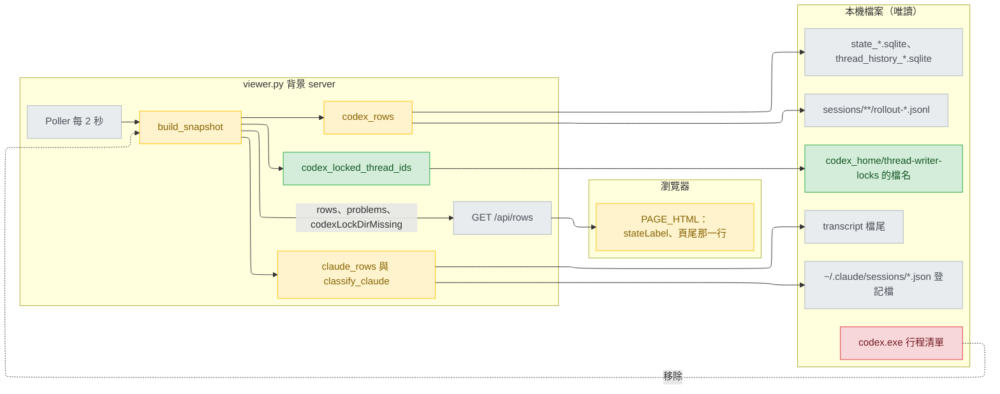
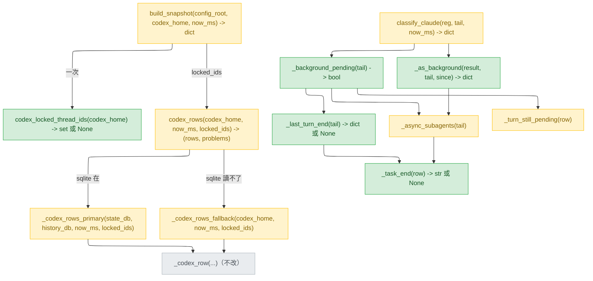
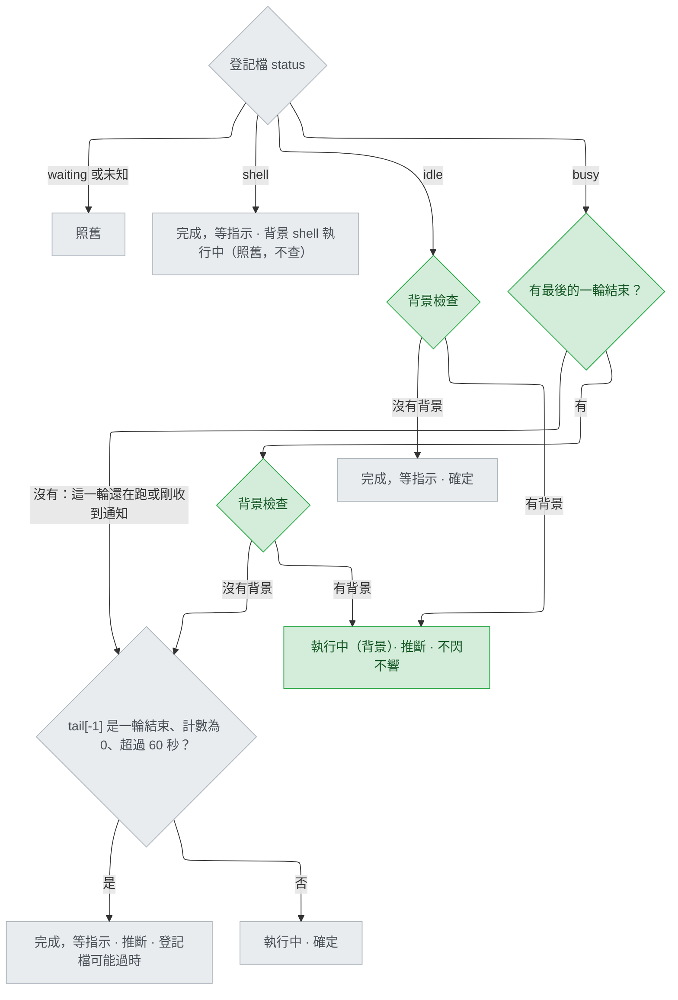
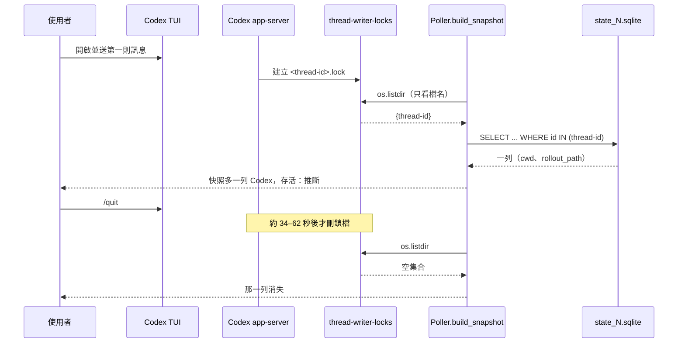
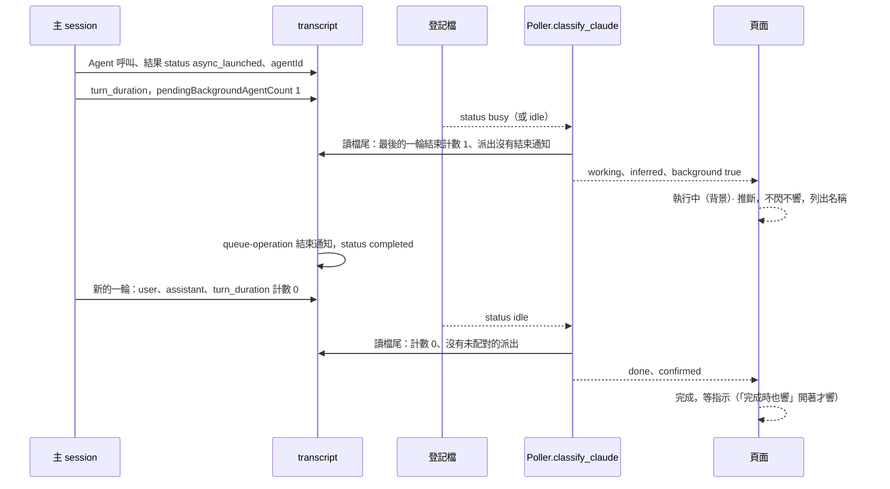

# viewer-live-status — detail design

## Reference

Stance doc: docs/design/2026-09-26-viewer-live-status-stance.md
Diagnosis doc: docs/design/2026-09-26-viewer-live-status-diagnosis.md
Decisions doc: docs/design/2026-09-26-viewer-live-status-decisions.md
Status: approved 2026-09-26（stance 與 diagnosis；decisions 的 Tier 1 只有 design-footer 一條，已由使用者 2026-09-26 回答）

被修正、不改動的舊設計：docs/design/2026-09-25-agent-viewer-web-portal-stance.md、docs/design/2026-09-25-agent-viewer-web-portal-decisions.md、docs/design/2026-09-25-agent-viewer-web-portal-detail.md。本文件取代其中這幾段：decisions 的 D6（`2026-09-25-agent-viewer-web-portal-decisions.md:196-198`）與 Tier 3「`idle`、`shell`、過時的 `busy`」一列（`:225`）；detail 的 `### liveness`（`2026-09-25-agent-viewer-web-portal-detail.md:485-497`）、claude_source 的第 3 條規則（`:518`）、codex_source 的 Interface 與存活（`:533`、`:535`）、Budgets 的 50 筆（`:89`）、Failure modes 兩列（`:711-712`）、Verification 兩列（`:747`、`:749`）、Work breakdown 的 unit 3（`:769`）。舊檔照 diagnosis 的決定不改（`docs/design/2026-09-26-viewer-live-status-diagnosis.md:48`）。

程式行號都是 main d514f6b 的檔案；`plugins/cai/scripts/viewer.py` 自 #162（8ce3dd8）起沒有再變。

用詞（第一次出現的英文詞）：背景子代理（background agent，主 session 派出後不等它做完就結束這一輪的助手，Workflow 同樣算）；派出（launch，工具結果 `toolUseResult.status` 是 `async_launched` 的那一列）；結束通知（task notification，`queue-operation` 列帶 `<task-notification>`，其 `<status>` 是 completed、failed、killed、stopped 之一）；一輪結束紀錄（`turn_duration` 列）；待完成計數（它上面的 `pendingBackgroundAgentCount`、`pendingWorkflowCount`）；簿記列（bookkeeping row，Claude Code 在兩輪之間自己寫的 `last-prompt`、`mode`、`pr-link`、`cost-state` 這類紀錄）；配對（pairing，派出找到它的結束通知）；登記檔（registry，`~/.claude/sessions/<pid>.json`）；檔尾（tail，transcript 或 rollout 最後 262144 位元組）；快照（snapshot，viewer 每 2 秒組出的 JSON）；鎖檔（lock file，Codex 的 `<codex_home>/thread-writer-locks/<thread-id>.lock`）；對話串（thread，Codex 的一段對話）；主路徑／退回路徑（primary／fallback，Codex 讀 sqlite 的一條，與 sqlite 讀不了時掃 rollout 的一條）；合成測試資料（fixture）。

### Traceability

| From the high-level design | Satisfied by | Status |
|---|---|---|
| UC3（Codex 列 TUI 關掉後約一分鐘內消失、一律推斷；Claude 列照舊） | `### codex_locked_thread_ids`、`### codex_rows`（只列有鎖檔的對話串、`aliveCertainty` 一律 `inferred`）；Verification 的 AC1–AC4 列與 AC8 實機 | covered |
| UC4（只剩背景工作時顯示「執行中（背景）」、推斷、不閃不響、列名稱） | `### classify_claude 與背景檢查`、`### page` 的 `stateLabel`；Verification 的 AC5、AC6 列與 AC8 實機 | covered |
| R2（Codex 假列、列錯專案） | diagnosis 的三個失敗測試，列在 Verification 最前；`### codex_rows` 不再數行程、不再照名額挑 | covered |
| R3（背景子代理在跑時被顯示成「完成，等指示」） | `### classify_claude 與背景檢查`：`idle` 也檢查（main 不查，`plugins/cai/scripts/viewer.py:1524-1527`），字樣與確定度照 V8 | covered |
| diagnosis 的 Failing test（三個） | Verification 第 1–3 列，build 的第一件事 | covered |

## Requirement

Agent Viewer 的兩個錯：（1）Codex 列以行程數推名單，會列出沒開的、別的專案的對話串（diagnosis）；（2）主 session 派出背景子代理後結束這一輪，那一行被判成「完成，等指示」，或照 #162 顯示成和「這一輪還在跑」一樣的「執行中 · 確定」（stance UC4、R3）。給同時開好幾個 Claude Code 與 Codex session 的使用者。怎麼知道做對了：diagnosis 的三個失敗測試轉綠；AC1–AC6 每種情況一個 fixture 測試綠；`python scripts/validate.py` 與 `python -m pytest` 全綠；AC8 實機開關一次 Codex TUI、跑一個背景子代理，看到的和 UC3、UC4 寫的一樣。

## Glossary

| Term | Definition | Where it lives |
|---|---|---|
| 派出 | 背景 Agent 或 Workflow 呼叫的工具結果列，`toolUseResult.status` 是 `async_launched`，id 在 `agentId` 或 `taskId` | plugins/cai/scripts/viewer.py:1437 |
| 配對 | 依檔尾順序，每個派出的 id 找它之後的結束通知；找不到就還在跑 | plugins/cai/scripts/viewer.py:1404 |
| 結束通知 | `queue-operation` 列，`content` 帶 `<task-notification>`、`<task-id>`，且 `<status>` 是四種之一 | new — plugins/cai/scripts/viewer.py（`_task_end`） |
| 一輪結束紀錄 | `type` 為 `system`、`subtype` 為 `turn_duration` 的列 | plugins/cai/scripts/viewer.py:1541 |
| 待完成計數 | 一輪結束紀錄上 `pendingBackgroundAgentCount` 與 `pendingWorkflowCount` 兩個鍵的值 | plugins/cai/scripts/viewer.py:1474 |
| 簿記列 | 不是 `user`、`assistant`、結束通知、一輪結束紀錄的其他列；它們不改變這一輪的結束狀態 | concept |
| 最後的一輪結束 | 檔尾裡最後一筆一輪結束紀錄，且它後面沒有 `user`／`assistant` 列、也沒有結束通知；否則沒有 | new — plugins/cai/scripts/viewer.py（`_last_turn_end`） |
| 背景檢查 | V8 的判斷：最後的一輪結束的待完成計數大於 0，或配對後還有派出在跑 | new — plugins/cai/scripts/viewer.py（`_background_pending`） |
| 執行中（背景） | `state` 為 `working`、`certainty` 為 `inferred`、`background` 為 `true` 的 Claude 列在頁面上的字樣 | new — plugins/cai/scripts/viewer.py（`_as_background`、`stateLabel`） |
| 登記檔 | Claude Code 每個 session 的 `sessions/<pid>.json`，`status` 是 `busy`、`idle`、`waiting`、`shell` 之一 | plugins/cai/scripts/viewer.py:1609 |
| 檔尾 | 讀檔案最後 262144 位元組所得、解析成 dict 的列清單 | plugins/cai/scripts/viewer.py:1173 |
| codex_home | `CODEX_HOME` 環境變數，沒有就是 `~/.codex` | plugins/cai/scripts/viewer.py:2209 |
| 鎖檔 id 集合 | `thread-writer-locks` 裡合格檔名去掉 `.lock` 的集合；目錄列不出來時是 `None` | new — plugins/cai/scripts/viewer.py（`codex_locked_thread_ids`） |
| 主路徑 | 以 `state_*.sqlite` 的 `threads` 與 `thread_history_*.sqlite` 的 `thread_turns` 組 Codex 列 | plugins/cai/scripts/viewer.py:1963 |
| 退回路徑 | sqlite 讀不了時，掃 `sessions/**/rollout-*.jsonl` 組 Codex 列 | plugins/cai/scripts/viewer.py:2018 |
| 快照 | `build_snapshot` 的回傳：`format`、`generatedAt`、`rows`、`problems`，本次加 `codexLockDirMissing` | plugins/cai/scripts/viewer.py:2251 |
| 頁尾那一行 | 頁尾第一行「Codex：找不到 thread-writer-locks，無法判斷哪個 session 開著」，平時隱藏 | new — plugins/cai/scripts/viewer.py（`PAGE_HTML` 的 `#codexLockNote`） |
| 存活確定度 | 列的 `aliveCertainty`，頁面在 `inferred` 時顯示「存活：推斷」 | plugins/cai/scripts/viewer.py:822 |

## Budgets

| What | Number | Where it comes from |
|---|---|---|
| 讀 transcript 檔尾的大小 | 262144 bytes | `plugins/cai/scripts/viewer.py:1236`，不改 |
| 伺服器組快照的間隔 | 2 s | `plugins/cai/scripts/viewer.py:2205`，不改 |
| 頁面輪詢間隔 | 1000 ms | `plugins/cai/scripts/viewer.py:1057`，不改 |
| 過時 busy 規則的門檻 | 60000 ms | `plugins/cai/scripts/viewer.py:1543`，不改（stance Out of scope 第二條） |
| 認得的待完成計數鍵 | 2 | decisions C5 |
| 算結束的 `<status>` | 4 | V8（`docs/design/2026-09-26-viewer-live-status-stance.md:29`） |
| 對話串 id 長度 | 36 characters | decisions C9 |
| 每次組快照列鎖檔目錄 | 1 `os.listdir` | 本設計；不開任何鎖檔（V1、V9） |
| TUI `/quit` 後 Codex 列消失 | 34–62 s（量過一次） | `.claude/track/viewer-live-status-fixes/probe/lock-watch.jsonl:2-3`、`intake.md:46`（00:45:22–00:45:50 之間離開，00:46:24 消失） |
| 退回路徑的 rollout 範圍 | 24 h、200 files | `plugins/cai/scripts/viewer.py:1664-1665`，不改；先以鎖檔 id 篩，再取 200 個 |
| 背景子代理名稱消失（派出被擠出檔尾）的比例 | 5.0 % | decisions C8（40／796） |
| 一輪結束後先來簿記列、子代理還在跑的比例 | 6.3 % | decisions C6（65／1030） |
| 主路徑一次查的對話串數 | 不設上限（原本 `LIMIT 50`），只查鎖檔 id 集合裡的 | `plugins/cai/scripts/viewer.py:1662`、`:1972` |

## Design decisions

- Codex 的存活只看鎖檔檔名（V9、diagnosis 的 Fix）：`build_snapshot` 讀一次鎖檔 id 集合，主路徑以 `id IN (…)` 查、退回路徑以檔名尾的 id 篩；不數行程、不看來源欄、不照名額挑。服務 UC3、R2。
- 鎖檔目錄列不出來（不在、不是目錄、沒權限）一律當成沒有：不出 Codex 列；codex_home 在才在頁尾說明（decisions design-footer、D6）。服務 AC4。
- 頁尾那一行由快照頂層布林欄位 `codexLockDirMissing` 帶過去，字樣寫死在頁面，不顯示 `problems`（decisions D5）。
- Claude 的背景檢查照 V8 兩個訊號並用；「檔尾那筆一輪結束」讀成「最後一個對話事件是一輪結束」，簿記列不擋（decisions D2）。`idle` 一律檢查，`busy` 在最後的一輪結束存在時檢查，`shell` 不查。服務 UC4、R3。
- 派出認 `toolUseResult.status == "async_launched"`，不是 AC5 字面的 `run_in_background`（decisions D3）；結束只認四種 `<status>`（decisions Ruled out 第三列）；待完成計數只認兩個具名的鍵（Ruled out 第一列）。
- 「執行中（背景）」是 `working` 加 `certainty: inferred` 加列欄位 `background: true`，不是第七個狀態；頁面只改 `stateLabel`，排序、計數、不閃不響都沿用 `working`（decisions Tier 3 第一列）。
- 配對找不到名稱（接續、派出在檔尾外）時照樣顯示「執行中（背景）」，名稱清單空著（stance Sacrifices 第五條、decisions D4）；這改變了 AC6 的字面行為。
- 移除 #162 加的行程計數與名額程式及只測它們的測試（diagnosis 的 Blast radius）。

## Diagrams

### Architecture

看哪裡：左上紅框的行程清單整格離開架構，綠色的鎖檔檔名取而代之，而且只經過新的 `codex_locked_thread_ids` 一個入口；跨過 server 與瀏覽器邊界的只多了一個布林欄位。

### Component

看哪裡：`_task_end` 是配對與「最後的一輪結束」共用的一個判斷，兩邊對「什麼算結束通知」不會各說各話；`codex_rows` 的第三個參數從兩個數字換成一個集合。

### Flow

看哪裡：綠色的背景檢查插在 `idle` 與 `busy` 兩條路的「完成」之前；它只會多判出「執行中（背景）」，灰色的原有結論在各自的條件下一個都沒改。`busy` 在一輪還在跑（最後的一輪結束不存在）時不做檢查，直接走原本的路。

### Sequence — UC3 與 R2

R2 的呼叫順序與 UC3 相同（開一個 TUI、只列它的對話串），不另畫。

看哪裡：刪鎖檔的是 app-server，不是 TUI，所以 `/quit` 到那一列消失之間隔著約一分鐘；Poller 在這段時間照實列著它、標推斷。

### Sequence — UC4 與 R3

R3 是 UC4 裡「一輪結束時還有背景子代理」那一段，不另畫。

看哪裡：結束通知一到，主 session 就開新的一輪（decisions C6），所以要看的是「最後的」一輪結束，不是檔尾任何一筆；背景期間的計數只在那一筆一輪結束之後還沒有新對話事件時才可信。

## Implementation spec

所有程式都在 `plugins/cai/scripts/viewer.py`（存在）；`plugins/cai-codex/scripts/viewer.py` 由 `python scripts/gen-codex.py` 重產，不手改。

### codex_locked_thread_ids

- **Responsibility:** 列出 codex_home 底下有鎖檔的對話串 id。
- **Interface:** `def codex_locked_thread_ids(codex_home: str) -> set[str] | None`
- **Data:** 輸入 codex_home 路徑；輸出 id 集合。一個名稱算數的條件：以 `.lock` 結尾、不以 `.` 開頭、去掉 `.lock` 後剛好 36 字元（`CODEX_THREAD_ID_LENGTH`）。目錄列不出來回 `None`；目錄在但沒有合格檔名回空集合。
- **Errors:** `os.listdir` 拋的任何 `OSError`（不在、不是目錄、沒權限，https://docs.python.org/3/library/os.html 「All functions in this module raise OSError (or subclasses thereof)」）→ 回 `None`；不寫 `problems`、不往外拋（decisions D6）。
- **Concurrency:** 只列目錄，不開檔（V1、V9）；Codex 在列目錄與後面的查詢之間新增或刪除鎖檔，最多晚一個輪詢週期反映。
- **Observability:** 回 `None` 時由 `build_snapshot` 轉成 `codexLockDirMissing`。
- **Where it lives:** `plugins/cai/scripts/viewer.py` 的 codex_source 段，放在 `_codex_row` 之前；新增常數 `CODEX_LOCK_DIR = "thread-writer-locks"`、`CODEX_LOCK_SUFFIX = ".lock"`、`CODEX_THREAD_ID_LENGTH = 36`，放在 `CODEX_FALLBACK_MAX_FILES` 之後（取代被移除的 `CODEX_RECENT_THREADS_LIMIT` 與 `CODEX_VSCODE_SOURCE`）。
- **What it reuses:** `os.listdir` 本身；舊 stance V5（`docs/design/2026-09-25-agent-viewer-web-portal-stance.md:30`）指定只用 stdlib。

### codex_rows

- **Responsibility:** 把鎖檔 id 集合變成 Codex 列。
- **Interface:** `def codex_rows(codex_home: str, now_ms: int, locked_ids: set[str] | None) -> tuple[list[dict], list[str]]`；`def _codex_rows_primary(state_db: str, history_db: str, now_ms: int, locked_ids: set[str]) -> tuple[list[dict], list[str]]`；`def _codex_rows_fallback(codex_home: str, now_ms: int, locked_ids: set[str]) -> tuple[list[dict], list[str]]`。
- **Data:** `locked_ids` 是 `None` 或空集合 → 直接回 `([], [])`，不開 sqlite。主路徑查詢改為 `SELECT id, rollout_path, cwd, updated_at_ms, name FROM threads WHERE archived = 0 AND originator = 'codex-tui' AND thread_source = 'user' AND id IN (<每個 id 一個 ?>) ORDER BY updated_at_ms DESC`，參數是 `sorted(locked_ids)`；拿掉 `PRAGMA table_info` 與 `source` 欄、`LIMIT`；`thread_turns` 查法、`_codex_subagents_by_parent` 照舊。每個查到的對話串一列：`_codex_row(thread_id, cwd, name, "inferred", turn_status, rollout_path, now_ms)`，再照舊以 sqlite 的 subagents 覆寫。退回路徑：24 小時內的 rollout 先以檔名去掉 `.jsonl` 後最後 36 字元（`plugins/cai/scripts/viewer.py:2046-2049` 的取法）對 `locked_ids` 篩，依修改時間由新到舊取最多 200 個，再照舊讀首行、以 `originator`、`thread_source` 過濾；每個一列、`aliveCertainty` 與 `certainty` 都是 `inferred`（照舊，`:2065-2066`）；不再以 `_codex_in_progress` 分組。列的形狀不變（`:1920-1926`）。
- **Errors:** 主路徑任何 `sqlite3.Error`（包括 `id IN` 參數太多時）→ 照舊走退回路徑並在 `problems` 前加「Codex 資料庫讀不了，改看紀錄檔」（`:2086-2094`）；單一 rollout 讀不了照舊記一行 `problems`。
- **Concurrency:** 每次呼叫開關各自的 sqlite 連線（照舊）；只有 Poller 一個執行緒呼叫。
- **Observability:** `problems` 照舊。
- **Where it lives:** 現有函式，`plugins/cai/scripts/viewer.py:1963-2094`。
- **What it reuses:** `_codex_row`（`:1911`）、`_codex_subagents_by_parent`（`:1930`）的 `IN` 佔位符寫法（`:1942-1947`）、`_highest_numbered_sqlite`（`:1834`）、`read_first_line`（`:1213`）、`classify_codex`（不改）。

### build_snapshot

- **Responsibility:** 組一份快照。
- **Interface:** `def build_snapshot(config_root: str, codex_home: str, now_ms: int) -> dict`（簽名不變）。
- **Data:** 回傳多一個鍵：`{"format": 1, "generatedAt": int, "rows": list, "problems": list[str], "codexLockDirMissing": bool}`。`locked_ids = codex_locked_thread_ids(codex_home)`；`codex_rows(codex_home, now_ms, locked_ids)`；`codexLockDirMissing = locked_ids is None and os.path.isdir(codex_home)`（decisions design-footer）。`EMPTY_SNAPSHOT` 與沒有 Poller 時 `/api/rows` 的空快照不改（`:2206`、`:1138-1139`），頁面把沒有這個鍵當成 `false`。
- **Errors:** 照舊，未預期例外由 `Poller.run()` 保留上一份快照（`:2337-2343`）。
- **Concurrency:** 照舊。
- **Observability:** 新欄位本身。
- **Where it lives:** `plugins/cai/scripts/viewer.py:2251-2277`，刪掉 `:2257-2259` 的兩次行程計數。
- **What it reuses:** `_codex_home`（`:2209`）由 `cmd_serve` 傳入，不改。

### classify_claude 與背景檢查

- **Responsibility:** 在 `idle` 與 `busy` 的「完成」判斷之前，照 V8 判出只剩背景工作的主 session。
- **Interface:**
  - `CLAUDE_PENDING_COUNT_KEYS = ("pendingBackgroundAgentCount", "pendingWorkflowCount")`；`TASK_END_STATUSES = ("completed", "failed", "killed", "stopped")`，放在 `TASK_NOTIFICATION_TAG`（`:1392`）之後。
  - `def _task_end(row: dict) -> str | None`：`row["type"] == "queue-operation"`、`content` 是含 `TASK_NOTIFICATION_TAG` 的字串、以 `str.partition` 取出的 `<status>` 在 `TASK_END_STATUSES` 裡 → 回 `<task-id>` 的內容（空字串回 `None`）；其餘 `None`。不看 `operation`（照 #162，`:1422-1427`）。
  - `def _async_subagents(tail: list[dict]) -> list[tuple[str, dict]]`：簽名不變；`queue-operation` 那一段改成 `task_id = _task_end(row)`，不是 `None` 才 `running.pop(task_id, None)`。
  - `def _turn_still_pending(row: dict) -> bool`：`any(isinstance(row.get(k), (int, float)) and row[k] > 0 for k in CLAUDE_PENDING_COUNT_KEYS)`。
  - `def _last_turn_end(tail: list[dict]) -> dict | None`：由尾往前走；遇到一輪結束紀錄回它；先遇到 `type` 為 `user` 或 `assistant` 的列，或 `_task_end(row)` 不是 `None` 的列，回 `None`；其餘列略過；走完回 `None`。
  - `def _background_pending(tail: list[dict]) -> bool`：`turn_end = _last_turn_end(tail)`；回 `(turn_end is not None and _turn_still_pending(turn_end)) or bool(_async_subagents(tail))`。
  - `def _as_background(result: dict, tail: list[dict], since) -> dict`：取 `_async_subagents(tail)` 最後一個的呼叫當 `current`（`{"tool", "input", "since"}`，同 `:1555-1560` 的形狀；沒有就留 `None`），再 `result.update(state="working", certainty="inferred", entryId="working:%s" % since, notes=[], background=True)`。
  - `classify_claude(reg: dict, tail: list[dict], now_ms: int) -> dict`：簽名不變。`result` 初值加 `"background": False`（`:1490`）。`idle`：`_background_pending(tail)` 為真 → `return _as_background(result, tail, since)`，否則照舊 `done`。`busy`：最前面加 `if _last_turn_end(tail) is not None and _background_pending(tail): return _as_background(result, tail, since)`；之後的過時規則與一般 `working` 一字不改（`:1535-1563`）。`shell`、`waiting`、未知照舊。
- **Data:** 回傳 dict 多一個鍵 `background: bool`；背景時 `state` `working`、`certainty` `inferred`、`notes` `[]`、`entryId` `working:<statusUpdatedAt>`、`since` `statusUpdatedAt`。`claude_rows` 的 `subagents`（`_claude_subagents`，`:1465-1471`）不改，背景名稱從這裡來；配對找不到名稱時是空清單。
- **Errors:** 無新的例外路徑；transcript 讀不到時檔尾是空清單（`:1632`），兩個訊號都沒有，照舊判做完。
- **Concurrency:** 純函式，只有 Poller 呼叫。
- **Observability:** 列上的 `background` 與 `certainty`。
- **Where it lives:** `plugins/cai/scripts/viewer.py:1384-1563`（claude_source 段）。
- **What it reuses:** `_async_subagents`（`:1404`）、`_param_summary`（`:1258`）、`ACTION_INPUT_MAX`（`:1241`）、`_subagent_name`（`:1395`）。

### page

- **Responsibility:** 顯示「執行中（背景）」與頁尾那一行。
- **Interface:** `PAGE_HTML` 裡三處：`stateLabel(row)` 的 `working` 分支改為 `return {label: row.background === true ? '執行中（背景）' : '執行中', icon:''};`（`:741`）；`<footer>` 的第一個子節點加 `Codex：找不到 thread-writer-locks，無法判斷哪個 session 開著 `（`:640`）；`poll()` 在 `lastGeneratedAt = data.generatedAt;` 之後加 `document.getElementById('codexLockNote').hidden = data.codexLockDirMissing !== true;`（`:1014`）。
- **Data:** 讀列的 `background` 與快照的 `codexLockDirMissing`，都是布林；兩者都沒有時當 `false`。
- **Errors:** 無；字樣是頁面裡的常數，不插入任何列欄位，`tests/test_viewer_page.py` 的跳脫檢查不受影響。
- **Concurrency:** 無。
- **Observability:** 畫面本身。
- **Where it lives:** `plugins/cai/scripts/viewer.py:396-1062`。
- **What it reuses:** 「等你簽核」以次要欄位換標籤的寫法（`:729-732`）；`#offlineNote`、`#staleNote` 以 `hidden` 切換的寫法（`:610`、`:903-911`）；`META` 的 `working`（`:660`）讓排序、頂端計數、不閃不響自動成立。

### 移除

照 diagnosis 的 Blast radius（`docs/design/2026-09-26-viewer-live-status-diagnosis.md:44`），在 d514f6b 重新核對過行號：`CODEX_APP_SERVER_MARKER`、`_is_app_server`（`plugins/cai/scripts/viewer.py:73-82`）；`_PROCESSENTRY32W`（`:90-102`）、`_TH32CS_SNAPPROCESS`（`:107`）；`_win_kernel32` 裡 `CreateToolhelp32Snapshot`、`Process32FirstW`、`Process32NextW`、`QueryFullProcessImageNameW` 的型別設定（`:118-124`）；`_process_image_path_windows`（`:127-142`）；`_count_processes_windows`（`:193-215`）、`_count_processes_linux`（`:259-284`）、`count_processes`（`:299-305`）；`CODEX_RECENT_THREADS_LIMIT`（`:1662`）；`CODEX_VSCODE_SOURCE` 與其註解（`:1666-1671`）、`_codex_session_slots`（`:1674-1678`）；主路徑的 `source` 欄與名額（`:1966-1974`、`:1990-2005`）；退回路徑的 `source` 與分組（`:2050`、`:2052-2062`）；`codex_rows` 的兩個數字參數與 `process_count == 0` 判斷（`:2072-2081`）；`build_snapshot` 的兩次計數（`:2257-2259`）。liveness 段開頭的註解（`:65-71`）改成只講 `check_alive`，`_FILETIME`、`process_start`、`check_alive` 與兩個平台實作留下（Claude 列與狀態檔還在用，`:1625`、`:2319`）。測試那一側只因這次變成沒人用的 helper（例如 `_session_meta` 的 `source` 參數）一併移除。

## Naming

| Name | What it is | Chosen by |
|---|---|---|
| 執行中（背景） | 背景時的狀態字樣 | the user, 2026-09-26（`.claude/track/viewer-live-status-fixes/options-design-bglabel.md:15-21`） |
| Codex：找不到 thread-writer-locks，無法判斷哪個 session 開著 | 頁尾那一行 | the user, 2026-09-26（`.claude/track/viewer-live-status-fixes/options-intake-nolock.md:6`） |
| `background` | Claude 列的布林欄位 | follows the row fields' lower-case/camelCase convention at `plugins/cai/scripts/viewer.py:1638-1644` |
| `codexLockDirMissing` | 快照頂層布林欄位 | follows `generatedAt`'s camelCase at `plugins/cai/scripts/viewer.py:2277` |
| `codexLockNote` | 頁尾那一行的元素 id | follows `offlineNote`／`staleNote` at `plugins/cai/scripts/viewer.py:610` |
| `codex_locked_thread_ids` | 鎖檔 id 集合的函式 | follows the public `codex_rows`/`claude_rows` naming at `plugins/cai/scripts/viewer.py:1609`、`:2072` |
| `_task_end`、`_last_turn_end`、`_background_pending`、`_as_background` | 背景檢查的私有 helper | follows the `_turn_still_pending`/`_async_subagents` private-helper convention at `plugins/cai/scripts/viewer.py:1404`、`:1474` |
| `CLAUDE_PENDING_COUNT_KEYS`、`TASK_END_STATUSES` | 兩組常數 | follows `CLAUDE_BACKGROUND_TOOLS`／`ASYNC_LAUNCHED_STATUS` at `plugins/cai/scripts/viewer.py:1390-1392` |
| `CODEX_LOCK_DIR`、`CODEX_LOCK_SUFFIX`、`CODEX_THREAD_ID_LENGTH` | 鎖檔相關常數 | follows the `CODEX_*` constants at `plugins/cai/scripts/viewer.py:1660-1665` |
| `thread-writer-locks`、`.lock` | Codex 自己的目錄與副檔名 | Codex 0.157.1（`.claude/track/viewer-live-status-fixes/probe/findings.md:5-9`） |
| 測試名稱 | 見 `## Verification` | follows `test_<subject>_<behaviour>` at `tests/test_viewer_codex.py:314` |

## Change points

| Path | Change | Exists today |
|---|---|---|
| `plugins/cai/scripts/viewer.py` | 上面的五個元件與移除清單 | yes |
| `tests/test_viewer_codex.py` | diagnosis 三個測試、AC1–AC4 的測試；所有 `codex_rows(..., N)` 呼叫改傳鎖檔集合；移除名額與 `vscode` 的測試 | yes |
| `tests/test_viewer_claude.py` | AC5、AC6 的測試；改寫 #162 的兩個 `busy` 背景測試 | yes |
| `tests/test_viewer_http.py` | `build_snapshot` 的兩個測試改替換 `codex_locked_thread_ids` | yes |
| `tests/test_viewer_liveness.py` | 移除四個行程計數測試；V2 測試只打 `check_alive`、`process_start` 與 `codex_locked_thread_ids` | yes |
| `tests/test_viewer_page.py` | 背景字樣與頁尾那一行的靜態測試 | yes |
| `plugins/cai-codex/scripts/viewer.py` | `python scripts/gen-codex.py` 重產 | yes |
| `plugins/cai/.claude-plugin/plugin.json`、`plugins/cai-codex/.codex-plugin/plugin.json`、`scripts/codex-release.json`、`plugins/cai-codex/agents/*.toml` | 版本號（ship 時決定） | yes |

沒有新相依。

## Failure modes

| Situation | What happens | What the caller sees |
|---|---|---|
| 沒裝 Codex（codex_home 不在） | 鎖檔 id 集合是 `None`，不出 Codex 列，`codexLockDirMissing` 為 false | 頁面和今天一樣，沒有任何 Codex 字樣 |
| codex_home 在、鎖檔目錄不在或讀不了（Linux、macOS、舊版 Codex 未查） | 不出 Codex 列，`codexLockDirMissing` 為 true | 頁尾第一行「Codex：找不到 thread-writer-locks，無法判斷哪個 session 開著」 |
| 鎖檔目錄在、沒有合格檔名（只有 `.coordination.lock`） | 空集合，不開 sqlite | 沒有 Codex 列，頁尾不說明 |
| 還沒送第一則訊息的 TUI（暫時 id 的鎖檔） | 查不到 `threads` 列 | 沒有它的列（照舊，`intake.md:42`） |
| TUI `/quit` 後鎖檔還在約一分鐘 | 那一列照列 | 「存活：推斷」的列多掛約一分鐘（UC3） |
| 強制關閉視窗後鎖檔殘留（只量到一次，數分鐘，`probe/findings.md:7`） | 那一列照列到鎖檔被清 | 多掛數分鐘；留給 AC8 實機確認 |
| VS Code 擴充套件開的對話串若沒有鎖檔（本機量不到） | 不成列 | main 在 `inProgress` 時列出的這種列看不到（diagnosis Out of scope） |
| 主路徑查詢失敗（任何 `sqlite3.Error`） | 退回路徑，以同一個 id 集合篩 | Codex 列全標推斷；`problems` 一行（頁面不顯示） |
| sqlite 壞掉、又接續了 24 小時沒動、還沒送訊息的舊對話串 | 退回路徑看不到它的 rollout | 送出第一則訊息、rollout 被寫入後才出現（decisions D7） |
| 背景子代理以 SendMessage 接續，或派出被擠出檔尾（5.0 %） | 計數仍大於 0 → 背景；配對找不到名稱 | 「執行中（背景）· 推斷」，沒有名稱、「目前」空著（AC6 的字面行為改了，decisions D4） |
| 一輪結束後先寫了簿記列（6.3 % 的背景等待） | 最後的一輪結束仍然成立 | 照樣「執行中（背景）」（decisions D2） |
| 結束通知到了、主 session 在處理它 | 最後的一輪結束不存在，走原本 `busy` 路線 | 「執行中 · 確定」，正確：主 session 真的在做事 |
| 某個背景子代理一直沒有結束通知，或 Claude Code 改了 `<status>` 的用字（不在四種之內） | 配對一直認為它在跑 | 那一行一直「執行中（背景）」，直到派出被擠出檔尾且計數也不再大於 0（stance Sacrifices 第五條）。注意：`<status>` 用字改變落在這一格，不是 Sacrifices 第六條說的「退回 fa1a0e0 的行為」；會退回 fa1a0e0 的是派出標記或計數鍵改名 |
| session 結束後被接續、上次留下計數大於 0 的一輪結束、沒有補發 `stopped` | 在使用者送出第一則訊息前，最後的一輪結束仍說有背景 | 短暫的「執行中（背景）」；掃描裡補發 `stopped` 的例子見 decisions C3 |
| 將來多一種待完成計數（例如背景 shell 的） | 不認 | 照 V8 不算背景 |
| 登記檔 `shell` 而同時有背景子代理 | 不做檢查（stance Out of scope） | 「完成，等指示 · 背景 shell 執行中」照舊 |

## Rollout

- **分段：** 一個 PR 出貨兩題。兩題碰的是 `viewer.py` 不同段落，但同一個檔、同一次版本號；分兩個 PR 要 bump 兩次版本，沒有好處。Work breakdown 的 unit 1、2 可以各自先綠，合在同一個分支。
- **既有資料：** 沒有遷移也沒有回填；viewer 不寫任何資料（舊 stance V1）。
- **在跑的呼叫者：** 已在跑的 viewer server 會繼續跑舊程式，直到使用者 `/cai:viewer stop` 再 `/cai:viewer`（launcher 沿用同 `format` 的 server，`plugins/cai/scripts/viewer.py:2436-2451`；decisions D8）。PR 說明要寫這一句。頁面是由同一個 server 送出，新舊頁面與快照不會混用。
- **版本與 Codex 樹（AC7）：** 版本號在 ship 時對當時的 main 取——本 track 期間 main 已從 41cb6e1 前進到 d514f6b（1.34.2、0.2.20），合併前可能再動。順序：把 `plugins/cai/.claude-plugin/plugin.json` 的 `version` 改成高於 main 的號碼；`python scripts/gen-codex.py`；`python scripts/gen-codex.py --release <高於 main 的 cai-codex 號碼>`；`python scripts/gen-codex.py --check` exit 0；`python scripts/validate.py` 與 `python -m pytest` 全綠。
- **回滾：** revert 那一個 commit；沒有寫過任何資料，使用者 stop／start viewer 即回到舊行為。

## Verification

diagnosis 的三個失敗測試最先，其次 AC1–AC6，最後是被取代或移除的既有測試。所有 fixture 都是合成的，不抄任何真實 transcript 或 Codex 資料。

| Criterion | Level | What it needs | Green before |
|---|---|---|---|
| R2／diagnosis 1：`tests/test_viewer_codex.py::test_build_snapshot_lists_the_locked_thread_whatever_its_source`——較舊的 `cli` 對話串（別的專案、沒鎖檔）與較新的 `vscode` 對話串（有鎖檔），只列較新那一列 | unit | `tmp_path` 當 codex_home；`_write_rollout`、`_make_state_db(..., sources=...)`、`_make_history_db`；`thread-writer-locks/` 放 `.coordination.lock` 與指定的 `<id>.lock`；空的 Claude config root；`monkeypatch.setattr(viewer, "count_processes", lambda name, skip_app_server=False: 1 if skip_app_server else 3, raising=False)`；呼叫 `viewer.build_snapshot`（diagnosis 的共同設定，`docs/design/2026-09-26-viewer-live-status-diagnosis.md:21`） | unit 1 合併；先寫、先確認在 d514f6b 上失敗 |
| R2／diagnosis 2：`test_build_snapshot_lists_no_codex_row_before_the_first_message`——一個 `cli` 對話串沒鎖檔，另有一個 id 不在 `threads` 的暫時鎖檔，0 列 | unit | 同上 | unit 1 合併；先失敗 |
| R2／diagnosis 3：`test_build_snapshot_lists_only_the_resumed_older_thread`——兩個 `cli` 對話串、只有較舊的有鎖檔，只列較舊那一列 | unit | 同上 | unit 1 合併；先失敗 |
| AC1：`test_codex_rows_returns_empty_without_locked_threads`（取代 `:314-325`）——`locked_ids` 為 `None` 或空集合時 `([], [])`；一個 `inProgress` 對話串沒鎖檔也不成列 | unit | `codex_rows` 直接呼叫 | unit 1 合併 |
| AC2：`test_codex_rows_keeps_the_turn_classification_of_a_locked_thread`——有鎖檔的 `inProgress` 對話串 `state` `working`、`certainty` `confirmed`、`aliveCertainty` `inferred`；`completed` 的是 `done` | unit | 同上 | unit 1 合併 |
| AC2：`test_codex_rows_lists_every_locked_thread_as_inferred`（取代 `:369-389` 的名額測試）——四個有鎖檔的對話串四列，全標推斷 | unit | 同上 | unit 1 合併 |
| AC3：`test_codex_locked_thread_ids_reads_only_thread_lock_names`——`.coordination.lock`、`<36>.lock.tmp`、`short.lock`、沒有副檔名的 `<36>` 都不算，只回合格的 id | unit | `tmp_path` 下建目錄與空檔 | unit 1 合併 |
| AC3：`test_codex_locked_thread_ids_never_opens_a_lock_file`——`builtins.open` 與 `os.open` 對 `thread-writer-locks` 底下的路徑一律拋 `AssertionError`，函式照樣回正確集合 | unit | `monkeypatch` | unit 1 合併 |
| AC4：`test_codex_locked_thread_ids_is_none_when_the_dir_cannot_be_listed`——目錄不在、同名的是一般檔案，兩種都回 `None` | unit | `tmp_path` | unit 1 合併 |
| AC4：`test_codex_rows_fallback_lists_only_locked_rollouts`（取代 `:639-666` 兩個）——沒有 sqlite、兩個 24 小時內的 rollout、只有一個有鎖檔，只列那一個、標推斷 | unit | `_write_rollout` | unit 1 合併 |
| AC4：`test_build_snapshot_flags_a_missing_lock_dir_when_codex_home_exists`、`test_build_snapshot_does_not_flag_when_codex_home_is_absent`、`test_build_snapshot_does_not_flag_when_the_lock_dir_exists` | unit | `tmp_path`；空的 Claude config root | unit 1 合併 |
| AC4 頁面：`tests/test_viewer_page.py::test_footer_has_the_codex_lock_note_hidden_by_default`、`test_poll_toggles_the_codex_lock_note` | unit（靜態） | `viewer.PAGE_HTML` 字串 | unit 3 合併 |
| AC5：`tests/test_viewer_claude.py::test_idle_with_an_unpaired_background_agent_is_background_working`——派出、計數 1 的一輪結束、`idle` → `working`、`inferred`、`background` true、`entryId` `working:<since>`、`notes` 空、`current` 是那次 Agent 的 description | unit | `_reg`、`_tool_use`、`_async_launch_result`、`_turn_duration`（`tests/test_viewer_claude.py:99-146`） | unit 2 合併 |
| AC5：`test_busy_turn_end_with_pending_agents_is_background_working`、`test_busy_turn_end_with_pending_workflow_is_background_working`（取代 `:248-262`、`:282-289`：確定度改推斷、多 `background` true） | unit | 同上、`_workflow_launch` | unit 2 合併 |
| AC5／decisions D2：`test_busy_turn_end_behind_bookkeeping_rows_is_still_background`——計數 1 的一輪結束後接 `{"type": "last-prompt"}`、`{"type": "mode"}`、`{"type": "pr-link"}`，仍是背景 | unit | 同上 | unit 2 合併 |
| AC5：`test_busy_after_a_completion_notice_is_plain_working`——派出、計數 1、結束通知在最後 → `working`、`confirmed`、`background` false | unit | `_task_notification` | unit 2 合併 |
| AC5：`test_idle_after_every_background_task_ended_is_done`——派出、計數 1、結束通知、`user`、`assistant`、計數 0 的一輪結束 → `done`、`confirmed` | unit | 同上 | unit 2 合併 |
| AC5／V8：`test_a_notice_with_another_status_does_not_end_a_launch`——`<status>progress</status>` 的通知不算結束；`stopped` 算 | unit | `_task_notification(task_id, status=...)` | unit 2 合併 |
| AC5／V8：`test_turn_still_pending_only_counts_positive_numbers`（`:274-279` 加一條）——`pendingShellCount=1` 不算 | unit | `_turn_duration` | unit 2 合併 |
| AC5：`test_shell_with_a_background_agent_is_still_done_with_note`——`shell` 不做檢查 | unit | 同上 | unit 2 合併 |
| AC5 頁面：`tests/test_viewer_page.py::test_state_label_shows_background_working`——`PAGE_HTML` 有「執行中（背景）」且 `stateLabel` 看 `row.background === true`；`test_meta_has_exactly_the_six_real_state_keys`（`:103-110`）不改、照樣綠，證明沒有第七個狀態 | unit（靜態） | `viewer.PAGE_HTML` | unit 3 合併 |
| AC6：`test_idle_with_only_a_pending_count_is_background_without_names`——檔尾只有計數 1 的一輪結束（接續或派出在檔尾外）→ 背景、`current` `None`，`viewer._claude_subagents(tail) == []` | unit | `_turn_duration` | unit 2 合併 |
| 取代：`tests/test_viewer_codex.py` 其餘 `codex_rows(..., N)` 呼叫（`:328-366`、`:461-578`、`:583-636`、`:669-682`）改傳鎖檔集合，斷言不變；移除 `:408-458` 五個名額與 `vscode` 測試；`_two_threads` 若沒人用就移除 | unit | 既有 fixture | unit 1 合併 |
| 取代：`tests/test_viewer_http.py::test_build_snapshot_assembles_rows_and_problems`、`test_build_snapshot_track_is_none_when_cwd_missing` 改替換 `codex_locked_thread_ids` 與三參數的 `codex_rows`，斷言傳進去的是那個集合、`codexLockDirMissing` 為 false | unit | `monkeypatch` | unit 1 合併 |
| V2 不減（舊 stance `docs/design/2026-09-25-agent-viewer-web-portal-stance.md:27`）：`tests/test_viewer_liveness.py::test_no_os_kill_is_ever_called` 拿掉 `count_processes` 兩行（`:35-38`），保留所有 `check_alive`、`process_start` 呼叫，加一次 `codex_locked_thread_ids`；移除 `:104-171` 四個計數測試；`test_check_alive_*` 三個不動 | unit | `monkeypatch`、`tmp_path` | unit 1 合併 |
| AC7：`python scripts/validate.py` 與 `python -m pytest` 全綠；`python scripts/gen-codex.py --check` exit 0 | integration | 本機 Windows；CI 的 Linux | unit 4 合併、ship 前 |
| AC8／UC3：開一個 Codex TUI、送一則訊息，看到那一列（存活：推斷、正確的專案與 track）；`/quit` 後約一分鐘內消失；另外按視窗 X 強制關閉一次，記下那一列多久消失（`probe/findings.md:7` 只量過一次、與另一個 TUI 結束重疊） | end-to-end（手動） | 使用者操作 Codex 0.157.1；新版 viewer（先 stop 再 start） | verify |
| AC8／UC4：主 session 派一個背景子代理後結束這一輪，那一行是「執行中（背景）· 推斷」、不閃不響、列出名稱；子代理結束、主 session 回報後才變「完成，等指示」 | end-to-end（手動） | 同上 | verify |

## Work breakdown

照 stage-build.md 的格式記錄偏離。風險最高的是 unit 1：它刪掉 #162 剛加的程式、改寫最多既有測試，而且 diagnosis 要求它的三個測試先寫、先看到失敗。

| Unit | Depends on | Can run alongside | Done when |
|---|---|---|---|
| 1 Codex 只看鎖檔：先寫 diagnosis 的三個測試並確認在 d514f6b 上失敗；再做 `codex_locked_thread_ids`、`codex_rows` 三個函式、`build_snapshot` 的接線與 `codexLockDirMissing`；刪移除清單；改寫 `test_viewer_codex.py`、`test_viewer_http.py`、`test_viewer_liveness.py` | nothing | 2（不同段落；同一個檔，依序合進分支） | Verification 裡標 unit 1 的列全綠 |
| 2 Claude 背景檢查：`_task_end`、`_last_turn_end`、`_background_pending`、`_as_background`，改 `_async_subagents`、`_turn_still_pending`、`classify_claude`；`test_viewer_claude.py` 的 AC5、AC6 測試 | nothing | 1 | Verification 裡標 unit 2 的列全綠 |
| 3 頁面：`stateLabel`、頁尾那一行、`poll()`；`test_viewer_page.py` | 1（`codexLockDirMissing`）、2（`background`） | nothing | Verification 裡標 unit 3 的列全綠 |
| 4 出貨準備：版本號、`gen-codex.py`、`--release`、`--check`、`validate.py`、`pytest` | 1、2、3 | nothing | AC7 那一列全綠 |
| 5 實機驗證（verify 階段） | 4，且使用者 stop／start viewer | nothing | AC8 兩列照寫的看到；強制關閉的殘留時間記進 verify 報告 |

### Upstream blockers

| What | Owned by | Needed before |
|---|---|---|
| 使用者在本機開關一次 Codex TUI（含一次按視窗 X）、讓主 session 跑一個背景子代理 | 使用者 | unit 5 |
| ship 時當下的 main 版本號（本 track 期間 main 已前進） | main 分支 | unit 4 的版本號，ship 前再對一次 |
