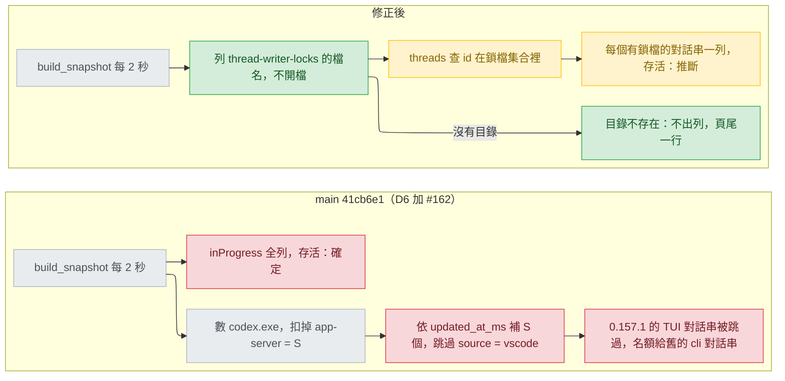

# viewer-live-status — diagnosis（問題 1：Codex 假列）

輸入：`.claude/track/viewer-live-status-fixes/intake.md`（2026-09-26 核准，AC1–AC8）、`probe/findings.md`、`probe/monitor-log.jsonl`、`probe/lock-watch.jsonl`、`.claude/track/done/agent-viewer-web-portal/post-merge-findings.md`；使用者 2026-09-26 以選單選「只改 Codex 看鎖檔 (Recommended)」（`.claude/track/viewer-live-status-fixes/options-design-main162.md:30-36`）：接在 main 41cb6e1 上做，把 #162（8ce3dd8）的行程計數換成只看鎖檔。程式行號都是 main 41cb6e1 的 `plugins/cai/scripts/viewer.py`。被修正的設計：`docs/design/2026-09-25-agent-viewer-web-portal-{stance,decisions,detail}.md`（不改，由本次新寫的 decisions／detail 取代其中的 D6、liveness、codex_source）。問題 2 見 `docs/design/2026-09-26-viewer-live-status-stance.md`。

用詞（第一次出現的英文詞）：終端機介面（TUI，Codex 的互動視窗）；對話串（thread，Codex 的一段對話，id 是 36 字元的 UUID）；鎖檔（lock file，`<codex_home>/thread-writer-locks/<thread-id>.lock`）；常駐服務（app-server，Codex 0.157.1 在沒有 TUI 時仍留在背景的 `codex.exe`）；名額（slot，「推斷還開著」的對話串可以有幾個）；來源欄（`source`，`threads` 表與紀錄檔首行記的建立來源，值見過 `cli`、`vscode`、`exec`）；合成測試資料（fixture）；快照（snapshot，viewer 一次輪詢的結果）；存活確定度（aliveCertainty，列上「存活：確定／推斷」）；紀錄檔（rollout，Codex 對話串的 `.jsonl`）。

## Status

approved 2026-09-26

## Symptom

- 回報時（fa1a0e0）：在 `D:\project\day-trading-monarch` 開 Codex，頁面出現 `demo-auto-package-upgrade`（track `add-sub`）與兩個 `claude-all-in-one` 的 Codex 列；關掉 Codex 後仍有兩列（`post-merge-findings.md:7`）。沒有 TUI、只有兩個常駐 `codex.exe` 時每次重現（`probe/monitor-log.jsonl:2`、`:4`）。錯的 track 由舊對話串的 cwd 算出（`viewer.py:2274-2275`）。
- main 41cb6e1 上，「沒開 TUI 卻有列」這一條在本機不再重現：本輪唯讀檢查（2026-09-26，只呼叫 `viewer.py` 自己的唯讀函式）印出 `count_processes` 全部 2 個、`skip_app_server=True` 為 0，兩個執行檔都在 `~\.codex\packages\app-server-daemon\releases\0.157.1-x86_64-pc-windows-msvc\bin\codex.exe`，所以沒有推斷名額（`viewer.py:1996-1997`）。
- 仍會錯的（讀程式推得，沒有執行）：Codex 0.157.1 的 TUI 對話串來源欄是 `vscode`——本機三個 0.157.1 的 `codex-tui`／`user` 對話串（`ab565c7a30a7`、`7774f7995540`、`cffa03e1fc5e`，正是 `probe/findings.md:7`、`:9` 與 `probe/lock-watch.jsonl:2` 實測時開的 TUI）在資料庫（唯讀）與紀錄檔首行都是 `vscode`，0.155.0–0.156.1 的 14 個都是 `cli`；本機沒有裝 Codex 的 VS Code 擴充套件（`~/.vscode/extensions` 沒有名稱含 openai、codex、chatgpt 的目錄）。#162 把 `vscode` 當成擴充套件的對話串，永不推斷它開著（`viewer.py:1666-1671`、`:1999`、`:2062`），於是 TUI 這一輪做完後自己的列消失，名額給最近的 `cli` 對話串——本機是 0.156.1 的 `68eefa288dba`（claude-all-in-one），也就是回報的「開在 A 專案、列出 B 專案」。`tests/test_viewer_codex.py:419-426` 目前以綠燈守著這個結果。

## Failing test

建置時第一件事寫進 `tests/test_viewer_codex.py` 的三個測試。本文件只描述，不寫程式；「現在」都是讀程式推得，沒有執行過。

共同設定：`tmp_path` 當 codex_home，用 `_write_rollout`、`_make_state_db(..., sources=...)`、`_make_history_db`（`tests/test_viewer_codex.py:72-123`）造對話串，turn 都是 `completed`；`thread-writer-locks/` 放 `.coordination.lock` 與測試指定的空白 `<id>.lock`；Claude 的 config root 是空目錄；`monkeypatch.setattr(viewer, "count_processes", lambda name, skip_app_server=False: 1 if skip_app_server else 3, raising=False)`，即一個 TUI 加兩個常駐服務（同 `tests/test_viewer_http.py:41-42`）。`raising=False` 是因為修正會移除 `count_processes`，之後這個替身不再被讀、測試照樣成立。呼叫 `viewer.build_snapshot`，只看 `platform == "codex"` 的列。

1. `test_build_snapshot_lists_the_locked_thread_whatever_its_source`：較舊的 `cli` 對話串（別的專案、沒鎖檔）與較新的 `vscode` 對話串（有鎖檔）。斷言：只有較新那一列。現在：只有較舊那一列——名額 1（`viewer.py:1996`），`vscode` 被跳過（`:1999`），補上較舊的（`:2001`）。TUI 行程若其實沒被數成 1，現在是 0 列，一樣失敗。
2. `test_build_snapshot_lists_no_codex_row_before_the_first_message`：一個 `cli` 對話串（沒鎖檔），鎖檔目錄另有一個 id 不在 `threads` 的 `<id>.lock`（還沒送訊息的 TUI，`probe/findings.md:8`）。斷言：0 列。現在：1 列，那個 `cli` 對話串補進名額。
3. `test_build_snapshot_lists_only_the_resumed_older_thread`：兩個 `cli` 對話串，只有較舊那個有鎖檔（用 TUI 接續舊對話串，`probe/findings.md:9`）。斷言：只有較舊那一列。現在：較新那一列（`:1998` 由新到舊補）。

測的承諾：舊 stance 的 UC3「一個主 session 一列……已結束的幾秒內消失」（`docs/design/2026-09-25-agent-viewer-web-portal-stance.md:52`）——測試 1 是開著的沒列、結束的列著，2 與 3 是結束的列著。既有測試直接把數字傳給 `codex_rows`（例如 `tests/test_viewer_codex.py:415`、`:424`），看不到哪個對話串真的開著，所以一直是綠的。

## Root cause

Codex 列的存活仍是「數行程，再照屬性與最近更新挑對話串」（D6 與 #162 的修正，`docs/design/2026-09-25-agent-viewer-web-portal-decisions.md:196-198`、`-detail.md:535`）：一個數字只回答開著幾個，不回答開著哪幾個。#162 把數字修對了，挑的那一步仍在猜。

- 數字：`count_processes`（`viewer.py:299-305`；Windows `:193-215`，Linux `:259-284`）。#162 以執行檔路徑或命令列含 `app-server` 扣掉常駐服務（`:76-82`、`:207-208`、`:271-280`）；本機實測有效（上面 2 → 0）。
- 挑哪幾個：主路徑先放所有 `inProgress`、再依 `updated_at_ms` 由新到舊補滿名額並跳過 `vscode`（`viewer.py:1990-2005`）；退回路徑同一套（`:2059-2062`）。跳過 `vscode` 依據的是「`vscode` 是擴充套件、沒有自己的行程」（`:1666-1671`），在 0.157.1 不成立（Symptom 第三條）。

**修掉那一行之後還會成立什麼？** 拿掉 `vscode` 那條，測試 2 與 3 照樣失敗：由新到舊補名額挑到的不是開著的那個。就算數字完全正確也一樣。另一條路：`inProgress` 的對話串不限數量全列、標「存活：確定」，只要任何 `codex.exe` 在跑（`:1990-1993`、`:2080-2081`），而常駐服務一直在，崩潰後卡在 `inProgress` 的對話串就一直掛著（沒實際看過）。原因在 D6 的「以數量推名單」，#162 沒有動它。

每個對話串自己的訊號是鎖檔（2026-09-26 實機，Codex 0.157.1，Windows）：每個開著的 TUI 各有一個、檔名就是對話串 id（`probe/monitor-log.jsonl:36-50` 的鎖檔名與同時段 `threads` 的 id 相同）；上面三個來源欄是 `vscode` 的 TUI 對話串都有鎖檔（`monitor-log.jsonl:36`、`:42`、`:70`），所以來源欄不影響這條規則；接續舊對話串沿用同一個檔名（`probe/findings.md:9`）；還沒送訊息的 TUI 另有一個暫時 id 的鎖檔，資料庫裡從沒有這個 id（`findings.md:8`）；TUI `/quit` 後鎖檔仍在、仍被握著，約 30 秒到 1 分鐘後才被刪（`probe/lock-watch.jsonl:2-3`，離開時間在 00:45:22–00:45:50 之間，`intake.md:46`）。握著它的是比 TUI 活得久的行程；說是常駐服務是排除法，不是量到的。鎖檔目錄沒有查 Codex 官方文件：UNVERIFIED；它若在某一版消失，下面的修法讓 Codex 列全部不見並在頁尾說明（使用者 2026-09-26 的選擇，`options-intake-nolock.md:15-21`）。

## Blast radius

- 退回路徑 `_codex_rows_fallback`（`viewer.py:2018-2069`）：同一個原因的第二條路，一起改（AC4）。
- Codex 列的 track 與分支（`viewer.py:2264-2275`）：由對話串的 cwd 算出，列對了就跟著對。
- #162 加的程式，修正後沒有呼叫者、照 `plugins/cai/rules/coding.md:20` 移除：`count_processes` 與 `_count_processes_windows`、`_count_processes_linux`（`:193-215`、`:259-284`、`:299-305`）；`_is_app_server`、`CODEX_APP_SERVER_MARKER`（`:73-82`）；`_process_image_path_windows`（`:127-142`，唯一呼叫者在 `:208`）；只給計數用的 `_PROCESSENTRY32W`（`:90-102`）、`_TH32CS_SNAPPROCESS`（`:107`）與 `_win_kernel32` 裡 `CreateToolhelp32Snapshot`、`Process32*`、`QueryFullProcessImageNameW` 的型別設定（`:118-124`）；`_codex_session_slots`、`CODEX_VSCODE_SOURCE` 與兩處跳過（`:1666-1678`、`:1999`、`:2062`）；讀 `source` 欄的 `PRAGMA` 與首行的 `source`（`:1966-1974`、`:2050`）；`CODEX_RECENT_THREADS_LIMIT`（`:1662`）；`codex_rows`、`_codex_rows_primary`、`_codex_rows_fallback` 的 `process_count`、`session_count` 參數（`:1963`、`:2018`、`:2072-2081`）與 `build_snapshot` 的兩次計數（`:2257-2260`）。
- 留下：`_win_kernel32` 其餘部分、`process_start`、`check_alive` 與其 Windows／Linux 實作（Claude 列的存活，`:1625`）；`_codex_subagents_by_parent`、`_codex_row`、`classify_codex`。
- 測試：`tests/test_viewer_codex.py` 裡 21 處傳數字的 `codex_rows` 呼叫（`:323`–`:680`），其中 #162 的 `:408-458`、`:639-666` 測名額與 `vscode`，`:419-426` 守的正是錯的結果；`tests/test_viewer_http.py:39-71`、`:81-82` 替換 `count_processes` 並斷言兩個數字；`tests/test_viewer_liveness.py:104-168` 測計數本身，`:20-38` 的 V2 測試要改成只打 `check_alive`，V2 的涵蓋不能少。
- 產出：`plugins/cai-codex/scripts/viewer.py` 由 `python scripts/gen-codex.py` 重產。
- 寫著這個前提的文件：D6（`decisions.md:196-198`）、detail 的 liveness（`detail.md:485-497`）、codex_source 的介面與存活（`:533`、`:535`）、Budgets 的 50 筆（`:89`）、Failure modes（`:711-712`）、Verification（`:747`、`:749`）、Work breakdown 的 unit 3（`:769`）、舊 stance Sacrifices 第二條（`stance.md:16`）。舊文件不改，由本次的新文件取代。
- 不受影響：Claude 列的存活用 pid 加 `procStart`（`viewer.py:1625-1628`）。

## Fix

- Codex 的存活只看 `<codex_home>/thread-writer-locks/` 的檔名清單：`<36 字元 id>.lock` 的 id 集合就是「開著的對話串」；點開頭的檔（`.coordination.lock`）不算；只列目錄，不開啟任何鎖檔（AC3）。codex_home 照舊由 `CODEX_HOME` 或 `~/.codex` 決定（`viewer.py:2209-2211`）。
- 主路徑：`threads` 查「id 在鎖檔集合裡」且照舊 `archived = 0`、`codex-tui`、`user`，不再取最近 50 筆、不看來源欄；每個查到的對話串一列，`aliveCertainty` 一律 `inferred`（使用者 2026-09-26，`intake.md:48`）；`inProgress` 與分類規則不變（AC2）。暫時 id 的鎖檔查不到列，自然不成列。
- 退回路徑：同一個 id 集合，對到 rollout 檔名結尾的 id，照舊用 `session_meta` 的 `originator`、`thread_source` 過濾；全部標推斷（照舊）。
- 鎖檔目錄不存在：不出 Codex 列，頁尾顯示一行「Codex：找不到 thread-writer-locks，無法判斷哪個 session 開著」（`options-intake-nolock.md:6`）。頁面至今不顯示快照的 `problems`（頁尾是固定文字，`viewer.py:640-647`；`problems` 只出現在伺服器端，`:1139` 以後），所以這一行要有顯示的地方，怎麼顯示留給 detail。只在 codex_home 存在、裡面沒有 `thread-writer-locks` 時顯示；沒裝 Codex 時頁尾不提 Codex（使用者 2026-09-26 選「只在有裝 Codex 時說明 (Recommended)」，`.claude/track/viewer-live-status-fixes/options-design-footer.md`）。
- Blast radius 列為移除的程式與只測它們的測試一併移除。

## Invariants preserved

- 舊 stance 的 V1（只列目錄、不開鎖檔、sqlite 唯讀）、V2（不送 signal；修正後連 Codex 的行程列舉都不做）、V4（Codex 列一律標「存活：推斷」）、V5（只用 stdlib 的 `os.listdir`）照舊成立（`docs/design/2026-09-25-agent-viewer-web-portal-stance.md:26-30`）；由 fixture 測試與既有的寫入邊界測試守（`-detail.md:751`）。
- 放寬的只有一條，是使用者的決定：UC3 對 Codex 列從「幾秒內消失」改為「TUI 關掉後約一分鐘內消失」（`options-intake-lockdelay.md:15-21`；`intake.md:48`），寫在 `docs/design/2026-09-26-viewer-live-status-stance.md` 的 UC3。
- 怎麼知道沒弄壞：上面三個測試加退回路徑與目錄不存在各一個 fixture 測試；`python scripts/validate.py` 與 `python -m pytest` 全綠；verify 實機開關一次 Codex TUI（AC7、AC8）。

## Picture

看哪裡：左邊的數字格是灰的——#162 已經把它數對；錯在它後面的兩格紅色：「補 S 個」仍在猜是哪幾個，`inProgress` 那格只要常駐服務在就一直成立。右邊沒有任何數量，名單直接來自鎖檔的檔名。

## Out of scope

- 還沒送出第一則訊息的 Codex TUI：暫時 id 不在資料庫、沒有 cwd，照舊不成列（`intake.md:42`）；測試 2 只守「它不會帶出別的列」。
- 強制關閉視窗後鎖檔殘留多久：只量到一次（`findings.md:7`，數分鐘，且與另一個 TUI 結束重疊），留給 verify（AC8）；若確實殘留數分鐘，那一列會多掛相同時間，標「存活：推斷」。
- VS Code 擴充套件開的對話串：本機沒裝，它的對話串有沒有鎖檔量不到（UNVERIFIED）。照 V9 有鎖檔才列；若它沒有鎖檔，main 目前在 `inProgress` 時列出的這種對話串（`viewer.py:1990-1993`）修正後就看不到。
- Linux、macOS 的鎖檔路徑：本機測不了；沒有目錄就照上面的規則不出列。
- Codex 等權限的 30 秒推斷，以及 `.claude/track/done/agent-viewer-web-portal/state.md` 其餘 Minor（`intake.md:42`）。
