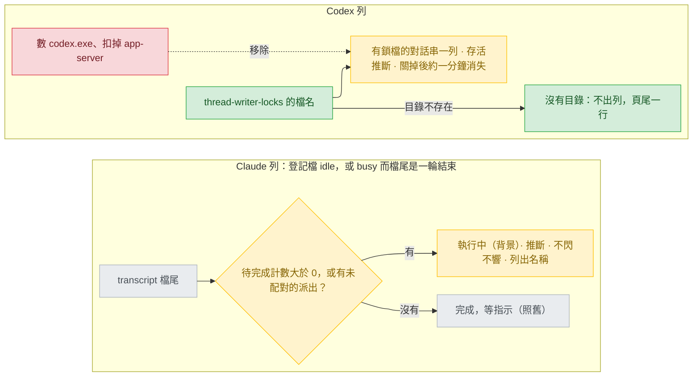

# viewer-live-status — stance

輸入：`.claude/track/viewer-live-status-fixes/intake.md`（2026-09-26 核准，AC1–AC8）與使用者的選單答案 `options-intake-bg.md`、`options-intake-nolock.md`、`options-intake-lockdelay.md`、`options-design-main162.md`、`options-design-bglabel.md`；原本的取捨 `docs/design/2026-09-25-agent-viewer-web-portal-stance.md`（2026-09-25 核准，以下稱「舊 stance」）。本 track 期間 main 多了 #162（8ce3dd8，兩題都動到）與 #163（41cb6e1，版本 1.34.1）；本 track 接在 41cb6e1 上做，程式行號都是它的 `plugins/cai/scripts/viewer.py`。本文件只補兩件事——背景子代理怎麼算、Codex 列的存活憑什麼——其餘照舊 stance。取捨方向由使用者在上面的選單定了，本文件沒有另選方向。問題 1 的原因與修法在 `docs/design/2026-09-26-viewer-live-status-diagnosis.md`。

用詞：背景子代理（background agent，主 session 派出後不等它做完就結束這一輪的助手；Workflow 是一次跑一串子代理的工具，同樣算）；配對（pairing，派出紀錄找到對應的結束通知）；結束通知（task notification，transcript 裡 `queue-operation` 帶 `<status>` 的那一筆）；待完成計數（`turn_duration` 那筆一輪結束紀錄上的 `pendingBackgroundAgentCount`、`pendingWorkflowCount`）；鎖檔（lock file，Codex 的 `thread-writer-locks/<thread-id>.lock`）；對話紀錄（transcript）；登記檔（registry）。

## Status

approved 2026-09-26

## Optimises for

頁面說「完成，等指示」或列出一個 Codex session 時，背後都有那個 session 自己留下的直接證據：Claude 列在背景子代理都結束之前不說做完，而且分得出「這一輪還在跑」與「只剩背景在跑」；Codex 列只列 Codex 自己掛著鎖檔的對話串。判準：AC1–AC6 每種情況一個 fixture 測試，加 AC8 的實機一次。

## Sacrifices

- Codex 列在 TUI 關掉後約一分鐘才消失，而不是舊 stance UC3 的幾秒，也不是 main 現在的約 2 秒（使用者 2026-09-26 選，`options-intake-lockdelay.md:15-21`、`options-design-main162.md:18-21`）；強制關閉視窗的那一次量到殘留數分鐘（`probe/findings.md:7`），還沒確認。
- Codex 列的存活一律是推斷，連本輪進行中（`inProgress`）的也是；main 把它們全列並標確定（`viewer.py:1990-1993`、`:2005`）。
- 沒有鎖檔目錄的環境——Linux、macOS、較舊的 Codex，都沒查過——看不到任何 Codex 列，只有頁尾一行（`options-intake-nolock.md:15-21`）；還沒送第一則訊息的 Codex TUI 照舊看不到（`intake.md:42`）。
- 背景 shell 在跑時照舊顯示「完成，等指示」並加註（`options-intake-bg.md:19-25`）。
- 背景子代理若一直沒有結束通知，那一行就一直是「執行中（背景）」，蓋掉真的做完。以 SendMessage 接續的子代理、或派出紀錄落在 256 KiB 檔尾之外（AC6）時，那一行仍靠待完成計數顯示「執行中（背景）」，但列不出子代理名稱：配對只認派出紀錄（`viewer.py:1416-1417`），接續不留派出紀錄（下面 V8 的證據）。
- 多讀兩種平台內部紀錄（`queue-operation` 與 `turn_duration` 的待完成計數），格式都沒有文件（舊 stance 的第一條犧牲，`stance.md:15`）；格式一改，這一行退回 fa1a0e0 的行為。

## Invariants

**This system's:**

- 舊 stance 的 V1–V7 全部照舊（`docs/design/2026-09-25-agent-viewer-web-portal-stance.md:26-32`）。
- V8 — 有沒有背景子代理（含 Workflow）在跑，只看對話紀錄：檔尾那筆一輪結束的待完成計數大於 0，或有派出、沒有它的結束通知（completed、failed、killed、stopped 之一）；背景 shell 不算。登記檔的 `status` 只決定要不要做這道檢查（`idle`，或 `busy` 而檔尾最後是一輪結束），不拿來判斷有沒有背景工作。主 session 這一輪已結束、只剩背景工作時，那一行是「執行中（背景）」、確定度「推斷」、不閃不響，列出配對得到的子代理名稱（使用者 2026-09-26，`options-intake-bg.md:19-22`、`options-design-bglabel.md:15-21`；AC5）。兩個訊號並用是使用者選的「判斷方式沿用 #162」（`options-design-bglabel.md:16`，#162 在 `viewer.py:1474-1480`、`:1540-1543`）；本機 1796 份 transcript 裡，1025 筆計數大於 0 的一輪結束有 188 筆配對找不到在跑的子代理，看過的兩個例子都是 SendMessage 接續（其一：`~/.claude/projects/D--project-claude-all-in-one/2162ccb5-c60c-447a-9112-ce3620300e7b.jsonl:231`、`:241-242`）；反過來「配對有、計數為 0」一筆都沒有（本輪唯讀掃描）。
- V9 — Codex 的存活只看鎖檔目錄裡的檔名：不數行程、不開啟鎖檔、不看 rollout 修改時間（使用者 2026-09-26，`options-intake-nolock.md:15-18`、`options-design-main162.md:30-31`；AC1、AC3）。

**Cross-project:**

- 舊 stance 的 Cross-project 四條照舊（`docs/design/2026-09-25-agent-viewer-web-portal-stance.md:36-39`）。

## Rejected stances

- **連背景 shell 也算數。** 看得到背景還在跑的每一件事，但開發伺服器這類永不結束的指令會讓那一行永遠「執行中」；輸在「只憑會結束的證據說還在跑」（使用者否決，`options-intake-bg.md:27-33`）。
- **沒有鎖檔目錄就退回數行程。** Linux 與 macOS 也看得到 Codex 列，但錯的列會回來，正是要修的問題（使用者否決，`options-intake-nolock.md:23-29`）。
- **鎖檔加「有 TUI 行程在跑」，以及同一家族的 #162「數 `codex.exe`、扣掉路徑含 `app-server` 的」。** 關掉後立刻消失，但要靠常駐服務的安裝路徑辨認它，Codex 更新就可能壞（使用者否決，`options-intake-lockdelay.md:23-29`）；#162 另外仍以數量推名單（diagnosis 的 Root cause）。使用者選接到 main、把它換成只看鎖檔，不照 #162 收掉這條 track（`options-design-main162.md:38-44`）。
- **照 #162 顯示「執行中 · 確定」。** 不必改問題 2 的程式，但這一輪還在跑（要先中斷）和只在等背景（可以直接打字）看起來一樣（使用者否決，`options-design-bglabel.md:23-29`）。
- **讓登記檔告訴我們有沒有背景工作。** 不必讀檔尾，但它分不出來：背景子代理在跑的十幾分鐘裡登記檔一直是 `busy`（`.claude/track/viewer-live-status-fixes/probe/registry-bg.jsonl:3`），和一輪還在進行時同一個值。

## Use cases / Issues

- UC3（取代舊 stance UC3 裡「已結束的幾秒內消失」那一句，`stance.md:52`）— Claude 列在 session 結束後幾秒內消失；Codex 列在 TUI 關掉後約一分鐘內消失，一律標「存活：推斷」。判準：AC1–AC4 的 fixture；AC8 實機開關一次 Codex TUI。
- UC4（界定舊 stance UC4 的「一輪做完」，`stance.md:53`）— 主 session 結束一輪、但照 V8 還有背景子代理或 Workflow 在跑時，不算「一輪做完」：顯示「執行中（背景）」、推斷、不閃不響，並列出子代理名稱；背景工作都結束了，才照原規則判做完（「完成時也響」開著才響）。判準：AC5 的 fixture；AC8 實機跑一個背景子代理。
- R2 — 沒開 Codex TUI 仍出現 Codex 列、列出幾天前或別的專案的對話串（`.claude/track/done/agent-viewer-web-portal/post-merge-findings.md:7`）。main 在本機已不重現「沒開 TUI」那一條，但開著 TUI 時仍列錯（diagnosis 的 Symptom）。判準：diagnosis 的三個失敗測試轉綠。
- R3 — 主 session 在背景跑子代理時被顯示成「完成，等指示」（`post-merge-findings.md:21-23`）。fa1a0e0 是過時 busy 規則判的；main 起待完成計數大於 0 就不套它（`viewer.py:1536-1547`），改顯示「執行中 · 確定」並列出子代理（`:1549-1563`）。剩下的：字樣與確定度要照 V8；`idle` 時仍不檢查、直接判做完（`:1524-1527`，AC5 要檢查）。判準：AC5。

## Overview

看哪裡：左邊黃色是 #162 已有、要改的兩格——判斷多涵蓋 `idle`，結果從「執行中 · 確定」改成「執行中（背景）· 推斷」；右邊紅框是 #162 的行程計數，整格移除，名單只從鎖檔來。

## Out of scope

- 背景 shell 的配對（`options-intake-bg.md`）；登記檔是 `shell` 時照舊判做完並加註，不做這道檢查（AC5 只列 `idle` 與 `busy`）。
- 過時 busy 規則的 60 秒門檻與「登記檔可能過時」照 #162（`viewer.py:1540-1547`，`docs/design/2026-09-25-agent-viewer-web-portal-decisions.md:225`）不改；verify 若看到 `busy`、檔尾沒有背景工作卻被判做完的列，再回來處理。
- 還沒送第一則訊息的 Codex TUI、Codex 等權限的 30 秒推斷、舊 track 其餘 Minor（`intake.md:42`）。
- 留給 decisions，證據已找到：派出的標記是 `toolUseResult` 的 `{"isAsync":true,"status":"async_launched","agentId":…}`，Agent 呼叫都沒有 `run_in_background`（`~/.claude/projects/D--project-claude-all-in-one/a8af33f2-a42d-4e02-b0d5-10d322d5ac2b.jsonl:100-101`，該檔每個 `"run_in_background":true` 都在 Bash 呼叫上，如 `:146`）；結束通知同時帶 `<task-id>` 與 `<tool-use-id>`（同檔 `:108`）；SendMessage 接續後同一個子代理 id 再來一次通知（`~/.claude/projects/D--project-day-trading-monarch-3/402ed4d7-e8c2-4eee-afec-1b47cdf054ec.jsonl:1043-1044`、`:1067`、`:1131-1132`、`:1160`）。其餘：#162 以 `pending*Count` 萬用比對任何計數（`viewer.py:1478-1480`），V8 只認子代理與 Workflow 兩種，將來多一種（例如背景 shell 的）要不要算；頁尾那一行怎麼顯示（頁面至今不顯示 `problems`，`viewer.py:640-647`）；「執行中（背景）」在快照裡的欄位與命名。
- `docs/` 被 git 忽略；本檔要進 PR 需在 ship 時 `git add -f`。
