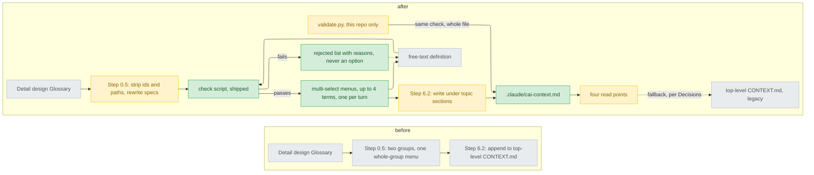

# refine-context-md-file — stance

依據：issue #326；已核准的 `.claude/track/refine-context-md-file/intake.md`（AC1–AC9，2026-10-08）與同目錄的 `discover.md`。行號以 `07277dd` 為準。這份文件就是 AC4 要的新 stance 紀錄：它推翻 `docs/design/2026-09-25-cross-track-glossary-stance.md` 的 S4（`:31`）、S5（`:32`）、Sacrifices 第二條（`:18`）與 Rejected stances 末條（`:48`），收窄 S2（`:29`）；S1（`:28`）與 S3（`:30`）換成新路徑後沿用，編號改為下面的 I1–I7。

名詞：詞彙表（glossary）是收專案詞與一兩句定義的那個檔。檢查（check）是這次新增、隨 plugin 出貨的 script，判斷一條定義能不能寫入。讀取點（read point）是程序開頭先讀詞彙表的四個步驟。選單（menu）是用提問工具給 2–4 個選項的一次提問；多選（multi-select）是同一個選單可以勾好幾項。Step 0.5 是 build 開工前一次問完的那一步，Step 6.2 是 build 收尾時寫詞彙表的那一步。`<top>` 是 `git rev-parse --show-toplevel` 印出的目錄。Codex 是另一套 CLI，cai 另外產生一份給它（`plugins/cai-codex/`）。

## Status

approved 2026-10-08

## Optimises for

詞彙表裡每一條都是沒讀過任何一條 track 的人也看得懂的專案詞：定義先過一支隨 plugin 出貨的檢查，再由本人逐詞勾選，本 repo 與使用者專案一樣。怎麼算成功：`validate.py` 用同一支檢查掃 `<top>/.claude/cai-context.md` 全部 PASS（AC4、AC5）；Step 0.5 每個詞彙選單最多 4 個詞、沒有任何一項標 recommended（AC2）。

## Sacrifices

- **build 多問幾題**：通過檢查的詞每 4 個一個選單、每個選單各佔一個對話回合，取代現在整組一次選（`plugins/cai/skills/track/references/stage-build.md:101-103`）；參考執行的停點上限「seven at most」（`approval-gates.md:480-482`）目前只把詞彙算一個停點（`:492`）。
- **誤擋不能硬放**：檢查判錯的合法定義——例如列出四個值的 `CONTEXT.md:86`，或以中文標點數句子數錯——只能改寫到通過為止，沒有人工放行（`intake.md:140`，round 2 答 (a)）。
- **詞變少**：檔名、函式、欄位、狀態字串、agent 名稱與日常用語不再收（AC9）；要查它們得回去讀程式。
- **不再只改文字**：多一支 script、它的 tests 與一項 `validate.py` 檢查要維護，樣式（pattern）要跟著寫法調整；舊 stance 用 S5 換到的簡單就此放棄。
- **檔案不在專案頂層顯眼處**：搬進以點開頭的 `.claude/` 目錄（`intake.md:134`）；使用者專案若讓 git 忽略 `.claude/`，PR 裡就看不到它（`intake.md:93`，交 Decisions）。
- **本 repo 這次的 88 條不逐詞問**：去留由 Gate 1 簽核 detail design 裡的整張表決定，那張表是 Gate 1 這一次要整段讀完的例外（`discover.md:7-8`、`:26-30`）；I3 的逐詞選單不管這一次清理。

## Invariants

**This system's:**

- I1（沿用 S1，換路徑）`<top>/.claude/cai-context.md` 只是詞彙表：詞名加一兩句說它是什麼，只收本專案獨有的概念；不放決策編號、track 文件路徑、規則、帶單位的數字或程式行為的複本（`CONTEXT.md:3-4`；AC4、AC9）。一個詞名在整個檔、跨所有節只出現一次，也只有一個意思（AC5）。
- I2（收窄 S2）build 寫入的每一條定義——提議的、取代舊定義的、本人自由輸入的——都在同一次執行裡通過檢查，寫進檔的文字與通過檢查的文字逐字相同。被拒的詞永遠不是選項，只連同檢查印出的理由列在選單文字裡；自由輸入沒通過就不寫，build report 點名並附理由（AC1、AC2、AC4）。在使用者專案一樣擋。
- I3（沿用 S2 其餘部分）詞名沒當過本人回答過的選單的選項，就不寫入；取代既有定義時新舊並列；逾時自動關閉的選單不併入它的任何一個詞（AC2）。唯一例外是本 repo 這次清理，權源是 Gate 1（Sacrifices 末條）。
- I4（沿用 S3）唯一寫入點是 build 的 Step 6.2，在 verify 之前；其他 stage 與 skill 都不寫。build 只寫新路徑（AC8）。
- I5（取代 S4）讀取點讀 `<top>/.claude/cai-context.md`，不存在就不提、不建議建立；對 `<top>/CONTEXT.md` 的退路只照 Decisions 的決定。不是 cai 寫的 `<top>/CONTEXT.md` 不當詞彙表讀、不搬、不改；build 不經選單不改使用者既有的條目，檢查只管 build 要寫的定義（`intake.md:92`）。
- I6（取代 S5）一支檢查、一份樣式：build 與 `validate.py` 呼叫同一支 script，`validate.py` 不另寫一套（AC4）。它從 UTF-8 檔讀定義、以 UTF-8 輸出，從不經命令列參數收定義（原因見 Cross-project 末條）。
- I7 釘住的文字同一次改完，不該動的不動：`stage-build.md` 的 Step 1 與 Step 6 標題不改名、`state.md` 字樣維持 3 次（`scripts/validate.py:2455`）、第 9–10 行不動；`approval-gates.md` 保留「exception to `epistemics.md`」（`scripts/validate.py:2561-2562`）；每個多選選單都有對應的 Codex override（`discover.md:16-20`）。

**Cross-project:**

- 本 repo `CLAUDE.md` 的 "Who a file is for"（出貨檔不得假設本 repo 的版面；`plugins/cai-codex/` 只由 `scripts/gen-codex.py` 產生）與 "Before pushing"（validate、pytest、改動行 90% 覆蓋、Linux CI）。
- 使用者 rules，以 `CLAUDE.md:8-14` 匯入的版本為準，包括 `workflow.md` 的「沒被要求就不 commit」與 `coding.md` 的 Simplicity first。
- 平台：subagent 沒有 `AskUserQuestion`（`pending-questions.md:8-11`）；選單只能有 2–4 個選項（`approval-gates.md:9-11`）；Codex 的提問工具不能多勾（`scripts/codex-overrides.json:1019`）。
- 環境：本機 Bash tool 會打壞非 ASCII 的命令列參數（memory `bash-tool-mangles-non-ascii-argv.md:11-13`）；Windows 的管線輸出預設 ANSI code page（`plugins/cai/scripts/options_lint.py:181-187`）。

## Rejected stances

- **維持 S5，只改文字、靠更清楚的規則與人審**：代價最小，但這 88 條全是走過人審選單才進來的（issue #326 "Why it ends up this way" 第 2 點，正好推翻舊 stance `:64` 的假設）；本人在 round 1 選了要機械檢查（`intake.md:135`）。
- **檢查只警告，本人仍可勾被拒的詞**：誤擋零代價，但本人在 round 2 選了「不能勾，只能給新定義」（`intake.md:140`），而且等於把 I2 交回人審。
- **檢查只放 `validate.py`、只管本 repo**：使用者專案照樣累積同類條目（issue #326："Cleaning this file alone does not hold"），違反 AC4。
- **檔案留在 `<top>/CONTEXT.md`，或改放 `cai.json` 的 `"context"` 鍵**：前者把 cai 的產物放在別人專案的頂層（`intake.md:130`）；後者是本人自己提的另一案，最後選了 `.claude/cai-context.md`（`intake.md:134`）。
- **逐詞，但用編號清單讓本人打字回答**（issue 決定 2 的例子）：本人選了每 4 詞一個多選選單（`intake.md:136`）；只有 Codex 因平台限制仍走編號文字。
- **清理拆成第二條 track**：檢查一上線就讓本 repo 的檔案 FAIL，而搬家與清理改的是同一批句子（`intake.md:77`）。

## Use cases / Issues

- R1 — 決策編號、track 文件路徑、規格數字、程式行為的複本、實作名詞被寫進詞彙表（`CONTEXT.md:38-48`、`:56`、`:57`、`:89`、`:93`）。判準：檢查對每一類都擋下並印出理由（AC4）；清理後 `validate.py` 全 PASS（AC5、AC6）。
- R2 — 整組選，本人無法逐詞取捨（`stage-build.md:101-103`）。判準：AC2 與它的兩個釘住的 tests。
- R3 — 只能附加、沒有分節，順序就是 track 的先後（`stage-build.md:448-450`）。判準：AC3。
- R4 — 一詞多義：`run`（`CONTEXT.md:75`、`:81`、`:92`、`:96`）、`verify`（`:45`）。判準：AC5。
- R5 — cai 的檔案落在使用者專案頂層（`stage-build.md:442-448`、`README.md:125`）。判準：AC8 的 Grep 只剩退路與搬遷的句子。
- R6 — 這條 track 自己的 build 跑的是快取 1.47.1 的舊 Step 6.2，會把 `<top>/CONTEXT.md` 建回來（`discover.md:32-37`）。判準：本 track 的 Detail Glossary 沒有任何該併入的詞，新詞一律進清理表。
- UC1 — 一次 Step 0.5：去編號與路徑 → 改寫規格句 → 檢查 → 被拒清單附理由 → 每 4 詞一個多選選單 → 自由輸入再檢查 → Step 6.2 依節寫入（AC1–AC3）。
- UC2 — 通過的詞不到 2 個（含全被拒）：選單至少要 2 個選項（`approval-gates.md:9-11`），被拒的理由仍要讓本人看到（`intake.md:91`）。做法交 Decisions。
- UC3 — 使用者專案已有 `<top>/CONTEXT.md`：cai 寫的與別人寫的要分得開（`intake.md:92`）；退路與搬遷交 Decisions（AC8）。
- UC4 — 使用者專案讓 git 忽略 `.claude/`：Step 6.2 的 commit 與 PR 帶不到這個檔（`intake.md:93`）。交 Decisions。
- UC5 — 本 repo 清理：Gate 1 簽的 88 列表；build 先對全表跑檢查，被擋的列保留不寫、記錄並報告（`discover.md:39-43`；AC5、AC6）。
- UC6 — Codex：多選改成編號文字，`gen-codex.py` 無 DRIFT（AC1、AC7）。
- UC7 — 健康檢查：validate、pytest、Linux CI、diff-cover（AC7）。

## Overview

看的重點：左邊從 Glossary 到檔案中間沒有任何關卡，人只在整組選單上點一次。右邊每一條要寫的定義都得經過綠色的「check script」，包括本人自由輸入的那條（`FT --> C` 那一圈，I2）；被拒的詞只出現在清單裡，到不了選單。`validate.py` 不另寫規則，用同一支檢查掃整個檔（I6）。虛線到舊的頂層 `CONTEXT.md` 是唯一還沒定的箭頭，交 Decisions（I5）。

## Out of scope

- 新句子的確切措辭、檢查的樣式、節名，以及 script、它的測試檔、模板的名稱：交 Decisions（命名排進 Tier 1）與 Detail。
- `_Avoid_` 行、`CONTEXT-MAP.md`、ADR：照舊不引入（舊 stance `:22`、`:107`）。git 歷史裡的舊定義不追改。
- 誤擋時的人工放行：不做（Rejected stances 第二條）。
- subagent 能不能無提示寫入 `.claude/`（`discover.md:24`）與 PR 內文放不放得下 88 條新舊對照：要實際執行才知道，交 build 第一個寫檔單元確認。
- `docs/` 被 git 忽略；這份文件在 ship 時要 `git add -f`（`intake.md:80`）。
